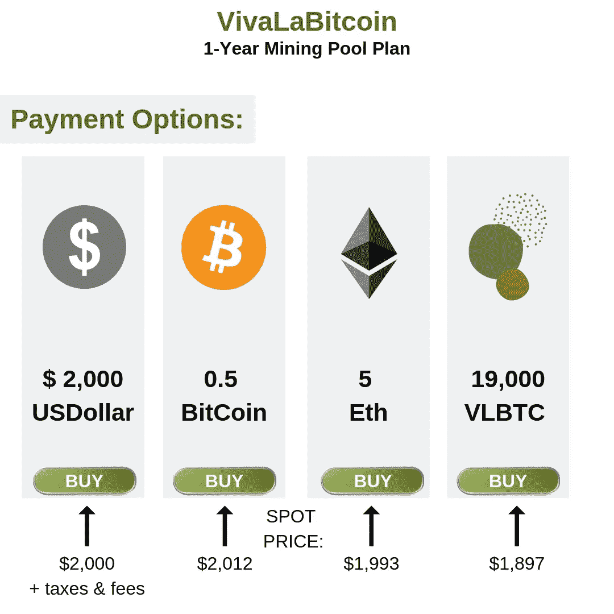
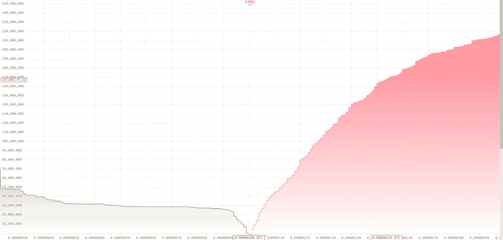
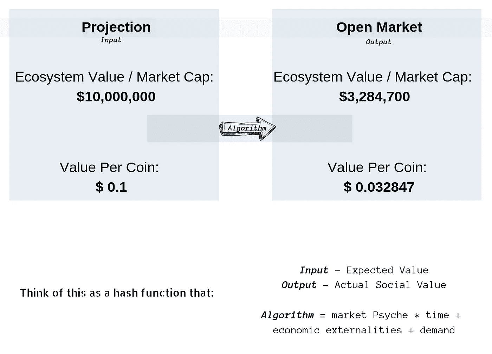
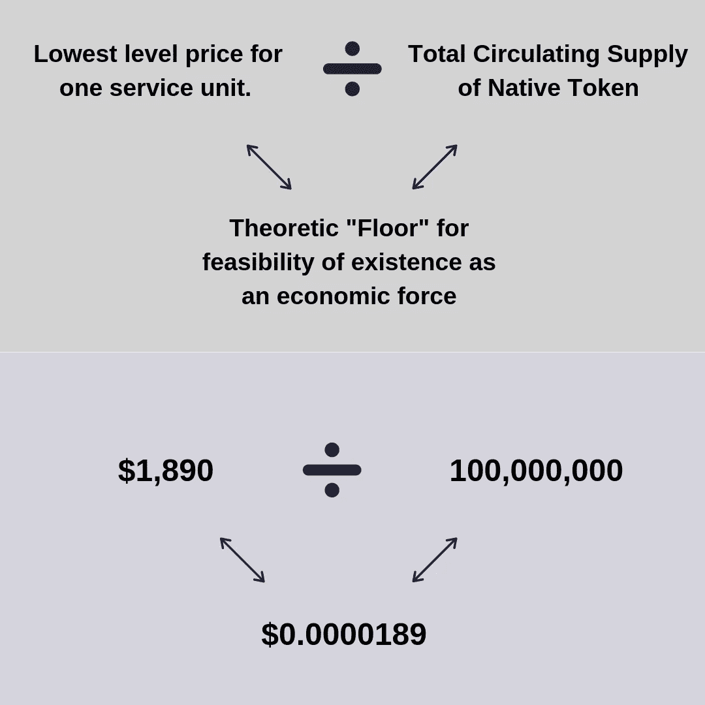
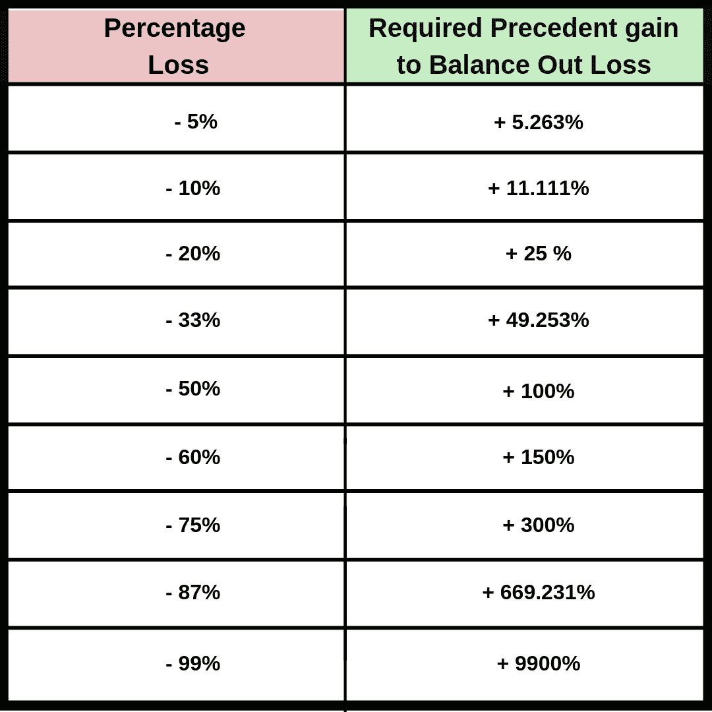

# 采纳或不采纳；这算问题吗？

> 原文：<https://medium.datadriveninvestor.com/to-adopt-or-not-to-adopt-is-that-even-a-question-ddc7fae9a2d8?source=collection_archive---------14----------------------->

## 采用加密货币的黑暗面🐱‍👤

让我们在比特币之前的土地上开始这场冒险。

总的来说，采纳是让世界进一步发展和思想传播的唯一关键因素。采用表示全球化。全球化意味着什么？来自社会的想法的不可分割的永久角色(或关键的短期角色)。

 [## 挑战你对人工智能和社会的看法的 4 本书——数据驱动的投资者

### 深度学习、像人类一样思考的机器人、人工智能、神经网络——这些技术引发了…

go.datadriveninvestor.com](http://go.datadriveninvestor.com/4AI1) 

采纳通常与价值密切相关。越有价值的东西越有可能被大量采用。想想谷歌。越多的人采用谷歌作为搜索引擎，谷歌就变得越“有价值”。

在这里，我们把价值称为具有很高社会价值的东西。用它的元物理学对应物来表示:货币价值。

如果有 100，000，000 个普通人使用谷歌，那么理论上来说，谷歌是根据它能够向这些人提供多少服务来提取价值的。显然，越多的人使用谷歌，谷歌就能提供越多的价值(反之亦然)。这在某种程度上是一种循环反馈机制。

现在，让我们更深入地挖掘经济问题，问一问:**收养*总是*一件好事吗？**

这是一个问题，它开始揭示经济博弈论的微妙结构，并揭示了一个项目生存能力的真正本质…

不过，关于采用及其在近代史上的抽象角色，已经说得够多了……是时候谈谈后公共区块链时代了。

大约在 2009 年 1 月 3 日

比特币诞生了，全球采用的竞赛开始了。

> *虽然分散系统和分布式系统之间存在差异；在这篇文章中，我们将交替使用分布式和分散式。

因为比特币是建立在网络结构上的，它被归类为一种被称为 DLT 的东西——分布式账本技术；DLT 的本质在它自身之内规定了它只有在被接受时才存在。

当比特币刚刚起步时，它的首要目标是吸引尽可能多的用户——因为采用意味着需求&需求最终意味着价值创造。

随着时间的推移，比特币的应用开始激增。随着采用爆炸式增长，出现了巨大的价格发现。企业家们开始注意到，由于比特币的采用，其价格产生了非同寻常的结果。为了利用比特币的成功，大量面向加密的项目开始出现。这些即将到来的 BaaS“区块链即服务”项目中的绝大多数将“原生令牌价值满足”纳入了他们的经济模型；也就是说，你可以用他们自己的支付方式支付公司的服务费用(当然，这种支付方式通过在总价上提供相当大的折扣来提供一些激励)。

系好安全带，我们将通过创造我们自己的来模拟一些加密经济理论的可靠性:

*   加密项目名称: **VivaLaBitcoin (VLBTC)🤣**
*   代币供应: **1 亿**
*   售出代币:**9000 万**
*   代币价格: **$0.1**
*   市值/生态系统价值:**1000 万美元**
*   **提供的服务:**高级比特币挖矿池****

**说现在，项目全面展开，没有内部破坏的意图；实际上，它甚至收到了一笔匿名的 10 万美元的天使捐赠。**

**一个用户想开始使用 VLBTC 服务挖掘比特币。他跳上他们的网站，寻找一个采矿计划开始。他找到了一个满意的计划，然后去付款，看到了以下选项:**

****

**看到用平台本地货币(VLBTC)支付的经济利益，用户跳到一些 DEX 或能够[原子互换](https://blockgeeks.com/guides/atomic-swaps/)的钱包上并得到一些 VLBTC。去为他的服务付钱，就这样。对吗？用户得到了他的服务，公司得到了它的利润，世界继续运转，好像什么都没发生。**

**VLBTC 经济会发生什么变化？本地硬币/代币的早期采用者、持有者和支持者会发生什么？**

**从发布开始，项目团队持有大约 10%的令牌。对于团队来说，要从这些保留的令牌中获取最大价值，他们需要将某种形式的需求推向公开市场。公开市场是剩余的 90%的令牌争夺识别项目的(投机)价值的地方。**

**让我们也提一下，VLBTC 的*业务的存在并不依赖于代币的存在*。作为一个提供服务的企业，(假定服务是长期可行的和有价值的)他们的存在完全基于他们获得的实际业务量。VLBTC 不在乎你选择什么样的支付方式。他们为你提供服务(包括税收&运营)的成本是 600 美元。定价模型每 30 秒更新一次，使用实时 Oracle (←Auger plug？)进给，并将始终保持在 1，990 美元以上的美元/BTC/ETH 和 1，1890 美元以上的 VLBTC 价格进给。**

**通过这一切，VLBTC 令牌的价格会发生什么变化？**

**筹款后，50%的分发代币立即得到“赎回”,记住代币在折价交易时的价值是 0.1 美元；这意味着 VivaLaBitcoin 现在拥有 45，000，000 个 VLBTC 代币/450 万美元。**

**提供这些服务的总成本将为 vivabilitcoin 137 万美元。**

**那么 VivaLaBitcoin 是做什么的呢？**

**向公开市场抛售代币。**

**因为在发送 VLBTC 令牌螺旋进入“价格发现”的深渊之前，公开市场上的原子厚订单能够吸收不超过 2，000，000(总的来说)。**

**考虑到 VLBTC 需要 137 万美元，在他们将 200 万美元投入市场后，还会剩下 117 万美元或 1170 万美元的代币。**

**也就是说，200，000 美元的价格下跌行为在价格暴跌之前以 0.1 美元的价格被吸收……之后的情况在订单簿中可能是这样的:**

****

**最终导致价格急剧下降；随之而来的，是更剧烈的价格下跌。**

**VLBTC 在 3 个交易所上市。每个交易所都列出了订单簿的下一个 100 页:每个价格点的价格降低 1%,同时订单规模变小…**

**看着 VivaLaBitcoin 清算 45，000，000 代币，以收回同样数额的费用，而这笔费用本应只用 13，700，000 代币收回；我们看到，公开市场显然认为 VLBTC 作为独立微观经济体的角色被严重高估了🤷‍♂️ *(上涨约 328.47%或 3.28 倍)***

**我们现在必须修改令牌组学；*根据开放市场对其的影响进行调整***

****

**我们甚至还没有开始行动…**

**这一价格发现发生在首次推出后不到一周；更不用说流通中的代币只有 50%被赎回。流通中的剩余代币被扔在公开市场上，放在钱包里的某个地方，或者等待在将来的某个时候被用于采矿服务。**

**随着时间的推移，LVBTC 企业出售其代币以维持正常经营，给市场造成了持续的下行压力；将破坏生态系统的经济价值，直到令牌的价值达到最大可能的“底线”(理论概念)或不复存在…**

**理论上的“下限”被确定为 LVBTC 代币作为支付存在所需的最小可行值。**

**这可以通过以下方式找到:**

****

**这给我们留下了什么？**

**嗯，发行的代币每枚价值 0.1 美元；跌至 0.0000189 美元，跌幅为-99.9811%……这意味着一个人可能投资和持有的每 1，000 美元现在价值 0.0189 美元(略高于 5%，不到 2 美分)。**

**这是一个非常极端的情况，旨在严格地作为一个松散的代表，说明过早采用 再加上 ***易错的经济结构*** e 如何会导致金融困境…**

**那么，做一个早期用户是否仍然明智呢？**

**在我看来: ***地狱是的！*****

**只要从一个消息灵通的有利位置&*DYOR——做你自己的研究***

**🤓勇敢探索🤓**

**🕋，🕋，愿区块链与你同在**

# ***🍜*精神食粮*🍜***

> ****不要低估市场的非理性……****
> 
> **当涉及到任何形式的图表分析时:仅仅因为一项资产已经跌到了新低/比最高点低了 99%,并不意味着它不能再跌了。**
> 
> **如果一项资产在 100.00 美元达到顶峰，然后在 2 年内跌至 1.00 美元，并不意味着它不会跌至 0.50 美元的较低水平；轻而易举地让某人损失整个仓位的 50%!**
> 
> **如果有人损失了 50%的投资组合价值，他们现在必须从当前的投资组合余额中赚回 100%!**
> 
> **举个例子:**
> 
> **有人在 20，000 美元时购买了比特币，现在持有 4，000 美元的比特币，损失了 80%。为了让他们的投资达到收支平衡，比特币现在必须获得+400%的收益。**

> **“往上走的路比往下走的路要多”**

****