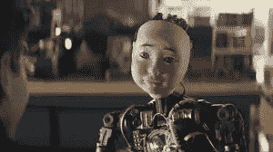

# 拟人化是人类:看超级碗广告，很明显我们仍然在努力确定人工智能应该是什么样子

> 原文：<https://medium.datadriveninvestor.com/to-anthropomorphise-is-human-watching-the-superbowl-commercials-its-clear-that-we-still-struggle-aec167761c1a?source=collection_archive---------17----------------------->

TurboTax baby

超级碗广告 30 秒钟的费用约为 520 万美元。在被专业人士和投机者仔细研究之前，大量资金被投入到市场研究中，以最大化品牌影响力。

因此，当五个不同行业的五家不同公司以类似人工智能(AI)的方式运营广告时，一定有什么东西在焦点小组中引发了反应。

如果过去几年推动人工智能报道的图像是可怕的机器人展示了不可阻挡的效力，因为它们粉碎了人类的竞争和工作，那么或许公司认为是时候强调它们的局限性了。抓住机会重新设定在这个过程中变得有点过高的期望。

1.  亚马逊以一则 Alexa 商业广告拉开序幕，强调错误——*“有很多失败”*——是可能的，同时调侃其产品越来越多的不确定性。失败的例子从哈里森·福特的狗随意点(过量)食物到*、【事件】*。
2.  TurboTax 推出了一款婴儿机器人,它永远不会具备成为一名合格的税务顾问的社交技能。与此同时，TurboTax 确实在使用人工智能来帮助客户计算退税水平。
3.  品客提醒我们,[虽然 Alexa](https://www.youtube.com/watch?time_continue=29&v=tDakI68u2xE) 可以重复关于土豆零食选择的统计数据，但它不能真正品尝它们。
4.  Michelob 有一个类似的主题，虽然理论上机器人可能能够在体育活动中碾压人类(顺便说一句，实际上并不准确),但如果没有机会在事后一起喝啤酒庆祝，这一切都有点空洞。
5.  最后，一家安全公司 SimpliSafe 直接利用了 21 世纪生活中的生存焦虑，包括计算机回答妻子向丈夫提出的问题，即他是否一直在听她的话，丹尼斯。利用我们对老大哥监控的恐惧来推销安全设备是一种有趣的策略。

那么我们能从中学到什么呢？

首先，不可阻挡的人工智能迷因已经有点失控，需要紧缩。但是恐惧仍然存在——这就是为什么反应会被切断。尤其是如果你的销售对象是啤酒和薯片的男性消费者，他们能感觉到自动化在他们脖子上的热气。然而，如果你经营一家人工智能公司(亚马逊(Amazon)或 TurboTax，就是你)，那就值得稍微调整一下预期(即使是在强调技术成熟后可能发生的事情的同时)。

与此同时，我们仍然在为人工智能是什么的视觉速记而努力。Alexa 扩大了人工智能拟人化的视觉范围，但绝大多数人工智能实例都是有效的自推进电子表格，我们仍然无法找到一种简单的方法来通过视觉媒体传达这一点。

或者，只是可能，所有这些公司只是使用在线投票技术，天网已经感染了面板，只是为了博取同情，为不可避免的事情赢得时间…

## 来自 DDI 的相关故事:

 [## 用 7 个步骤解释深度学习——数据驱动投资者

### 在深度学习的帮助下，自动驾驶汽车、Alexa、医学成像-小工具正在我们周围变得超级智能…

www.datadriveninvestor.com](https://www.datadriveninvestor.com/2019/01/23/deep-learning-explained-in-7-steps/)  [## 数据科学和软件工程哪个更有前途？-数据驱动型投资者

### 大约一个月前，当我坐在咖啡馆里为一个客户开发网站时，我发现了这个女人…

www.datadriveninvestor.com](https://www.datadriveninvestor.com/2019/01/23/which-is-more-promising-data-science-or-software-engineering/)