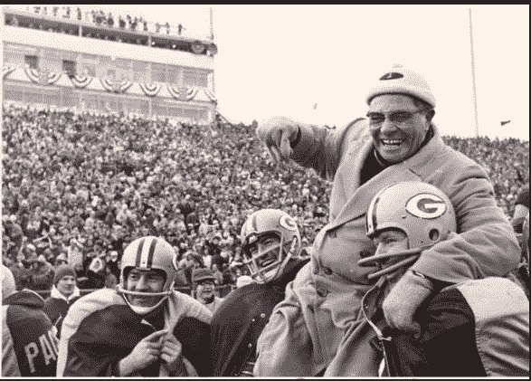

# 去蔻驰还是咨询？这是个问题。

> 原文：<https://medium.datadriveninvestor.com/to-coach-or-consult-that-is-the-question-dfe844dce2ef?source=collection_archive---------29----------------------->

多好的一周啊。

我们结束了在纽约的“少做”现场活动——从很多方面来说，这 3 天绝对改变了我们的生活。有一些绝对了不起的人，只是伟大的网络。顺便说一句，很多“做”。

我们谈得最好的一次是和绝对摇滚明星托德·赫尔曼。我最喜欢的人之一很荣幸能请到他演讲，如果你还没听说过他，一定要暂停这篇文章，去看看他。

托德在阿尔伯塔省的农场长大，后来建立了一个长达 20 年的教练帝国。这家伙整天都在向亿万富翁和奥运选手展示如何在他们所做的事情上超越 10 倍——简直就是大师。他现在正在推广一个 90 天的项目。

托德谈到的是教练和咨询的区别。这些年来，我已经和这个*打交道很多次了*，托德真的帮助我表达了一段时间以来的感受。

进入教练行业的一个自然方法是咨询。你赚了更多的钱，你有了人脉，你改进了方法，但老实说，我一直在为此挣扎——银行里的现金很不错，但最终我从未感觉良好。

我们今年完全停止了咨询，现在我们的全部精力都放在了指导上。

托德提出的主要启发是理解咨询和教练之间的关键区别:前者是*被动的*，而后者是*主动的*。

一个教练在防守。你有他/她在你身边，他们在那里帮助你战斗，并让你在即将到来的比赛中保持状态。

咨询师基本上是被动的。当事情已经出错时，你通常会被请来做顾问，而且你已经有了应对策略。你教了剧本就走了，要靠他们来执行。

通常情况下，你指导剧本后就离开了，几天后你的劳动成果就消失了——这是一劳永逸的事情，老实说，这是没有回报的。

作为一名教练，你要和这个人并肩作战。你在与他们战斗，你本质上是他们挑战的共鸣板，并作为一种帮助他们克服挑战的方式。你可以帮助别人学习和成长，最令人满意的是，你可以看到他们的成长。

从根本上来说，这也是精英主义。作为一名教练，我必须得到结果——作为一名顾问，你的标准要低得多。

你是一个*催化因子*而不是绷带。托德的与众不同真的打动了我，也吸引了我热爱教练的原因。从你带给客户的结果中，你会有一种自豪感，这种自豪感在做顾问时是没有的。

但是，也许这只是我。我喜欢在战壕里。