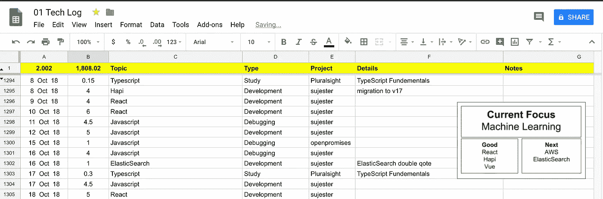

# 为了更好地编码，记录你的时间

> 原文：<https://medium.datadriveninvestor.com/to-code-better-log-your-time-426cec5620c4?source=collection_archive---------31----------------------->

我有一个习惯，说起来并不奇怪，但奇怪的是，自从我开始编程以来，我一直在这样做，从未失败过。这是一个帮助我不断提高编码技能的策略。

我记录我花在编程上的时间。

无论是实际开发、调试还是学习编程的某个方面，我都会记录下我所花的确切时间，以及描述我所花时间的关键词。

这是我开始做的事情，因为“10，000 小时”是你需要在某件事情上达到世界级水平的神话。我最初的目标是实践和学习编程的总时间达到 1000 小时。我很久以前就达到了这一点，但我决定继续记录我的时间。

下面是我使用的电子表格的截图:

如你所见，在 10 月 8 日到 18 日之间，我花了大部分时间为我的主要客户开发，花了一点时间学习 TypeScript，也花了一点时间在我的非盈利项目 [OpenPromises](http://www.openpromises.com) 上。

**那么有什么好处呢？**

这篇文章的主要观点是与你分享*为什么*记录你的时间是好的。

因为每次在我开始编码之前，我必须在我的日志中开始一个新的条目，需要像“主题”、“项目”和“细节”这样的信息，这迫使我意识到下一个小时或几个小时的目的。这给我们带来了好处 1:

> **日志记录帮助我更快地实现我的特定目标**

这减少了偏离轨道和徘徊到“呃，我在做什么”的土地。

有一个关于它的用途的信息的编码会议，给了我回顾和从过去的例子中学习的机会。这让我们看到了第二个好处:

> **它帮助我更好地计划未来的编码会议**

一般来说，我可以更好地估计开发某个特性或调试某个问题所需的时间，因为我有过去的例子可以参考。是的，准确预测完成一项功能或解决一个 bug 所需的时间可以像预测近期的股票价格一样成功，但总的来说，它确实帮助我更好地估计了所需的时间。

现在，学习对我来说很重要。一开始，我把 100%的编码时间花在学习上，而不是实际的编程上。现在我有了一个真正的客户，这个百分比当然会下降。但是，不断学习的重要性并没有降低。

当你停止学习时，并不是说你会停止成长，而是你实际上也会落后。现代 web 编程的目标是不断变化的。一年前，使用 Vue 进行生产对大多数 web 程序员来说是可笑的，但现在它得到了更多的重视，我们看到了 Vue 程序员的工作岗位。

这给我们带来了我要分享的最后一个好处。

> **记录我的时间可以确保我不断学习**

因为我是根据活动的目的来对编码时间进行分类的，比如‘开发’、‘学习’、‘调试’，所以我什么时候在学习，什么时候没有，这一点非常清楚。当我看我的工作表的最新一行，没有看到“学习”列在上面，我提醒自己下次有一点空闲时间就花时间学习。

简而言之，记录我花在编码上的时间帮助我更快地实现我的具体目标，帮助我更好地计划我未来的编码会议，并且确保我不断地学习。

喜欢这篇文章吗？在推特上向我问好。