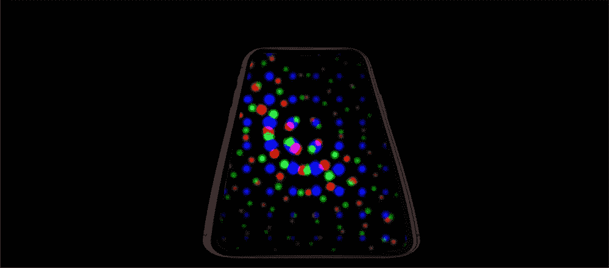

# 到数字，到模拟，到数字，然后带着利息回来

> 原文：<https://medium.datadriveninvestor.com/to-digital-to-analog-to-digital-and-back-with-interest-a920da4c82ee?source=collection_archive---------23----------------------->

Muezbiz works with the data more effectively without having to invade privacy.

## 已经犯过的错误的替代品。欢迎下一代社交媒体。欢迎感兴趣的媒体。

我们着迷于我们的玩具，无论是最新的食品加工机，还是非常酷的出行方式。我们的好奇心。我们的骄傲。我们对希望有同样经历的人的感觉。一种天生的感觉。它是部落式的，由于移动技术，它已经延伸到了地球的几乎每一个角落。

着迷于连接，我们继续以对我们的文明来说全新的方式冒险前进。我们发现自己被新玩具提供的可能性所吞噬。我们心甘情愿地连接、添加和吸收无穷无尽的数据。

在所有这些进化过程中，有一个简单的事实……我们是人，有人类的需求和弱点。

我们的数字玩具有效地将人们联系在一起，继续显示出它的潜力。孤独感有所减轻，但仅靠数字手段永远无法真正解决。我们仍然需要实体存在。我们的社交媒体联系仍然不完善。

躲在屏风后面……走出来的需求永远存在。

脸书成功地将数字世界带入我们的家庭，向我们展示了连接的力量。我们想填补情感上的空白，让别人渗透到我们的生活中。我今天感觉很糟糕。我今天应该穿什么？我们愿意给予我们的信任，以及我们的个人信息。

脸书探查我们的欲望，并驱动媒体成瘾的能力是所有其他社交媒体所羡慕的。作为第一个有效打击我们情绪的社交媒体，把它们放在一个有利的位置。

由于脸书可以自由获取个人信息，这种模式很快被视为广告和促销的可行资源。

欧逸文最近的一篇文章“机器中的幽灵”发表在 2018 年 9 月 17 日的*《纽约客》上，反映了“喜欢”如何通过人们的群体需求来促进联系。*

脸书的工作人员开始试验，首先是一个有价值的原因按钮，使用户能够捐赠他们的器官。这一发现证明了社会压力是如何鼓励朋友和家人也这样做的。广告商们很快抓住了这个概念，还有其他怀有更可疑意图的人。

缅甸成了脸书的眼中钉。带着脸书贪婪天真的理想主义，他们把他们的社会模式推向世界，通过增加成员来增加影响力。在缅甸，仇恨以惊人的速度在佛教极端分子中滋生，迫使罗辛亚穆斯林逃离家园……面临包括强奸在内的大规模谋杀。

脸书被追究责任。他们的回应是要求增加 100 名说缅甸语的审查员来删除危险的内容。他们失败了。问题要大得多，包括脸书自己的内容限制。不幸的是，这仍然是一个有争议的问题。现在，欧盟开始质疑脸书维持负责任媒体的能力。

我们的玩具变成了媒体成瘾的途径。我们的玩具变成了潜在的武器。我们自己对信息的需求，我们心甘情愿地给予和索取，却被用来为我们服务，也用来反对我们。尽管如此，许多人仍然认为他们的个人信息是无关紧要的。是吗？

我们仍然不知不觉地脆弱。

这是一个例子，说明我们的数字影响力变得多么有效。2016 年大选是为一个目的提供错误信息的最重要例子。通过各种渠道获取信息，不管是好的还是坏的，我们发现自己甚至质疑最有信誉的来源。

这是一个非常混乱的时期，并且正在影响我们的物质存在，我们对自我的模拟感觉。既然潘多拉魔盒已经完全打开，我们该何去何从？

我们对玩具的迷恋永远不会消退，我们对物理和数字连接的需求也不会消退。

我建立的媒体网站反映了下一代社交，叫做按地域过滤的“兴趣媒体”。兴趣媒体的众多优势之一是，它澄清了用户在兴趣范围内的信息。当一个媒体平台聚焦于用户的兴趣时，脸书现在面临的大部分模糊性就消失了。在 Muezbiz 的例子中，如果一个对话不是音乐性的，存档评论的决定就变得容易多了。

脸书一马当先，让人们在我们的物理社区内有效地进行数字连接。兴趣媒体也有同样的优势，是由我们个人兴趣提炼出来的。

这是我们回到模拟自我的地方。我看到当地人分享共同的兴趣，并与全球相似的社区联系在一起。我看到物理空间发生了变化，人们聚集在一起，可以在经济上和物质上互惠互利。我可以想象一个呆在家里的家长，通过为隔壁的高中乐队分享音乐赚点小钱。从数字到模拟，再到数字，再到数字。我看到了这样一个世界，在这个世界里，这两者结合在一起会带来更多的价值，并且让用户清楚地了解如何帮助控制不可控因素。欢迎感兴趣的媒体。

*约翰科尔，*[*Muezbiz.com*](http://muezbiz.com/)

[Muezbiz](https://www.muezbiz.com) *是创业公司。“在音乐对话中结识当地朋友。分享你喜欢的音乐来赚钱。”现在从当地的某个人那里购买按地区过滤的感兴趣的媒体。*

*所有加入的新成员都被转发到圣达菲民间/美国对话社交时间线上，看看网站如何运作。可以通过顶部成员名称下的首选项菜单随时更改默认值。*

我更多的流浪:

如果全美国的邻居都可以分享音乐内容，那会怎样？

[*The Tip Jar:字面上的 Tip Jar*](https://medium.com/@john_cole/the-tip-jar-literally-the-tip-jar-fc13c8757a89)

[*为了对音乐的热爱:一起成长一个社区*](https://medium.com/@john_cole/for-the-love-of-music-growing-a-community-together-b4773e33bc43)

[*出于对音乐的热爱:为什么做音乐人谋生这么难？*](https://medium.com/@john_cole/for-the-love-of-music-why-is-it-so-hard-to-make-a-living-being-a-musician-4a7af7fcd07)

[*为了对音乐的热爱:应用接吻原理？*](https://medium.com/@john_cole/for-the-love-of-music-applying-the-kiss-principle-4a653c6e1dfa)

[*为了对音乐的热爱:兴趣 vs 社交媒体—第一部分*](https://medium.com/@john_cole/for-the-love-of-music-interest-vs-social-media-part-1-1ffeac174a29)

[*为了对音乐的热爱:过滤什么最重要——第二部分兴趣 vs 社交媒体*](https://medium.com/@john_cole/for-the-love-of-music-filtering-what-matters-part-2-interest-vs-social-media-5196c7071450)