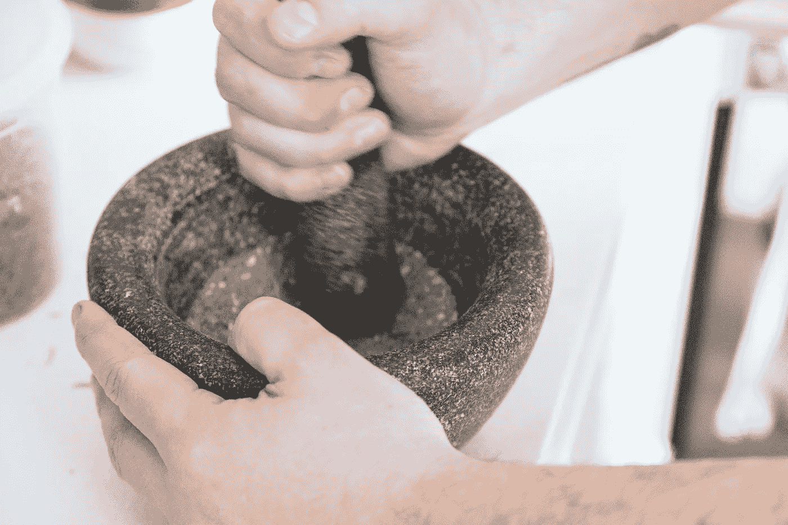

# 做还是不做？这是推特上的问题

> 原文：<https://medium.datadriveninvestor.com/to-do-or-not-to-do-that-is-the-twitter-question-f59dd1087d43?source=collection_archive---------3----------------------->

## 规则 1 是社交媒体不仅仅是关于你，而是你的观众

Readily mix Twitter content from yourself as well as from others.

无论是 Twitter 的新手还是自认为无所不知的资深人士，现在都是停下来回顾社交媒体该做和不该做的事情的好时机。

当你记得 Twitter 有着直接而广泛的影响力时，这一点尤为重要。你可以在世界范围内产生和在本地一样大的影响。

 [## Twitter 算法是如何工作的&更多...数据驱动的投资者

### 我们去拿护照吧。获取关于技术、金融、工作场所、生产力等方面的每日信息。跟我来…

www.datadriveninvestor.com](https://www.datadriveninvestor.com/2019/03/19/how-does-the-twitter-algorithm-work-more/) 

要记住的最重要的事情之一是，社交媒体，尤其是 Twitter，并不全是关于你的。每个人都有发言权，你可以通过分享内容来帮助每个人。是的，创建和分享你自己的观点和文章。

同时，不要严格地做一个广播员。当有人回复你的推文时，用简单的感谢来回复。随时混合自己和他人的内容。记住归属。

首要的指示是传递一致的信息来帮助你的听众。

# **善于分析**

为了确保你不会在真空中操作——白白转动你的 Twitter 轮子——请查看 Twitter analytics。您可以在您的个人资料图片下的下拉菜单中找到它。

从那里，你可以查看你的观众的人口统计数据，即将举行的活动以及你的推文表现如何。看看哪些推文效果最好，并尝试更像它们，看看互动是真实的互动还是一次性的侥幸。

 [## 被分析淹没，它们真的重要吗？

### 统计数据可以压倒一切。哪些重要？为什么企业应该关注社交媒体分析？

medium.com](https://medium.com/datadriveninvestor/inundated-by-analytics-do-they-really-matter-378c83cf0469) 

在最好的情况下，Twitter 分析显示了什么与你的观众产生了共鸣。这有助于你将资源引导到它们发挥最大效益的地方，让你的投资获得更好的社会回报。

标签是另一个考虑因素。它们有助于你的内容在任何特定时间从数百万条来回传播的推文中被找到。

每个 Twitter 聊天都有自己的标签，随着越来越多的事件的发生，参与者可以形成自己的网络。推特用户相互交流，同时向世界其他地方传播见解。

# **恶趣味**

如果你有可能让其他人受益的特殊内容，你可以创建自己的标签。这可能很有趣，但要小心:创建标签时，要确保它是唯一的。否则，你可能会断章取义地使用一个，这可能是低级趣味的，取决于当前的事件。

“在你的推文中使用与你的业务或内容相关的标签，以帮助你的推文在搜索结果中排名更高，”supremacy marketing 的联合创始人[达里亚纳·lozano‏](http://www.dharilo.com/)在与数字营销专家 [Madalyn Sklar](https://twitter.com/MadalynSklar) 的#TwitterSmarter 聊天中说道。

洛扎诺说:“每条推文坚持一到两个标签。”"试着将它们无缝地融入你的信息中."

 [## 如果你做得对，有一个标签

### 了解标签的基本知识来推销你的业务

medium.com](https://medium.com/datadriveninvestor/theres-a-hashtag-for-that-if-you-do-it-right-79b9d167c86a) 

如果你想让你的推文脱颖而出，图片、视频、信息图、gif 和其他视觉材料也是必不可少的。

给推文加标签还会让其他人知道你的信息对他们很重要，或者你已经使用了他们的内容，从而吸引他们的注意力。收件人会感谢你的帮助，并可能增加你的转发量。

# **独立推特**

这既不是做也不是不做，而是一个个人指导方针:如果你写的每条微博都独立存在，你可以获得更多的关注。请看下面来自一个可能的 Twitter 聊天问题的虚构例子:

Q1:在新的一年里，你可以做哪三件事来保持财务健康？#信用聊天

有人可能会这样回答:

A1 计划，预算，坚持。#信用聊天

为什么不说这个？

为了在新的一年里保持财务健康，制定一个计划，为它做预算，并坚持下去。#信用聊天

 [## 如何穿着睡衣建立良好的关系

### Twitter 聊天有趣、轻松，非常适合社交

medium.com](https://medium.com/datadriveninvestor/how-to-make-great-connections-in-your-pajamas-461e91356295) 

是的，重复问题很“小学化”。它也有更多的单词。同时，你有一个独立的完整的思想。请记住，聊天推文不仅会在聊天中传播，还会在世界其他地方传播。

# **更好的约定**

站在自己的角度，哪条推文更容易引起聊天之外的人的注意，并获得多次点赞和转发？你收到的赞、回复和转发越多，你的知名度就越大。这会带来更多的关注者，增加你的参与度。

学习推特上该做什么和不该做什么的最好方法是观察别人是如何做的——但是不要观察太久。你可以通过实践来更多地了解 Twitter。最好在聊天中学习，然后尝试发微博，直到你觉得舒服为止。

不要想多了。去做吧。

**关于作者**

吉姆·卡扎曼是拉戈金融服务公司的经理，曾在空军和联邦政府的公共事务部门工作。你可以在[推特](https://twitter.com/JKatzaman)、[脸书](https://www.facebook.com/jim.katzaman)和[领英](https://www.linkedin.com/in/jim-katzaman-33641b21/)上和他联系。