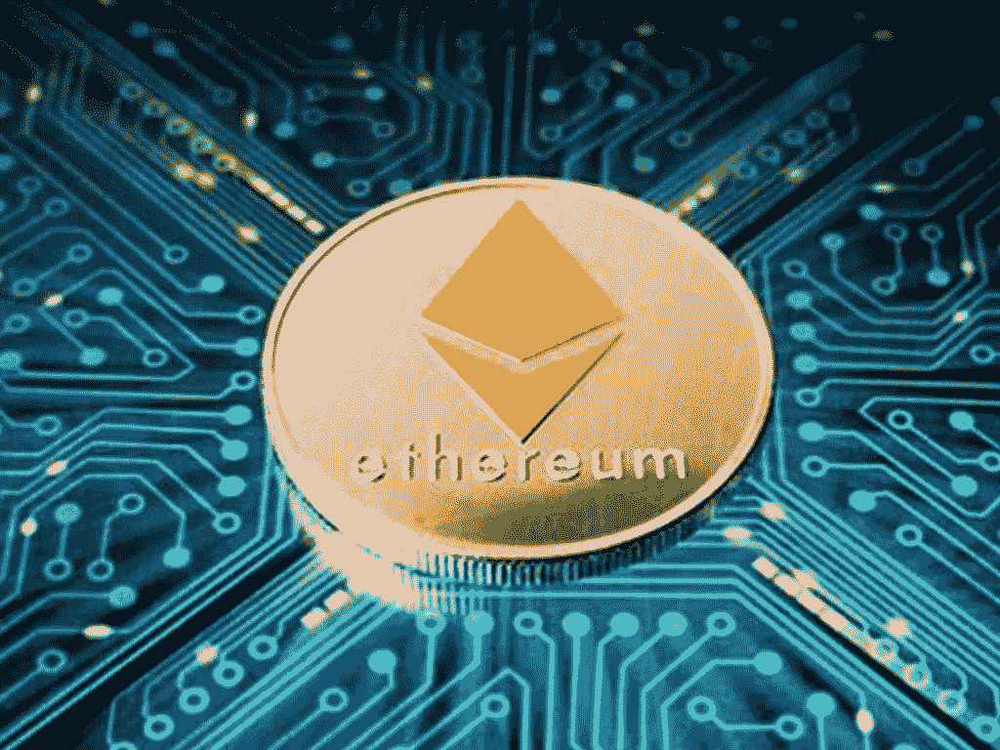
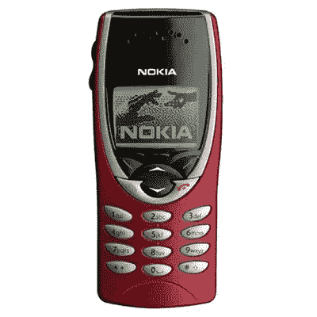
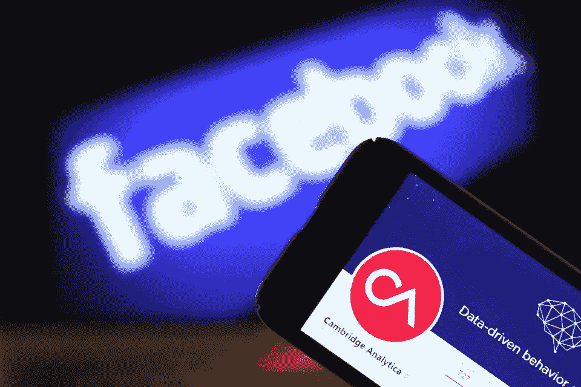

# 要发现以太坊的价值，你必须忽略它的价格

> 原文：<https://medium.datadriveninvestor.com/to-find-ethereums-worth-you-have-to-ignore-its-price-58815637edf8?source=collection_archive---------4----------------------->

Chip designers started to get creative with their circuit boards, supervisors were not amused.

如果你正在你的智能手机上阅读这篇文章，那么几乎有四分之一的可能性你是通过 iPhone 阅读的。尽管价格高得离谱，容易出现划痕和屏幕破碎(谁会把玻璃放在一部明显会掉落的手机上？)截至 2018 年第三季度，无处不在的 iPhone 制造商苹果在全球智能手机市场的份额为 24.3%。尽管有无数的 iPhone 替代品，其中许多更便宜，拥有更好的摄像头，功能，功能，内存和许多其他硬件——我们(包括我自己)仍然非常喜欢我们的 iPhone。部分原因是苹果的应用商店——智能手机革命的基石。当 iPhone 第一次出现时，App Store 是 iPhone 的一个主要吸引力，因为它是一个几乎可以完成所有事情的平台，

> “有一个应用程序可以做到这一点。”

成了将永远铭刻在一代人心中的一句老话。作为一个软件平台，iOS 成为了应用开发者的*和*之地，直到最近几年，谷歌才赶上了它的谷歌 Play 商店，Android 应用的数量才最终超过了 iOS 应用。但数字不一定是最好的衡量标准，因为我们大多数人只使用少数几个应用程序，而最受欢迎的应用程序在两个平台上都有。随着 iOS 对应用程序开发人员来说更有利可图，新应用程序出现在 Android 应用程序出现之前的趋势已经出现。

正是我们智能手机上的应用程序提供了拥有它们的理由。因为让我们面对它，如果我们需要做的只是发短信(问你的祖父母)和打语音电话(再次，问你的祖父母)，一部诺基亚 8210(参观博物馆)会立刻做到这一点*和*为了更好的措施，你甚至可以玩游戏蛇(没有人老到足以告诉你那是什么，研究物理档案)。应用程序提供了最终为智能手机提供动力的燃料，并催生了一个完整的生态系统，在这个生态系统中，我们的大部分生活都围绕着我们口袋里的东西(让我们保持这种复杂，我知道你在想什么)。

Michelangelo's Sistine Chappel in pixels.

同样，以太坊的核心目的是为开发者提供类似于 iOS 的去中心化平台，以便在以太坊协议的基础上开发去中心化的应用或 dApps。尽管以太坊的价值受到打击，但可以说，与几乎所有其他区块链协议相比，它在实现其目标方面相对成功——为其他应用程序的开发提供平台。

以太坊从未打算成为一种“投资”。但是因为建立智能合同(满足特定条件时自动执行的数字合同)很容易，企业家和蛇油推销员以及形形色色的骗子都把马鞍套在以太坊上，推出各种各样的 ICO(首次硬币发行)。这些 ico 中的许多只不过是利用散户投资者赚钱的方式——使用以太坊购买这些 ico 的代币。由于去年对 ico 的需求达到白热化，对以太坊的需求也流向了月球，推动其价格对美元上涨。但是当这些 ico 提高以太币的时候，他们也很快抛弃了以太币，用它来交换法定货币。加密货币交易所 [BitMEX](https://blog.bitmex.com/ethereum-holdings-in-the-ico-treasury-accounts/) 最近对 220 个 ico 的分析显示，ico 出售的以太币与它们以美元计算筹集的一样多(约 50 亿美元)。无论人们是否同意 ICO 热潮对以太坊价格的影响，或者是否同意以太坊作为 ICO 筹集资金的渠道，人们都不能否认，最终，以太坊作为促进这一功能的平台是成功的。

以太坊的创建愿景从来不是作为一种货币形式与美元竞争。相反，它被设计成允许互联网用户重新控制他们的数据。虽然比特币的诞生可能是为了消除金融领域的中间人——以太坊的诞生是为了针对亚马逊、脸书和优步等平台公司——但所有这些公司最近都因严重侵犯隐私和不当处理用户数据而受到审查。

Your data, their profit.

就像苹果的应用程序商店一样，以太坊吸引了才华横溢的开发人员，他们对以太坊协议形成了自己狂热的忠诚，创造了一个充满活力的开源程序员社区。在开发社区中，那些对开发区块链应用感兴趣的人谈论以太坊，而那些对价值储存或交换媒介感兴趣的人则倾向于谈论比特币。尽管以太坊的价格相对于美元大幅下跌，但开发者对以太坊的兴趣并没有减弱——快速查看 GitHub 对以太坊相关项目的承诺将会证实这一点。尽管许多基于以太坊的项目被过度宣传，不太可能实现他们早期的承诺，但这个空间继续吸引人才和资本——这是建立基于以太坊的生态系统的关键因素，就像苹果公司将应用程序带入主流意识一样。

从物流公司到银行，从金融机构到农民，各行各业的公司都在投入真金白银探索以太坊区块链的商业应用。两个月前，能源巨头壳牌(Shell)和法国兴业银行(Société Générale)以及花旗集团(Citigroup)宣布支持 Komgo 的开发，这是一个旨在改善商品贸易融资的以太坊项目。

以太坊开发者的部分吸引力在于它的图灵完整性——这意味着开发者可以编写能够(在很大程度上)解决任何合理计算问题的程序。它还允许复杂的逻辑，这是设计复杂以太坊智能合约的关键组件。因为以太坊是图灵完全的，所以有可能用另一种编程语言如 Python 来实现逻辑，但是如果需要的话，可以将该逻辑转换成 Solidity(一种以太坊编程语言)。要理解这种暗示的意义，可以把它想象成一个“通用翻译器”。基本上，即使我是一个精通 C++或其他编程语言的程序员，因为以太坊是图灵完全的，我可以将我的编程逻辑从一种编程语言移植到以太坊区块链——这是一个巨大的好处。这意味着作为一名开发人员，我不必重新定义我的编程逻辑来专门迎合以太坊协议，这也是以太坊吸引如此多开发人员的部分原因。

Jim forgot where he left his keys again.

从 CryptoKitties 这样的游戏到 Augur 这样的预测市场，以太坊仍然是少数几个开发者、公司和企业家都在其上建立的区块链协议之一——就像第一代 iPhone 发布时的苹果应用商店一样。随着物联网或物联网(洗衣机和冰箱等设备连接到互联网)的兴起，从 Sansung 和 IBM 到 Barclays 和 Wells Fargo 的公司都在探索以太坊协议之上的建筑应用。但与苹果的应用商店不同，苹果的应用商店是一个有围墙的花园，只有遵守苹果制定的严格规则的应用才能获得成功，以太坊的去中心化性质意味着任何人都可以在以太坊协议之上构建——这无疑会有并且已经有一些不幸和不可预见的情况——其中主要是 DAO(去中心化自治组织)的臭名昭著的黑客攻击以及随后以太坊分为以太坊和以太坊经典。可以肯定的是，以太坊在很大程度上仍处于婴儿期——它甚至只是一个刚刚学步的孩子，真正存在了大约三年半。

但是以太坊，不管怎样，都有巨大的潜力。它是开放的，灵活的，可以以比特币所不能的多种方式定制。以太坊的创始人 Vitalik Buterin 公开表示，他的最终目标是利用以太坊从根本上重新构建网络——从传统经纪人手中夺走权力，并将其交付给大众。如果以太坊最终通过无数开发人员在其上构建去中心化网络的未来而实现大规模采用，那么 2017 年和 2018 年的 ICO 泡沫和破灭就像是苹果应用商店发展中的一个减速带，可能是区块链协议。仅仅因为这个原因，一个人*可以*考虑持有一些以太坊，以及一部 iPhone。