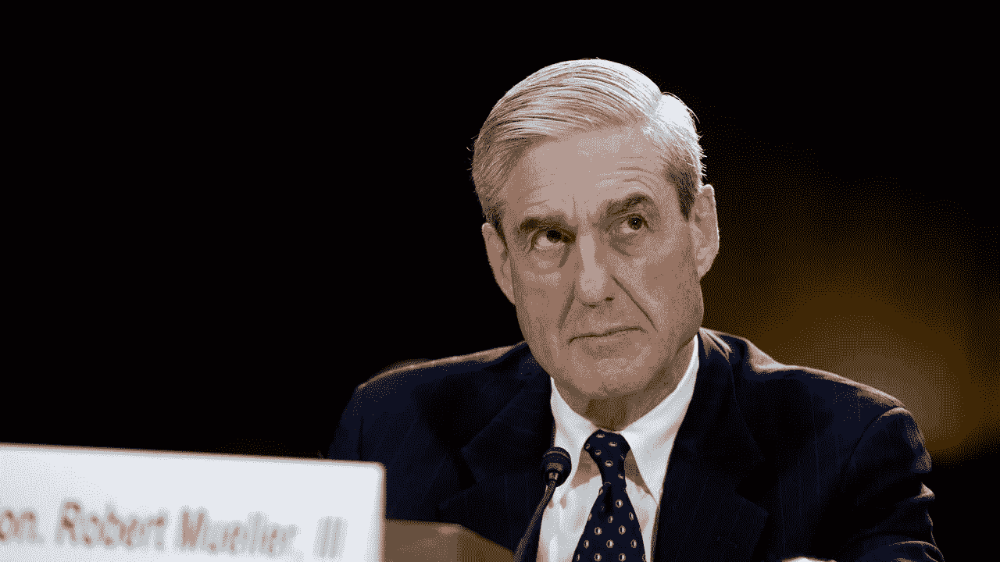
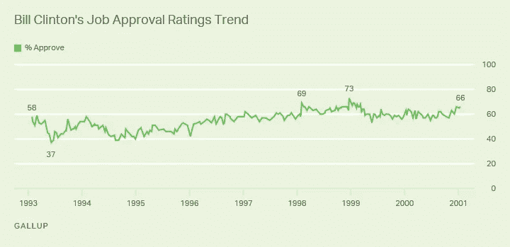

# 弹劾还是不弹劾？这是个问题。

> 原文：<https://medium.datadriveninvestor.com/to-impeach-or-not-to-impeach-that-is-the-question-f39add068801?source=collection_archive---------2----------------------->

## 解开政治包袱

民主党目前发现自己处于进退两难的境地。

2017 年 5 月，司法部副部长罗德·罗森斯坦(Rod Rosenstein)任命罗伯特·穆勒调查特朗普总统潜在的妨碍司法公正和共谋行为。然而，2019 年 4 月发布的穆勒报告并没有像许多左翼人士希望的那样谴责总统。然而，它仍然没有解决潜在妨碍司法的问题。这份期待已久的报告(尽管经过高度编辑)凸显了美国政治中日益扩大的鸿沟，特别是左翼。罗伯特·穆勒和他的团队得出的结论基本上是不确定的，并导致了对报告的不同解释。结果，民主党分成了两派——一派呼吁对总统进行弹劾听证，另一派不这么认为。

希望弹劾听证会开始的国会成员正在回应他们的基础上增加对总统压力的日益增长的愿望。穆勒报告中列出的 10 起潜在妨碍司法公正的案件被许多人认为是足以支持弹劾听证会的证据。此外，总统迄今为止在总统任期内采取的各种行动，助长了民主党内许多人尽快结束特朗普总统任期的愿望。实现这一目标的唯一现实途径是通过弹劾。

 [## 保护主义、政治和经济动荡——数据驱动的投资者

### 美国股市昨日出现 400 多点的大幅反转，为未来的事情发出了警告信号。市场…

www.datadriveninvestor.com](https://www.datadriveninvestor.com/2018/06/28/protectionism-politics-economic-turmoil/) 

这些可能的司法障碍包括:

*   **总统解除联邦调查局局长詹姆斯·科米的职务。**
*   **努力解除罗伯特·穆勒特别委员会。**
*   **努力阻止证据的公开披露。**

然而，许多民主党国会议员不支持弹劾。至关重要的是，这并不意味着他们不会减少对特朗普弹劾的想法，而是认为支持弹劾实际上有助于总统。克林顿总统在审判和弹劾程序中的公众舆论最好地证明了这一点:

The Lewinsky Scandal occurred throughout 1998.

正如你在上面看到的，在 1998 年弹劾克林顿总统的过程中，对总统的总体支持并没有受到华盛顿事件的影响。事实上，在此期间，他甚至享受到了一些最好的民调数字。政治的党派性质意味着民主党人对总统的看法没有受到丑闻的影响，共和党选民无论如何也不会投票给他。结果，这一丑闻只是凸显了现代政治纯粹的党派性质，并没有动摇任何一大批选民。

目前不要求弹劾的民主党人已经从这起丑闻中吸取了教训，并不认为当前的局势严重到足以弹劾。此外，他们还在等着找到反对总统的证据，类似于水门事件中发现的尼克松录音带。过早地要求弹劾，如果他们最终找到未来*【重罪和轻罪】*的重要证据，那么它就不会被认真对待。

如果针对总统的无效弹劾听证会开始，那么在 2020 年，他将能够在他所谓的*“政治猎巫”*中充当无辜的一方，并将有更大的机会赢得连任。

因此，民主党领导层——南希·佩洛西(Nancy Pelosi)和查克·舒默(Chuck Schumer)——正在利用任何可能的机会攻击总统，但没有要求举行弹劾听证会。他们在 2016 年低估了唐纳德·特朗普，结果输掉了一场选举，所以他们现在更加谨慎，以确保这不会在 2020 年重演。如果有任何实质性的证据出现，如果他们知道自己会赢，他们会第一个要求弹劾。

对于民主党人来说，弹劾是一个艰难的选择。

他们都有相同的目标(结束特朗普的总统任期)，但在如何实现这一目标上存在分歧。在今年晚些时候总统选举开始成形之前，民主党不分裂至关重要。共和党几乎完全团结在特朗普总统周围，而民主党仍然需要找到一个他们都可以支持的候选人。政策分歧并没有让这变得更容易。许多人已经意识到，他们阻止特朗普当选总统的唯一方法就是在投票箱中击败他。