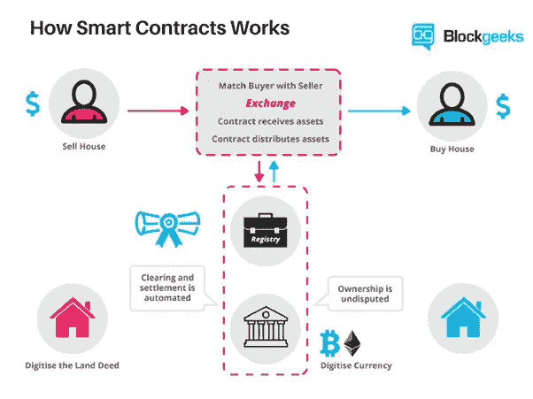
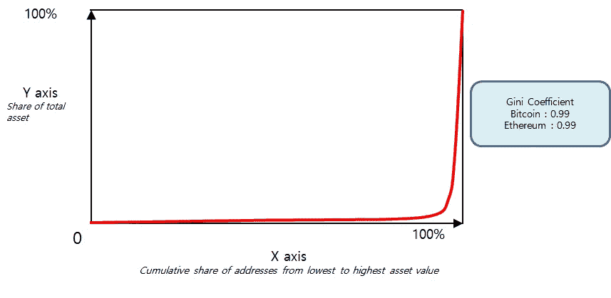

# 整合区块链和人工智能-2

> 原文：<https://medium.datadriveninvestor.com/to-integrate-blockchain-and-artificial-intelligence-2-9f05eb8bd79?source=collection_archive---------14----------------------->

**EcoVerse 的理论背景**

在区块链，一致算法管理两个重要功能:第一个是维护包括批量生产在内的网络中分类账的一致性。第二是管理区块链网络创造的财富分配。到目前为止，几乎市场上的每一枚硬币都被设计成使用这两种功能交织在一起的共识算法。

对于分类账维护，共识算法需要由参与者(称为矿工或区块生产商)提供设备和网络结构。激励，或者说财富，只分配给一小部分贡献者，作为对他们贡献的回报。这是迄今为止设计的大多数加密货币中财富集中的原因。然而，在 EcoVerse，上述两个功能是分开设计的。第一个功能是通过人工智能的实现来管理的。

在这篇文章中，我想解释为什么在 EcoVerse 项目中集成人工智能和区块链是重要的，这是有史以来第一个自我可持续的网络。但首先有必要考察一下区块链的演变。

在 2008 年首次介绍区块链的中本聪的身份至今仍然是匿名的。但许多人认为他是一名精通密码学的计算机程序员。他创建了一个支付系统，允许普通大众在网络空间相互交易，而不需要第三方参与。[1]正如你们中的一些人可能认为的那样，这一点的重要之处在于，网络空间中的人们从根本上来说是不可信任的。如果一个人不能被信任，那么必须创造一种机制来提供“信任”。于是这个问题就通过加密货币解决了:即使不认识对方，交易也是通过密码证明来保障的。

例如，当两名士兵在黑暗的战场上相遇时，验证对方身份的最佳方式是通过预先确定的密码。第一个士兵以“土豆”开头，第二个士兵回答“地瓜”，两人互相验证成功。中本聪的想法是，如果身份可以用这种方式证明，即使双方是陌生人，生意也是可能的。通过这个伟大的想法，诞生了第一种加密货币——比特币。虽然比特币是一个成功的价值储存系统，但也存在许多问题。或许最大的担忧是比特币的实用性不是很强。最基本的问题是比特币承诺的问题。不仅仅是我们日常生活中进行金钱交易的一种手段，还必须有一种机制，通过这种机制，公众既可以相互承诺，又可以看到这种承诺得到履行。为了实现这一目标，Vitalik Buterin 创建了以太坊(Ethereum)，这是一个加密货币平台，利用各方同意的所谓“智能合约”进行互动。[2]

虽然以太坊拥有比比特币先进得多的系统，但它也有许多问题，包括缺乏实用性。

(image source: blockgeeks.com[5])

这些问题中最值得注意的是可伸缩性问题，指的是每秒事务数(TPS)和事务完成时间(TFT)。虽然许多平台都试图解决这个问题，并且随着时间的推移，它已经慢慢得到改善，但它仍然是一个需要进一步解决的问题。

然而，如今加密货币最致命的问题是自我可持续性。简单地说，大多数加密平台都是自我毁灭的。这么说意味着，在没有外部影响的情况下，一个没有自我可持续属性的生态系统最终会自我毁灭。[10]这是由以下原因造成的:

不公平的财富分配

性能差

去中心化意识形态的抽象。

在以前的系列文章中，我讨论了自我可持续性的区块链要求。[6–12]在这个系列中，我将重点关注上面提到的问题。

纽约大学经济学教授鲁比尼，“末日博士”回应这些问题，称加密货币是所有骗局和泡沫的母体。”[4]他说，在加密货币的世界里，狗屎硬币没有立足之地。除了简单地理解他的观点，我还同意其中的许多观点。千真万确:大多数货币都是骗局。根据韦氏词典，骗局是“欺骗人们不诚实地赚钱的一种方式。“我认为，除了少数例外，大多数硬币都是骗局。原因是硬币更努力地模仿人类的贪婪，而不是追求技术上的卓越。几乎在每个案例中，团队都在努力满足内部人员的欲望。基尼系数可以证明这一点。

这里基尼系数显示比特币在 0.99。如果基尼系数为 1，我们说这是完全不平等。为了用更简单的术语来理解这一点，让我们以一个收入来自农业的社区为例。如果 100 个人在农场工作，一起挣了 100 美元，但只有一个人真正拿回了 100 美元，那么这对其余的人来说是完全不公平的。这里，基尼系数显示为一(1)，被称为完全不平等状态。由于比特币的价格为 0.99，人们可能会认为以太坊和 EOS 等其他货币应该更低——但它们甚至比比特币更接近 1。虽然网络可能是分散的，但财富的分配正变得难以置信地集中。开发者说这是不可避免的，因为他们需要解决可扩展性和在日常生活中看到用户的问题(以更快的 TPS 和 TFT 为标志)。这只是一个借口。简直是胡说八道。从长远来看，财富的分配远比日常的网络性能问题更重要。

这是 EcoVerse 已经考虑了很长时间的事情。我们能否在分散财富分配的同时解决可扩展性和日常可用性的问题？起初，这似乎是不可能的——但这正是人工智能的用武之地。这就是我们所说的 AI-DPoC(人工智能支持的代理利益证明)。

如前所述，AI 负责一致性算法的块形成和维护。一旦人工智能解决了这个问题，共识算法就只剩下一个功能了。这个功能是平均分配用户产生的财富。有了这个，我们可以创造性地分享我们的财富。直到现在，财富分配一直严重失衡。这就是为什么我们将人工智能引入我们的生态系统。

AI-DPoC 的详细设计将在下一篇文章中讨论。

这是“EcoVerse 的理论背景”的第二部分阅读第一部分，点击这里:[https://link.medium.com/42cwuwSOzS](https://link.medium.com/42cwuwSOzS)

本文由韩文原文翻译而来，可在 Steemit 网站上阅读:【https://steemit.com/ecoverse/@nicklee002/45sbbw-2 

参考

[1]比特币白皮书。比特币:一种点对点的电子现金系统。[https://bitcoin.org/bitcoin.pdf](https://bitcoin.org/bitcoin.pdf)。
[2]以太坊白皮书。[https://github.com/ethereum/wiki/wiki/White-Paper](https://github.com/ethereum/wiki/wiki/White-Paper)T5【3】尼古拉斯·库尔图瓦。《论最长链规则与加密货币的程序化自毁》，[https://arxiv.org/abs/1405.0534](https://arxiv.org/abs/1405.0534)
【4】美国消费者新闻与商业频道。鲁比尼对加密的批评加倍，称其为“正在融化的恶臭污水池”[https://cnb.cx/2NESVBO](https://cnb.cx/2NESVBO)
【5】网虫。智能合同:将取代律师的区块链技术。[https://blockgeeks.com/guides/smart-contracts/](https://blockgeeks.com/guides/smart-contracts/)尼克·李【6】永焕。自我可持续区块链的要求第 1 部分。

第二部分。[https://link.medium.com/NeHxFS0OzS](https://link.medium.com/NeHxFS0OzS)T20【8】第三部分。【https://link.medium.com/2gCtzu2OzS】 [【9】第四部分。](https://link.medium.com/2gCtzu2OzS)
【10】第五部分。
【11】第六部分。
[第七部分。](https://blockgeeks.com/guides/smart-contracts/)[https://link.medium.com/dgUF5u9OzS](https://link.medium.com/dgUF5u9OzS)