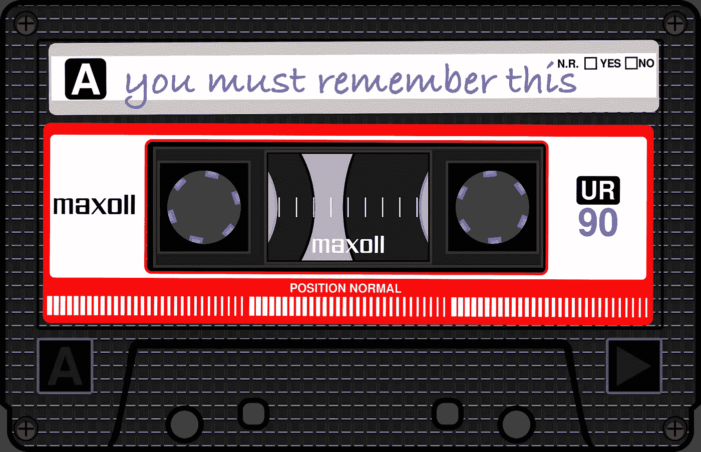
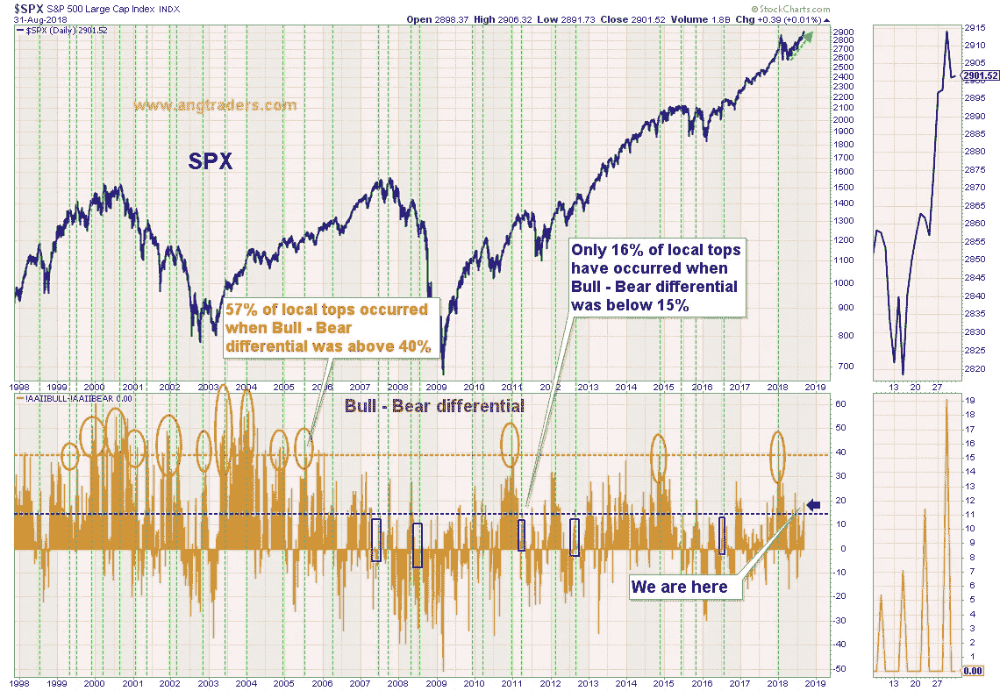
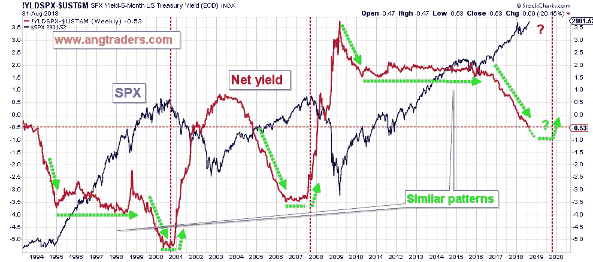

# 要记住，你必须忘记

> 原文：<https://medium.datadriveninvestor.com/to-remember-you-have-to-forget-d529eb3107a6?source=collection_archive---------13----------------------->

为什么投资者更容易忘记牛市而不是熊市？毕竟，熊市的持续时间和规模(平均而言)都比牛市短，因此人们可以认为牛市更容易记住。为什么在过去的五年里，如此多的数字城市预言家警告我们，所有仍在市场上的人都将面临厄运和黑暗？有多少次你读到过股票市场估值过高，而市场却不断创出新高？

研究记忆的科学家现在更加关注“遗忘”在记忆中的作用。事实证明，如果我们不擅长遗忘，我们将根本无法记住太多东西。如果我们的大脑能够记住日常生活中发生的每一件事和我们的每一个想法，那么由此产生的多余记忆将会变得难以辨认。换句话说，我们没有记忆。

我们最记得那些我们的大脑/思想认为重要的经历，而忘记所有其他的。一天结束时，我们几乎记得发生的所有事情，而第二天早上，我们已经忘记了大部分事情。

科学家们不太了解我们的大脑是如何决定什么是重要到需要记住的，但我们的工作假设是，恐惧的情绪起着巨大的作用；记住危险是一种有助于生存的适应性进化特征。然而，有些情况下，为了我们自己的利益，我们也记得*。例如，PTSD 是由无法忘记的极度恐惧经历造成的，最终会干扰正常的记忆功能；不能忘记，意味着我们在制造新的记忆时有困难。**你必须忘记，才能记住。***

可怕的事件，以及由此形成的对这些事件的强烈记忆，解释了为什么投资者和分析师会关注熊市，甚至(尤其是)在长期牛市期间。这是一种轻度的创伤后应激障碍。

当然，当投资者确信“回到水里”是安全的时候，已经太晚了。在市场顶部没有恐惧，这就是牛市不会给人留下深刻印象的原因。

# 市场情绪

大多数投资者在做出投资决定时依赖基本面分析，但根据我们的经验，市场不是由基本面驱动的，对金融和地缘政治消息的反应也不一致。

我们的工作假设是，市场中唯一不变的是人类的情绪，特别是恐惧和贪婪(害怕错过)，这些情绪在市场的定价历史中留下重复的模式，告诉我们可能的未来。在我们用来衡量投资者恐惧的几种技术中，最直接的是 AAII(美国独立投资者协会)每周调查，其中成员被问及他们是否认为市场在未来六个月会上涨、保持不变或下跌。这个指标作为反向指标有相当好的记录；市场顶部的特点是高看涨情绪和低看跌情绪，而市场底部的特点则相反。

下图显示了牛市减去熊市的情绪差异与标准普尔 500 的对比。它强调了这样一个事实，即接近 60%的局部顶点发生在差值大于+40%时，而只有 16%的顶点发生在差值小于+15%时。过去一周，这一差额略微上升至+19%。当差价在+15%到+40%之间时，熊市开始的可能性只有四分之一。即使标准普尔 500 继续创出新高，散户投资者的恐惧仍在蔓延。当恐惧达到这种程度时，市场顶部很少出现。

# 估价

几乎自 10 年前这轮牛市开始以来，基本面分析师就一直在警告我们股票估值过高，但市场本身却持续走高。大多数时候，市盈率或一些变量(如价格销售比)被拿出来支持估值过高的说法，但这种类型的分析没有考虑利率。我们更倾向于使用**净收益率**，我们将它计算为股息收益率减去 6 个月期国债收益率；这比较了投资于股票市场和无风险国债的资本回报率。

下图显示，尽管净收益率最近转为负值，但仍高于科技牛市期间的任何时候，也高于过去三年的房地产牛市。此外，请注意，在主要市场顶部之前，净收益率趋于平缓。

以这种方式衡量，股票是*而不是*高估的，直到净收益率开始变平，恐惧变得稀少，我们将假设“历史上最讨厌的牛市”仍然存在。

**昂商**

加入我们在 www.angtraders.com 的团队，从我们 40 年的经验中获益。

**我们为我们的用户提供独特的视角，这是我们在过去 40 年中形成的，这有助于我们站在市场的“正确一边”,远离人群。**

特别通知:从 2018 年 9 月 5 日起，我们的订阅费率(仅针对新订户)将为每月 50 美元或每年 400 美元。

**我们邀请您在 2018 年 9 月 5 日之前加入我们，目前的价格为 30 美元/月或 240 美元/年，只要会员资格不变，这一价格就不会增加。**