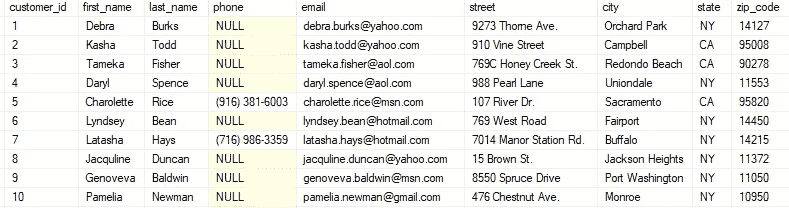
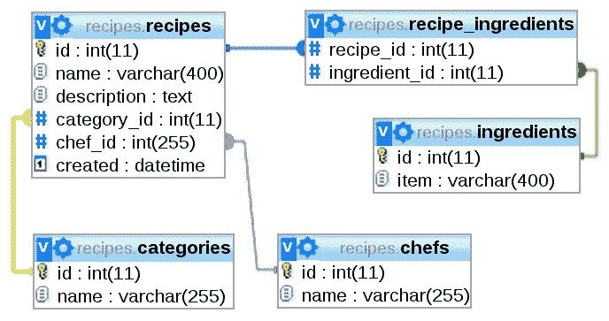
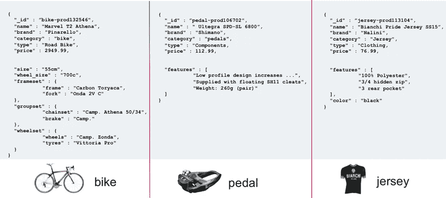
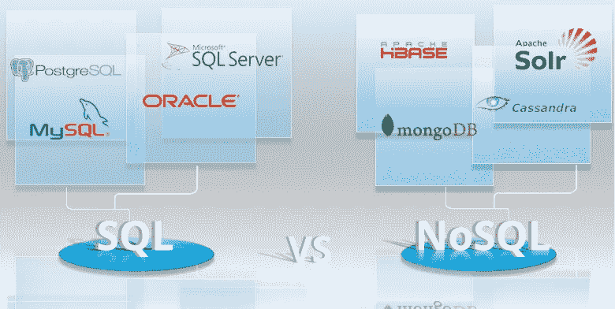

# 到 SQL 还是不到 SQL

> 原文：<https://medium.datadriveninvestor.com/to-sql-or-not-to-sql-91cdd4011dd6?source=collection_archive---------5----------------------->

## 这是一个问题…

我是电视和互联网上烹饪相关内容的超级粉丝。我喜欢看阿尔顿·布朗做出美味可口的菜肴，同时解释它们背后的科学。当我试图在家重新制作这些菜肴时，我意识到如果没有适当的计划，你会很快迷失在厨房里。

专业厨师使用的计划系统被称为[。在开始组装菜肴之前，厨师将在厨房准备和整理所有的配料(有时还有大盘子和餐具)。拥有一个组织良好的工作场所可以让你专注于更复杂的问题，而不是担心组成产品的积木(或成分)。](https://en.wikipedia.org/wiki/Mise_en_place)

我强调了**计划**在烹饪中的重要性，因为这也是选择你的应用程序需要什么样的数据库的最重要的一步。由于 SQL 和 NoSQL 数据库的结构不同，它们在伸缩、查询和空间方面有不同的优缺点。让我们从基础开始。

A basic visual representation of SQL vs NoSQL databases.

# 结构化查询语言

SQL 代表结构化查询语言。它是一种用于编写从数据库收集数据的查询的语言。SQL 有许多不同的命令，允许您从两个不同的表中排除或合并结果。表是 SQL 数据库中数据的基本结构。

An example SQL table.

最容易把 SQL 表想象成 Excel 文档。表是由它们的模式定义的——每行的名称和它包含的数据类型的指南。数据的每个条目或行都需要有一个部分，即使它是空的。上表只有 2 个条目的电话号码，但是其他条目**必须**有一个电话号码部分，所以在该部分放置 NULL。如果向表中添加另一列，每个条目都将有一个用于该列的空间。

 [## 创建折衷书架的程序员指南|数据驱动的投资者

### 每个开发者都应该有一个书架。他的内阁中可能的文本集合是无数的，但不是每一个集合…

www.datadriveninvestor.com](https://www.datadriveninvestor.com/2019/03/25/a-programmers-guide-to-creating-an-eclectic-bookshelf/) 

SQL 数据库最与众不同的部分是它们是关系型的。表中的每个条目都有一个惟一的 ID，将它与该表联系起来。如果来自两个不同表的数据是相关的，那么可以编写 SQL 查询，通过它们唯一的 id 连接这些表。这保持了表格的组织性，并允许**单一的事实来源**。

A graphic showing the relationships between SQLtables.

在上表中，一个食谱只有一个厨师，但是一个厨师可以有许多食谱；creator chef 的 ID 作为一列保存在 recipe 表中。因此，厨师对菜谱所有权的唯一来源**是菜谱表，这是一种**一对多**的关系。食谱和配料有一种**多对多**关系——食谱可以有许多不同的配料，配料可以属于许多不同的食谱。为了保持**单一来源的真实性**，我们创建了一个单独的表，通常是两个表名的组合，如 recipe_ingredients，称为 **joiner 表**。joiner 表中的每个条目都包含配方和配料 id，因此可以使用 recipe_ingredients 表作为指南，在查询中连接配方和配料表。**

# **NoSQL**

NoSQL 数据的结构没有 SQL 数据库那么严格，但是为了便于比较，我们称 NoSQL 的“表”为**集合。**这些集合保存**文档**中的数据(或者“行”来继续这个比喻)。文档没有固定的模式，没有固有的关系(尽管它们可以变成关系型)，可以有嵌套数据，并且结构有点像 JSON。

Some examples of NOSQL documents.

您可以看到上面的文档有一些相似之处，但是 bike 文档比其他两个条目包含更多的信息。尽管存在差异，但所有这些文档都属于 NoSQL 数据库的“**产品”**集合。然而，这也意味着你不一定只有一个真实的来源——相同的数据可能存在于不同的文档中。例如，如果自行车和踏板来自上面集合中的同一个经销商，那么自行车和踏板文档都有一个完全相同的“经销商”部分。

# 利弊

## 结构

SQL 数据库不像 NoSQL 数据库那样灵活，但是它们更容易预测。当查询时，您确切地知道您的数据将如何被构造，并且您的单一事实来源防止了误解。然而，需要更多的时间来正确地计划您的表和关系。NoSQL 可以受益于集合中文档之间的灵活性，但在更新数据时会有所损失。如果你的数据，尤其是相关数据，经常变化，NoSQL 可能会给你更多的挫折。

## 速度

必须查找和更新数据的所有独立副本也会影响应用程序的速度。然而，如果你的应用程序是阅读密集型的，NoSQL 会快得多。您不必担心编写复杂的查询，然后数据库将这些查询拼凑起来并返回。

## 缩放比例

水平扩展包括添加更多服务器来管理您的数据库。SQL 数据库很难水平扩展，因为数据不能分割。数据库可以垂直扩展(为服务器增加更多的计算能力)，但是增加到一台服务器的能力是有限的。NoSQL 数据库更加灵活，因为它们可以受益于这两种类型的伸缩。

# 资源

 [## SQL 与 NoSQL——哪个对你更好？

### 无论您是否已经使用过数据库，即将使用数据库，或者根本没有使用过数据库，这个主题都是…

medium.com](https://medium.com/hackernoon/sql-vs-nosql-what-is-better-for-you-cc9b73ab1215)