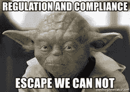

# 今天的政策，明天的技术:

> 原文：<https://medium.datadriveninvestor.com/todays-policy-tomorrow-s-technology-449228462833?source=collection_archive---------31----------------------->

**北美当前人工智能概述**

2018 年 11 月 15 日在[巴斯德研究所](https://www.pasteur.fr/fr)举行的[人类发展倡议日](https://healthcaredatainstitute.com/2018/10/31/hdi-day-2018-ia-sante-nouvelles-donnees-nouvelles-methodes-focus-sur-les-reseaux-sociaux-jeudi-15-novembre-2018/)主题演讲“人工智能&健康:新数据、新方法”

世界各国正在进行一场竞赛。一场超越人工智能的主导经济力量的竞赛。为什么？正如俄罗斯总统弗拉基米尔·普京的名言，“谁成为人工智能的领导者，谁就将成为世界的统治者。”

其他人也有这种想法。26 个国家和 6 个国际组织已经宣布了正式的人工智能战略，认可了概念原则，或者成立了人工智能政策调查机构。其中既有总体的国际概念，如七国集团的 Charlevoix 人工智能未来共同愿景，也有具体的民族主义，如中国的“新一代人工智能发展计划”。

现在，你可能会问，如果我在这里谈论北美的人工智能政策，我注意到这些国际发展了吗？

有几个原因:

***首先是*** ，理解是什么在国际上推动这些政策很重要。对经济实力的渴望？当然可以。但是，对决策者和消费者来说，更根本的是对未知的恐惧。这种恐惧很大程度上是由于缺乏对人工智能的理解。

这个房间里的任何人都不会对此感到惊讶。这不是一个简单的话题。但重要的是要了解普通大众对人工智能的理解有多基础。

如果你问普通人人工智能的例子，充其量，他们可能会回答苹果的 Siri 或亚马逊的 Alexa，或者在最坏的情况下，机器人或终结者。虽然一些政策制定者已经深入研究了人工智能的主题，但他们中的绝大多数人都拥有与普通人相同的知识水平。

事实是，人工智能仍处于非常早期的应用阶段。尽管人们在谈论完全自主的机器，但在不久的将来，人工智能的发展可能会更加平凡，尽管是必不可少的，比如执行后台任务。

不过，这还是未知数。人工智能能够做什么的 ***潜力，而不是它正在做什么，*** 这正在塑造国际人工智能政策，并将决定它将如何应用。

第二次 ，这是近代历史上第一次有组织的、国际性的努力来主动塑造一个单一的公共政策领域。或者至少是一个不涉及战争的复杂政策领域。

当我说人工智能政策时，我不是在谈论一个单一的概念。而是各种不同政策和概念的相互关系。这些问题包括知识产权、隐私、安全、研发、员工培训和移民等。因此，当检查一个国家或国际机构的人工智能战略包括或不包括/完成什么时，你还必须考虑他们在这些领域的现有系统；他们现有的政策如何已经促进了 AI 的发展或解决了 AI 提出的问题。

换句话说， ***AI 政策根植于过去和未来*** 。因此，回顾过去和期待理解任何给定提议的潜在影响一样重要。有效的政策需要了解现有政策是如何形成的以及为什么会形成；他们寻求解决什么问题；他们这样做的效果如何；如果这些担忧与今天在人工智能环境中表达的担忧相同。

***第三*** ，人工智能政策本来就具有国际性。人工智能策略不是在国家主义信仰的真空中创造出来的。它们相互反应，相互依存。由于缺乏更好的术语，我将称之为“侧眼效应”

人们只需看看经常被引用的欧盟关于隐私做法的一般数据保护条例(GDPR)或马克龙总统在本周巴黎和平论坛期间由五十(50)个国家同意的网络安全协议就可以证明这一点。这些举措已经并将影响隐私和网络安全法律的变化，这些法律会对人工智能公司可用的数据产生内在影响。

你为什么要关心这个上下文呢？

因为，正如美国风险投资家布拉德利·图斯克(Bradley Tusk)所言，他自称是“初创企业的修复者”，正如[对](https://www.axios.com/bradley-tusk-axios-pro-rata-podcase-ca1dceb2-5091-4264-af97-81e1469cdba4.html)所说，“你必须严肃对待政府和政治，因为它能成就或毁灭你的企业。”

我同意这种说法，并补充说，你必须了解国家人工智能政策正在演变。政策制定者越来越多地采取一种国际“赢家通吃”的心态，在技术方面寻求对贸易伙伴的影响力。

如此看来， ***资助创新研究还不够*** 。AI 研究和产品实现之间的时间和空间有太多的未知。缺乏对监管影响的早期关注和围绕人工智能的政策制定者教育不足是代价高昂的。太多时候，这些都是不必要的疏忽，增加了已经固有的未知。

**这让我想到了今天北美的人工智能政策**。

写这篇文章的时候，我一直在纠结如何展示“大洋彼岸”正在发生的事情。毕竟，这些国家的 GDP 可能比一些有自己人工智能项目的欧洲国家还要高。因此，我提前为我忽略了任何你可能认为重要的信息而道歉。我终究要为问答期留点东西。

在深入研究每个国家的具体细节之前，值得注意的是(相对)横跨整个大陆的*和他们的方法中的*区别。**

**对于共性，有两点。**

*****先有*** ，人才库广泛。这主要是因为一些人工智能领域的领军人物把北美称为他们的家。被公认为“人工智能之父”的美国人约翰·麦卡锡，临终前一直居住在加州的斯坦福。英国裔加拿大人、“深度学习教父”杰弗里·辛顿在加拿大多伦多大学投入了大量的时间和研究。两者都教授和培养了一代又一代的人工智能工程师和学者，他们正在创造明天的技术，为今天的辩论提供框架。**

*****第二个*** ，也许正是由于这个人才库，北美早早占据了 AI 政策思想领袖的位置。**

*   **在奥巴马总统的领导下，美国在 2016 年[发布了第一份官方报告。](https://obamawhitehouse.archives.gov/blog/2016/12/20/artificial-intelligence-automation-and-economy)**
*   **加拿大是第一个正式纪念他们战略的国家，将其列入 2017 年预算。**
*   **在 2018 年，墨西哥是第一个对人工智能采取几乎完全社会化方法的国家。**

**这两个国家之间的主要区别在于他们对政策采取的方法。在高层次上:**

*   **加拿大将人工智能视为研究和人才引进的问题。**
*   **美国对人工智能开发采取了几乎(我强调几乎)不干涉的态度。**
*   **墨西哥正在平衡人工智能的社会需求和成本。**

*****不管*** 的做法如何，不可否认的是，北美作为一个地区致力于保持在 AI 中的关键领导角色。记住这一点，让我们仔细看看每一个。作为发言人的特权，出于你们稍后可能会理解的原因，我将从该大陆的南部移到北部。**

**先说墨西哥。墨西哥在国际人工智能政策讨论中相对较新，在今年(2018 年)3 月发布了其战略。它作为南北美洲之间桥梁的历史角色使它对更大的“美洲”人工智能计划至关重要。对于拉丁美洲和南美洲来说，它是一个明显的数字领导者。特朗普政府发起的一项重要北美贸易协定的修订凸显了这一点。**

**其人工智能政策在很大程度上基于英国繁荣基金资助的白皮书——题为“[迈向墨西哥人工智能战略:驾驭人工智能革命](http://go.wizeline.com/rs/571-SRN-279/images/Towards-an-AI-strategy-in-Mexico.pdf)”该战略建立在过去十(10)年建立的强大的创业文化和更新的电信基础设施之上，专注于培养风险资本和创业思维。**

**有趣的是——特别是从医疗保健行业的角度来看——它采取了一种 ***“基于需求”的方法*** ，规划了识别该国培养人工智能的潜在社会需求的过程。这包括:**

*   **促进墨西哥在数字政策方面的国际领导地位，特别强调 OECD 和 Digital7**
*   **在政府间电子政务委员会内设立人工智能小组委员会，以促进多部门对话和方法；**
*   **通过人工智能小组委员会与专家和公民合作，以确保这些努力在未来政府中的连续性。**
*   **绘制行业的使用案例和需求，并确定政府内部的最佳做法；和**
*   **公开报告的建议以征询公众意见。**

**对于这个房间里那些着眼于墨西哥潜在增长的人，我会注意到为这个国家和你们的技术向人工智能小组委员会提供投入的机会的数量。**

**时间会证明这个策略是否成功。许多因素对国家有利。它知道自己不知道什么，并认识到需要系统地教育自己 ，计划的主要任务应该是什么。该战略并没有立法规定一个预先设想的答案。相反，它认识到它正从相对空白的石板开始，无论是在人工智能技术的概念可能性还是监管限制方面。它首先确定需求——对资金、创新、教育的需求——并确保这些问题将无缝整合到未来的答案中。如果这种方法成为发展中国家的国际模式，我不会感到惊讶。**

*****北移，*** 我们在美国发现一种可以理解的不同做法。**

**相对于世界范围而言，美国倾向于对技术采取宽松的监管方式。它更愿意让经济原则作为其增长的制衡。一些人认为，特朗普政府在人工智能方面相对缺乏方向是超越美国领导地位的机会。**

**在这一点上，我敦促说两句谨慎的话。**

*****先说*** ，美国没有发布官方 AI 战略不代表政府对该话题不感兴趣。相反，在一系列行业圆桌会议之后，特朗普总统在 5 月份发表了一份声明( [2018](https://www.whitehouse.gov/briefings-statements/artificial-intelligence-american-people/) )，承诺提供资金，并表明了允许 AI 自由发展的意图。这意味着，就目前而言， ***人工智能政策是在现有法律法规体系*** 的指导下进行的。**

**这就引出了我的 ***第二个告诫的词*** 。美国现有的法律体系促进了创新，但对于新兴技术来说，这些法律体系很复杂，有许多未定义的领域。它鼓励强劲的私人资本投资，同时在法院和执法机构提供消费者保障。**

**正如美联储州长莱尔·布雷纳德周二呼吁监管者监督银行业的人工智能时所说，“监管和监督需要经过深思熟虑的设计，以确保风险得到适当缓解，但不会阻碍负责任的创新。”**

**法律建议对国土安全部和国防部的谈判至关重要，目前他们正在研究人工智能的进攻性和防御性安全影响及应用。对这项技术的使命和方向的坚定理解对于教育美国联邦贸易委员会来说是必不可少的，该机构昨天刚刚举办了一场关于人工智能的竞争和消费者保护考虑的研讨会。全球视角是与美国国会合作导航潜在变化的关键，以及它们可能为现有法律范围设定的国际先例。**

**将联邦政府、各州和法院中所有潜在的监管和执法机构乘以 X，你就有了人工智能的前景。**

*****换句话说，美国是一个广阔的竞技场*** 。**

**如果美国及其政府是一个“大实验”，那么有人可能会说人工智能可能是这个实验的终极测试。**

**作为一家医疗保健公司，这对你意味着什么？谁将是你在美国利益的最终仲裁者？我希望我能给你一个简单的答案。不幸的是，近期不太可能出现这种情况。有很多地方可供争夺。**

**在最好的情况下，食品药品监督管理局将决定你进入市场。这里的好消息是调控途径已经在创建中。今年 4 月 7 日，FDA 首次批准一种用于糖尿病视网膜病变医疗诊断的人工智能设备上市。从那以后，它已经批准了许多不同的人工智能设备上市。用于这些批准的协议和基准可以为未来提供指导。**

**在最糟糕的情况下，你可能会在消费者数据泄露的情况下面临美国联邦贸易委员会，或者在数据泄露或人工智能失败导致人命损失的情况下面临美国法院。美国将如何回答人工智能责任的问题仍不得而知。但这些问题很可能会被医疗保健人工智能所关注和决定。**

**最值得注意的是，无论是在最好还是最坏的情况下，如果你现在不开始与政策制定者对话，前进的道路可能会在没有你的参与下制定。但是我一会儿会谈到这个问题。**

***最后，让我们把目光转向加拿大，加拿大在 6 月( [2018](https://www.newswire.ca/news-releases/prime-minister-announces-even-closer-collaboration-with-france-684845431.html) )承诺与法国合作开发伦理型人工智能。这就是为什么我想以这个国家作为结尾。毕竟，我要在法国做这个演讲。所以，你总是要把它带回家，不是吗？***

***加拿大的人工智能战略被视为第一个由国家政府正式通过成为法律的国际人工智能战略。这是因为加拿大的人工智能战略明显是研究和人才开发的战略之一。“泛加拿大人工智能战略”一经发布，不仅得到了概述，还被纳入了加拿大 2017 年联邦预算，在五年内拨款 1.25 亿加元。***

***在加拿大高级研究所( [CIFAR](https://www.cifar.ca/) )的领导下，该国制定了一项雄心勃勃的计划，通过一系列举措来促进充满活力和协作性的人工智能研究社区的发展，这些举措包括:***

*   ***三个新的研究所遍布全国，作为卓越中心——埃德蒙顿的阿尔伯塔机器智能研究所(AMII)、多伦多的 Vector 研究所和蒙特利尔的 MILA；***
*   ***CIFA 人工智能教席，一个在国际上招募和保留顶级学术研究人员和机器学习专家的计划；***
*   ***国家人工智能计划，以举办协作范围内的国家人工智能活动；和***
*   ***CIFAR 人工智能与社会项目研究人工智能的政策和伦理含义。***

***虽然总体战略没有提及数据管理、隐私和安全、劳动力发展或促进战略部门投资的相关政策，但这些都是需要考虑的因素。只是不在特定的人工智能策略的背景下。***

***不，加拿大人工智能战略的主要任务和重点是提升其作为人工智能思想领袖的国际形象。到目前为止，他们做得非常好，充分利用加拿大担任 G7 主席国的时机发布了他们的人工智能战略。***

***特鲁多总理和马克龙总统宣布，他们承诺在 7 国集团 6 月在魁北克省沙勒沃伊举行会议之前进行合作，有效地为那里的相关人工智能讨论奠定了基础。该协议将得到一组国际公认的专家的支持，这些专家致力于开发面向社会和经济利益的人工智能技术。你可以期待这一合作在 12 月 G7 人工智能多利益相关方会议上得到强调。***

***虽然有很多谈论，但在北美或世界各地，人工智能政策很少明确。管理投资和产品开发的法规正在制定中，并将在一段时间内保持不变。然而，监管将会存在，而且很可能会很多。再次引用风险投资家图斯克的话，“最终，政治会来找你。”***

***但是，这不是结束，这只是开始。***

***那么，你应该做什么？很多事情。不只是在北美，而是在巴黎，在布鲁塞尔，在全世界，如果可能的话。***

******首先是*** ，你现在应该在和决策者、监管者对话。在所有人工智能研究计划中，这些对话需要尽早和频繁地安排。你需要围绕你的技术做什么来教育他们；是什么推动了它的产生；以及你在解决什么问题。***

**必须再次指出的是，人们不仅对不同类型的人工智能缺乏了解，而且对它们如何利用数据也缺乏了解。这再加上科技行业历来厌恶在产品实际上可供消费者使用之前不与政策制定者对话，对未来来说并不是好兆头。你，我们所有人，现在就需要开始与政策制定者对话，即使是在实验阶段，不仅要教育他们技术，还要教育他们如何使用和保护数据。**

*****第二个*** ，你要解决和定义人的因素。人的因素需要在你的信息传递的所有层面都处于中心位置。为创新而创新不再是一种可接受的战略。**

*****第三个*** ，你的倡议需要透明，可以理解。你需要预见明天的问题和担忧，并准备好今天回答它们。或者，至少，准备好说你正在寻找答案。**

**这可能是你生意中最重要的部分。一个问题处理得好或不好，都可能决定整个技术的政策。不管你喜不喜欢，当前的格局正被看似不相关的行业(即社交媒体平台)所左右。随着人们所认为的“科技”和“医疗保健”行业之间的界限变得模糊，一个行业的不当行为(有意或无意)会影响到另一个行业。鉴于信息的敏感性以及医疗保健技术对消费者生活水平的直接影响，护理责任就更加重要了。你和你的行业将被严格审查。**

*****第四个*** ，与此相关的是，你需要解释你将如何围绕隐私、歧视和责任等问题将透明度融入数据集。让监管机构知道，你正在跟踪和审计你的信息质量，以限制潜在的偏见，错误或歧视性的结果。当出现问题时，确定谁应该负责。**

**对数据政策达成明确一致的需求至关重要。这是所有决策者首先会问的问题之一。如果你没有这些，那就期待标准为你而设。在合作关系和第三方协议中，您需要准备好解释:**

*   **信息从何而来；**
*   **它是如何被保护的；和**
*   **使用参数。**

*****要注意！*** 如果没有你的积极参与，解释你正在实施的流程，你实际上是在把这个领域让给别人。监管机构会试图为你设立一个。**

**AI 也会有失误。看似不相关的技术中的短期灾难正在塑造你创新的监管格局。会有漏洞。不幸的是，可能会有人死亡。这些都需要解释。需要采取一种求助手段。**

**这些失误不一定需要决定人工智能政策的方向。积极的心态让你更容易与政策制定者接触，并解释哪些保障措施是必要的(哪些是不必要的)。工业正开始这样做。**

**苹果首席执行官蒂姆·库克最近[指出](https://www.forbes.com/sites/samshead/2018/10/24/apple-ceo-tim-cook-issues-ai-warning-it-must-respect-human-values-including-privacy/#6bc70c16584d)人工智能“必须尊重人类价值，包括隐私。”**

**生物技术和制药行业已经在处理人工智能应用提出的问题，如疾病的早期检测、潜在的责任问题以及如何解决误诊问题。美国商会、互联网协会、商业软件联盟和信息技术产业委员会——它们都包括医疗保健和行业感兴趣的公司——都提出了考虑人工智能技术发展的隐私提案。**

**这些努力是不是太少太迟了？一些人，尤其是在欧洲，声称他们至少在隐私等特定领域是尊重的。然而，当我们着眼于更复杂的讨论，即所有这些如何融入更大的人工智能方法时，我认为不是。**

**最后，我将重新构思我开始这篇演讲时的陈述。**

**人工智能研究，特别是在医疗保健行业，不仅在争夺市场控制权，还在争夺如何监管和使用它。无论是在法国还是在北美，资助不包括早期关注监管和教育政策制定者问题的研究，将严重制约你在这场竞赛中胜出的能力。这是你的选择——我很抱歉地说，你需要很快做出选择——如何优先考虑资源以满足这些需求。**

*****昨天的罪恶会抑制明天的机会吗？如果你帮助政策制定者理解他们今天的决定的影响，就不会。*****