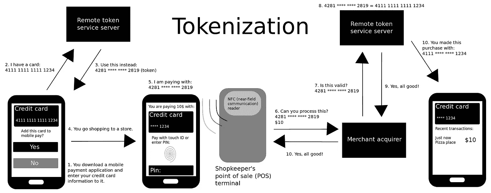
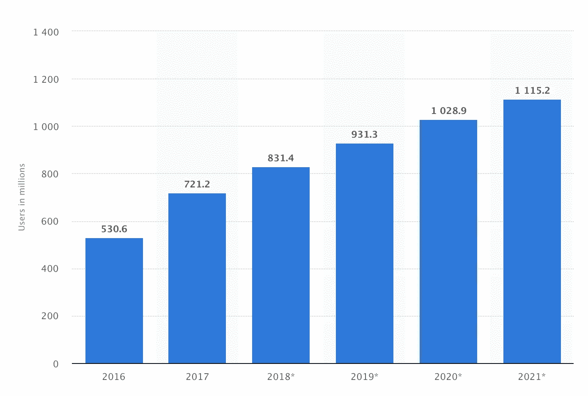

# 令牌化，安全移动支付背后的一项功能

> 原文：<https://medium.datadriveninvestor.com/tokenization-a-capability-behind-secured-mobile-payment-f4cd6319f1c?source=collection_archive---------5----------------------->

[https://en.wikipedia.org/wiki/Tokenization_(data_security)](https://en.wikipedia.org/wiki/Tokenization_(data_security))

在我的上一篇文章中，我谈到了去神秘化的和[在线电子商务支付的](https://medium.com/datadriveninvestor/online-e-commerce-payment-players-technologies-options-de5f59bd2a1c)[支付生态系统——玩家、支付聚合者、选项](https://medium.com/datadriveninvestor/payment-ecosystem-demystified-beaa08d85959)。作为上一篇文章的后续，我想通过这篇文章进一步探索安全移动支付背后的**令牌化** **能力。**

# 为什么要令牌化！

我们在店内支付的方式在全球范围内发生了前所未有的变化。由于新兴的移动支付技术，消费者和商家有了更多的选择来进行简单、方便和非常安全的数字支付！

[统计数据](https://www.statista.com/statistics/557959/global-mobile-proximity-payment-users/)显示了 2016-2021 年全球移动近距离支付用户数量。2017 年，全球移动近距离支付用户数量为 7.212 亿，预计 2020 年将超过 10 亿。

© Statista 2018

**随着无卡交易(如 Apple Pay、Samsung pay、Android pay、发卡行钱包、存档卡(在电子商务中))的日益流行，有必要最大限度地降低未经授权使用主账号(PAN)的风险，并减少欺诈。支付令牌化系统有望满足这一需求。**

# 什么是标记化

就像在卡存在交易中一样，信用卡受芯片保护以防潜在的欺诈，在卡不存在交易的情况下，主要账号(PAN)[ *支付卡通常有 16 位数字压印在卡的正面，称为 PAN* ，被一系列随机生成的数字所取代，这被称为“令牌”

> [PCI 委员会](https://en.wikipedia.org/wiki/Payment_Card_Industry_Data_Security_Standard)将令牌化定义为“用称为令牌的替代值替换主帐号(PAN)的过程。取消令牌化是将令牌兑换为其关联 PAN 值的反向过程。

根据 [wikipedia](https://en.wikipedia.org/wiki/Tokenization_(data_security)) 的说法，选择令牌化作为加密等其他技术的替代方案将取决于不同的监管要求、解释以及相应审计或评估实体的接受程度。这是对标记化在实际使用中施加的任何技术、架构或操作限制的补充。

# 令牌化生态系统中的新玩家

## 令牌请求者

令牌请求者可以请求自己使用的支付令牌，或者代表令牌用户请求共享的支付令牌。

令牌请求者的一些示例包括数字钱包提供商、支付服务商、商家和物联网制造商。

## 令牌服务提供商

根据 [EMV 规范](https://www.emvco.com/emv-technologies/payment-tokenisation/) —令牌服务提供商负责许多独立的功能，包括但不限于:

*   令牌库的维护和操作
*   令牌生成
*   安全和相关控制的应用
*   令牌发放和令牌供应
*   去标记化和标记化

代币服务提供商的一些例子包括 Visa 代币服务、Master Card 代币服务

> 令牌库提供了将支付令牌/令牌到期日映射到基础 PAN / PAN 到期日的机制。

[https://www.emvco.com/emv-technologies/payment-tokenisation/](https://www.emvco.com/emv-technologies/payment-tokenisation/)

# 支付令牌用例

可以应用令牌化规范的一些常见用例有:

## 基于设备的钱包/可穿戴设备(安全元件)

[安全元件](https://www.justaskgemalto.com/en/what-is-a-secure-element/)安全存储卡/持卡人数据，并管理加密数据的读取。在支付交易过程中，它就像一张非接触式支付卡，使用行业标准技术来帮助授权交易。安全元件可以嵌入在手机或 SIM 卡中。

例如——Apple Pay

## 基于设备的钱包(HCE)

Android 4.4 引入了一种不涉及安全元素的[附加卡仿真方法](https://developer.android.com/guide/topics/connectivity/nfc/hce)，称为*基于主机的卡仿真*。这使得任何 Android 应用程序都可以模拟一张卡，并直接与 NFC 读卡器对话。

例如，Android pay、Samsung pay

> 三星设备支持 HCE 技术，并拥有促进磁安全传输(MST)的附加技术。

## 档案卡(商户专用)

文件上的卡令牌旨在用于特定的商户或支付处理器，作为支付卡细节的替代。通过存储代币而不是卡的详细信息，商家和加工商可以在发生数据泄露时限制其客户遭受欺诈的风险。

示例—电子商务商家交易

> NFC 中使用的技术基于较早的 RFID(射频识别)理念，即使用电磁感应来传输信息。

## 结论

本文试图介绍标记化的基础知识。通过令牌化，客户将能够进行支付交易，而不必担心欺诈和盗窃。令牌化比传统加密更灵活，处理时需要的计算资源也少得多，这使得令牌化更受欢迎。