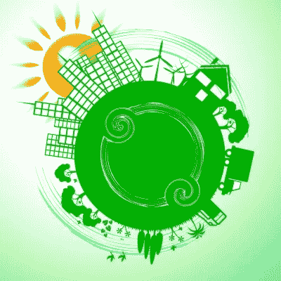

# 令牌化经济:如何构建可持续的生态系统？

> 原文：<https://medium.datadriveninvestor.com/tokenized-economy-how-to-build-a-sustainable-ecosystem-4a18c25a07be?source=collection_archive---------17----------------------->

*Image courtesy of Stuart Miles at FreeDigitalPhotos.net*

大多数代币未能兑现的地方不是价格上涨或股东价值增加。

> 大多数代币未能提供可持续的生态系统。

# 这是你需要遵循的两个列表

**陡峭数字 1:经济的封闭循环**

*   用户必须能够购买令牌化经济中所需的生产资产
*   用户必须能够做某事/赚取令牌
*   用户必须能够用代币购买产品、资产或他们生活中需要的其他东西

**陡峭数字 2:与其他生态系统的相互作用**

*   用户必须能够支付硬币/令牌菲亚特
*   用户必须能够将硬币/代币兑换成其他硬币/代币
*   用户必须能够为菲亚特改变硬币/令牌

# 这是一个过程

生态系统的建立是一个过程，而不是一个时间点。即使大多数 ICO 承诺过多，交付不足，如果团队仍在努力，也要给他们一个机会。

*符号化经济在书籍或互联网上描述或讨论不多*——所以我们被迫从观察“经典”经济生态系统开始，并试图在符号化经济中模仿它们。

> 我明白，在即时满足的时代，耐心是一种稀缺商品——但如果我们想让新的生态系统可持续发展，耐心是绝对必要的。