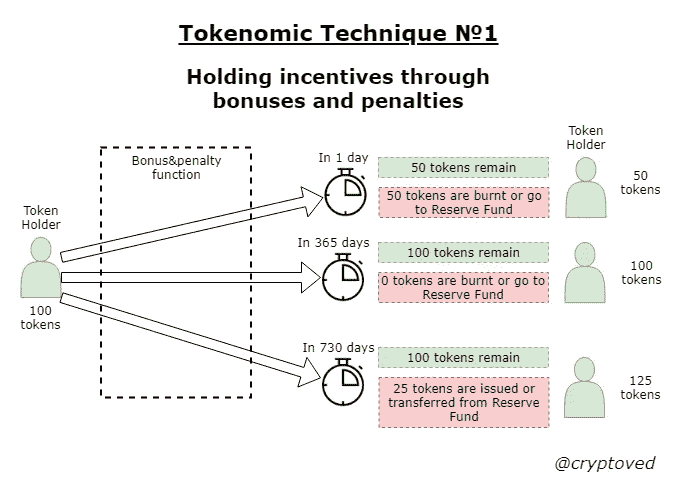
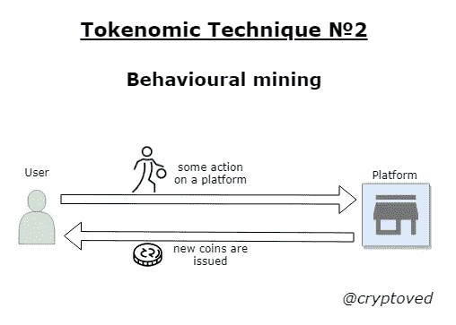
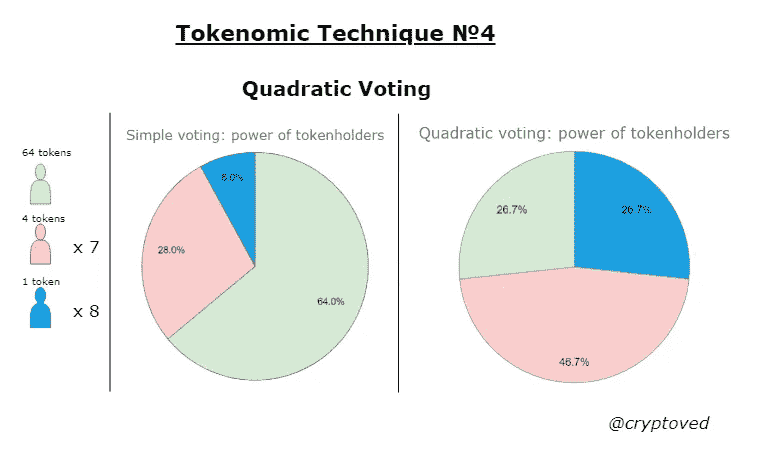
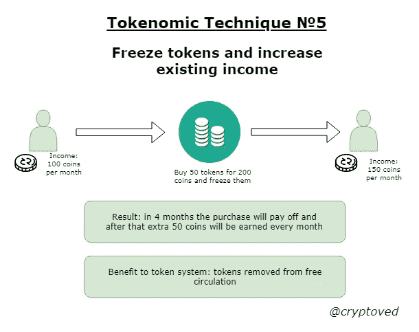
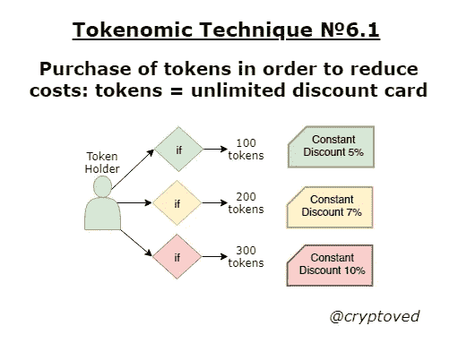
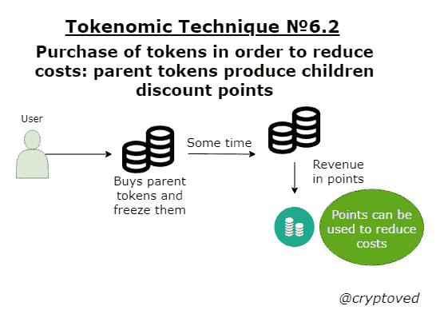
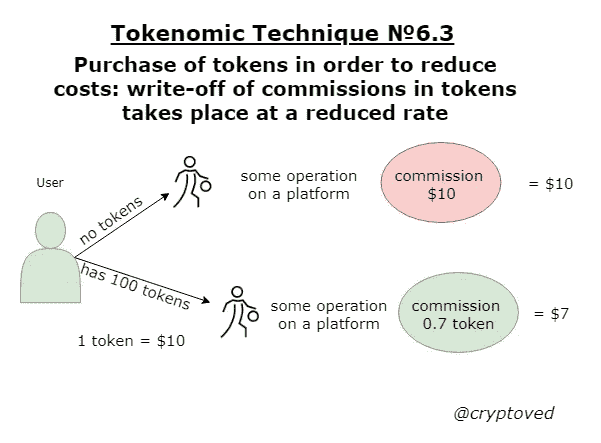
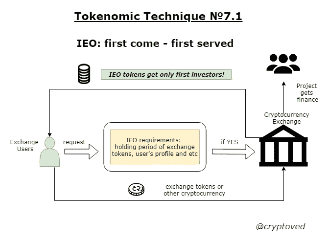
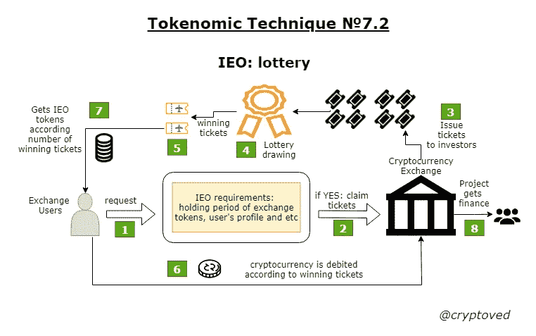
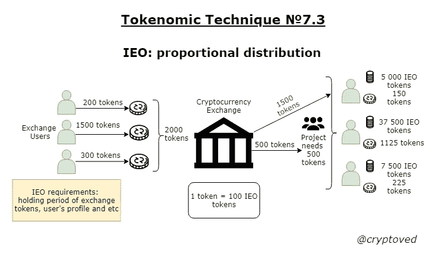

# 令牌原子武器库:简介和技术 1–7

> 原文：<https://medium.datadriveninvestor.com/tokenomic-arsenal-introduction-and-techniques-1-7-510688d623a2?source=collection_archive---------1----------------------->

令牌是在特定生态系统中创建的数字单元。代币应该鼓励参与者使用该系统，这最终影响代币价值的增加、其周转率以及生态系统参与者数量的增加。

令牌组学——实现生态系统既定目标的令牌设计过程。令牌设计流程包括:

 [## ieo 在币安 Launchpad |数据驱动型投资者网站上获得 3 次代币销售，势头强劲

### 在无情的熊市之前，ICOs 在 2017-18 年期间为加密/区块链项目创造了第一次融资热潮…

www.datadriveninvestor.com](https://www.datadriveninvestor.com/2019/03/26/ieos-gather-momentum-with-3-token-sell-outs-on-binance-launchpad/) 

*   生态系统中代币流和游戏规则的逻辑阐述；
*   令牌的动机阐述(为什么参与者应该使用它？);
*   初级令牌出现的机制(成因)和未来新令牌出现的机制(排放政策)；
*   令牌利用机制(如有必要)；
*   价格政策(系统中有多少实体)。

在开发表征组学模型时，有必要考虑机制的设计。它允许您设置主要参与者的“正确和期望的”行为。

机构设计最简单的例子:一个老奶奶给两个孙子烤了一个蛋糕。有必要切掉它，这样就不会得罪任何一个孙辈了。最有可能的是，一个没有特殊工具的祖母仍然会给他切不完美的 50%到 50%。“快”的孙子会选大一点的，二孙子会得罪一点。奶奶会不高兴的。他们应该怎么做？

我们使用机制的设计:祖母说把蛋糕切给第一个孙子，第二个孙子将选择两块中的任何一块。这样一来，第一个孙子会尽量把馅饼切得均匀，第二个孙子只能选择更好的一块。如果第一个孙子不平等地切馅饼，他自己将对这一误解负责。有了这些游戏规则，没有人会被老奶奶冒犯，会尽量表现得理性和正确。

令牌系统的主要优势是机制的设计可以在加密货币协议、智能合同和加密货币资产的激励功能中编程。

因此，设计良好的令牌具有以下属性:

*   在生态系统中有用，没有它，生态系统的功能效率会降低，或者原则上不起作用；
*   它具有抗通胀性，所以代币的发行是在系统中想出来的；
*   可扩展，令牌可以在人与人之间快速大批量发送；
*   可替换，除非它是唯一的令牌(不可替换的令牌)；
*   被许多人、服务、人工系统所接受；
*   它具有流动性，代币在交易所和 p2p 网站上交易；
*   它具有激励使用的功能，分为经济激励(代币持有者赚得更多或用它储蓄)或管理激励(代币持有者有投票权并能够影响生态系统)。
*   代币有“游戏规则”，用户明白这个代币能做什么，不能做什么。

令牌组学可以称为数学、统计学、经济学(尤其是宏观经济学和博弈论)、密码学、IT、游戏设计等相关学科交叉的一个实验性的新领域。

来自世界各地的许多团队都在努力设计令牌系统。在“Tokenomic Arsenal”系列作品中，我想考虑现有项目中的 tokens 的设计采用了哪些原则，以及给出抽象的例子。通过表征技术，我将意味着表征它的表征的任何特征。每种技术通常会被单独分开。如果无法将技术分开，则将它们放在一起考虑。每种表征技术将具有表征方案，并且以极其容易理解的方式进行描述，从而有可能直观地看到和解析表征的这一特定特征。我会将这些技术与单个乐高零件进行比较。每个单独的是一个非常简单的单位，但在建设过程中，可以获得一个相当复杂的数字。

在目前的发展阶段，理解我们在此期间积累的标记组学技术的本质是很重要的。是的，当分开考虑时，它们非常简单。但是首先，我们理解并描述每个元素，然后我们构建更复杂的东西。

结果，我们将有一个记号组学技术的武器库，从中我们已经可以形成记号组学系统的设计。在某些情况下，为了简化对机制的理解，对标记组学技术的描述可能是不准确的。

将来，我计划结合记号组学来描述整个系统。

**令牌操作:**

**令牌发射(coinbase):** 一个新的令牌不知从哪里冒出来，令牌在系统中诞生。

**代币转移:**代币从一个钱包转移到另一个钱包。

**令牌烧录:**令牌从系统中永久移除。

**代币冻结:**代币在特定时间内失去流动性。冻结可以是强制的，在这种情况下，它通常被称为锁定(发生在私人投资者身上)。此外，冻结在本质上可以是自愿的，并追求某些经济和管理目标。冻结是通过智能合约或系统中的集中参与者进行的。

**解冻代币:**代币脱离解冻，可以在系统中自由移动。令牌冻结可以在用户调用时发生，也可以在一段时间后发生。也可以有触发除霜。在这种情况下，某个事件在解冻之前发生。

**令牌委托:**临时令牌转移到系统中的验证器。同时，验证器不拥有令牌的所有权，但拥有预先注册的权利。

**令牌召回(unbond):** 返回之前委托的令牌的过程。最常见的是，这个过程伴随着暂时的或其他条件。

**Staking:** 这个概念可以理解为冻结令牌和委托令牌。在这种情况下，重点在于令牌被给予第三方实体(验证器、智能契约)的使用，以便增加它们。

**Tokenomic 技巧№1:通过奖金和惩罚来持有激励。**

例如，我们希望确保早期投资者不向市场出售代币。你可以想出一个机制，在一定时间内，代币将被解锁，损失随着时间的推移而减少，然后通常会变成奖金。第一天释放代币——你损失 50%，而损失的代币可以被烧掉或者送到项目的备用金。一年内释放代币—损失 0%。2 年后释放代币—您将获得 25%的奖金，奖金可以通过发行机制获得(创建新代币)，也可以从储备基金中转移(即在这种情况下不会创建新代币)。这种内置机制刺激令牌持有者的预期行为，并允许整个系统以相当可预测的方式运行。在这种情况下，可以通过某个函数设置从负 50%到 25%的路径，即在任何时候解锁令牌，都会有惩罚或奖励。

**主要目标:**让投资者关注项目的长期目标，而不是眼前的利润。这一机制切断了投机者的渠道，并鼓励投资者关注基本的项目目标。

技术方案:

**Tokenomic technique №1: holding incentives through bonuses and penalties.**

在 LTO 网络项目中使用了一种类似的技术(但只有惩罚措施)，并命名为“巨魔桥”:[https://medium . com/@ Price _ Steven/a-novel-approach-to-combat-ico-speculation-a 2309009 ee94](https://medium.com/@Price_Steven/a-novel-approach-to-combat-ico-speculation-a2309009ee94)

**记号组学技术№2:行为挖掘。**

发布新令牌的机制可能具有不同的性质。总的来说，它回答了这个问题——在什么条件下，根据什么规则出现新令牌。一种类型的排放机制是用户或行为挖掘。用户在平台上执行了一些操作，并收到了相应的令牌。让我们看几个例子:

*   娱乐场用户在娱乐场中进行游戏，并且对于一定的营业额，接收该娱乐场的代币。例如，您需要进行 10 ETH 的营业额，然后用户将获得一个新的赌场令牌；
*   买方在在线商店中进行购买，并且基于该数量，接收在线商店的代币。这与忠诚度系统非常相似，当在网上商店购买时会产生积分，用户可以在随后的购买中花费这些积分。唯一的区别是，现在这个令牌可以有其他属性。也许他被赋予了分红功能，在这种情况下，网店的买家在某种程度上成为了网店的共有人，将获得未来所有利润的一小部分；
*   在一个分散的出租车应用程序中，司机和乘客都可以从每次旅行中收到系统令牌，这些令牌可以有自己的用途。

**主要目标:**平台对使用平台服务的人进行奖励。在我看来，这是一个相当公平的机制，奖励忠诚的用户，以使他们长期留在平台上。

技术方案:

**Tokenomic technique №2: behavioural mining.**

赌博项目中也经常使用类似的技术:骰子、耙子、Live——Wink 生态系统中的 Dapps。此外，Gojoy 也使用了类似的机制，这是一种联合和批发购买的服务。

**Tokenomic 技术№3:以投票换取收入。**

通常，DAO 系统引入了对令牌持有者的投票。“投票率”在这里非常痛苦，就像在生活中一样。主动多数票，在某些情况下约为 2-5%。如果我们想提高“投票率”，那么投票应该在要求(请求)系统收入(如果有的话)的过程之前建立。此外，这种机制应该投资于方便的用户界面，而不是与智能合约的手动交互。

同时，收入可以具有不同的性质:股份溢价(代币是从零开始创建的)、再分配收入(代币是从平台利润中支付的)、基于某项工作的收入和其他类型。

**主要目标:**通过引入投票的经济激励来增加系统中投票者的百分比。在某种程度上，这种机制也可以用于股息系统的法律外壳，它变得不纯粹是股息，因为在获得收入之前，令牌持有者需要做一些更多的管理工作。

技术方案:

**Tokenomic Technique №3: revenue claiming in exchange for voting.**

类似的技术也用在了 Dlive 流媒体平台上:[https://help.dlive.tv/en-us/article/locked-points-mhl19t/](https://help.dlive.tv/en-us/article/locked-points-mhl19t/)

**表征技术№4:二次投票。**

二次投票是一种投票类型，其中参与者的票数等于他支付的金额或一个参与者手中可用代币的平方根(根据公式“对于 X 货币单位/代币，你得到 X 票的平方根”)。这种类型的投票允许降低系统中富裕参与者的优越感，并获得更均匀的投票结果。

例如，系统有一个有 64 个代币的多数代币持有者，有 7 个人，每个人有 4 个代币，还有 8 个人，每个人有一个代币。系统中有 100 个代币。如果我们进行定期投票，那么多数票持有者将永远获胜(他拥有 64%的选票)，其余的人甚至没有投票的意义。

有了二次投票，一切都变得更有趣了。我们的富有代币持有者得到 8 票，7 个普通持有者各有 2 票(总共 14 票)，最小代币持有者还有 8 票。有钱球员的管理实力被抹平，现在他只有总票数的 26.67%(8/30)。较小的代币持有者有投票的动机。系统变得越来越平衡，现在每一票都很重要。同时，富有的代币持有者可以在不同的附属账户之间重新分配代币，从而在系统中获得更多的投票。在这种情况下，很有可能需要一个识别用户的程序，或者在某个日期之前创建的“钱包”有投票权。当然，在每种情况下，有必要仔细考虑保护机制，防止富裕代币持有者的不公平游戏。

**主要目标:**二次投票消除统治精英的霸权，更平均地重新分配管理职能。这样的体系不允许滑向独裁主义和主要代币持有者的全部权力。

技术方案:

**Tokenomic Technique №4: Quadratic Voting.**

二次投票的概念受到激进市场的追随者和以太坊生态系统中 DAO 的开发者的欢迎。

**代币术№5:冻结代币，增加现有收入。**

一个人在某个系统里已经有收入了。如果他购买和冻结某些代币，他可以增加它。重要的是不要混淆这种技术与股息:直到购买和冻结代币，一个人没有收到股息。在我们的例子中，一个人在没有代币的情况下已经有了收入，但他可以通过购买代币来增加收入。

让我们考虑假设的和真实的例子:

*   币安交易所支付你引荐的 20%。如果帐户中有 500 个 BNB 代币，这个百分比可以立即翻倍。因此，扣留代币增加了现有收入(在未来)。
*   假设我们为某个加密货币结构工作，每月获得 10 ETH。我们可以开始为同样的工作接收 15 个 ETH，但前提是我们购买 1000 个 ABC 令牌，并在智能合同中冻结它们。

**主要目标:**这项技术一方面可以让你减少自由流通的代币数量，同时增加当前受益者的忠诚度。

技术方案:

**Tokenomic Technique №5: freeze tokens and increase existing income.**

标记组学技术被用于币安交易所的推荐项目。它在这次交流的成功中发挥了重要作用。

**代币技术№6:购买代币以降低成本。**

用户在系统中招致一定的成本，但是他可以通过购买代币来减少这些成本。这似乎是一个相当简单的机制，从公众的角度来看，它可以与折扣卡相提并论。记号功能的自由允许我们以更多样的形式使用这种技术。

考虑降低成本的例子。在这种技术中，对于每一种情况，我们也将制定我们自己的方案来更清楚地区分不同的变化。

**主要目标:**为代币购买创造经济激励，以降低系统中的用户成本。该机制允许您从循环中删除令牌或启动令牌的活动循环。

**6.1。代币=无限折扣卡。只要我们保留一定数量的代币，我们的折扣就有效。与此同时，当一个数量的代币赋予你 5%的折扣和另外 7%的折扣时，可以创建一个区间折扣系统。接收允许在很长一段时间内取消代币的自由流通。这个案例被许多类型的真实业务所使用。**

**Tokens = unlimited discount card.**

**6.2。父代币产生子代币折扣。**这是一个更复杂的情况，这里我们有两种类型的令牌。父代币可以购买和冻结，它们将定期触发折扣代币的发行。例如，我们冻结了 100 个父令牌。在月末，我们增加了盈利能力，但这是在单独的代币中发生的，这些代币已经可以用于减少购买金额。在系统中，我们将这种代币称为点数。点数汇率可以与系统中的稳定硬币或其他计算货币相关联。在 Tron 的生态系统中可以观察到类似的情况，当长期持有一定数量的 TRX 时，由于积累的能量，交易是免费的。

**6.2\. Parent tokens produce children discount tokens.**

6.3。代币佣金的注销率降低。这里，最简单的例子是币安交易所用 BNB 代币的佣金机制。例如，你交易了 10 个比特币，0.01 BTC 的佣金将从你的账户中扣除，之后你将剩下 9.99 BTC。但是如果佣金用 BNB 代币注销，你可以减少 30%的佣金。在这种情况下，系统将自动按当前汇率向 BNB 转账 0.01 BTC，将收到的金额乘以 0.7，并从您处提取这笔 BNB。在这种情况下，10 个 BTC 将仍然是 10 个 BTC。这种机制允许创造代币的经济需求(用户将购买代币以节省佣金)并启动活跃的代币流通。

**6.3\. Write-off of commissions in tokens takes place at a reduced rate.**

**代币术№7:持有代币才能参加 IEO** 。

2019 年成名的模特。用户持有交换令牌一段时间，然后可以参与新项目的众筹投资。

交易所通常要求持有交易所代币一段时间，直到 IEO(在某些情况下，没有这种义务)，然后接受对交易所代币本身的投资，有时接受对另一种加密货币的投资。接受另一种加密货币是有益的，因为将来它不会影响交换令牌本身的价格。一定时间后，该项目将开始出售 IEO 期间收集的加密货币。如果这些是交换代币，这将对价格造成压力。在我看来，最妥协和均衡的方案是要求持有兑换令牌(我们将兑换令牌从自由流通中移除)，并接受更受欢迎的货币形式的 IEO 资金(结果，这不会对未来的汇率造成负面压力)。这种模型在长时间内更稳定，当用户和项目在短时间内有高需求时，不会产生严重的抽取和转储模式，反之亦然，提供交换令牌。

**主要目标:**在交易所上市新项目，与独立的 ico 相比，这些项目通常质量更高。通过这种模式，项目的评分由交易所自己进行，最终降低了低质量和欺诈性产品、系统和平台的水平。该项目本身受到了交易所用户和整个加密货币社区的关注。这一计划的投资者投资于更可靠的项目，在某些情况下，他们在相当短的时间内成倍增长。反过来，交易所鼓励代币持有者持有代币，从而减少自由流通代币的流通。

**7.1。投资者根据“先到先得”的原则在 IEO 投资。**

根据这一计划，投资者根据紧迫性投资一个新项目。谁先投资谁就能得到代币。有时候这样的 ieo 几秒钟就关闭了，供不应求好几倍。

**7.1\. Investors invest in IEO according to the principle: first come — first served.**

这个方案被用于币安的第一批 IEOs，Bittrex，Huobi 和其他加密货币交易所。

7.2。投资者投资基于彩票的独立企业。

FCFS 计划有其缺点:有许多不满意的投资者没有设法参与 IEO。还有，人们开始滥用机器人成为第一。因此，根据 FCFS 计划，普通投资者几乎没有机会参与 IEO。彩票模式被取代，每个投资者都有同样的机会参与 IEO。根据持有代币的数量，在一定时期内发行彩票。令牌的数量可以是该时段的平均值，也可以是整个时段的最小值。彩票中奖者被收取一定数量的交换代币，作为回报，他们收到该项目的 IEO 代币。

**7.2\. Investors invest in lottery-based IEOs.**

**7.3。IEO 代币的比例分配。**

彩票方案也有其缺点:不是每个人都幸运，尤其是如果投资者没有多少彩票的话。一些交易所已经开始应用比例令牌分配模型，通常也称为融合模型。通过这种方案，可以宣布筹集资金的数额，投资者进行投标，甚至实际上将资金转移到 IEO。如果所需资金的数额是 X 个常规单位，而投资者送的是 5X 常规单位，那么每个投资者将只投入计划资本的 20%。有了这样的模型，重要的是预测投资人对项目的需求，并考虑到只有一部分资本会进入你。此外，在这个模型中可能有各种变化:例如，那些在其他人之前提交申请的人可能有一个提高系数。或者该方案可以具有例如 10 倍常规单位的上限。此外，不同的系数可能取决于交换令牌的保持期。基本思想始终保持不变:投资者仅获得部分资本的项目代币，这取决于其他投资者的需求。

**7.3\. Proportional distribution of IEO tokens.**

在某些情况下，交易所可能会合并 IEO 方案。比如第一阶段，安排 FCFS 模型，第二阶段，进行令牌的比例分配。在这种情况下，每个阶段可能有不同的条件(直到象征性价格)。在 Okex、Huobi 交易所观察到了各种方案的组合。

这是标记组学的第一部分，其中仅考虑了 7 种标记组学技术。在未来，我计划继续一系列的笔记，并制定出其他技术和系统。

反馈: [@onlypreico_bot](https://t.me/onlypreico_bot) 电报中

电报频道:[https://t.me/cryptovedinvest](https://t.me/cryptovedinvest)

我将很高兴收到有趣的标记技术的描述。如果文本中有不准确的地方或者你有意见，也欢迎你。

你正在开发一个加密货币项目吗？我会考虑加入这个团队的可能性，从开发记号组学和商业模型(方案、表格、描述部分)的角度来考虑。

你可以支持我的工作:

BTC:3 qg1 n1 mfcbewghqcukyr 289 dvomjpnkjek

LTC:mstocnuxwhg 8 xs 87 fjzvfvaabzn 9 cmrrqn

ETH:0x 8484 e 207 e 84783 f 65d 584254 a 44 c8 d 3814437 d5a

谢谢！