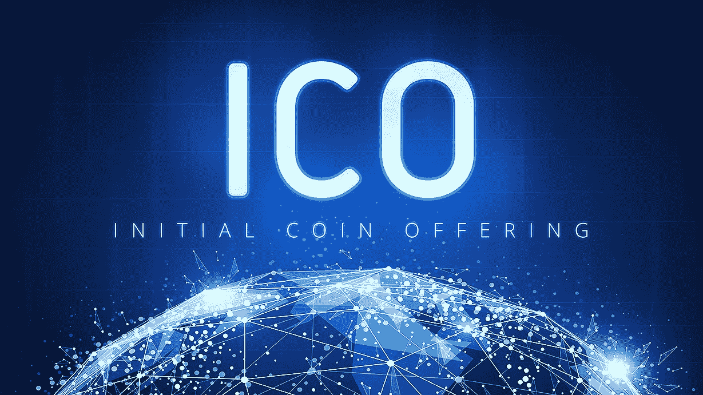

# 令牌组学&策略令牌结构的重要性

> 原文：<https://medium.datadriveninvestor.com/tokenomics-1c79f2b796e4?source=collection_archive---------0----------------------->

**代币**:私人发行/公司发行的货币。特定加密货币生态系统(项目、其中创建的社区以及其中所有参与者(包括代币、用户、团队成员等)的动态交互)中的价值单位。

区块链项目吸引投资者和用户的主要方式之一是通过 ICO——首次发行硬币(众筹或 TGE——代币发行活动)。令牌的结构如何将对项目产生直接的影响。网络的价值随着采用它的用户数量的增加而大幅增加，因此出现了令牌的*令牌组学*，如何和为什么；生态系统的一套规则，包括在哪里/如何使用它，对项目的成功非常重要。

***代币经济学*** 是代币架构的设计，将说服投资者和/或用户采用它，并帮助围绕货币建立的生态系统成长。代币是生态系统中使用的“燃料”或货币，用于交换商品、服务(公用事业代币)或拥有股权或债务(安全代币)。

*令牌组学*可以进一步分解为“微令牌组学”(处理单个分类账系统)和“宏令牌组学”(处理 DLT 网络的整个生态系统(分布式分类账技术)[【1】](#_ftn1)，包括其与第三方(如交易所、监管机构、合作伙伴等)的互动。

如果你想为 ICO/Crowdsale 创造一个代币，你需要知道如何激励人们购买、持有、使用和交易它。

**设计**

功能、令牌分发、令牌治理和价值应该在设计良好的令牌中清楚地呈现。令牌设计或结构需要清晰。

令牌执行什么操作或实用程序？

是否可扩展？

它是否已经或需要大规模采用(规模经济)？

它有市场吗？

可以在交易所交易吗？

将创建多少令牌？

代币将如何分配？

令牌将如何管理？

# 可用性

令牌的可用性——如何使用和为什么使用——需要明确定义。代币可以是多用途的工具，可以以各种方式使用，例如:授予治理权，在买方和卖方之间创建交易经济(价值交换)，进行支付或用于利润/利益共享的目的。在任何经济生态系统中，令牌的可用性都必须清晰明了，并得到很好的解释。

# 效用或安全性

令牌结构的设计和属性不仅对投资者和用户，而且对政府监管者都非常重要。

如果代币被归类为证券，则必须对其进行监管。许多 ICO 试图在公用事业令牌的保护下规避监管，并获得更大的销售池，但是这样做，特别是如果他们向美国公民销售，会使项目和项目团队成员面临巨大的法律风险。

SEC 主席 Jay Clayton [表示](https://www.sec.gov/news/public-statement/statement-clayton-2017-12-11)，根据美国法律，以他人的创业或管理努力为基础展示和营销潜在利润的代币和产品包含证券的特征。

## 安全令牌

如果代币从外部可交易资产中获得价值，它就是证券代币。安全令牌已经发展到在区块链技术的基础上支持传统的首次公开募股(IPO)。购买证券代币的主要原因是为了在某个时候赚取利润，无论是以利润、收入份额还是价格升值的形式。安全代币受到严格监管，只能出售给合格的投资者。

[*美国证券交易委员会网站*](https://www.sec.gov/fast-answers/answers-accredhtm.html) *包含合格投资者的完整定义:

过去 2 年年收入超过 20 万美元(个人)或 30 万美元(与配偶)的个人，今年预期也是如此
净资产超过 100 万美元的个人，不包括主要住所(除非所欠抵押贷款超过住所价值)
资产超过 500 万美元的机构，如*

## 实用令牌

实用程序令牌也称为应用程序令牌或用户令牌。这些代币由公司发行，以资助将使用公用代币的生态系统或项目的发展。购买者基本上是在购买一项服务或产品的未来用途。公用事业代币不是作为投资而设计的。

# 双令牌产品

安全代币可以代表投资者提供某种程度的安全，但也存在一些问题。令牌出售后，必须继续遵守安全令牌。这包括 12 个月的持有或锁定期，在此期间代币不能出售，当代币可以出售时，只能出售给其他合格的投资者。如果项目需要在生态系统中和/或市场上的令牌出售给最终用户，这种被占用的资本可能会使项目脱轨。

初创公司正在考虑推出“双重令牌产品”。在这种类型的发行中，证券令牌出售给合格的投资者，而第二令牌是出售给用户/顾客的公用令牌。

**利率** —代币和股权的真实协议

利率结构允许公司发行两种代币，一种作为符合证券法的股本，另一种作为奖金提供给投资者。[【2】](#_ftn2)

第二个令牌是用于在生态系统中执行特定服务的令牌。

**日期** —代币和股权债务协议

这种结构提供了一种可转换票据(债券)或直接债务代币，公用事业代币作为额外津贴。[【3】](#_ftn3)

[**事实**](https://www.coindesk.com/basics-facts-new-model-compliant-icos/)**—**[【4】](#_ftnref2)
事实模型同时使用安全令牌和实用令牌。第一个是通过 ICO 或众筹向合格投资者提供的安全令牌，符合 SEC 的要求。第二部分是代币，是在 ICO 之后以财产红利的形式分配给投资者的。发行的第二个令牌的号码与购买的第一个令牌的号码完全匹配，因此不被视为证券。

**治理**

如何建立规则？创始人会制定规则还是会有董事会？贡献者有投票权吗？贡献者有机会选举董事会吗？

有什么样的结构和流程来监督公司的发展方向，以确保它保持在正确的轨道上？

在分散的社区中，良好的治理对于行业的长期成功至关重要。为了行业的发展，为了继续吸引投资者投资区块链的初创企业，我们需要尽我们所能，对投资我们的人负责。

**令牌分配**

谁得到什么？

有多少代币公开出售？团队成员将获得多少比例的代币？这个数字公平吗？是不是很大比例是私下卖给投资者的？这会影响最终运行生态系统的用户可用的令牌数量吗？

许多 ICO 显示团队成员获得了一大笔初始资金。这种方法的一个问题是团队成员没有动力进一步开发项目，因为他们已经收到了大量的薪水。

一个好的项目会将其令牌分发与路线图联系起来，并使用托管来保护投资者的资金。如果没有达到一个里程碑，资金可以释放回投资者。

**令牌分发**

代币一旦发行，升值的潜力有多大？

**供求**

**供给**定义为市场能够提供的产品或服务的总量；**需求**是指购买者想要的商品数量。就 ICO 而言，是否有代币上限或限量供应？或者有没有以固定价格提供的无限量代币(比如一次性使用的票或用于服务或玩游戏)？

> **无限数量的代币——固定**
> 
> **设置令牌数量—易失性**

如果代币被利用(在生态系统中使用)很重要，并且大量投资者持有(持有)代币，那么生态系统不会增长，从而导致价格波动。

这一切意味着什么？

对于即将到来的 ICO，你的令牌结构的好坏将决定它在 ICO 期间和之后的成功程度。从投资者的角度来看，它显示了项目的潜力，最终你需要让投资者和/或用户相信你的令牌设计，从而相信你的项目。

奥黛丽·奈斯比特

[螺旋营销&公关](http://www.spinspirational.com)

[奥黛丽·奈斯比特在 Linkedin 上](https://www.linkedin.com/in/audrey-nesbitt-0388a52a/)

[@ audreynesbit 11 在推特上](https://twitter.com/AudreyNesbitt11)

[【1】](#_ftnref1)[https://www.he3labs.com/blog/2018/6/4/what-is-tokenomics](https://www.he3labs.com/blog/2018/6/4/what-is-tokenomics)

[【2】](#_ftnref2)[https://hackernoon.com/security-tokens-are-doa-8ba1bb9f9368](https://hackernoon.com/security-tokens-are-doa-8ba1bb9f9368)

[【3】](#_ftnref3)[https://hackernoon.com/security-tokens-are-doa-8ba1bb9f9368](https://hackernoon.com/security-tokens-are-doa-8ba1bb9f9368)

[【4】](#_ftnref2)[https://www . coin desk . com/basics-facts-new-model-compliant-icos/](https://www.coindesk.com/basics-facts-new-model-compliant-icos/)