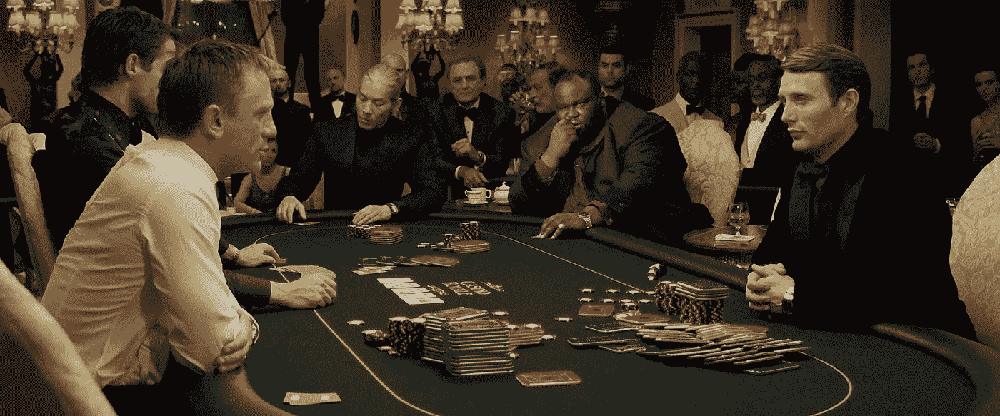

# 记号经济学:谁把博彩公司扣为人质，他们是如何被区块链解救的(下)

> 原文：<https://medium.datadriveninvestor.com/tokenomics-who-holds-bookmakers-hostage-and-how-they-are-rescued-by-blockchain-part-ii-c9d5c6b8b7b6?source=collection_archive---------32----------------------->

## 如何以及为什么将一个看似成功的商业模式符号化

[Read Tokenomics Part I](https://medium.com/@portagency/tokenomics-who-holds-bookmakers-hostage-and-how-they-are-rescued-by-blockchain-e384d708c652): Who holds bookmakers hostage

安保要花钱。流向离岸地区的资本高达数万亿美元，仅仅是因为人们希望他们的钱远离当局。整个国家都是为了这个唯一的目的而建立的——在个人理财领域提供保密性和可靠性。区块链可以确保这一至关重要的优势，尤其是在体育博彩方面。

在文章的第一部分，[，](http://portagency.io/)中，我们展示了博彩公司如何最终成为**自身商业模式**的受害者。以下是主要问题:

*   缺乏玩家的信任
*   法定货币的提款问题
*   数百万的营销和广告费用导致不愉快的佣金。

区块链技术似乎是治疗不信任症的唯一方法，这一点显而易见，我们不需要成为象征经济学专家就能看出来。但它会对其他问题有帮助吗？体育博彩公司的令牌化真的有道理吗？让我们和我们的嘉宾[瓦西里·苏马诺夫](https://icobench.com/u/sumanov)一起放大令牌组学，他是令牌设计专家。

# 我们为什么以及如何在这种商业模式中集成 token？

1.  人们更愿意依赖智能合同，而不是博彩公司的话，因此实施区块链技术将提高服务的可靠性。
2.  尽管加密货币似乎很难兑现，但事实上，它比要求赌博的收益容易得多。从法定货币转向数字货币将解决提款问题。
3.  剩下的问题是不断增长的营销和广告费用，导致佣金增加，可以从任何一方面解决:令牌化应该有助于推广，或降低玩家的下注成本。但是，我们能两者兼顾吗？答案是*是的*。

## 有了正确的令牌设计，一切皆有可能:

*   代币持有者可以被授予非委托投注的权利。玩家的经济将会增加每注的代币数量。
*   下一个合乎逻辑的举措将是允许持有大量代币的投资者将其持有的部分代币出租给其他玩家，这些玩家将分享利润作为回报。这将允许他们双方降低成本。因此，不仅代币持有者将受益于代币价格的升值，而且还能够从贷款中获得一些被动收入。
*   如果我们更仔细地观察这个生态系统，我们会发现除了实际的“玩家”、公司本身和通常的博客作者——预测者——之外，市场上还有其他类型的玩家。他们的赌注写在区块链上，确保预测的可信度随着赌注中代币数量的增加而增加。任何玩家都可以成为这样一个白手起家的影响者，并将其经验货币化，同时吸引观众并推广公司。与传统的数字营销相比，这是一个全新层次的有机推广，甚至与特定的秘密空投或奖金计划相比也是如此。这是开发系统基础设施的全新层次的社区参与。这是一个全新的分析市场，否则他们将无法在本地博彩公司赚到任何东西，现在可以零费用出售他们的预测订阅，或从收益中获得一定比例的补偿，这只有在所有人都在同一平台上下注的情况下才有可能。该系统本身将会自我扩展。

[Read Tokenomics Part I](https://medium.com/@portagency/tokenomics-who-holds-bookmakers-hostage-and-how-they-are-rescued-by-blockchain-e384d708c652): Who holds bookmakers hostage

博彩公司的案例展示了标记化如何帮助解决现有问题，以及如何超越商业模式的限制。通过正确应用令牌组学，企业可以节省数百万的促销费用，并且仍然可以从现有的客户群体开始扩张。在这种情况下，社群越广，投注额越大，玩家的佣金越低，代币价格越高。但是，最有价值的是，除了赌博之外，赚钱的选择越多。

> 如果不真正了解底层业务，为一家公司设计一个完美的令牌是不可能的。例如，瓦西里已经花了 3 天时间与创始人进行不间断的讨论，更不用说他自己 4 年的体育博彩经验了。他最初提出了几个不同的令牌化选项，在塑造这个之前，[但是货币令牌不能满足需求](https://medium.com/@portagency/tokenomics-who-holds-bookmakers-hostage-and-how-they-are-rescued-by-blockchain-e384d708c652)并且一个赌注令牌甚至不值得运行数学建模(还记得分析的命令吗？)，因为利润的季节性使得理论上公司不可能与潜在的代币持有者分享利润。

正如我们已经发现的，**这家博彩公司的代币整合****不仅是合理的，而且在这一点上是必要的**。如果没有 token，恶化的问题就不会得到解决。对博彩公司的信心不会完美无缺地构思和奇迹般地诞生，监管条件，这将允许更容易地法定撤回博彩收益，在可预见的未来不会改善，因此公司和客户的成本只会越来越难以承受。博彩公司仍然会被他们自己的商业模式所吸引。

# 奖金

正如我们所看到的，基于对商业模式的彻底研究的令牌设计的明智方法解决了公司的问题并创造了新的机会，但它也做了其他事情。它有助于预测令牌本身的漏洞，这是罕见的公司在这么早的阶段就实现的事情(并最终遭受它)。如果后 ICO 令牌出了问题，无论令牌集成能解决多少问题，它都一文不值。

在模型博彩公司的案例中，记号经济学是在不考虑外部信息来源的情况下建立的。动态计算系统确定一个人在下注时应该持有的最小代币数量，它只考虑代币的数量和下注的次数。这种“奖励”功能使代币和业务不受投机的影响。

> 这就是令牌经济学的美妙之处。

*凡妮莎·艾姆里斯*