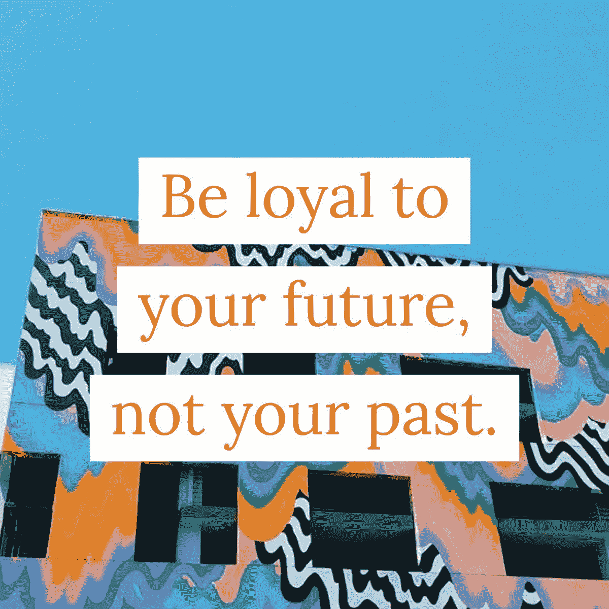
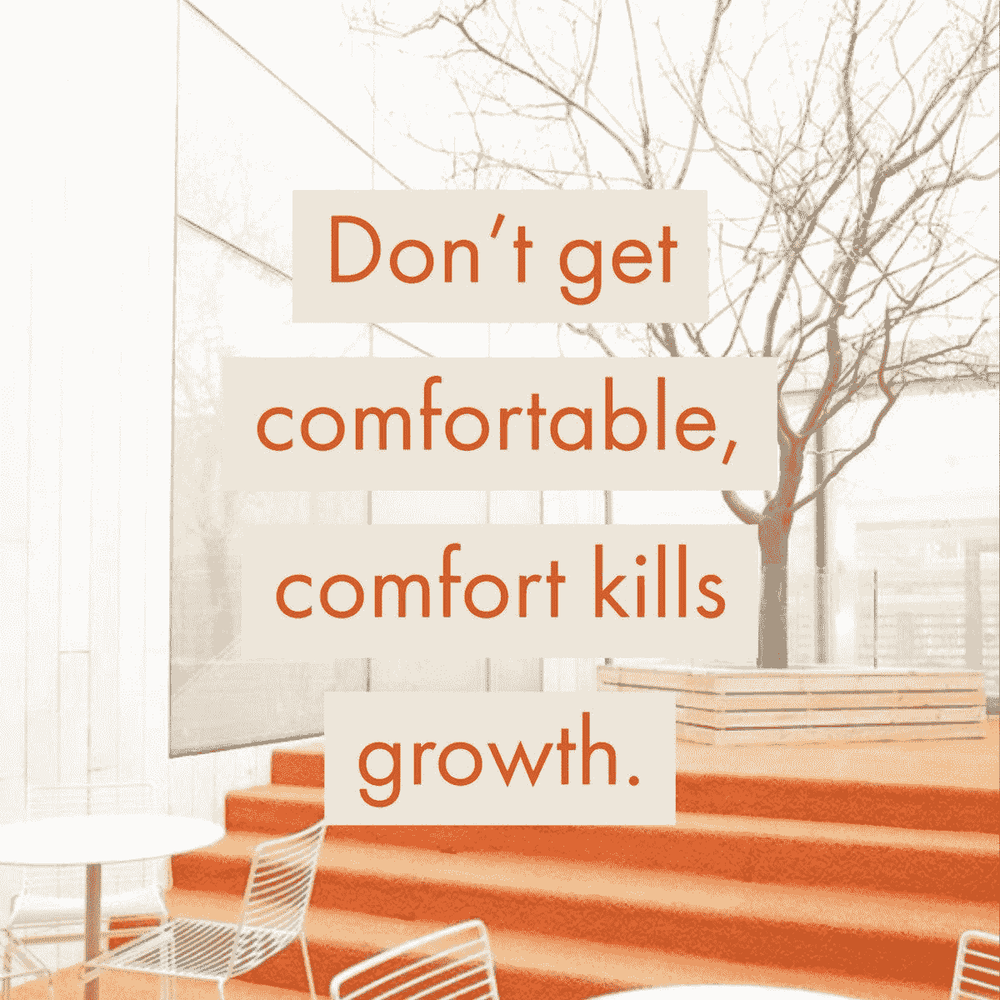
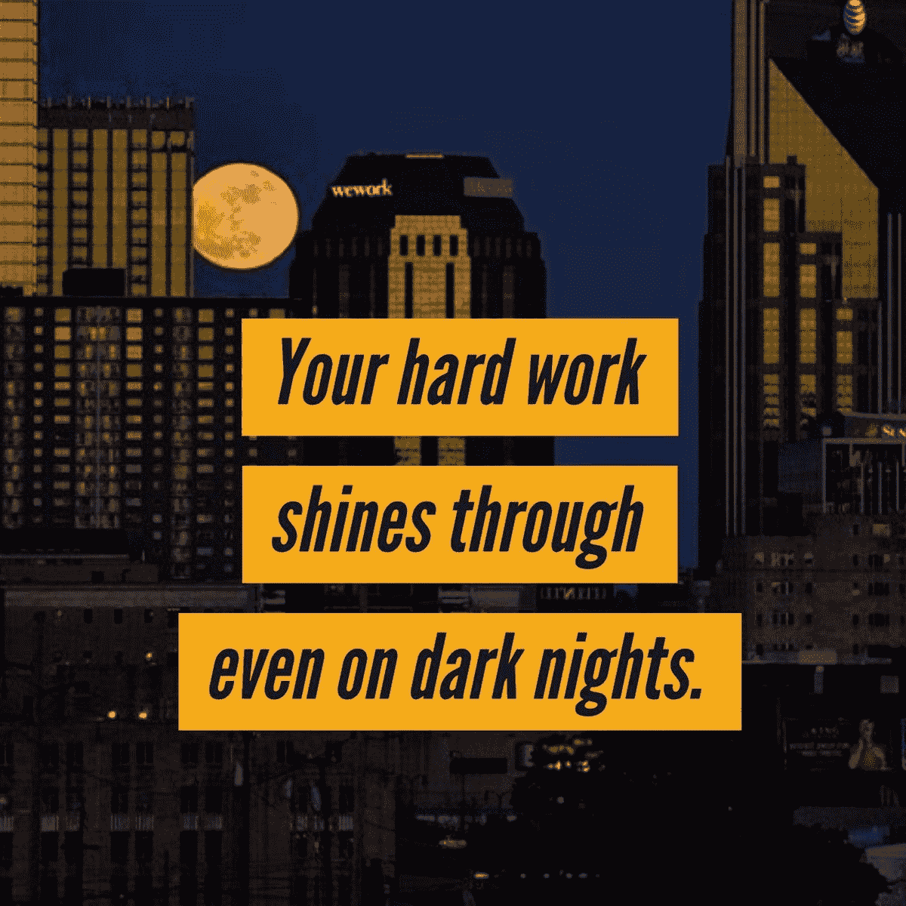

# 明天的工作将“感觉像是我们生活的一部分”

> 原文：<https://medium.datadriveninvestor.com/tomorrows-work-will-feel-like-part-of-our-lives-6d10dbd7ca41?source=collection_archive---------10----------------------->

## 自动化和人工智能将挑战员工

未来的工作可能不会包括梦寐以求的飞行汽车——更不用说悬浮滑板了。 [*回到未来第二部*2015 年 10 月 26 日](https://www.businessinsider.com/why-october-21-2015-was-the-chosen-date-in-back-to-the-future-part-ii-2015-10)，来了又走了。然而，温妮·孙、阿曼达·斯拉文和大卫·法诺仍然为那些即将走上工作岗位的人看到了希望。

他们从雇主和雇员的角度谈论了近期和长期的期望。

斯拉文是 CatalystCreativ 公司的首席执行官和创始人。她还是第七层的参与专家、作家、演讲者、投资者和顾问。法诺在 [WeWork](https://twitter.com/WeWork) 从事房地产、设计、施工、销售、营销和企业等工作。孙是金融行业最受欢迎的专业人士之一。

 [## 人工智能、领导力和人才管理

### 使用人工智能让你的员工保持快乐和忠诚

medium.com](https://medium.com/datadriveninvestor/artificial-intelligence-leadership-and-talent-management-f2f19afd4432) 

一个简单的说法是，企业将更多地依赖自动化和人工智能，解放劳动力，让他们从事更多有创意、有回报的项目。

“商业变化如此之快，而且大多是向好的方向发展，”孙说。“人们将更加关注工作与生活的平衡、企业灵活性、工作场所透明度的提高等等。

“由于技术进步和像 WeWork 这样酷的协作工作空间，传统办公室不再是必需品，”她说。“无论你在哪里，无论你想去哪里，你都可以在那里工作。”

Sun 有一个链接，人们可以在那里注册 WeWork 折扣。

# 移动和成形

“我希望看到工作场所变得更有可塑性，”斯拉文说。“这将允许快速的变化和增长，而不是过去那种相当严格的结构。我们正朝着“自我组织”和更个性化的创业体验前进。

“工作与生活的平衡正在转变为工作与生活的融合，”她说。“我们希望这一切相互融合，因为我们可以在‘任何地方’工作。”这是积极的和消极的。我们需要感觉像是生活一部分的工作，而不是与之分离的工作。"

无论工作的方向是什么，人必须是主要的关注点。

“关注人才，”法诺说。“提供卓越员工体验的公司将是成功的公司。

“我把员工体验定义为文化、环境、敬业度和技术的交集，”他说。“员工体验不仅仅是薪酬和津贴。这包括关心他们的职业和个人成长。”

文化和协作将在商业计划中扮演重要角色。

“人民需要人民，”孙说。“在建立任何规模的企业时，你都需要身边有了解你所面临挑战的聪明人。拥有一个团队的好处是你可以让人们交流想法。

“我非常相信工作场所或你的工作环境中的协作，”她说。“当我们有归属感和欣赏感时，我们自然会对工作更加满意和兴奋。我就是这样对待我的员工的。”

协调必须是协作工作的首要和中心。

法诺说:“公司的存在是为了让集体实现意图。”。“让集体达成一致是一项挑战。如果你有正确的文化，人们会合作实现共同的目标。

“文化和协作对我们取得成功至关重要，”他说。

# 通过合作取得成功

技术进步不敢凌驾于情感之上。

“没有文化和协作的企业是不可持续的，”Slavin 说。“我们必须记住，企业是由渴望情感联系、意义和目标的人组成的。文化和协作是创业的两个必要因素。

“文化和协作是我们第七层框架的重要组成部分，”她说。“我们致力于教育他人这些价值观的重要性，将其作为与客户(内部和外部)互动的最高层次。”

 [## 说出为什么你是人们可以信任的人

### 你的网上商业文化揭示了不加掩饰的真相

jkatzaman.medium.com](https://jkatzaman.medium.com/tell-why-youre-the-one-who-people-can-trust-95397df40f14) 

对合作的探索永无止境。

“你需要知道在你业务的任何阶段，你需要什么样的人或顾问，”孙说。“问问在这方面更有知识的人。这很大程度上是关于意识到你的需求。我见人就认真听，看我们之间有没有协同作用。

“当我为了工作和媒体露面而旅行时，我喜欢预订 WeWork 会议室，”她说。“无线网络太棒了。空间很美。我总是会遇到新的有趣的人。”

Fano 在这里也强调对齐。

他说:“我们把这与最有利于我们的会员、顾客和客户的结果联系起来。”“然后我们探索机会。”

联系合作者可以在近处或远处进行。

“合作是制造催化剂的关键，”Slavin 说。“在两年半的时间里，我们每月与来自世界各地的思想领袖举行两次‘交流’活动。这些经历不仅带来了合作，也带来了社区。

“在开始职业生涯的最初几年，我为他人奉献了大量的时间和精力，并免费帮助了许多人，”她说。"这有助于我找到适合合作的人."

# 预测客户需求

每个企业家都在考虑如何让他们的生意更上一层楼。

“当我想到这一点时，我必须弄清楚我们的客户需要什么，并从中受益，”孙说。“这是找出一个能让他们生活得更好的解决方案。

“几乎我们在办公室做的每一件事都要花费我们的时间和金钱，”她说。“这只是经营企业的一部分。生活中大多数我们真正想要的东西也是如此。”

法诺还将自己的企业愿景定得很高。

“我们致力于让公司提供一致和令人惊叹的员工体验，”他说。“这将通过他们的员工来我们公司，我们公司去他们的大楼来实现。我们称之为由我们提供动力的。

“我们正变得非常专注于推出这些产品和服务的上市战略，”法诺说。“一个例子是让[软件和分析领导者 Teem](https://www.wework.com/blog/posts/wework-acquires-workplace-software-and-analytics-leader-teem) 加入我们公司。”

 [## 有机增长助长了社交媒体上的财富

### 了解你的观众会增强相互吸引

medium.com](https://medium.com/datadriveninvestor/organic-growth-fuels-the-wealth-on-social-media-d7b4e6278ebd) 

财务考虑不是最重要的增长因素。

“虽然通常大多数人认为钱是发展企业所需要的，但时间是我们所拥有的最被低估的资源，”Slavin 说。“我需要更专注、更有目的的时间来专注于最可持续的下一步增长。”

明天的台式机看起来也会与今天的不同。

“我希望我们未来的办公空间更大，在设计上更大胆，”孙说。“我看到这些漂亮的 WeWork 图片，我希望他们能派设计师来我家。”

答案就在大气和工人的网眼里。

法诺说:“未来的工作场所将是拥有合适的环境，合适的人，在合适的时间做合适的工作。”。“在 WeWork，我们渴望提供许多可以衡量的维度，以确保员工的成功。”

# 不需要等待

斯拉文认为工作的未来已经到来。

“我的桌子就是我那天坐的地方，”她说。“它可以在世界各地的 WeWork，也可以在飞机上。我们开发了一个博客来帮助人们远程工作，因为 CatalystCreativ 是一个远程工作团队，可以[找到高效的工作场所](https://cityasanoffice.com/)。

企业主还利用社交媒体来优化未来的增长。

“做生意的第一步是在你的行业里做到最好，”孙说。“一旦你被证明经营着一家强大的企业，就该加强你的社交媒体和营销活动了。在打造自己的品牌时要自律。”

 [## LinkedIn 做得好几乎是神奇的

### 这是一个宣传你的个人品牌和故事的好地方

medium.com](https://medium.com/datadriveninvestor/linkedin-done-right-is-almost-magic-805094be7bb6) 

Slavin 的在线吸引力是大多数人认为的求职网站。

“我非常喜欢 LinkedIn，”她说。“与其他任何平台相比，它能更快地带来面对面的交流。它是建立关系过程中的一个指南，并一直坚持提供超越广告的价值。

“我认为社交媒体是一种更加真实的方式，可以分享我的声音，而不会太分心，”斯拉文说。“合理分配你的时间很重要，这样你花在社交媒体上的时间才不会浪费。”

根据公司的结构和愿景，理想的客户在五年后看起来可能还是老样子。

“我们的理想客户与我们有相似的价值体系、职业道德和改善财务生活的热情，”孙说。“最重要的是，他们需要成为好人。”

顾客也应该熟悉为他们服务的业务。

“我的理想客户了解创造的价值催化剂，”Slavin 说。“这个人信任并尊重我们的专业知识，积极听取我们的合作伙伴意见，并愿意有目的地成长。

“这是第七层次的文化思维:当你的个人价值观和信仰一致时，这是最高层次的参与，”她说。“更高的参与度会带来更高的成就，所以你在‘钱’上是对的。”"

# 树立榜样

期望也适用于内部。

“我们正准备把我们的专业知识应用到自己身上，”Slavin 说。“我总是说当你站在太阳上时，你是盲目的。重要的是，我们要走出自己的路，确保自己先做好工作，然后再让别人做。”

法诺也首先向内看。

“关注员工体验是我们的首要任务，”他说。“我们正在构建产品和服务，以适应各种形式和规模的公司。从最小到最大，我们很高兴能帮助人们创造生活，而不仅仅是谋生。”

 [## 鼓舞人心的空间让员工心情愉悦

### 创造舒适、高效的工作场所对每个人都有帮助

medium.com](https://medium.com/datadriveninvestor/inspiring-spaces-put-workers-in-the-mood-516bd6947d01) 

各种应用程序、软件和技术为企业家节省了时间和金钱。

“我最喜欢的商业软件是 Intuit 和 QuickBooks，”孙说。“我很感激它为我节省了大量准备公司资产负债表的时间。这是一个非常智能、易于使用的程序。

“我真的很喜欢用我的 iPhone 在全镇做生意，”她说。“很多时候，这意味着社交媒体。像 [Buffer](https://twitter.com/buffer) 和 [TweetDeck](https://twitter.com/TweetDeck) 这样的工具真的有助于加速这个过程，我只关心效率。”

法诺更喜欢用 [Slack](https://twitter.com/SlackHQ) ， [Tableau 软件](https://twitter.com/tableau)，微软和谷歌。

“作为一个远程组织，我们使用许多应用程序和软件，如 [Google Drive](https://twitter.com/googledrive) 、Slack、 [Zoom](https://twitter.com/zoom_us) 、 [Asana](https://twitter.com/asana) 、QuickBooks 和 [HubSpot](https://twitter.com/HubSpot) ，”Slavin 说。

# 从习惯到最佳实践

商业成功不会凭空出现。大多数情况下，这是良好习惯的结果。

“作为一名企业家，意味着你没有太多的停机时间，”孙说。“要想长期成功，你需要采用能让你自动采取行动的系统。

“我从媒体在线文章和我遇到或采访的人那里学到了很多有用的信息，”她说。“我学会了掌握信用卡，感觉很有力量。现在我有了收集旅游积分的策略，这很令人兴奋。”

法诺有一个软件固定为改善所有。

“我正在努力学习如何编码，”他说。“总有学习和成长的空间。扩展我的个人知识使我能够更好地支持我的团队。”

阅读和播客是斯拉文的救星。

“我通过阅读学到了很多东西，”她说。“我喜欢阅读《广告时代》、《T2》、《纽约时报》、《纽约时报》和《公司》,但我的大部分内容都是通过 LinkedIn 介绍给我的。我现在正在看的书是*[*《财富的起源:经济学的彻底改造及其对商业和社会的意义*](https://www.amazon.com/Origin-Wealth-Remaking-Economics-Business/dp/1422121038) *，*我*高度推荐*。*

*“我在一次苹果播客采访中学到的最喜欢的事情之一是——而不是说，‘这有意义吗？’“这会让你与之交谈的人感到自卑——把所有权放在自己身上，”斯拉文说。说，‘我解释清楚了吗？’"*

*她补充说，她“通过 [NPR](https://twitter.com/NPR) 和他们的播客 [Invisibilia](https://twitter.com/NPRinvisibilia) 更多地了解了这个世界、人类行为和我自己。这是我最喜欢的播客。我也碰巧是 NPR 世代倾听 T21 董事会的成员。”*

* [## 四位坚定的领袖挑战新世界

### 快速的变化考验着他们预测、适应和发展的能力

medium.com](https://medium.com/an-idea/four-determined-leaders-take-on-the-new-world-f98c32e66ca8) 

偶尔会冒出一些惊人的想法，激励创业者。

“我在为我的新节目采访某人时想到了一个主意，”孙说。“我非常喜欢在忘记之前记下这个想法。如果我自然无法将它从脑海中抹去，那就该花时间去尝试新的东西了。”

法诺指出，与客户的日常互动产生了“关于我们如何成为一家更好的公司的惊人想法。”

阅读" [*建立一个故事品牌:阐明你的信息，让客户会听*](https://www.amazon.com/Building-StoryBrand-Clarify-Message-Customers/dp/0718033329) “启发 Slavin”重新评估我的业务以及我如何交流专业知识。”

# 互惠互利

最终，让成功人士围绕在你身边可以帮助企业家变得更加成功。

“把合适的人带进一个组织，指导他们，让他们领导，”孙说。“任何双赢的成功都比你在孤岛上工作要好几百倍。”

成就也取决于如何定义它们。

“成功是一个棘手的词，”法诺说。“和各种各样的人在一起很重要，他们拥有不同的技能、不同的水平和不同的经历。这样你就能有一个更全面的商业方法。”

斯拉文认为影响力是双向的。

“你是和你相处时间最长的五个人中的平均水平，”她说。“最重要的是，你身边要有‘成功’的人。我指的是情感上、精神上的成功，而不是经济上的。”

**关于作者**

吉姆·卡扎曼是[拉戈金融服务公司](http://largofinancialservices.com)的经理，曾在空军和联邦政府的公共事务部门工作。你可以在[推特](https://twitter.com/JKatzaman)、[脸书](https://www.facebook.com/jim.katzaman)和 [LinkedIn](https://www.linkedin.com/in/jim-katzaman-33641b21/) 上和他联系。* 

**原载于 2018 年 10 月 12 日*[*www.datadriveninvestor.com*](http://www.datadriveninvestor.com/2018/10/12/tomorrows-work-will-feel-like-part-of-our-lives/)*。**