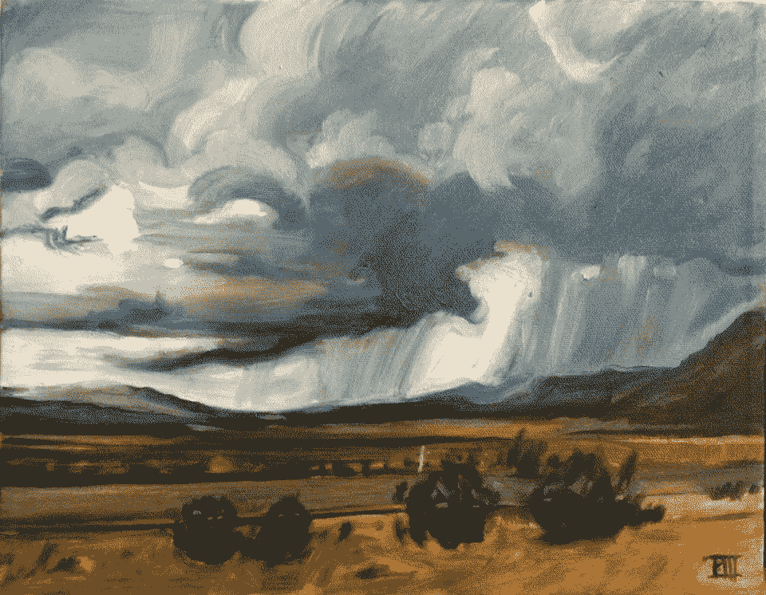

# 信息太多？那就去做吧。

> 原文：<https://medium.datadriveninvestor.com/too-much-information-then-just-do-it-8695735aa7f7?source=collection_archive---------7----------------------->

stormy travels, Palmer Saylor III

我的职业生涯已经走到了一个十字路口，这个十字路口极大地影响了我的个人健康、财富和人生观。顺便说一句，我每天都在努力寻找自我完善的替代性和独特的观点，这似乎已经让我筋疲力尽了。我的阅读、同事的建议和研究让我走上了重复引用和主题的道路，这些重复引用和主题反映了自我完善、实现、实现和接受的相同智慧和模式。我不再像几年前那样热衷于阅读，但我最近发现，我的阅读习惯表明，我可能在追逐同样的偏见，在各种形式中寻找同样的认同。我们都想进步。自我提升阅读一直根植于我对心理学和科学的兴趣和倾向。从那以后，在我 40 多岁的时候，它逐渐减少到博客阅读和写作。我一直保持着对小说、小说和经典文学的稳定饮食。但现在我读书是为了寻求指导，比如项目学习、职业建议、自我完善等等。我想这对于我这个年龄的人来说是一个自然的过程，不管生活的道路如何。自然地(或不自然地)，我的性情和潜意识努力将所有这些信息和智慧整齐地捆绑成一个整洁的宇宙真理的小包裹，我可以用它来解决所有的问题。显然，消息灵通的决策会带来更好的结果。我希望我的写作也能如此。(我将跳过关于我写作能力的自我否定声明，把它留在这里。)

 [## 成功的生活数据驱动型投资者的 25 种自我提升方式

### “我活得越久，学到的就越多。学的越多，体会的越多，知道的越少。”―米切尔·莱格兰德时间到…

www.datadriveninvestor.com](https://www.datadriveninvestor.com/2019/03/12/25-self-improvement-ways-for-a-successful-life/) 

从 1988 年到 1993 年，我在艺术学校学习，并在 20 多岁时作为艺术总监在艺术界应用这些知识和技能。我花了 30 多岁通过佣金建立自由职业生涯。从四十多岁起，我就开始稳定下来，努力磨练和提高我对各种技能的掌握，努力成为一名多才多艺的人。我仍然喜欢烹饪、写作、打猎、志愿服务、商业发展等。我努力成为一个勇猛的绅士，走高尚的道路，做好一切准备。作为一名自由职业者，我的职业生涯已经稳定在足够好和成功之间。我尽最大努力通过阅读来防止痴呆症，通过旅行来享受舒适，通过参与家庭生活来获得满足感。但是当我写这篇文章的时候，我满足于我的荣誉。我需要一个新的行动计划。

> 无论你能做什么或梦想什么，开始吧；勇敢包含天才、力量和魔力。——歌德

我认为新的计划是将我所取得的成就、旅行、阅读和生活整理成一个整洁的理论或定制的咒语，它将照亮我所应用的任何黑暗或灰色物质。一个重要的切线如下:现代生活感觉如此不自然，但历史和新数据表明，它是如此相同，尽管更安全，更繁荣，更和平。这一成功的代价似乎让我们在如此敏感的领域付出了高昂的代价，却没有解决我们内部的问题。我们在美国遭受健忘症和文化极化，我们的自然环境遭到全球性的破坏。如此多的全球性问题，我希望自己无论如何都不要参与其中。我试图将身份和我的生活方式融入解决方案，并将解决方案融入我的生活方式和身份。唉，我们是一个集体意识，我们在很大程度上都是主体和数字。我的个人难题变成了困境，困境变成了挑战，随后随着时间的推移变得越来越清晰……*我如何解读、组织和应用我的智慧和核心价值观到一种与我自己和我周围的一切都格格不入的生活方式中？在真空之外，在真空之内，我如何按照自己的方式生活？(反之亦然)。*我如何在一个将真实的一切货币化、公司化和商品化的文化的逆境中获得成功和发展。*我如何在一种文化中做出决定，这种文化通过一个新的贵族阶层破坏了美国梦，这个新的贵族阶层让我的价值观与我作对。最重要的是，过多的信息是如何麻痹我的动力和决策的？***

***在过去的 8 年里，我对这个问题的回答是在我的世界周围建造一个更大的栅栏，把世界挡在外面，避开一切与我的道德、健康和生存不相容的东西。然而，我仍然发现自己触及了那颗狮子的心，分享了我在 20 多岁时所追求的东西:平衡、满足和接受。看起来游戏没有变，我也没有变…我们都变得更复杂了。***

> ******如果我用心创作，几乎一切都行得通；如果从头部看，几乎没什么*。**——马克·夏迦尔***

***我最近思考了一个最近的困境，这个困境可以说是我通过信息不断寻求改善和决策的缩影。我反思我的精通。在我 35 岁左右的时候，我对旧的爱好和兴趣变得相当认真，包括写作和表演音乐、户外娱乐和其他古怪的爱好。猎鸭高居榜首。我仍然有年轻时对猎枪的挥棒本能，所以这是自然而然的。我重新订婚了，打猎帮助我平衡了生活。然而，一种新的飞行方式和新的鸭子种类让我停下来，并激励我在新的环境下更好地射击。自然，我读，我读。我尝试了许多技巧，包括一个众所周知的被称为“安静的眼睛”的运动技巧。我试过了，虽然看起来很有效，但实际上我变得更糟了。事实上，我的拍摄三季都很糟糕。然后我突然想到。我已经在没有任何指导或想法的情况下使用了“安静的眼睛”技术。只是意识到我的“安静的眼睛”破坏了我。我的肌肉和脊椎记忆已经替我完成了任务，是时候相信我的直觉了。有一天在双向飞碟靶场，一切都到了紧要关头。我告诉一个朋友，在没有任何通知的情况下就去拉投鸽器上的绳子，以确保我的本能是 100%的反应。嗯，他拉了一下绳子，我的反应还不错，就像我年轻时一样。我不仅达到了目标，而且 98%的时间都在做。我回来了，重新调整了我的直觉、内心和思想。更重要的是，我发现我甚至没有瞄准枪管。事实上，我什么也没做，只是让肌肉记忆和本能在时间中冻结在那一刻。当它结束的时候，我真的一点都不记得那一刻了。但在那之后，采石场就是我的了。***

> ***“照做就是了。”-耐克商标***

***所以本质上，我需要知道的就是如何以及何时收集信息，相信我的直觉，并在一个完美的掌握时刻应用这种经验。我是这样组织的。***

******信息+实践=精通******

*****精通+实践=智慧*****

*****智慧+实践=本能*****

**这个等式和方法能在我的职业生涯中起作用吗？也许停止沉思、阅读和收集事实能让我清晰而成功地到达另一个世界？我确信这个等式是可以互换的，但是等式中的“信息”(收集)部分真的不能互换。也许是时候进入练习精通或智慧等式的第二或第三部分了。而不是收集信息。**

**我们以消费者为基础的文化给我们带来了超负荷的信息和数据。我们的大脑在中午前权衡并做出的决定比我们的祖先一周做的还要多。你可以在丹尼尔·莱维汀的书《有条理的头脑》中读到更多。有一点是肯定的，我们都患有“TMI”。我一直知道耐克的口号“只管去做”不仅仅适用于运动员。你被困在等式的哪一部分了？我自己似乎被数学卡住了，但是我熟悉它的所有部分。这里没有什么新的提议是以前没有说过或写过的。也许有人读到这篇文章时，会听到脑海中响起一声钟声，并从中提取出潜意识中已经产生了十亿次共鸣的普遍信息。…这反过来会推动他们走向行动的精通…就像我读到的最后一样。**

**谢谢，**