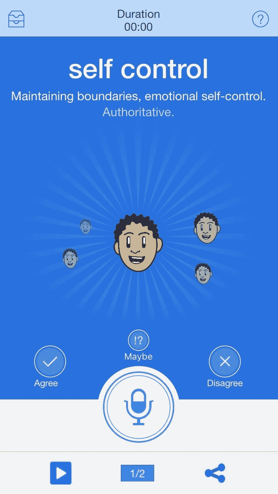

# 测试你的 VUI 的情绪、心情和用户解释的工具。

> 原文：<https://medium.datadriveninvestor.com/tools-to-test-your-vuis-emotions-moods-and-user-interpretation-f4c6eb189e46?source=collection_archive---------21----------------------->

检测和分析用户情绪被称为:**情感分析。**

谷歌对此的解释是；*“通过计算识别一段文本中表达的分类观点的过程，尤其是为了确定作者对特定主题、产品等的态度。，是积极的，消极的，还是自然的。'*

在语音优先的世界中，这可以用来检测用户的情绪和用户的感受。然而，对于品牌和公司来说，这也可以用来**分析**他们录制的提示或语音 AI 的**声调**，并测试他们的**角色**和**品牌价值**是否与选择的**语音特征**和**文案**一致。

但是你从哪里开始呢？您需要定义您的类别，只需从“**正**”或“**负**”开始。列出积极和消极的单词，你可以比较用户或 VUI 说了什么，并相应地进行分类。此外，也有开源工具，如 **KNIME** 来检测用户或 VUI 说负面话和正面话的时间百分比。

一个更详细的测试你的 VUI 动作或技能的方法是用绿野仙踪的方式来测试。其中有人播放记录提示或语音人工智能，并写下或让用户选择它触发的情绪或心情。

探测情绪和心情是一个相当新的游戏，Beyond Verbal 公司开发了一款名为 Moodies 的应用，做得非常好。这个应用程序是一个很好的工具，可以让你以更先进的方式测试你的 VUI。从你的语音 AI 播放一段 20 秒的音频，或者使用你录制的提示，它会实时分析语音语调。它给你一个关于你的 VUI 是如何被感知的结果，以及一个带有忧郁、包容和对抗的基本尺度的情绪图。

在这次测试中，我用一种平静的、稍微低沉的语调说话。介绍一家国际科技公司。

没有任何研究，不知道公司的名字，背景，志向和价值观？你认为这是正确的语调吗？请在下面的评论中告诉我你的想法！

然而，使用这些情绪检测技术并不能给你 100%的准确性。总是需要用不同的方式、多种工具和方法、不同的人等等来分析。正确理解 VUI 的情绪状态是很好的，但是错误的理解会有很高的代价。

*关于 VUI 测试或 VUI 听觉品牌的更多信息？前往*[*www . voice branding . nl*](http://voicebranding.nl/)

*作者:*[*Phoebe Ohayon*](https://www.linkedin.com/in/phoebe-ohayon/)*|合作伙伴，声音品牌化。*