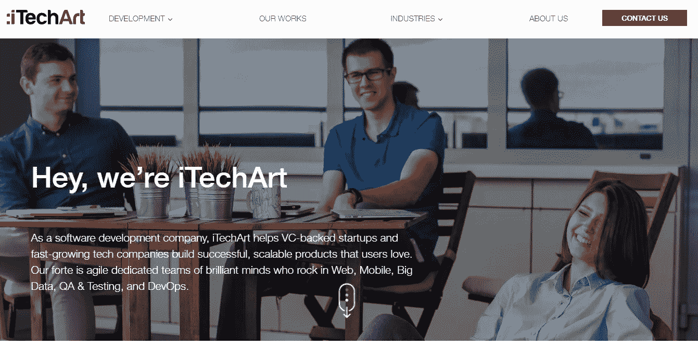
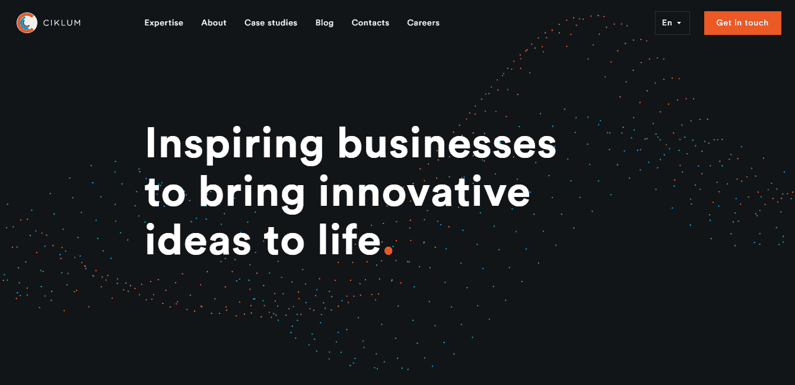
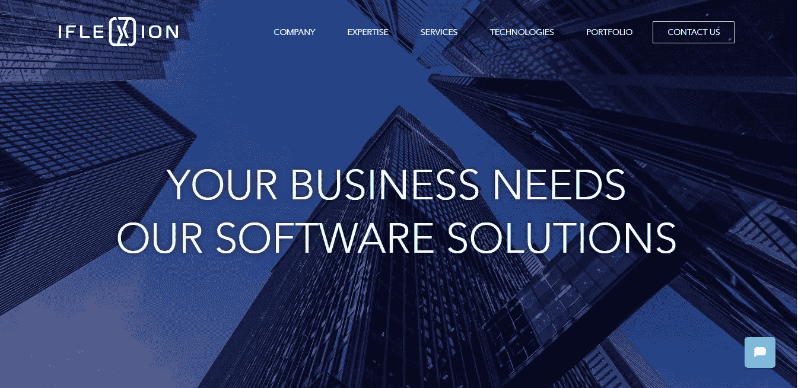
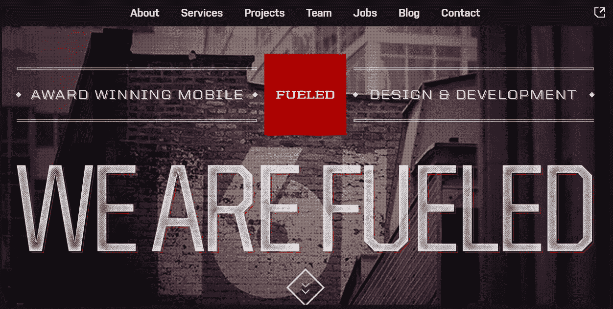
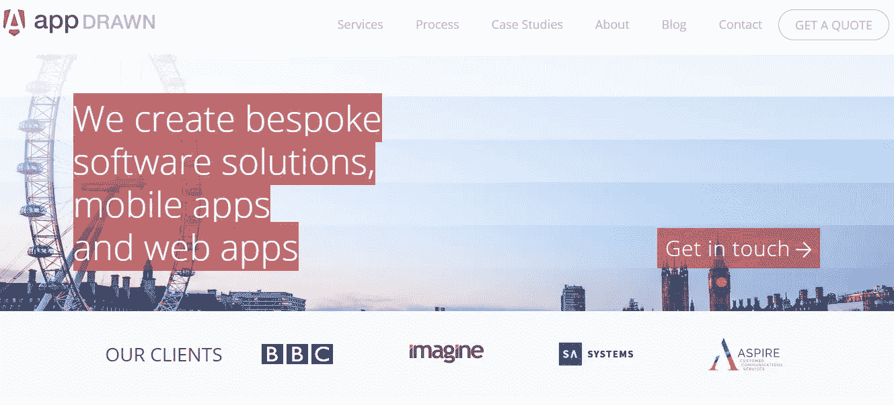
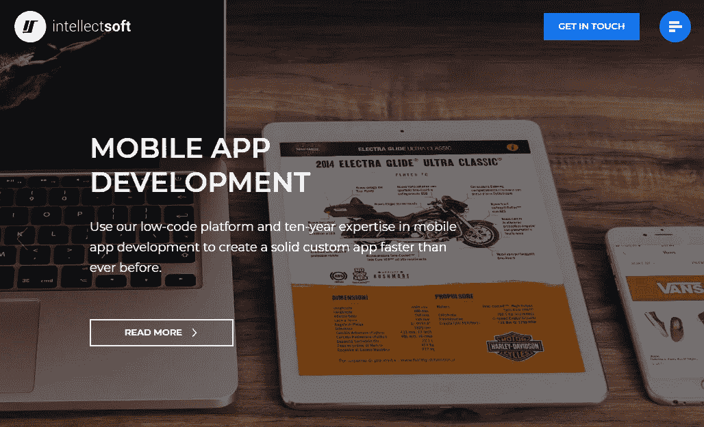
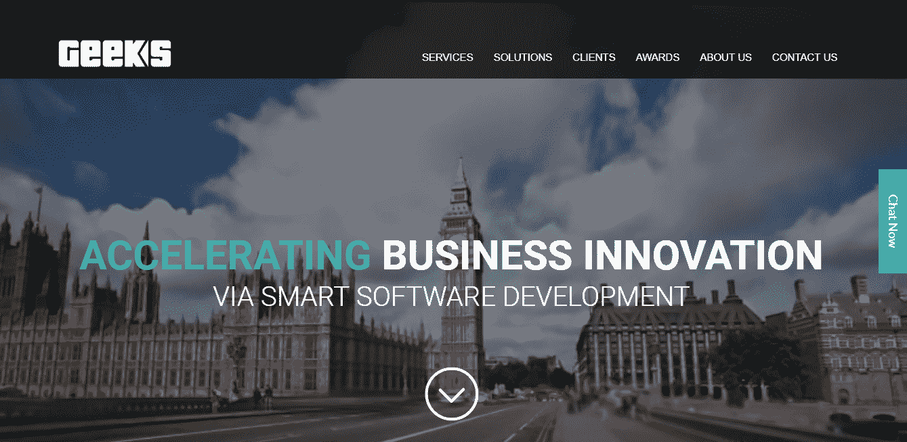
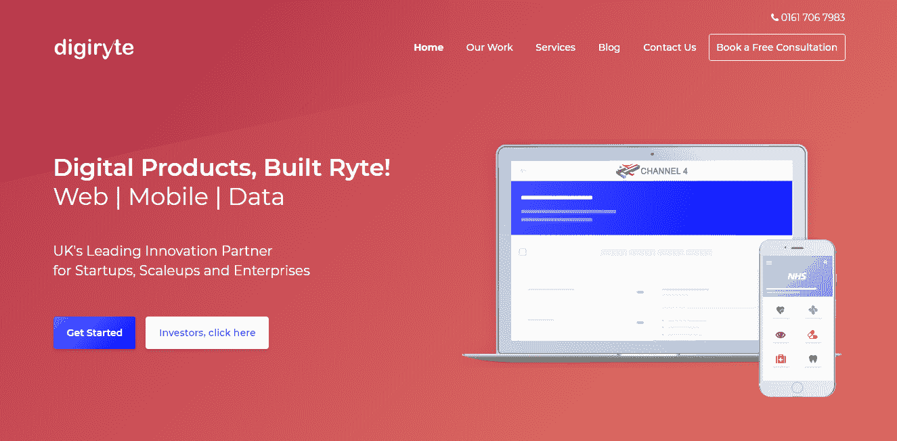
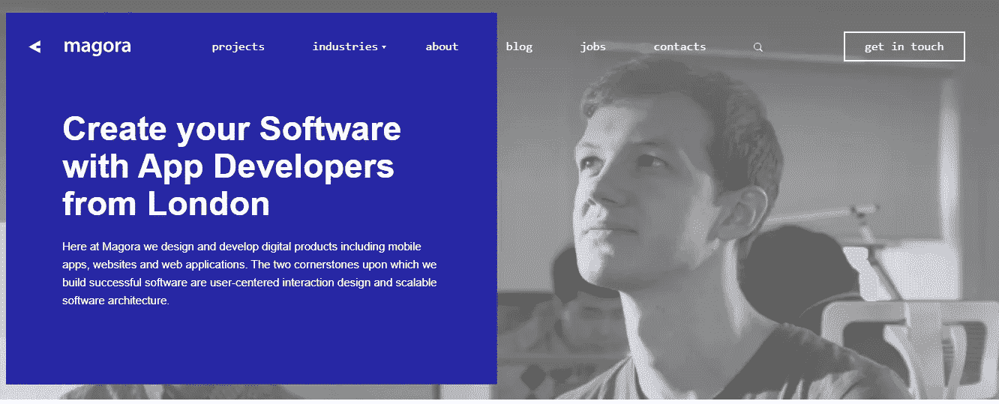
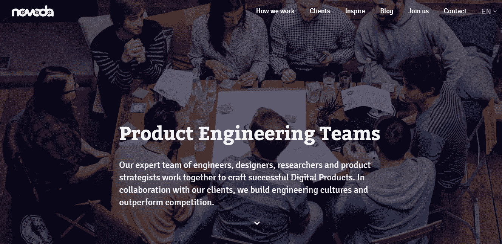

# 英国十大应用开发公司

> 原文：<https://medium.datadriveninvestor.com/top-10-application-development-companies-in-the-uk-bf7f59bff5f7?source=collection_archive---------3----------------------->

如果你准备好将一个新的数字想法带入生活，是时候找一个开发者来实现它了。在世界各地，成千上万有才华的开发人员已经准备好争夺你公司的注意力，并为你开发下一个应用程序。仅在英国就有超过 338，000 名程序员和软件开发人员。

幸运的是，许多英国顶级开发公司雇佣了最优秀、最聪明的软件开发团队。这些开发公司得到了大客户的信任，能够坚持最佳的软件开发实践，并为他们的客户需求构建量身定制的解决方案，这些公司因提供了让用户回头率更高的出色体验而赢得了良好的声誉。

 [## 2019 年移动应用开发之路——数据驱动投资者

### 任何在移动应用程序开发行业工作的人，无论他们是专注于在伦敦开发 iOS 应用程序还是…

www.datadriveninvestor.com](https://www.datadriveninvestor.com/2019/01/15/the-path-of-mobile-app-development-in-2019/) 

以下是一些当今英国顶级应用公司的综合报道:

**iTechArt**

*   **办事处地点:美国、英国、白俄罗斯**
*   **成立时间:2002 年**
*   **公司规模:1001-5000 名员工**
*   **客户:条形图、Forex.com、conventi on、Blackboard、Lasspass、ZEFR**

[iTechArt](https://www.itechart.com/company/) 是一家软件开发公司，拥有 1，300 多名开发人员和 200 多个活跃客户。iTechArt 主要专注于帮助风险投资支持的初创公司和高增长技术公司，监督整个开发过程，直到交钥匙产品。该公司的解决方案是使用全面的后端和有感染力的用户界面构建的成功且可扩展的产品。iTechArt 在伦敦、明斯克和纽约设有办事处，提供一整套 web 开发、iOS 和 Android 移动应用程序开发以及跨平台移动应用程序开发服务。

**Ciklum**

*   **办公地点:英国、乌克兰、丹麦、美国、以色列、瑞士、阿联酋、德国、西班牙**
*   **成立时间:2002 年**
*   公司规模:1001-5000 名员工
*   **客户:FlixBus、Just Eat、Kantar Retail、托马斯·库克、Jabra**

财富 500 强全球数字解决方案公司 Ciklum ，在全球五个国家拥有多个开发中心。通过其端到端业务解决方案，Ciklum 提供了各种不同的参与模式，以帮助公司开发他们所需的软件。无论是管理整个服务，从零开始建立一个想法，还是用专门的专家扩展开发团队，Ciklum 屡获殊荣的专家都强调开发团队的力量、可靠性和可负担性。

Ciklum 的工程、QA、R&D 和数据分析服务已被 Forrester、Gartner 和欧洲软件测试奖等领先的行业协会认可为欧洲提供的最佳服务。

**Iflexion**

*   **办事处地点:英国、美国**
*   **成立时间:1999 年**
*   **公司规模:201–500 名员工**
*   **客户:贝宝、Expedia、易贝、施乐、毕马威**

[Iflexion](https://www.iflexion.com/portfolio) 拥有 20 多年构建 web、移动和企业应用的经验。该公司的全周期服务几乎涵盖软件开发的每个领域，支持银行、教育、娱乐、制造、公共部门和零售行业的广泛客户。作为全栈供应商，Iflexion 将业务领域经验与技术专业知识相结合，为移动设备和网络提供全面的端到端解决方案。

**加燃料**

*   **办公地点:美国**
*   **成立时间:2007 年**
*   公司规模:51-200 名员工
*   **客户:沃比·帕克、巴尼百货、威瑞森、QuizUp、Afterlight**

[Fueled](https://fueled.com/services/) 是一家屡获殊荣的移动设计和开发公司，专注于 iPhone 应用和 Android 应用的战略、设计和开发。Fueled 专门为初创公司和企业工作，致力于制作吸引人的设计，使网站和移动应用程序快速、灵敏且易于使用。因为应用程序不是一刀切的，所以 Fueled 团队提供了一整套按菜单点菜的开发服务，以使整个项目变得生动，或协助关键组件的开发。Fueled 的伦敦和美国开发人员强调他们在构建让人们说话的服务方面的专长，使用现代高效的编码实践将应用程序转化为让用户满意的可用产品。

**AppDrawn**

*   **办公地点:英国**
*   **成立时间:1999 年**
*   **公司规模:2-10 名员工**
*   **客户:BBC，Aspire，SA 系统，Imagine**

总部位于伦敦的软件开发商[appdraw](https://www.appdrawn.com/our-process)专注于为各种客户创建移动应用、网络应用和定制软件解决方案。凭借二十多年服务于英国和欧盟的经验，AppDrawn 致力于为初创公司和大型企业创建解决方案，以实现遗留流程的现代化，解决新问题并构建应用程序。AppDrawn 使用独特的敏捷原型开发方法，一旦明确定义的设计流程完成，就开始开发项目，从而保证项目按时按预算进行。

**智能软件**

*   **办公地点:英国、挪威、美国**
*   **成立时间:2007 年**
*   **公司规模:201–500 名员工**
*   **客户:Gulls，Eurostar，Cirrus Insight，NHS**

[Intellectsoft](https://www.intellectsoft.net/) 是一家提供全方位服务的软件开发公司，专注于移动应用程序开发、区块链开发和企业解决方案。Intellectsoft 是一家专注于使用人工智能和增强现实等新兴技术的尖端工程解决方案的精品咨询公司，拥有超过 500 家客户，涵盖金融、保险、医疗保健、物流、零售和旅游行业。Intellectsoft 的专门应用程序开发团队使用现代实践(如低代码开发)来创建在移动平台上本地运行的现代解决方案。随着全球业务从英国扩展到硅谷和东欧，Intellectsoft 与许多主要的财富 500 强公司合作。

**极客有限公司**

*   **办公地点:英国**
*   **成立时间:2007 年**
*   公司规模:51-200 名员工
*   **客户:Mitie、HMV、欧洲货币、雷盛、组织媒体**

极客有限公司雇佣了一个屡获殊荣的开发团队来开发适用于所有移动平台的应用程序。专注于加快组织的上市时间，Geeks Ltd 使用现代跨平台开发工具来快速构建原型和移动应用程序，以供快速使用。Geeks Ltd .的加速软件开发流程确保其总部位于伦敦的组织赢得了初创公司、企业以及介于两者之间的任何规模公司的信任。

**数码**

*   **办公地点:英国**
*   **成立时间:2016 年**
*   **公司规模:11–50 名员工**
*   **客户:NHS，Vapewunder，蓝色大酒店**

作为英国领先的创新合作伙伴之一，面向寻求扩大规模的初创公司、企业和组织， [Digiryte](http://digiryte.com/) —构建正确的数字产品——帮助从头到尾支持软件开发流程。通过全面的构思和路线图，Digiryte 致力于使用 React Native 和 flutter 等现代框架和开发工具开发定制的 web 应用程序和移动应用程序。从电子商务软件到区块链系统上的机器学习增强聊天机器人，Digiryte 利用现代技术，在曼彻斯特和普雷斯顿的办公室为客户打造尽可能最好的应用解决方案。

**玛格拉**

*   **办公地点:英国**
*   **成立时间:2010 年**
*   **公司规模:51–200 名员工**
*   **客户:InnovoCare、BrandSkout、伦敦 VIP Group、VPS、Blue Cielo**

Magora 为 B2B 和 B2C 客户开发移动应用和网络应用。无论是创业 MVP、面向消费者的服务还是内部企业实用程序，Magora 都可以帮助组织确定应用程序的产品策略，设计 UX 和 UI，并设计和实现最终产品。Magora 位于伦敦的办公室与许多不同行业的客户合作过，包括医药、房地产和运输。

**诺沃达**

*   **办公地点:英国、西班牙、德国**
*   **成立时间:2008 年**
*   **公司规模:51–200 名员工**
*   **客户:英国新闻、乐购、ImmobilienScout24、CCleaner、梦多**

[Novoda](https://novoda.com/clients/) 为 iOS 和 Android 开发应用程序，通过以下六个步骤实现移动应用程序开发流程:启动、可点击原型、迭代发布、质量保证、用户界面、设计和发布后支持。自 2008 年以来，诺沃达一直在重新考虑新成立的公司以及成熟品牌的服务。他们的专业人员孜孜不倦地为产品或业务寻找最佳的数字解决方案，以保持他们的领先地位。

选择合适的应用开发者对你的应用的成功至关重要。与声名狼藉或缺乏经验的开发人员合作可能会导致应用程序漏洞百出，界面糟糕，性能低下，从而产生不太理想的用户体验。上面的列表可以在提供开发服务的各种公司中为你提供指导。