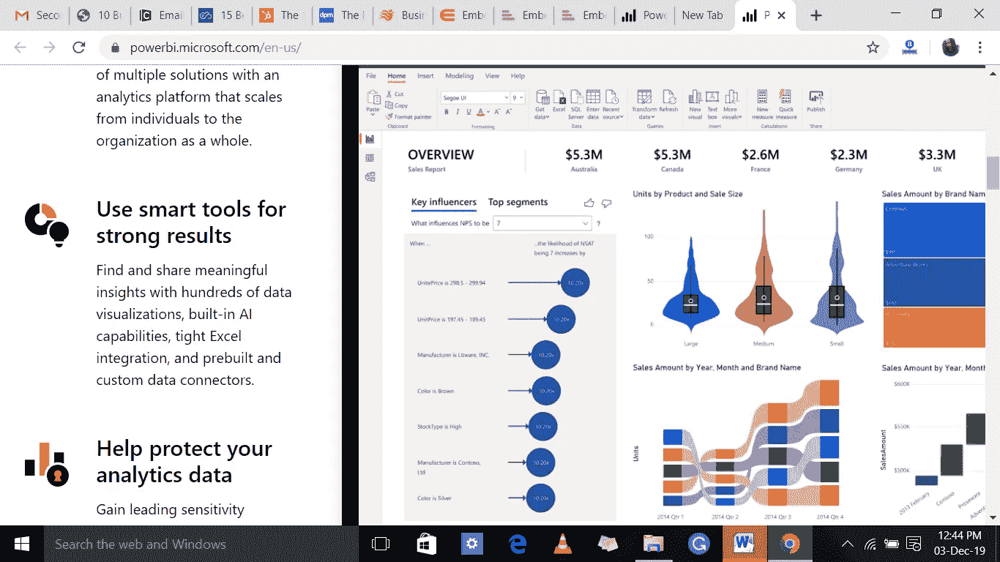
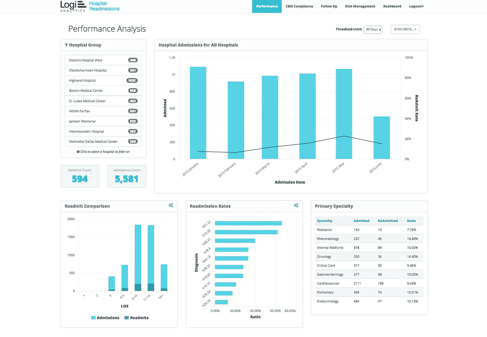
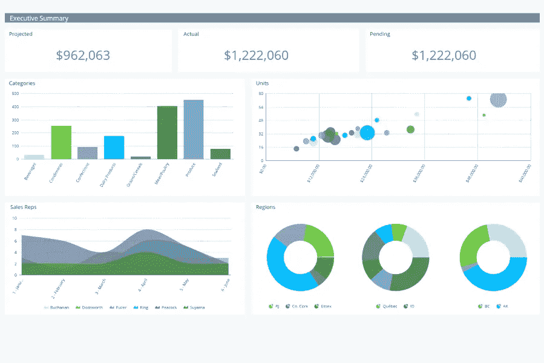
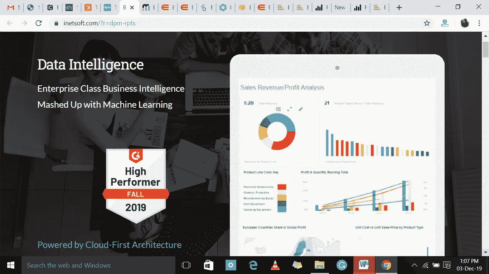
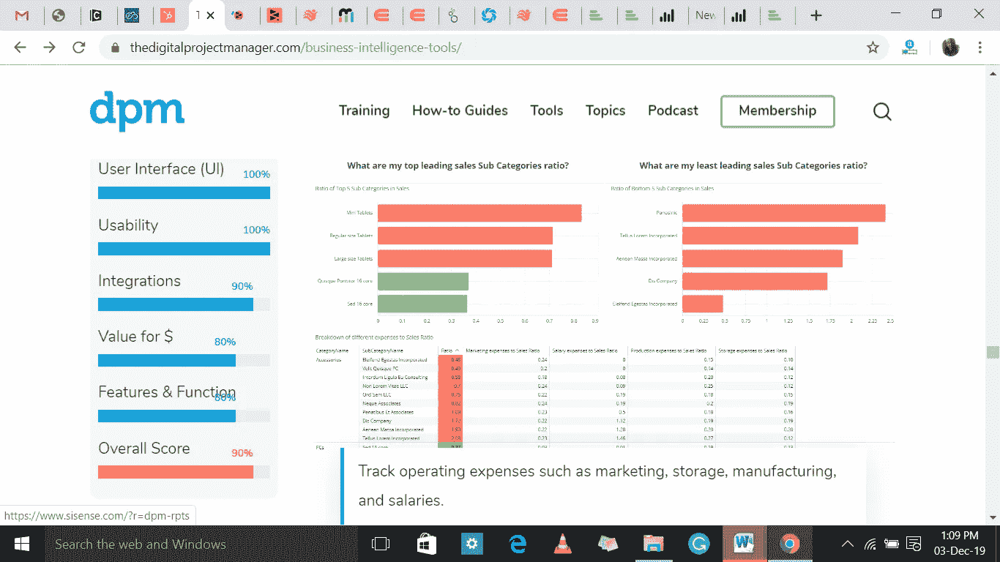
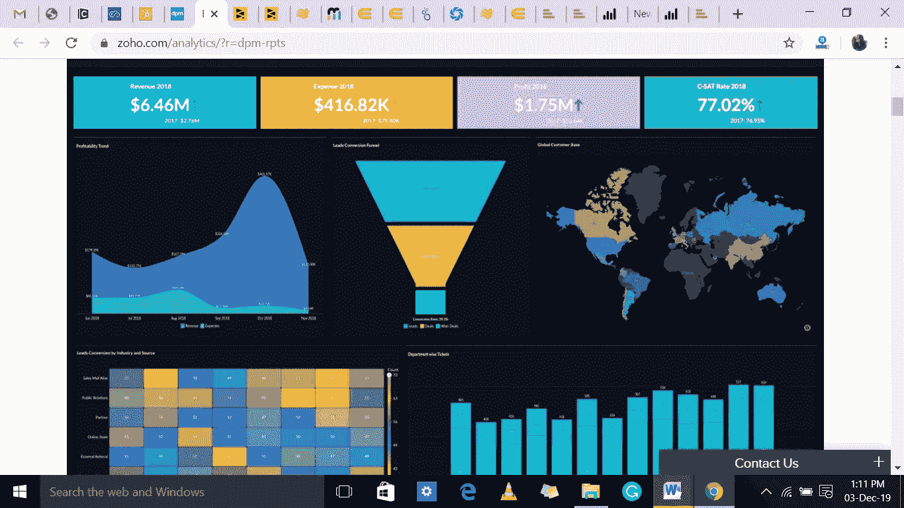
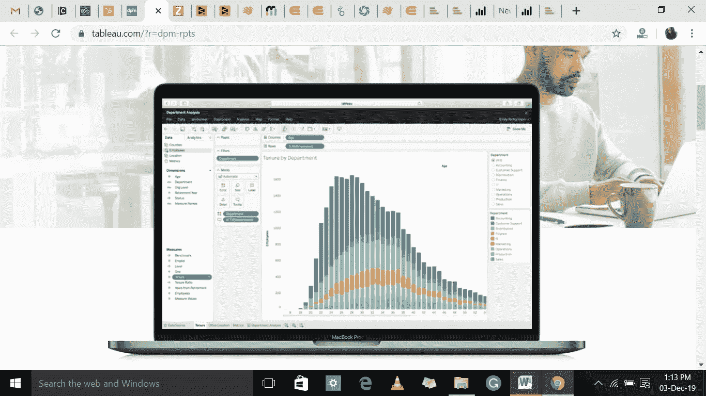
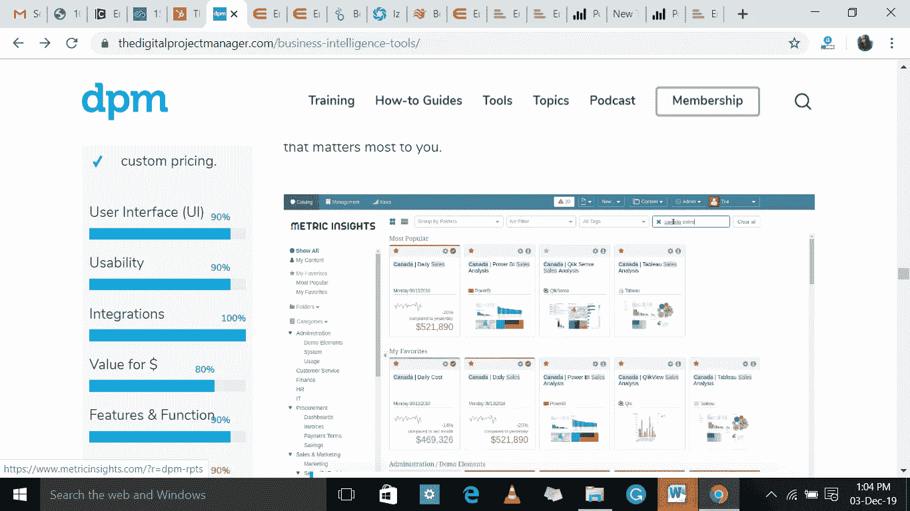
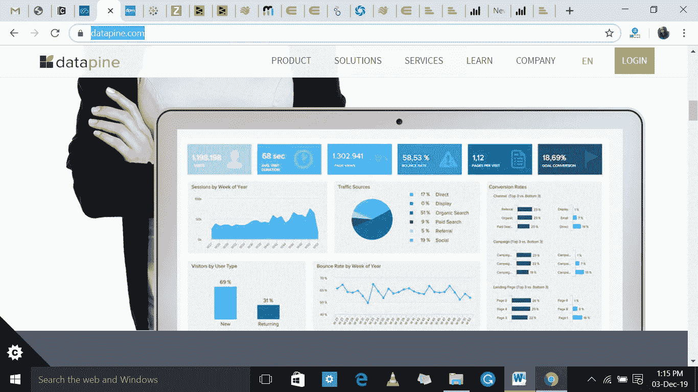
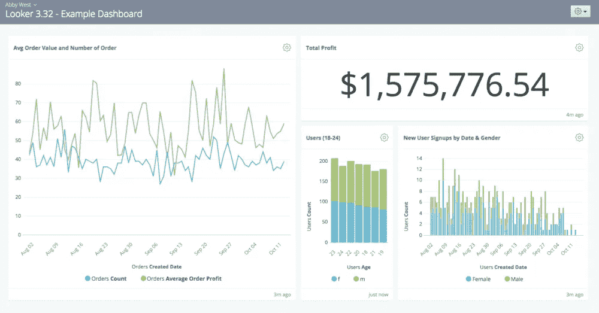

# 数字营销人员的 10 大商业智能工具

> 原文：<https://medium.datadriveninvestor.com/top-10-business-intelligence-tools-for-digital-marketers-b9f64f14cd34?source=collection_archive---------1----------------------->

商业智能工具是数字营销的重要组成部分。作为数字营销人员，这些工具帮助您了解趋势，并帮助您从数据中获得洞察力，以确保您做出必要的、经过深思熟虑的商业决策。

商业智能[数字营销工具](https://mediaonemarketing.com.sg/digital-marketing-services/)包含许多有用的特性和功能，让您的业务更加轻松。他们通过自动化重复的过程和编辑信息来做到这一点，否则如果手动完成，这些信息将很难破解。他们还提供营销指南，以保证一切都是迎合。下面是对 10 个最佳商业智能工具的回顾，可以考虑添加到你的网络营销活动中。

# 1.功率 BI

微软 [Power BI](https://powerbi.microsoft.com/) 商业智能分析解决方案，为非技术业务所有者提供分析、可视化、聚合和共享数据的工具。

## **电源 BI 如何工作**

Power BI 用于在组织的数据中寻找洞察力。它可以帮助连接不同的数据集，将数据转换和清理到一个数据模型中，并创建图形或图表来提供数据的可视化，所有这些都可以与组织内的其他 Power BI 用户共享。

 [## 一个企业在肚子上移动:如何照顾直觉|数据驱动的投资者

### 事实证明，直觉不仅仅是一种感觉。科学很清楚:你的直觉比你知道的更多…

www.datadriveninvestor.com](https://www.datadriveninvestor.com/2018/11/09/a-business-moves-on-its-stomach-how-to-make-allowances-for-gut-feelings/) 

它还可以为管理员或经理提供执行仪表板，提供对各部门工作情况的管理见解。对于熟悉 Excel 的用户来说，它的用户界面非常直观，并且它与其他微软产品的集成使它成为一个几乎不需要前期培训的多功能工具。

## **特性**

它的一些功能包括人工智能、快速洞察、Cortana 集成和定制、建模视图、混合部署支持自助服务准备和用于集成的 API。

Power BI 主要由部门代表和管理人员使用，用于深入了解部门和员工个人的目标进展情况。

## **定价**

Power BI 起价为 9.99 美元/用户/月，有一个面向中小型企业主的免费版本。然而，组织的规模决定了定价。

你可以访问他们的网站[https://powerbi.microsoft.com/](https://powerbi.microsoft.com/)了解更多详情。

# 2.逻辑分析

[Logi Analytics](https://www.logianalytics.com/) 是一款公认的领先嵌入式分析工具，可帮助公司在商业和企业应用中嵌入仪表盘和报告。

## 【Logi Analytics 如何工作

通过其基本的 BI 设计方法，Logi Analytics 无需编码即可向任何平台提供报告和仪表盘。Logi 提供嵌入式分析，允许用户将仪表板、报告和分析嵌入到现有应用程序中。它还允许与任何安全系统轻松集成，并为 It 提供访问控制，以便员工能够根据其职责访问数据。

## **特色**

它的一些功能包括预测分析、利润分析、在线分析处理、自动计划报告、特别报告/分析和可定制的仪表板。

Logi 是中小型企业、政府机构甚至大型公司的理想选择。

## **定价**

Logi 根据组织的需求提供定制价格。联系他们获取免费报价。

更多信息，请访问他们的网站[https://www.logianalytics.com/](https://www.logianalytics.com/)

# 3.Exago

[Exago](https://exagoinc.com/) 是一款屡获殊荣的工具，专门用于 SaaS 的嵌入式 BI 和分析，允许用户在没有 IT 帮助的情况下创建、报告和交互式仪表盘。

## **Exago 的工作原理**

Exago 为寻求向客户提供临时和报告、仪表板和日程安排的公司提供端到端业务分析解决方案。其全功能 BI 解决方案与公司基于 web 的 SaaS 或内部应用程序相集成，并允许非技术用户自行创建报告和仪表板。

它具有开放的 API 特性和完全可定制的 UI，允许技术人员灵活地控制和进一步集成多个数据源中的数据库云服务器。使用 Exago，用户可以混合来自不同来源的数据，包括 SQL Server、DB2、MySQL、Oracle 和 Informix。

## **功能**

Exago 的一些功能包括预测分析、高级分析、数据可视化、数据建模、构建报告、集成 API、自助服务等等。

Exago 非常适合创业公司、中小企业、代理机构、自由职业者和企业。

## **定价**

Exago 提供定制价格，并有 30 天免费试用。

更多详情请访问 https://www.exago.com/网站。

# 4.InetSoft

InetSoft 是一款数据智能工具，将 BI 与机器学习功能相结合，以更好地专注于数据。

## **工作原理**

[InetSoft](https://www.inetsoft.com/) 通过 Style intelligence 和 InetSoft 专有的数据块技术，允许来自大多数数据源的数据混搭。数据混搭是实时完成的，因此用户可以随时访问他们的信息。用户可以自定义他们的仪表板，包括不同的图表类型，以及添加新数据。

有了这个工具，没有人需要成为 IT 专家来定制报告和仪表板。该解决方案针对特定的工作职能，如供应链、营销和销售。在市场营销中，您可以自定义仪表板来跟踪活动和销售线索。

InetSoft 可以通过各种方式轻松集成到现有环境中，例如使用仪表板集成、CSS 界面定制、SOAP 服务等等。InetSoft 已经应用于许多行业、业务职能和部门。

## **特性**

其中一些功能包括用于数据探索的高级可视化、可扩展的生产报告、自助服务功能、报告设计器、拖放式仪表板、独立 BI 应用程序和基于 Web 的小型服务器应用程序。

Inetsoft 是制造业、电信、医疗保健、教育和金融服务等众多行业的理想之选。

## **定价**

InetSoft 提供定制定价，并提供 5 天免费试用。

你可以访问网站[https://www.inetsoft.com/](https://www.inetsoft.com/)了解更多信息。

# 5.西森斯

[Sisense](https://www.sisense.com/) 是一款商业智能软件，可帮助企业整理、分析和查看数据，从而做出明智的商业决策。

## **工作原理**

Sisense 提供了一个端到端解决方案，用于处理来自多个来源的不断增长的数据集，开箱即用，能够在一台商用服务器上处理数 TB 的数据并支持众多用户。

它使组织中的每个成员都可以轻松访问，因为它确保了无论在该领域中有什么经验，都可以轻松发现业务见解。Sisense 从所有来源收集公司的所有信息，并将它们统一到一个可访问的存储库中。它还最大限度地发挥了 64 位计算机的潜力，并允许使用强大的可视化报告进行智能分析，而无需经历准备工作的麻烦。

## **特性**

Sisense 的功能包括人工智能、业务绩效管理、数据可视化、web 分析、报告和预测分析

Sisense 最适合新兴创业公司到老牌企业。

## **定价**

Sisense 提供定制价格，并提供免费试用的免费演示。

请访问他们的网站 https://www.sisense.com/[了解更多详情。](https://www.sisense.com/)

# 6.Zoho 分析

[Zoho Analytics](https://www.zoho.com/) 是一款自助式 BI 和数据分析软件，通过拖放式设计器构建数据可视化、仪表盘和可操作报告。

## **工作原理**

虽然大多数工具都有一个强大的 BI 系统，但 Zoho Analytics 做的不止这些。它有一些功能，如人工智能助手，可以提供轻松的协作，Android 移动应用程序，以及许多第三方集成选项。

该软件包括各种报告，提供业务各个方面的实时可见性。通过其拖放界面、图表和小部件来创建定制的仪表板，团队成员可以共享数据并在表格和报告上进行协作，同时为每个用户提供简单的访问控制。这些报告可以由其他队友发布和查看，或者嵌入到博客或网站中。

Zoho Analytics 与 Hubspot CRM、Zoho Analytics、Microsoft Dynamics CRM、YouTube、脸书、Twitter、Google Analytics 等进行了集成。

## **特性**

它的功能包括报告和仪表板、图表类型、嵌入式分析、自助 BI、拖放界面、计划数据备份、多语言支持、布局和主题、数据导入、电子邮件计划等。

Zoho 是所有企业类型、规模和行业的理想选择。

## **定价**

Zoho Analytics 两个用户每月 22 美元起，有 15 天的免费试用期。它根据您的需求提供四种定价选项。

要获得更好的见解，请访问他们的网站[https://www.zoho.com/analytics/](https://www.zoho.com/analytics/)

# 7.（舞台上由人扮的）静态画面

[Tableau](https://www.tableau.com/) 是一款 BI 软件，提供众多数据可视化和分析工具。这是一个强大、可扩展的分析平台，提供云、桌面或现场选项。

## **工作原理**

它具有交互式、可视化的分析风格，允许用户通过手机、浏览器或嵌入到各种应用程序中的方式安全地使用数据。该解决方案帮助企业从多个来源点收集数据，如 SQL 数据库、电子表格、Google Analytics 等云应用程序。

它的实时可视化分析和交互式仪表板允许对数据集进行切片和切块，以生成相关的见解并探索新的机会。它有助于创建一个带有交互式可视化的数据分析的叙述性故事，可以与观众分享。它可以与 Google Analytics、Splunk 和 ServiceNow 等数据收集系统以及 Amazon Web Services、Datawatch、AIMMS、AllSight 和 Astera 等其他集成系统相结合。

## **特性**

Tableau 功能包括共享仪表板、突出显示和过滤数据、嵌入仪表板、本地数据连接器列表、数据通知、移动就绪仪表板、仪表板注释、自动更新、元数据管理、服务器 REST API 等。

Tableau 可以定制，以服务于各种行业，如通信、教育、银行、医疗保健、房地产、技术和制造。

## **定价**

Tableau 起价 70 美元/用户/月，有 14 天的免费试用期。

想了解更多信息，请访问他们的网站【https://www.tableau.com/ 

# 8.度量洞察

成立于 2010 年的 [Metric Insights](https://www.metricinsights.com/) 将公司的商业智能工具和数据整合到一个可搜索的门户网站中，以实现用户参与。BI 工具提供了一个易于导航的门户，并提供了深刻的信息。

## **工作原理**

Metric Insights 与各种流行的数据库集成，从各种来源收集可操作的数据并进行排序。Push Intelligence 平台可以轻松连接现有的商业智能工具、SaaS 应用程序和大数据，让用户能够专注于商业问题。

Metric Insights 提供了一个 KPI 仓库、协作和通知技术，可以告知您的关键业务指标何时发生了变化及其原因。它还集成到现有的 BI 系统中，如 Business Objects、TreasureData、MicroStrategy 和其他系统，为大量混杂的数据增加了一层上下文和相关性。

它还可以与 Tableau 服务器和 Tableau Online 一起使用。它的插件还可以与谷歌分析、Adobe 分析、Adaptive Insights、Hubspot、脸书等平台协同工作。

## **特性**

Metric insights 的一些功能包括摘要和突发电子邮件、异常检测、松弛集成、异常和变更报告、警报和工作流。

Metric Insights 非常适合跨多个平台收集数据的所有类型的企业。

## **定价**

Metric Insights 提供定制定价，并提供免费演示和免费试用。

更多详情请访问他们的网站[https://www.metricinsights.com/](https://www.metricinsights.com/)。

# 9.数据线

作为一个 BI 和数据可视化解决方案，datapine 将您所有的数据源连接在一个集中的位置，并创建详细的可视化来帮助企业理解数据。

## **工作原理**

该解决方案几乎可以连接到任何数据源，帮助公司将数据转化为有价值的新见解，并实时做出数据驱动的决策。一个用户友好的拖放界面允许非技术用户理解复杂的数据集并回答关键的业务问题。datapine 还提供各种创新的 B1 4.0 功能，如预测分析、智能警报和交互式仪表板功能。

它的数据集成能力使用户能够无缝地连接和分析众多来源的信息，如 ERP、CRM 和各种文档。由于它非常用户友好，即使是不精通技术的用户也可以使用它，而无需经历陡峭的学习曲线。

## **特色**

datapine 的工具和服务侧重于六个核心功能，包括自助分析、仪表板、共享和报告、嵌入式分析、数据仓库和数据安全

[datapine](https://www.datapine.com/) 是小型和大型企业的完美之选，因为它配备了现代化的数据仪表板，可以清晰地显示公司的目标、进展和其他相关信息。

## **定价**

Datapine 的价格从每月 249.00 美元起，并且有免费试用。

你可以访问他们的网站[https://www.datapine.com/](https://www.datapine.com/)了解更多信息。

# 10.检查员

[Looker](https://looker.com/) 创建易于阅读的报告和面向视觉的仪表板，显示丰富的数据，用于概述业务指标、位置价值和发现表之间的互连性。

## **工作原理**

Looker 解决方案帮助公司重新思考商业智能和数据可视化。有了它，他们可以访问基于网络的界面，通过数据分析实时了解运营情况。他们可以随时创建报告，让所有感兴趣的人都能看到。

它通过将跨数据源的数据集成到单个视图中，帮助团队快速轻松地打破数据孤岛。当公司中的每个人都能获得新鲜、可靠的数据时，他们可以做出更好、更明智的选择

它与亚马逊红移(Amazon Redshift)或谷歌大查询(Google BigQuery)等数据库合作，创建数据可视化，并获得企业客户群的全貌。

## **特性**

其功能包括定制应用程序、仪表板、商业智能、热图、营销分析、预测分析、定性数据分析、报告、we 分析和统计分析。

Looker 适合所有公司，无论大小。他们提供免费的互动培训课程和其他类似教程的资源，以提高各种业务水平的可用性。

## **定价**

Looker 对十个用户的起价为每月 3000 美元，并有一个免费的演示。

访问 Looker 的网站【https://looker.com/ 了解更多信息。

# 结论

这些是小型和大型企业的最佳 BI 工具。无论您需要排序、可视化、排序或报告数据，这些工具中的一个将满足这些需求。确保您拥有所需的工具，以根据与您的公司和客户相关的当前数据继续发展您的业务运营。

有关如何使用这些工具和[数字营销](https://mediaonemarketing.com.sg/digital-marketing-services/)最佳实践的更多信息，请联系我们 [MediaOne。](https://mediaonemarketing.com.sg/)