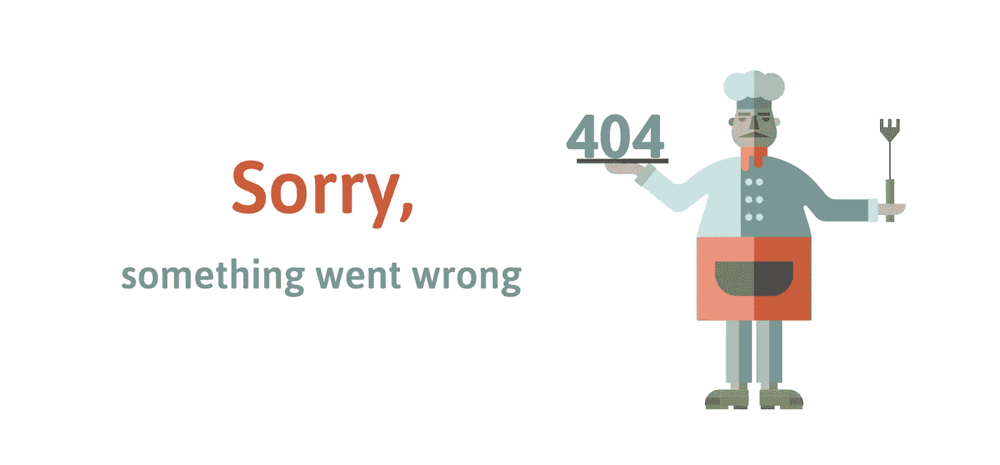

# 要避免的 10 大商业网站错误

> 原文：<https://medium.datadriveninvestor.com/top-10-business-website-mistakes-to-avoid-417e5e76a889?source=collection_archive---------9----------------------->

迟早，每个企业主都会开始考虑推出自己的商业网站。然而，如果你想让你的网站产生收入并获得客户的信任，那么你必须负责任地处理网站创建过程。小型、中型和大型企业在创建网站时都会犯一些常见的错误。今天，我们想和你分享一些企业最常犯的网站错误。

# 规划不足

公司犯的最大的网站错误之一是他们没有很好地规划网站。就像创业需要大量的计划和细节，你的网站也是如此。你需要仔细考虑你的网站上的信息来建立页面意识。这是非常重要的，因为如果你有原创的高质量的内容，这将有助于你在你的行业中建立信誉和权威，也会给你的搜索引擎带来提升。

 [## 2019 年最值得学习的编码语言——数据驱动的投资者

### 在我读大学的那几年，我跳过了很多次夜游去学习 Java，希望有一天它能帮助我在…

www.datadriveninvestor.com](https://www.datadriveninvestor.com/2019/02/21/best-coding-languages-to-learn-in-2019/) 

# 有很长的页面

如果你有一个很长的网页，你是在要求你的访问者集中注意力，考虑到他们最喜欢的猫视频或名人八卦页面只有一次点击的距离，你不太可能做到这一点。你不可能用一大页文字来吸引观众的注意力。试着把大块的文本分成小块。你也可以把你的内容分成小组，每个小组都有自己的网页。许多读者会浏览文本，寻找他们要找的信息。因此，最好使用副标题和编号列表。

# 过于关注产品和服务

虽然你创建网站是为了卖东西，但你必须有一个让你独一无二的元素。糟糕的网站设计会缺乏个性。这将非常简单，并试图出售你的产品或服务。告诉听众你个人的“为什么”，即你的产品存在的原因是什么，它满足了什么需求？你也应该告诉听众你自己的故事，关于你为什么决定开始提供你的产品或服务。所有这些信息都会给你的客户更多独特的体验，帮助你在拥挤的市场中脱颖而出。

# 不明确的行动呼吁

既然客户已经访问了你的网站，你必须告诉他们你对他们有什么要求。这可能是下载一本电子书，购买或其他任何事情，但你需要小心翼翼地推动他们采取这些行动。如果用户已经做到了这一步，这意味着你已经做了一件很好的工作，将他们的兴趣与你的设计和内容挂钩，但是现在是时候将你与客户的关系提升到下一个层次了。

# 在主页上使用幻灯片

当[为你的企业](https://skywell.software/web-development/)开发一个网站时，使用幻灯片很有吸引力，因为它在视觉上很吸引人，但它不会帮助你向用户传递你的信息。例如，观众可以开始阅读一张幻灯片上的信息，但在他们阅读和消化完上一张幻灯片之前，下一个片段就会出现。假设用户会回头阅读这些信息是一种夸张的说法。因此，最好完全避免幻灯片放映。

# 一种尺寸适合所有内容

并不是所有访问你网站的人最终都会转变成顾客，甚至会进入销售渠道的下一阶段。你应该将你的受众分成不同的类别，如冷漠受众、网站访问者、以前的购买者和其他许多群体。如果你的内容是基于受众在销售漏斗中的位置而定位的，你就更有可能看到更高的转化率和回头客。

# 忘记午睡

NAP 代表姓名、地址、电话号码，您必须始终确保所有这些信息都是最新的。如果您最近搬到了一个新的地方，更改了公司的名称或电话号码，那么在您的网站上显示最新的信息是非常重要的，这样您就不会让您的客户感到困惑。

# 低估你的博客

尽管博客对于各种规模的企业都是必不可少的，但在为小企业主创建网站时，它尤其有用，因为它有利于建立你作为思想领袖的权威和声誉。如果你能为你的观众提供有价值的内容，处理当前的问题，并包括客户可以采取的步骤来克服这些问题，他们会不断回来找你。

# 忽略内页

设计你的主页是很容易的，因为这是人们来到你的网站后首先看到的东西，但是内部页面也很重要。他们需要包含有用的信息，因为否则，他们只是空的重量。相反，使用这些页面给出关于你的产品或服务的详细而有价值的信息。

# 糟糕的导航

最常见的网页设计错误之一是让你的访问者容易迷路。如果发生这种情况，你很可能会失去他们。您可以通过在页面顶部包含一个导航栏以及一个站点地图来避免这种情况，站点地图将允许您的用户在站点的所有不同页面之间跳转。

在创建你的网站时，一定要避免这些常见的错误，这样你就能顺利地创建一个你的客户会喜欢的网站。

*最初发布于*[*https://sky well . software*](https://skywell.software/blog/top-10-business-website-mistakes-to-avoid/)*。*