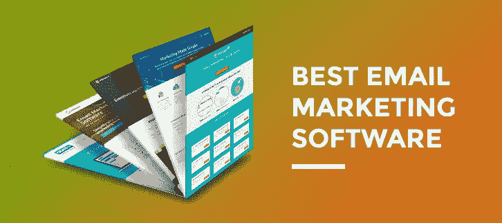
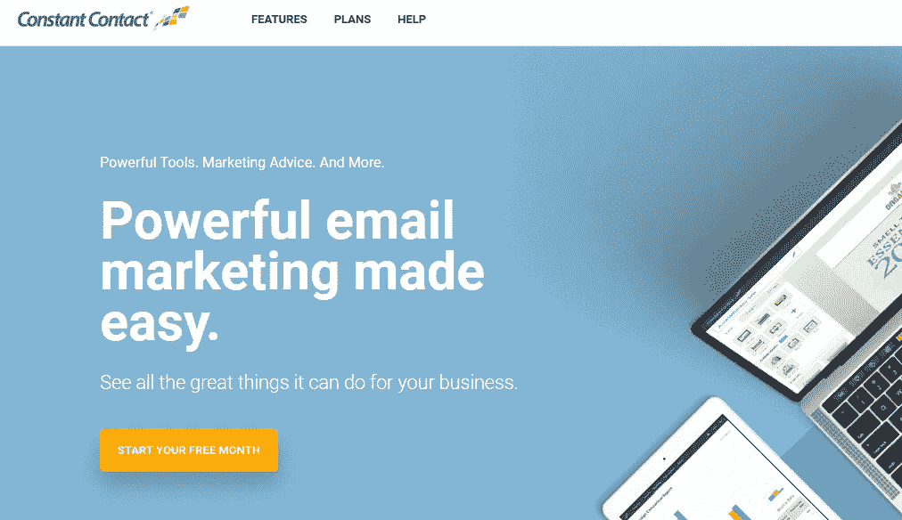
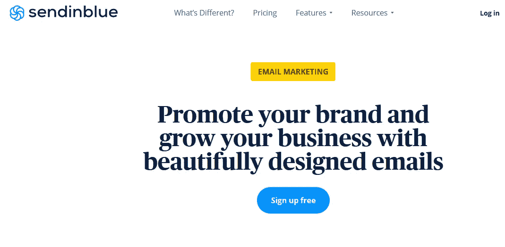
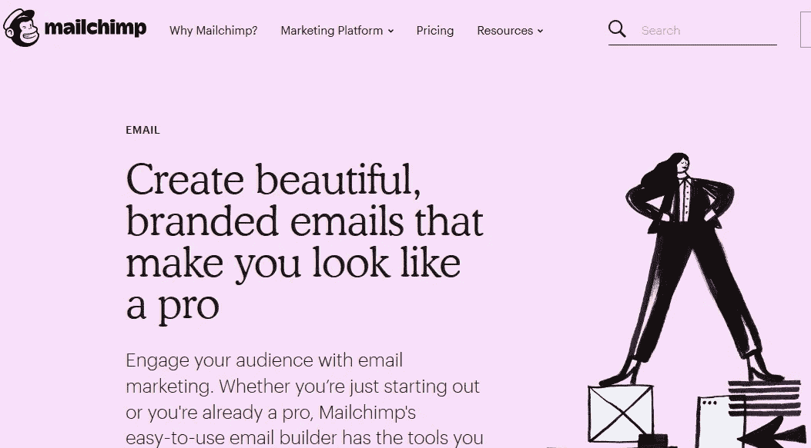
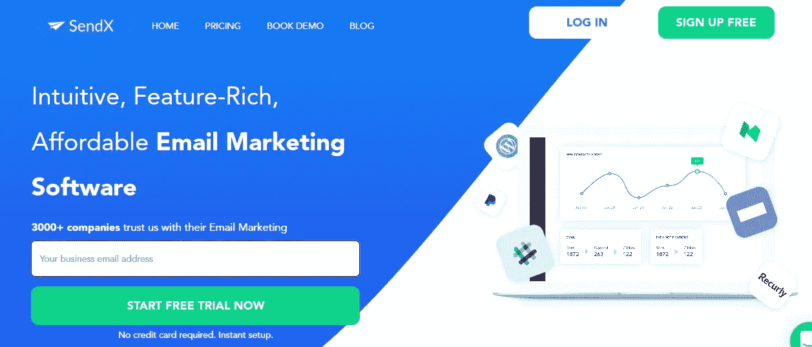
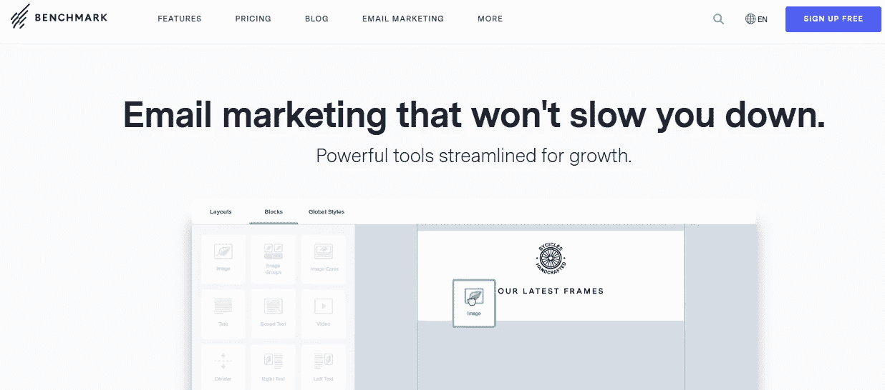
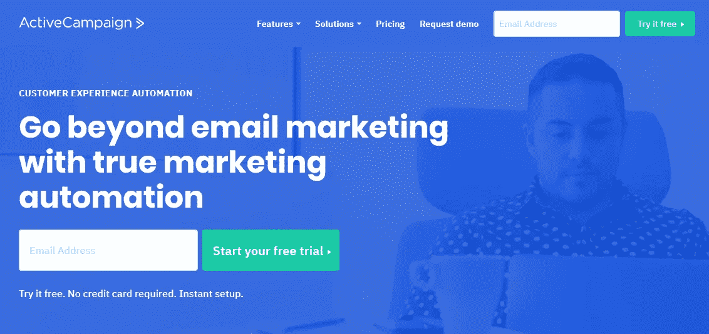
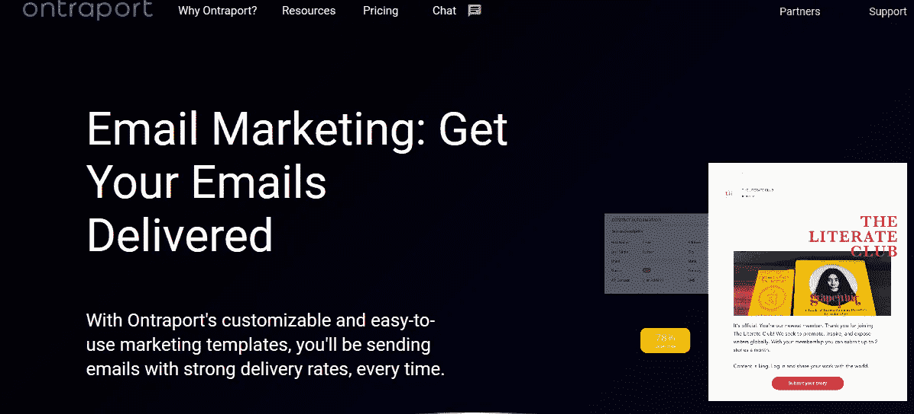
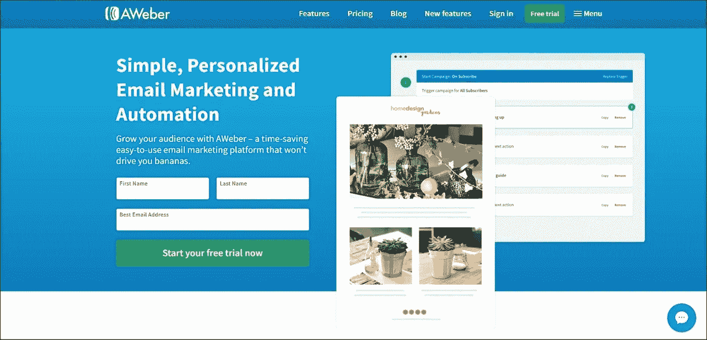
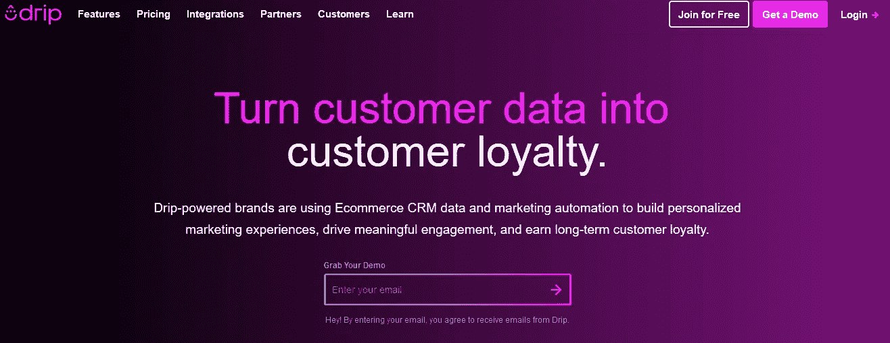

# 十大电子邮件营销软件及其使用方法

> 原文：<https://medium.datadriveninvestor.com/top-10-email-marketing-software-for-businesses-today-4c9b72840d32?source=collection_archive---------11----------------------->

由于互联网上有很多选择，找到最好的电子邮件营销软件是一项挑战。也就是说，大多数营销人员通常想要一个易于使用的工具，并提供一系列可以产生线索、增加转化率和促进销售的功能。

以下是能显著改善你的业务的 10 大电子邮件营销软件列表。

# 1.经常接触

[持续联系](https://www.constantcontact.com/global/home-page)是小型企业的完美电子邮件营销解决方案。它有几个定制选项，并与其他软件无缝集成，同时具有用户友好和直观的界面。

自 1995 年问世以来，Constant Contact 通过不断推出其他电子邮件工具所不具备的新功能而保持领先地位。例如，它支持活动管理，并有一个内置的社交媒体工具，允许你在社交网络上创建和分享优惠券。它还具有几个集成，使您能够将该工具连接到其他营销平台。

# 它是如何工作的

Constant Contact 有一个强大的拖放编辑器，可以简化电子邮件模板的创建，并设计可在每个设备上正确呈现的回复电子邮件。该工具还有一个自动化功能，允许您对受众进行细分，重新定位非开放者，并根据联系人点击的位置触发电子邮件系列。

 [## 一个企业在肚子上移动:如何照顾直觉|数据驱动的投资者

### 事实证明，直觉不仅仅是一种感觉。科学很清楚:你的直觉比你知道的更多…

www.datadriveninvestor.com](https://www.datadriveninvestor.com/2018/11/09/a-business-moves-on-its-stomach-how-to-make-allowances-for-gut-feelings/) 

内置的实时跟踪工具会通知你哪些人正在打开、点击和分享你的电子邮件。这些信息对于规划您的电子邮件营销策略至关重要。

# 最佳使用案例

持续联系电子邮件营销软件最适合小企业。

# 定价

这项服务提供 60 天的免费试用。一旦这段时间过去，你可以订阅电子邮件或电子邮件加计划。最便宜的电子邮件套餐每月 20 美元，而电子邮件加套餐起价 45 美元。如果你支付六个月，你将得到 10%的折扣。

# 2.发送蓝色

[SendInBlue](https://app.sendinblue.com/account/login) 是一款适合预算紧张的企业的电子邮件营销解决方案。它提供了一个免费的计划，尽管功能有限。该服务对市场来说相对较新；它最初专注于基于交易的电子邮件，但后来集成了 SMS，为用户提供了一系列丰富的新功能。

定价取决于发送消息的数量，而不是订户的数量。它的突出特点包括布局优化，用户管理，报告和分析。

# 它是如何工作的

SendInBlue 是一个简单的工具。您可以通过从其庞大的库中选择一个模板或从头开始创建自己的模板来快速创建电子邮件。选择模板后，您可以使用内置的个性化功能来个性化内容。

下一步是发送电子邮件；在这里，您可以根据性别、地理位置、购买历史等参数选择和细分各种联系人。最后，SendInBlue 依靠 A/B 测试技术来确保你在正确的时间发送吸引人的电子邮件，以最大限度地提高打开率。

# 最佳使用案例

SendInBlue 是邮件列表中有大量用户的企业的理想选择，因为价格取决于发送的邮件数量。

# 定价

SendInBlue 提供了四种软件包——免费版、精简版(25 美元)、基本版(39 美元)和高级版(39 美元)。包裹越贵，您可以发送的电子邮件就越多。

# 3.轮毂点

[HubSpot](https://www.hubspot.com/products/marketing/email) 是一个一站式营销解决方案，结合了 CRM、电子邮件营销自动化工具、内容管理系统和登录页面生成器。它最显著的优势是它提供了所有的工具和出色的分析功能。

# 它是如何工作的

HubSpot 是一个全面的在线营销工具，它结合了 CRM、营销和销售平台来创建数据驱动的活动。该软件包括电子邮件营销，分析，博客集营销，搜索引擎优化，等等。这些工具可以显著地将你的营销活动从不成功的冒险转变为成功的冒险。

HubSpot 套件中的一些显著功能包括电子邮件管理系统、社交媒体管理器、登录页面生成器和内容管理系统。它们与 CRM 协同工作，这样每一个新用户一旦注册到您的邮件列表中，就会被添加到客户数据库中。

# 最佳使用案例

HubSpot 是希望通过单一平台开展营销活动的企业的完美解决方案。

# 定价

该平台根据您需要的功能数量提供了多种方案。最便宜的套餐要 50 美元，而最贵的每月要 2000 美元。

# 4.MailChimp

[MailChimp](https://mailchimp.com/features/email/) 是一款易于使用的营销工具，非常适合博客作者和经营小型网站的个人。该平台的可靠性使其成为世界上领先的电子邮件软件之一，因为人们每天使用它发送超过 10 亿封邮件。

MailChimp 受欢迎的另一个原因是它不断推出新的有用的功能。其中值得注意的包括 A/B 测试、自动回复、联系人细分、第三方集成等等。

# 它是如何工作的

MailChimp 允许您通过访问大量预先设计的模板库和强大的拖放模板生成器来轻松创建电子邮件。您可以在内置的 content studio 中管理和存储您的所有图像，以便将来需要时可以快速找到它们。

该工具还允许您使用现成的电子邮件自动化或创建自己的电子邮件自动化，以便在正确的时间到达目标受众。最后，您可以使用实时分析工具监控您的营销活动，并做出数据驱动的决策。

# 最佳使用案例

大多数人使用 MailChimp 是因为它有一个免费计划。然而，它也是有用的网站所有者谁想要一个功能丰富的电子邮件营销工具。

# 定价

终身免费计划允许您每月发送 12，000 封电子邮件，并且拥有一个不超过 2，000 名用户的订户列表。另外两个计划，即 Grow 和 Pro，起价分别为 10 美元和 199 美元。

# 5.SendX

尽管对市场来说还是新鲜事物，SendX 正以显著的速度流行起来。这背后的原因是他们独特的“Opti-Send”技术，可以自动向没有打开第一封电子邮件的订户重新发送消息。

# 它是如何工作的

SendX 允许您使用其高效的弹出表单、内嵌表单和登录页面来构建和扩大您的电子邮件列表。该工具收集了大量现成的主题，并与所有网站无缝集成。

它有各种各样的自动化特性，比如滴序列消息传递、基于用户活动的自动化、受众细分等等。

最突出的功能是点击热图功能，它显示了大多数读者点击你的电子邮件的位置。如果你正在进行电子邮件营销活动，这些信息是至关重要的。

# 最佳使用案例

SendX 是使用电子邮件发送推销的营销人员的最佳选择。通过自动重新发送未打开的邮件，您可以提高打开率和转化率。

# 定价

来自 SendX 的最便宜的计划每月花费 29.99 美元。与其他提供商不同，SendX 也接受加密货币支付。

# 6.基准

[Benchmark](https://www.benchmarkemail.com/) 有一个简单易用的界面，即使对初学者也很友好。此外，它有很好的支持和电子邮件营销工具的基本功能。它的突出特点是拖放式生成器，允许你定制电子邮件。

# 它是如何工作的

与其他电子邮件软件类似，Benchmark 具有强大的拖放功能，可以根据您的喜好定制邮件。它还支持实时编辑，因为你可以进行编辑，并在你键入电子邮件时查看它们的效果。

如果你擅长 HTML，你可以利用内置的代码编辑器从头开始设计你的电子邮件。

# 最佳使用案例

Benchmark 最适合想要一个工具同时与多个客户机通信的初学者。

# 定价

该工具有两种方案:免费和专业，每月 13.99 美元。如果你选择按年计费，你每月可以节省 2 美元。

# 7.主动运动

ActiveCampaign 是一种综合营销，旨在帮助营销人员发送少量但有效的电子邮件。它依靠一个 if/then 逻辑来创建自动电子邮件发送活动。其他有用的功能包括用户细分、发送短信、销售线索和联系人评分。

# 它是如何工作的

ActiveCampaign 是一个一站式营销软件，结合了电子邮件营销、销售和 CRM、营销自动化和机器学习等方面。

电子邮件营销软件的一些最显著的功能包括多用户编辑、第三方集成、移动优化、可控投递、分析和受众细分等。

# 最佳使用案例

ActiveCampaign 非常适合需要集成 CRM 软件的复杂自动化工具的高级用户。

# 定价

该工具提供了四种计划:精简版、高级版、专业版和企业版。前三款的起价分别为 15 美元、70 美元和 159 美元。最后一个计划是 Enterprise，起价为每月 279 美元。有一个 14 天的免费试用期，在此期间你可以发送多达 100 封电子邮件。

# 8.翁特拉波特

[ontrapport](https://ontraport.com/)是一款电子邮件营销工具，拥有庞大的用户群体，并不断更新以推出新功能。

# 它是如何工作的

与 HubSpot 类似，Ontraport 允许您从一个地方管理整个数字营销活动。它从 CRM 开始，所有客户的详细信息都存储在那里。

内置的电子邮件软件具有定位和调度功能，确保您的邮件在正确的时间送达正确的客户。你也可以用短信补充你的营销活动。

# 最佳使用案例

该工具是专为小型利基业务，如健身教练和美容爱好者。

# 定价

Ontraport 有一项计划，每月 79 美元起，最多可联系 1000 人。如果你想把信息发送给更多的观众，你将不得不付更多的钱。

# 9.AWeber

AWeber 是已经存在了近 18 年的开创性电子邮件营销解决方案之一。这也是包含自动回复功能的第一选择之一。该工具具有丰富的功能，包括拖放式电子邮件生成器、庞大的模板库以及与第三方平台的多种集成。

# 它是如何工作的

突出的特点是自动回复，其主要目标是简化电子邮件营销过程。它允许你起草后续的电子邮件，在预先指定的时间间隔发送。

此外，您还可以享受无限的后续消息，为您的网站创建网页表单，详细的跟踪和分析，以及定制的网页表单模板。

# 最佳使用案例

AWeber males 提供的出色支持和可靠性非常适合希望简化电子邮件营销活动的小型企业。

# 定价

最便宜的方案是每月 19 美元，最多允许 500 名用户。随着用户数量增加到 25，000 人，成本会逐渐增加，超过这个数字，你就必须从公司获得定制报价。

# 10.充满

[滴滴](https://www.drip.com/)是一个新推出的电子邮件营销平台，主要面向博客作者、营销人员和电子商务网站所有者。它有一个用户友好的界面和多种功能，帮助您的电子邮件脱颖而出。

例如，你可以将你的信息分段，瞄准新客户和回头客，放弃购物车的访客，以及没有点击邮件链接的人。它还允许营销人员通过 SMS 发送跟进消息。

# 它是如何工作的

滴滴让你对目标客户的兴趣和偏好有了无与伦比的洞察。它具有强大的电子商务 CRM 功能，使您能够弥合客户需求和您提供的服务之间的差距。

你对顾客了解得越多，你就能更好地个性化体验。

# 最佳使用案例

对于销售大量产品的营销人员来说，如电子商务网站，滴滴是理想的解决方案。

# 定价

滴滴有四种不同的计划，所有这些计划都允许你发送无限数量的电子邮件——唯一的限制是你的邮件列表上的订户数量。它们包括入门版(免费)、基础版(49 美元)、专业版(99 美元)和企业版(定制)。

# 结论

市场上的大多数[电子邮件营销](https://mediaonemarketing.com.sg/newsletter-marketing-in-singapore/)软件都提供类似的服务。选择合适的工具时，最重要的考虑因素是您的预算和营销目标。明智的做法是选择一个提供免费试用的选项，这样你就可以在付费前评估它的适用性。

你知道任何其他电子邮件营销软件值得在这个列表中的位置吗？请随时与我联系。我们还提供专业的数字营销服务和咨询。