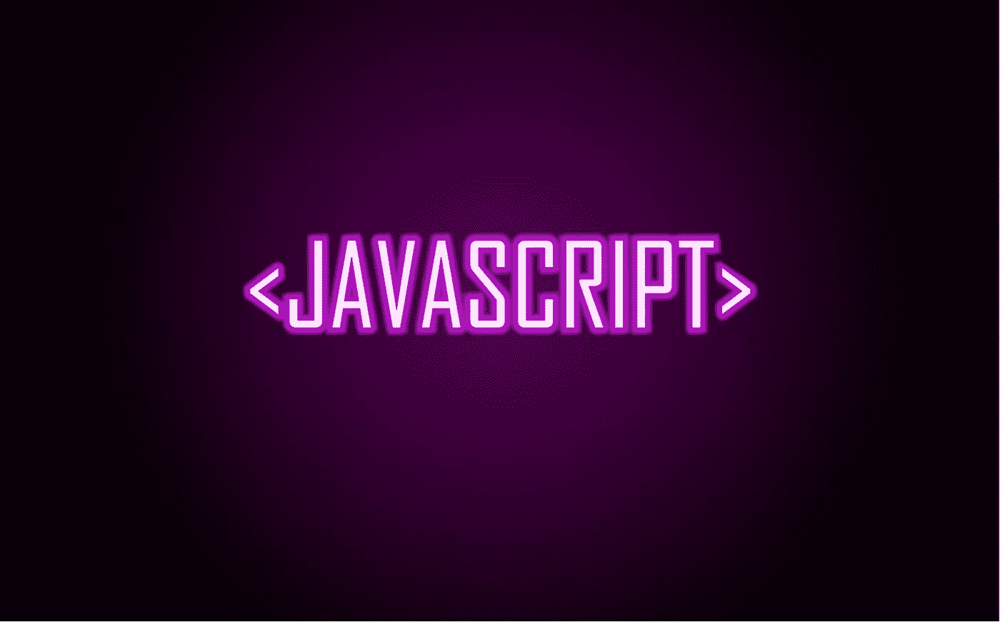

# 2019 年十大 JavaScript 测试和调试工具

> 原文：<https://medium.datadriveninvestor.com/top-10-javascript-testing-and-debugging-tools-in-2019-76862733b4b2?source=collection_archive---------4----------------------->

我们都明白测试 JavaScript 代码的必要性。这是使浏览器内部一切正常工作的唯一方法。在测试 Node.js、Angular、React 和其他框架时，有很多 JavaScript 测试工具可供选择。在我们进入工具本身之前，有必要了解有许多类型的测试，例如:

*   单元测试——这是对单个组件/单元进行测试的地方，以确保每个组件/单元都能正常工作。

 [## 2019 年最值得学习的编码语言|数据驱动的投资者

### 在我读大学的那几年，我跳过了很多次夜游去学习 Java，希望有一天它能帮助我在…

www.datadriveninvestor.com](https://www.datadriveninvestor.com/2019/02/21/best-coding-languages-to-learn-in-2019/) 

*   集成测试——将单个单元作为一个单元进行组合和测试。该测试的目的是确保所有独立组件按照预期相互作用。
*   功能测试——根据功能需求对整个系统进行测试。这是通过将一些值输入到所有功能/特征中并观察输出将会是什么来完成的。

虽然还有许多其他类型的测试，但是让我们来看看一些用于测试 JavaScript 的工具。

# 十大 JavaScript 测试工具

# 1.自动话频警报器(automatic voice alarm)ˌ视听教具(audiovisual aids)

AVA 是测试 JavaScript 的好选择，原因有很多。您可以使用它来执行 Node.js 代码的测试。它有一个简洁的 API，提供对新语言的支持和许多其他好处。测试人员喜欢这个工具，因为它提供了极好的速度，所以他们可以一次运行许多测试，并且测试语法简单。

# 2.cumber.js

Cucumber.js 可以在 Node.js 版本和现代 web 浏览器上运行。它对于测试来说是很棒的，因为它提供了团队成员之间简单而及时的交流，以及用“简单的语言”运行自动化测试的选项，也就是说，它可以很容易地被参与测试的任何人阅读。然而，这种通信可以改进，因为 Cucumber 是一个用于执行测试的可执行文件，在全局安装时将无法工作。

# 3.酶

这是 React.js UI 库的测试工具。它使开发人员能够根据输出来调整和模拟运行时。它的 API 与 jQuery 非常相似，用于文档对象建模(DOM)的修改和遍历。也可以使用酶来测试反应天然特征。

# 4.因果报应

这是一个很棒的 JS 测试工具，因为它允许在许多浏览器中执行代码，包括移动浏览器。Karma 最显著的优势之一是不需要设置一大堆配置。相反，开发人员可以简单地创建代码，并立即从测试中获得反馈。

# 5.茉莉

Jasmine 通常被称为“行为驱动的”JavaScript 测试框架。它不依赖于任何其他 JavaScript 框架，也不需要 DOM。它的语法允许简单的测试编写，并且它对于定制网站编程、涉及 Node.js 的项目以及几乎所有其他在 Java 上运行的东西都非常有用。

# 6.玩笑

Jest 被许多行业专业人士视为一个全面的 JavaScript 调试工具。事实上，它甚至不需要配置。它可以直接开箱即用。可以一次进行许多测试，先进行以前失败的测试。Jest 兼容 Angular、Node.js、Babel 和 Vue 等流行的 JavaScript 技术。

# 7.卢娜

关于 Luna 有许多不同的观点，因为它提供了许多优势，例如在几分钟内运行单元测试的能力，它提供代码覆盖报告而不需要安装任何额外的模块，也不需要任何配置。然而，它不提供 transpiling，这意味着你将不能使用 CoffeeScript 或 TypeScript，也不支持旧的浏览器。

# 8.摩卡

Mocha 提供了许多可以在 Node.js 和浏览器上运行的特性。最重要的是，它让开发人员能够简单方便地测试异步代码。其中一个原因是因为测试是连续执行的，这允许准确和灵活的报告，同时仍然能够映射未被注意到的异常。

# 9.量角器

量角器是一个测试 Angular.js 及其继任者 Angular 的综合框架。测试是针对浏览器中的应用程序进行的，量角器与应用程序进行交互，就像普通人一样。

# 10.库奈特

这是一个使用 jQuery 的项目的单元测试框架。有趣的是，QUnit 是由投资者 jQuery 的 John Resig 创建的。通过可用于测试任何 JavaScript 代码的可扩展 API，它使用起来既快速又简单。如果测试失败，QUnit 会提供快速而详细的反馈，以便尽快解决问题。

无论您选择什么工具，都要确保团队的所有成员都能舒适地使用它，因为即使是一个在测试过程中没有被注意到的 bug，如果被发送给用户，也会对您的产品造成灾难性的影响。进行自动化和手动测试都是可取的，因为有许多可能存在 bug 的地方，所以让人类测试人员参与到这个过程中也是一个好主意。您对工具的选择也将取决于您独特的项目需求，因为您可能需要某些特性，比如 transpiling、plain language testing 等等。因此，要仔细评估所有的选择，因为在过程中更换工具可能会很麻烦。

*最初发布于*[*https://sky well . software*](https://skywell.software/blog/top-10-javascript-testing-and-debugging-tools-in-2019/?fbclid=IwAR3umztTmTBWe2O2dxJutfwZEWRjQ-fCqCNf1izVbk78-laws2Mpegy7Gcg)*。*