# 发展业务的 11 大必备数字营销工具(2022 年 5 月 2 日更新)

> 原文：<https://medium.datadriveninvestor.com/top-10-must-have-digital-marketing-tools-to-grow-your-business-c1b8c79f7345?source=collection_archive---------3----------------------->

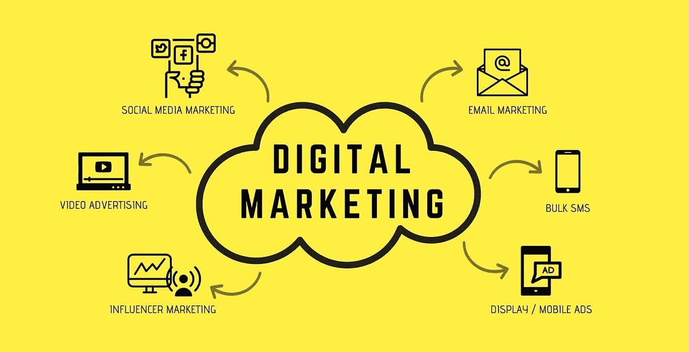

随着全球互联网用户数量的稳步增长，每个想要保持竞争力的企业都必须开展全面的数字营销活动。缺乏在线展示意味着你错过了向互联网展示你的业务的机会。

数字营销活动的第一步是制定战略，如 [SEO](https://mediaonemarketing.com.sg/seo-agency-singapore/) 、 [SEM](https://mediaonemarketing.com.sg/search-engine-marketing-sem/) 、[电子邮件营销](https://mediaonemarketing.com.sg/creating-great-email-marketing-campaigns-singapore-market/)和[社交媒体营销、](https://mediaonemarketing.com.sg/social-media-marketing-smm-singapore/)等等。然而，管理所有这些可能相当具有挑战性。这解释了投资数字营销工具以帮助简化营销流程的必要性。

 [## 一个企业在肚子上移动:如何照顾直觉|数据驱动的投资者

### 事实证明，直觉不仅仅是一种感觉。科学很清楚:你的直觉比你知道的更多…

www.datadriveninvestor.com](https://www.datadriveninvestor.com/2018/11/09/a-business-moves-on-its-stomach-how-to-make-allowances-for-gut-feelings/) 

大多数数字营销工具要么免费，要么价格适中。即使你经营一个小企业，你也可以投资这些平台来增加你的影响力和提升品牌知名度。

以下是发展我们业务的十个必备数字营销工具。

# 1:宣传片

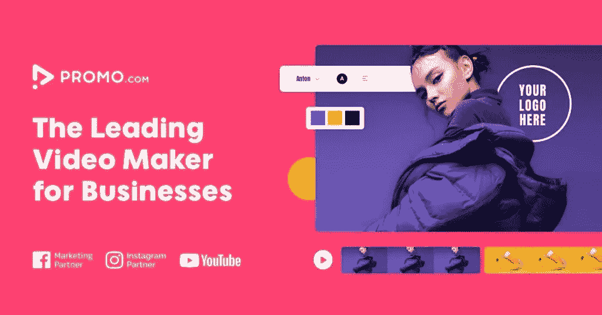

Promo 是一个[在线视频制作工具](https://promo.com/for/online-video-maker)，你可以在其中为你的视频营销策略制作视频。借助 Promo，任何人都可以轻松制作视频广告、产品视频、社交媒体视频等等。Promo 具有易于使用的功能，为您的视频提供现场品牌，以及由 Getty Images 和 iStock 支持的大型在线媒体库，因此您永远不会用完内容。促销有助于扩大业务范围，提高品牌知名度，吸引更多的顾客。

**最佳使用案例**
宣传片是推广业务和推进营销战略的最佳视频制作工具。

**定价**
Promo 有免费试用，但也有商业和代理计划可以尝试。定价如下:[https://promo.com/pricing](https://promo.com/pricing)

# 2.松弛的

[Slack](https://slack.com/) 为您的数字营销团队提供社交网络平台。该工具允许您向个人以及所有团队成员发送消息。此外，您可以将所有内容组织到频道中，这使您能够快速到达您的目标受众。如果你想沉浸在冗长的谈话中，你可以开始一个线程来避免混淆信息。

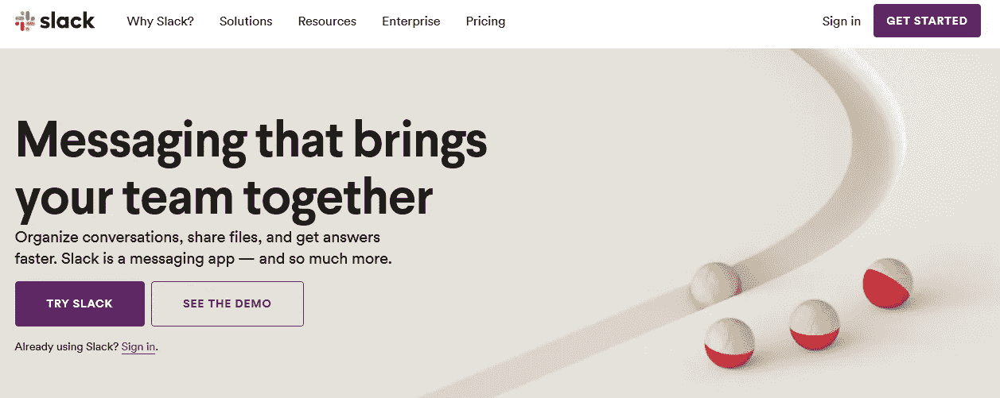

除了消息传递，Slack 还允许你共享文档和多媒体文件。它是基于云的，这意味着你可以从任何设备访问账户。如果您愿意，也可以访问历史聊天记录。

# 最佳使用案例

Slack 是规划你的数字营销策略的完美工具。

# 定价

最便宜的套餐是每月 8 美元。

# 3.阿尼莫托

视频是最有效的营销策略之一。 [Animoto](https://animoto.com/) 是一款制作专业视频的优秀工具，可以帮助你发展业务。

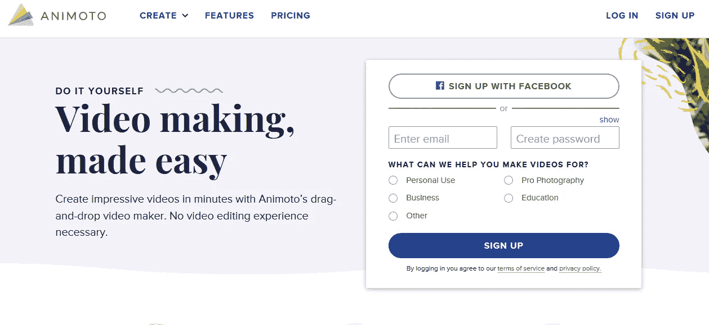

你不需要成为一个有经验的视频编辑来使用这个工具。有大量的模板可供选择，访问 Getty Images 意味着您不必浪费时间寻找补充的视觉内容。完成后，只需点击一个按钮，您就可以将视频发布到社交网络。

# 最佳使用案例

Animoto 是制作营销视频和演示的理想平台。

# 定价

该计划对公司来说起价为每月 33 美元。

# 4.Ubersuggest

成功的 SEO 活动最重要的方面是使用正确的关键词。 [Ubersuggest](https://neilpatel.com/ubersuggest/) 通过标记最有力的关键词，确保你从搜索引擎优化工作中获得最大收益。

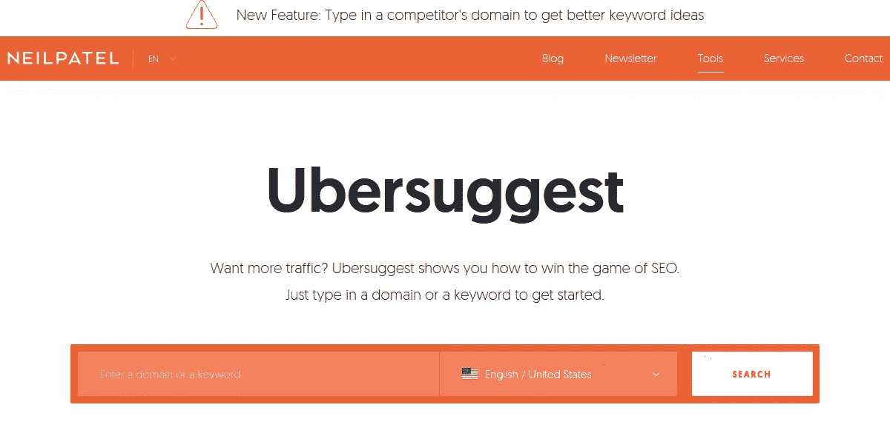

例如，如果你的目标是营销电子产品，该工具将建议你的目标受众可能在搜索引擎上使用的所有长尾短语。

# 最佳使用案例

想要在搜索引擎结果第一页排名，Ubersuggest 是必备。

# 定价

它是免费的！

# 5.脸书现场直播

直播是联系客户并让他们参与到个人层面的明智方式。例如，您可以使用直播视频来回答问题，展示新产品，并解释您的产品如何工作，等等。

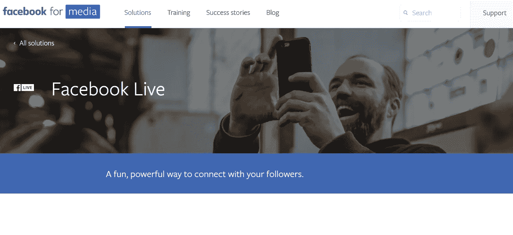

脸书直播是增加你社交媒体页面参与度的有效方式，可以立即接触到数百万人。

# 最佳使用案例

脸书直播允许你向你的追随者直播视频。

# 定价

它是免费的！

# 6.Hootsuite

Hootsuite 是简化社交媒体营销活动的最佳工具。大多数企业通常在多个社交平台上都有业务，这使得管理成为一项挑战。

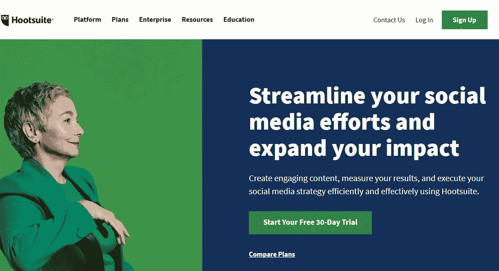

Hootsuite 是一个基于网络的应用程序，允许你从一个地方管理多个社交媒体档案。你可以看到推特和脸书上的热门话题，并做出相应的反应。该应用程序还允许你安排职位。

# 最佳使用案例

Hootsuite 是管理社交媒体活动的有用工具。

# 定价

最便宜的方案是每月 29 美元，一个用户最多有十个社交档案。

# 7.前导页

登陆页面的设计决定了访问者是否会返回到搜索结果或者点击查看你的产品。 [Leadpages](https://www.leadpages.net/) 的主要目标是确保你的登陆页面的外观吸引用户，并鼓励他们浏览你的网站。

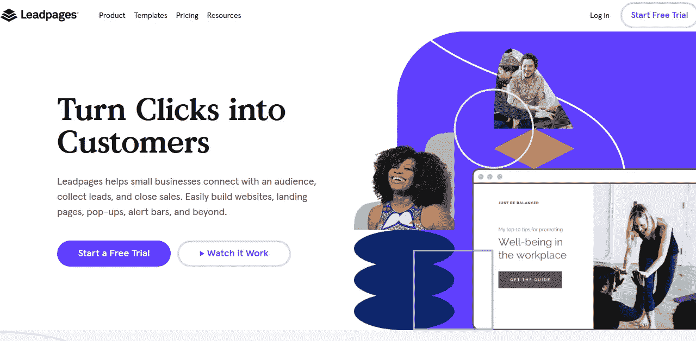

这个工具的突出特点是它能够创建移动友好的页面，并优化以提高转化率。此外，它有几个模板和拖放功能，允许您自定义登录页面，以适应您的喜好。

# 最佳使用案例

如果你的登陆页面没有产生足够的转化率，你需要在 Leadpages 上投资。

# 定价

整个软件包，包括登录页面生成器、模板和转换工具包，起价为每月 25 美元。

# 8.MailChimp

[MailChimp](https://mailchimp.com/features/email/) 是简化你的电子邮件营销活动的无价工具。它具有改善你的电子邮件布局，管理你的邮件列表，跟踪有用的指标，并生成重要报告的功能。内置的模板易于使用，时尚，有吸引力的图像和行动呼吁。

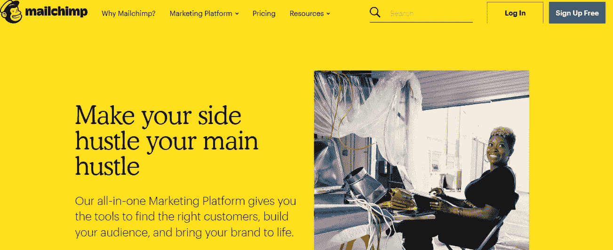

然而，最令人印象深刻的功能是告诉你邮件被退回的原因。这个工具还允许你发送无限数量的电子邮件。

# 最佳使用案例

MailChimp 对于同时向几个用户发送大量电子邮件非常有用。

# 定价

基本计划每月花费 10 美元。

# 9.Zendesk

没有一个可靠的客户支持系统，你就无法成功地开展营销活动。Zendesk 允许您整合所有客户支持渠道，包括电话、短信、聊天、电子邮件和社交媒体。该平台将来自客户的所有信息发送到一个中央仪表盘，您可以在那里关注他们。

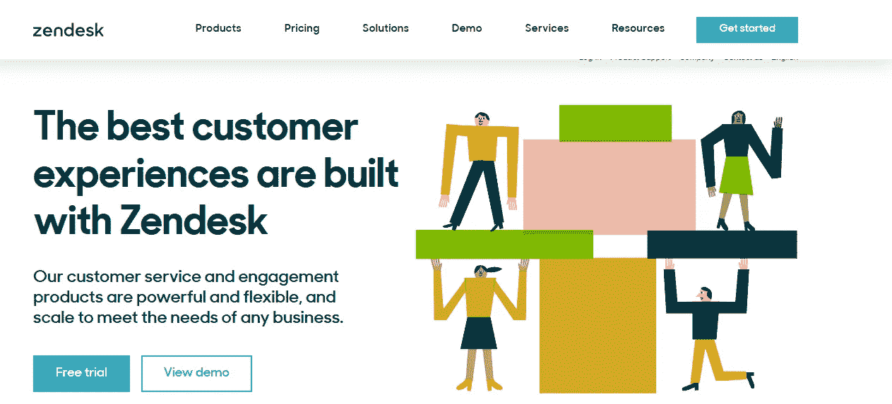

如果您的网站没有客户支持工具，Zendesk 提供了几个应用程序，您可以嵌入这些应用程序来引入这一功能。这项服务依靠机器学习来组织和解决客户问题。

# 最佳使用案例

Zendesk 允许您有效地组织、管理和解决客户问题。

# 定价

最便宜的方案是每个客户支持代理每月 5 美元。

# 10.谷歌分析

Google Analytics 可能是追踪数字营销活动关键指标的最全面的工具。你用得越多，它就越能有效地为你的网站产生准确的分析。

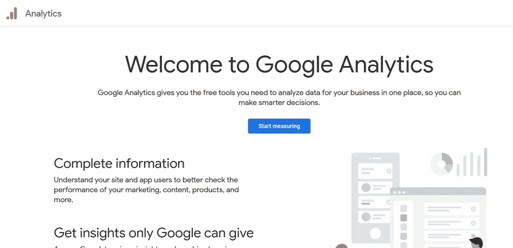

您可以从这个工具中获得一些值得注意的统计数据，包括访问者统计数据、表现最好和最差的网页等等。

# 最佳使用案例

谷歌分析确保你运行一个数据驱动的营销活动，并减少资源浪费。

# 定价

月访问量不超过五百万的网站是免费的。

# 11.Canva 商务

[Canva](https://www.canva.com/pro/) 是一个具有强大拖放功能的平台，允许您创建令人惊叹的图像、图标、徽标和信息图表等。

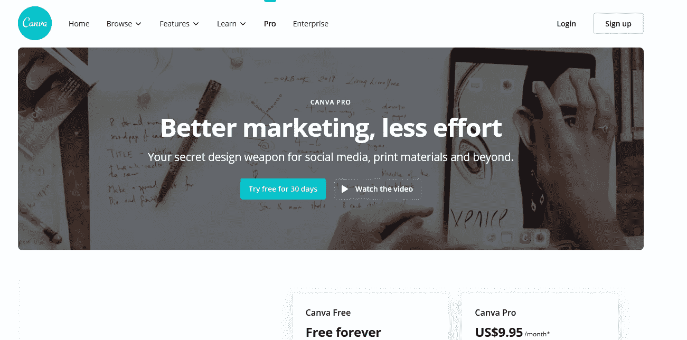

该工具提供了一个巨大的图像和模板库，消除了对专业设计师的需求。

# 最佳使用案例

Canva 对于创建美观的图像很有用。

# 定价

计划从零费用开始，团队每月支付 12.95 美元，企业必须要求定制价格。

# 结论

除了上面提到的工具，还有很多[数字营销](https://mediaonemarketing.com.sg/digital-marketing-singapore-ultimate-guide/)工具。选择正确工具的最佳方式是专注于与您的公司结构和业务目标相匹配的工具。也就是说，上面提到的选项是一个很好的起点。

获取更多专业技巧，了解如何使用这些工具进行[数字营销](https://mediaonemarketing.com.sg/digital-marketing-services/)并获得最大投资回报。