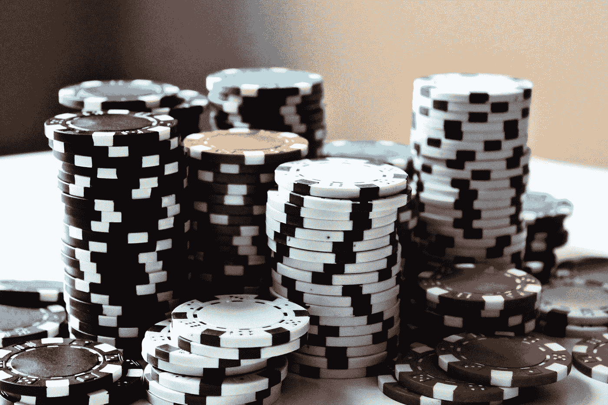

# 交易和投资的 10 大扑克概念

> 原文：<https://medium.datadriveninvestor.com/top-10-poker-concepts-for-trading-and-investing-4a6ec9eaac07?source=collection_archive---------0----------------------->

## 扑克理念如何为市场中的风险回报决策提供指导

Photo by [Michał Parzuchowski](https://unsplash.com/@mparzuchowski?utm_source=medium&utm_medium=referral) on [Unsplash](https://unsplash.com?utm_source=medium&utm_medium=referral)

扑克概念对于发展市场交易和投资决策所需的思维过程是非常宝贵的。事实上，许多金融机构都有浓厚的扑克文化，许多富有的金融家对扑克有浓厚的兴趣。一些例子:

*   投资公司 Susquehanna International Group 举办内部扑克锦标赛，甚至将扑克作为招聘和雇佣流程的一部分。他们的统计套利主管 Bill Chen 甚至写了一本名为“扑克数学”的书，并在现场锦标赛中赢得了大约 200 万美元的奖金。

 [## 算法交易的机器学习|数据驱动的投资者

### 当你的一个朋友在脸书上传你的新海滩照，平台建议给你的脸加上标签，这是…

www.datadriveninvestor.com](https://www.datadriveninvestor.com/2019/01/30/machine-learning-for-stock-market-investing/) 

*   绿光资本的 David Einhorn 成功参加了多场扑克锦标赛。他甚至出现在 ESPN 的电视活动中，比如《一滴之大》( Big One for One Drop ),它有很酷的百万美元买入费。
*   奥巴马总统之前传言的美国驻法国大使人选是不良债务对冲基金经理亿万富翁马克·拉斯利，他在私人住宅经营地下扑克游戏。

我的信念是，任何人如果希望在生活中获得全面的教育，以此作为最终目标，或者作为在商业或投资等冒险领域做出更好决策的实践教育，都应该学习扑克，掌握扑克理论的工作知识，并至少玩几百个小时。

不必了解所有的理论，但拥有更一般的扑克基础理论的工作知识，如著名扑克理论家 **David Sklansky 的“扑克理论”和“无限注德州扑克:理论与实践”**极大地丰富了思维，即使不一定是在扑克环境中。同样，不一定要成为一个老千或冠军，只要有玩游戏的经验就可以看到这些理论上的想法在行动。

**我将在这里考虑一些重要的扑克概念，以及它们如何成为思考交易或投资情况的有用工具，我将包括一个“市场背景”的解释。**此分析主要集中在“无限德州扑克”(NLHE)，因为这是最常见和最受欢迎的扑克形式，但此处的想法稍加修改即可适用于所有形式的扑克，因为它们在涉及风险和回报的决策方面有很大的重叠，且信息不完整。可能有几十个扑克概念，但我将只选择前 10 个，否则这篇文章可能会成为一本完整的书。

# 1.要有耐心和选择性

当你不在被迫下注的盲注位置时，你不需要拿筹码冒险，也没有等待的奢侈。这对你来说是一个优势，因为你可以简单地等待最有可能成功的最好的牌。为什么不利用这一点呢？

有时，即使你有一个很好的赌注，你可能会放弃它，这样你就可以在另一个更大的回报和更小的风险下一个更好的赌注。这种等待好牌并只下最好的注的策略是你的标准策略。这些起手牌是像 a-a 或 k-k 这样的大同花对子，以及像 a-k 或 a-q 这样的大连牌。在下一轮中，好牌可能是两对或更大，和/或当其他玩家没有显示实力时。

## 市场背景

不要只是盲目投资。等待非常好的高概率下注，并确保你确切知道你为什么下注。当你下注时，你希望决定非常容易，有尽可能大的“安全边际”。

> “投资的诀窍就是坐在那里，看着一个又一个项目过去，然后等待一个合适的项目。”—沃伦·巴菲特
> 
> "股票市场旨在将资金从积极参与者转移到病人身上."—沃伦·巴菲特

# 2.用像彩票一样的回报玩廉价牌

玩得太安全，只等待好牌，实际上可能太不愿意承担风险，这本身就是一种风险。很少有人一开始就有很强的牌，而且他们在多轮下注中都保持很强的牌。此外，你可能会因为玩得太紧而输钱，因为其他人可能会利用这种策略更频繁地下注，而不会在你有好牌时跟注。

为了应对这种情况，你可能想尝试用很弱但未来潜力很大的牌进入底池。例如，在翻牌前有 33 或 55 这样的小口袋对子，你甚至可以跟注相对于有效筹码数量的小加注，尤其是在底池中有多名玩家的情况下。你不会马上赌这手牌是最好的牌，尽管这种可能性很小，但你会赌如果你打出第三张牌，拿到一个非常强的三张一类的“套”，这手牌就会变成一手大牌

我们希望将这些类似彩票的收益限制在那些具有良好潜力的牌上，尽管理论上任何随机的两张牌都可能赚大钱。这意味着要避免像 72 花色这样的手牌只玩小对子。

你不会经常赢，但是如果你真的赢了，你会赢很多。

## 市场背景

如果你可以通过天使投资或在公司非常便宜的时候廉价进入早期公司，即使你输了也不会损失太多，但你有巨大的收益。期权也是如此，但是期权本身由于隐含的波动率溢价和时间价值而被高估了。

重要的是要知道，简单的便宜并不意味着好的赌注。它必须便宜，有光明的未来。因此，在口袋对子中，你必须多付一点，比如小加注，这类似于一个价格合理的好公司，可能是 72 同花，可能是价格合理的好公司，也可能是差公司。

> “以合理的价格收购一家优秀的公司，远胜于以合理的价格收购一家普通的公司。”
> 
> —沃伦·巴菲特

Photo by [Loic Leray](https://unsplash.com/@loicleray?utm_source=medium&utm_medium=referral) on [Unsplash](https://unsplash.com?utm_source=medium&utm_medium=referral)

# 3.风险比回报更重要

即使你玩的是好牌，并做出了很好的决定，你也必须小心，下足够小的注，这样你就可以在短期的坏运气中幸存下来，进入长期，而长期可能是相当长期的，在几个月或几年的数万手牌中。

这些意味着不要在任何一场游戏中花费太多的资金。

## 市场背景

控制下跌损失实际上可能比盈利更重要。

*   亏损 25%需要 33%的回报才能实现平衡
*   50%的损失需要 100%的回报才能平衡
*   亏损 75%需要 300%的回报才能实现平衡

> *“规则一:永远不要亏钱。规则 2:永远不要忘记规则 2。”*
> 
> *——*沃伦·巴菲特

# 4.许多小单打还是一个大全垒打？

请注意你是在玩赢小注和小底池的游戏，还是在玩赢大注的游戏。小底池可能意味着每个人都在玩好牌，更表明谨慎的紧注被动游戏。大底池可能意味着每个人都在寻求一次大赌博。这两种策略都不太好，只是表明你实际上在玩哪种游戏。

## 市场背景

考虑你的偏好和技能是否更适合以下哪种情况

*   背景 1:较小的赌注，活跃的交易，更多的头寸，更多的证券，在更短的时间内？
*   背景 2:更大的赌注，长期持有，更少的头寸，更少的证券，更长的时间？

重要的是，你不要在上下文 1 中做决定，但同时要根据上下文 2 的标准进行跟踪和判断，反之亦然。

# 5.表格选择

你总是试图在你的扑克游戏中获得“相对”优势，因为绝对优势在实践中是无关紧要的，因为你在一张牌桌上最多只能和 9 个人玩，而绝对优势可能是不可能的或不可取的。

即使你是世界上前 10 名最好的扑克玩家之一，如果你和接下来的 9 名世界一流的扑克玩家坐在一起，这也可能不是一场好游戏。以相关的方式，即使你是世界上第 50，000 名最好的玩家，而牌桌上的每个人都接近第 500 万名最好的玩家，你也处于非常有利的地位。

你想尽可能把自己放在最有利的位置，这样你就能最好地利用你的技能，你的决定会更容易也更重要。

## 市场背景

也许这可能涉及流动性差的市场或有一个主导者可以获得更好信息的市场。

你自己目前的头寸只是问题的一部分，因为当存在一个大得多的参与者，可以使用大得多的资本来控制订单簿，从而改变价格或流动性水平时，进出头寸的交易成本可能会非常高。

换句话说，在你进入市场之前，要知道你要进入什么市场，这样你就知道周围的环境。

# 6.情绪控制比知识更重要

如果你情绪失控，处于“倾斜”状态，即使拥有世界级的天赋和理论知识也是无关紧要的扑克至少 80%是精神和情感的，20%是机械的、风险回报决策和数学的。

从我个人的经验来看，我能想到的最好的类比是，在我面前有一个红色的大按钮，上面写着:“按我。”如果我不按，我就赢了。但是随着时间的推移，我遇到了非常烦人或有压力的情况，例如即使玩得好也要输钱，或者玩得不好，这时我就有越来越强烈的冲动去按下那个红色的大按钮。这个按钮代表了释放和简单“赌博”的不受约束的欲望，而克制按下它代表了坚持一个有纪律的过程。

如果事实证明你无法控制自己，通常会做出愚蠢的举动，并损失很多，那么你今晚离开很重要。

## 市场背景

你可能想设定一天的最大亏损，如果你在积极交易，简单地平仓并接受已实现的亏损，如果你是买入并持有投资，停止看市场并接受未实现的亏损。

当你精神状态不好时，当涉及到更多的钱时，你想把自己从做出更多糟糕决定的境地中解脱出来，你可以把自己挖得更深。

> “用快乐的心和强大的精神去战斗。”
> 
> 詹姆斯·马蒂斯将军，USMC

# 7.底池赔率与隐含赔率

**底池赔率**定义为底池大小与您所面临的赌注之间的比率。直觉上，如果底池很大，比如$5000，而你只需要跟$100 摊牌，那么底池赔率就是$5，100 到$100 或 51 比 1。如果同一底池你必须跟注$5，000，那么底池赔率是$10，000 比$5，000 或 2 比 1，这显然更糟。

**隐含赔率**是指如果你打了听牌，你在未来几轮下注中的赔率。因此，如果你有很好的机会凑成一手牌，比如听顺子和同花听牌，那么你可以在当前的一轮下注中跟注，因为你知道这手牌很可能是较弱的一手牌，很有可能在以后凑成一手强牌或不可战胜的牌。

还有一个问题是**“反向”隐含赔率**，当你知道另一个玩家可能会跟注，试图抓住一张未来的牌。在这种情况下，你要下足够大的注，这样他们就不值得看到下一轮。

每个决定只有在回报和风险的背景下才是好或坏的。如果你有一个不错的底池或隐含的赔率，任何赌注都是好的，只要它足够小。

## 市场背景

现在你的赌注成功的概率是多少？这不是一家公司是一个明确的赢家还是输家，而是你现在实际支付的价格与你现在能赚多少(赔率)或在有利的发展情况下未来能赚多少。

# 8.位置至关重要

扑克是轮流玩的，位置较晚的玩家比位置较早的玩家更有优势。直觉上，这是基于你对他人行为的观察。

## 市场背景

在市场背景下，你可能要等到更多的信息，如大型机构已经采取了立场，给出更多的好指标，采取同样的赌注。

在押注合并和收购时，你可能希望等到它已经宣布，而不是当它是传言或非常可能的时候。这给了你一个有效的“最后位置”,以便以后采取行动。

Photo by [Amanda Jones](https://unsplash.com/@amandagraphc?utm_source=medium&utm_medium=referral) on [Unsplash](https://unsplash.com?utm_source=medium&utm_medium=referral)

# 9.金钱加权决策

如果我们退后一步，忘记纸牌、筹码和所有扑克规则，从下注金额和概率的角度考虑一切，那么我们只希望在赢的概率很大、输的概率很小的情况下下大注。就是这样！

因此，问题不在于你是对还是错，而在于当你是对还是错的时候，有多少钱处于危险之中。这意味着在早期交易回合或底池较小时下较小的赌注。当大赌注出现时，对手很有可能有你害怕的那手牌，可以击败你。

另一个有价值的概念是牌桌上筹码的有效大小相对于你筹码的大小。涉及有效筹码数量约为 1/100 或 1/500 的赌注的决策完全不同。因此，钱的数量和实际的卡一样重要。

## 市场背景

非常类似于扑克，因为它涉及风险和回报不可知论者如何考虑它们。基本上，除非你有很大的信念，否则不要建立很大的头寸。

# 10.研究老手

存在非常重要的手牌的完整数据库，甚至还有人们玩这些手牌的视频。这种历史可以用来获得一个很大的优势，在作出扑克决策。

早在 2009 年，一位名叫 Brian Hastings 的在线玩家在另一位名叫 Isildur1 的知名玩家 Brian Townshend 的帮助下研究了牌局历史，这位玩家后来被证明是瑞典的 Victor Blom。在一次扑克单挑中，Hastings 从 Blom 赢了$ 420 万。

这是一个关于研究过去牌局历史的问题，但它也可能涉及许多其他问题，如风险、牌桌选择和金钱加权决策。

## 市场背景

研究过去的投资决策和投资者可获得的信息，以及基本原理和周围的市场和经济条件非常重要。

> "**历史**不会重演，但它经常**押韵."**
> 
> **——**马克·吐温

# 这只是一个开始

这些来自扑克的想法有助于在交易和投资市场时做出风险回报决策，这只是一个开始，并且只是扑克改善思维的一小部分。这个列表并不完整，只是我个人对十大最相关的扑克概念的看法。