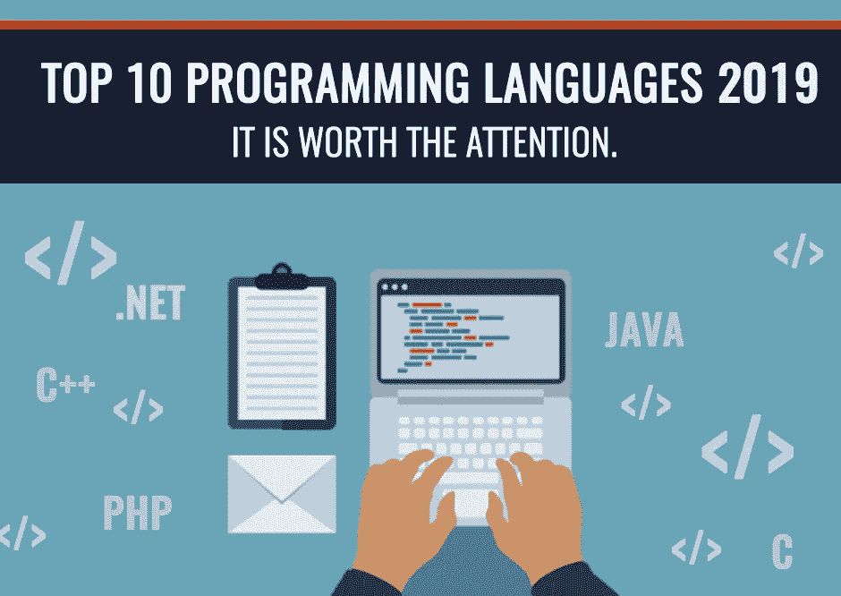

# 2019 年成功开发的十大编程语言

> 原文：<https://medium.datadriveninvestor.com/top-10-programming-languages-for-successful-development-in-2019-fe4de37fb3e0?source=collection_archive---------5----------------------->

如果你是一个软件开发领域的新手，无疑你脑海中点击的第一个问题是“从哪里开始”？在技术进步的时代，你必须从数百个选项中挑选出一个，但是你如何才能找到最好的呢？哪一个会最合适，与你的兴趣和职业目标高度匹配。如果一个人想开发一个移动应用程序，或者想获得编程语言知识的认证，或者甚至想学习新的技能，那么这个人应该选择正确的编程语言。

根据我的经验，选择最重要的编程语言最明显的方法是观察市场技术趋势。作为一名开发人员，了解哪些语言是有需求的至关重要，因为这些语言将推动或解决未来的应用程序问题。

 [## 创建折衷书架的程序员指南——数据驱动的投资者

### 每个开发者都应该有一个书架。他的内阁中可能的文本集合是无数的，但不是每一个集合…

www.datadriveninvestor.com](https://www.datadriveninvestor.com/2019/03/25/a-programmers-guide-to-creating-an-eclectic-bookshelf/) 

选择正确的编码语言会使项目更令人愉快，意味着它会让你实现更多，工作更有命令性，并避免由于你试图创建的工作的不兼容性而出现的主要障碍。

接下来，在这个博客中，你将深入了解一些最苛刻的编程语言，用于移动开发、web 开发、游戏开发等等。

我希望最后你能清楚地了解哪种编程语言会在接下来的一段时间以及更长的时间里促进你的职业发展。

让我们开始吧..

**1。JavaScript** —作为 2019 年及以后最苛刻的编程语言之一，Java-Script 在该榜单中占据首位。在 2018 年的年度调查中，近 68%的开发人员申请学习这种语言，因为它将引导他们建立交互式网页，展示动态内容，并促进从网络到移动的过渡。在今天的情况下，不了解 JavaScript 似乎不可能成为一名软件开发人员，因为这种语言在前端开发中起着至关重要的作用。甚至，大多数社交媒体平台认为 JavaScript 是创建交互式网页的最简单方式，并且是职业驱动的。

**2。Python** —你可能会感到震惊，为什么我把 Python 放在第二位，因为结果显示它位于第五位。但是，我一定会让你相信，这是什么原因？对于通用来说，Python 是一种用户友好的语言，是近几年才出现的开源语言。它有“基于对象”的子集，类似于 JavaScript。许多流行的社交媒体应用程序，如 Instagram、Reddit 和 Youtube，都是由 Python 构建的。此外，它还适用于 3D 渲染、web 开发和将来会更加严格的科学计算。

**3。Java** —我把这种语言放在第三位，有一句话很适合这个地方，“写一次，到处跑”。Java 已经领先其他编程语言 20 年了。总的来说，Java 对象不携带对自身外部数据的引用。Java 比 C++简单，因为它使用内存分配。它是 Android 操作系统的基础，90%的公司选择它来管理各种后端操作。

**4。C/CPP** —我们一直听说“老是金”——C 已经证明了这个说法。自 20 世纪 70 年代末推出以来，C 已经成为了一个重要的编程世界。我们可以说，它是一门父语言，其他一些语言也是从 C 语言衍生或受其启发，包括 Java、C#和 Objective-C。开发的起源是虚拟现实、计算机图形学和游戏等。

**5。PHP**——这可能会让你大吃一惊，这种语言的开发目的是为 Rasmus 维护个性化主页，但是到今天为止，它实际上已经引领了全球 83%的网站。基本上，PHP 代表超文本预处理器，通常用于创建 HTML 格式的书面网页。

**6。Swift**——接下来是 Swift；正如它的名字一样，Swift 是一种开源的默认编程语言。它是由苹果公司开发的，所以如果你想开发本地应用程序，iOS 或 MAC OS，那么 Swift 是这个目的的一个勉强要求。我想说的是，Swift 在某个地方受到了 Python 和 Ruby 的影响，尽管与它的前身 Objective-C 相比，它被认为更安全，更容易调试和读取。

**7。C# (c-sharp)-** 软件巨头微软在 2000 年引入了这种语言，用于改进桌面应用程序，即大多数 Windows 8/10 应用程序。需要 C#。NET framework 才能顺利运行。用户可以很容易地通过 C#找到错误，这是一种逻辑类型化的语言，在将代码放入任何软件或应用程序之前，会对其进行检查。总的来说，C#适合于开发和改进 web 应用程序、桌面应用程序，也在虚拟现实、2D 和 3D 游戏的解决方案中证明了自己。

**8。Ruby** —一种有魅力的编程语言，强调输出和简单，1990 年在日本创立。创建 Ruby 的初衷是为了简化编程环境，让它更有趣。它是由全栈 web 框架 Rails Framework 产生的。它为您提供了一个通过使用较少的代码行来构建应用程序的机会。虽然，要保留它的灵活性，同时让它慢下来，并不像你想象的那么容易。

**9。Objective-C** —苹果公司首次为其 iOS 和 OS X 操作系统及其 API(应用编程接口)使用的面向对象编程语言。Objective-C 是在 20 世纪 80 年代发展起来的，由最早的操作系统使用。你可以称之为混合 C，因为它增加了 C 编程语言的特性。

**10。SQL** —它代表用于操作数据库的结构化查询语言。SQL 包括存储、检索和操作保存在关系数据库中的信息。它使你能够保存和精确的数据，也有助于处理数据库的完整性和它们的无关性。

**包装完毕！！**

在过去的几十年里，软件行业随着新的版本和更新而改变。最好的编程语言是什么？很难选择。如果你开始一个职业发展，这完全取决于你的兴趣水平，最适合你。