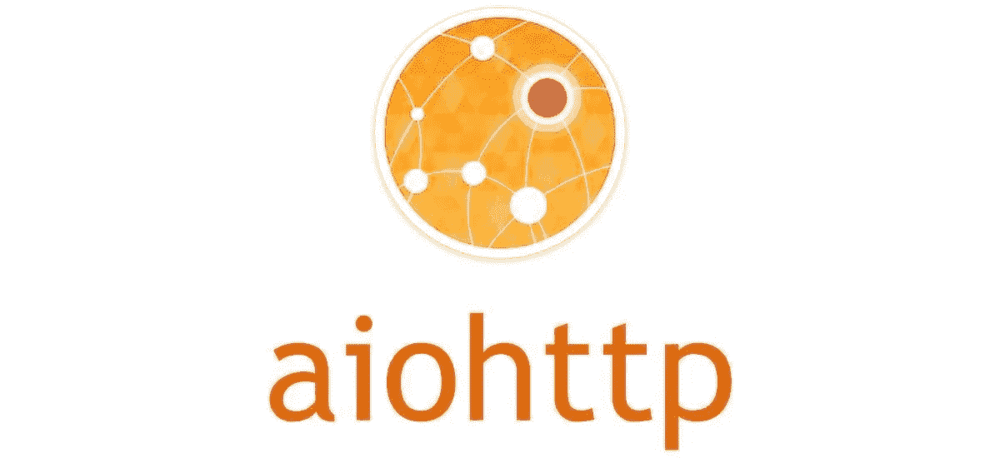
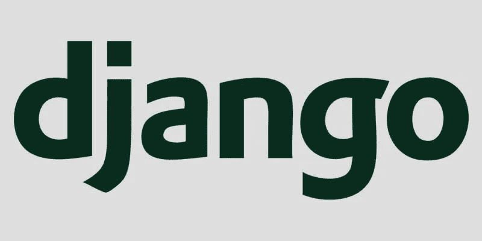
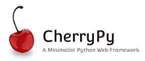
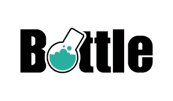
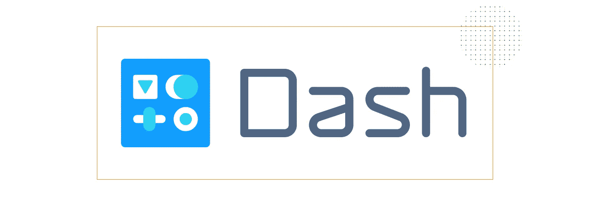

# 2019 年使用的 10 大 Python Web 开发框架

> 原文：<https://medium.datadriveninvestor.com/top-10-python-web-development-frameworks-used-in-2019-16f725a1720e?source=collection_archive---------2----------------------->

Python 是一种解释的、面向对象的、动态类型的交互式编程语言。自从过去几年以来，它已经成为开发人员中最流行和要求最高的语言之一。说 python 是数据科学家和机器学习工程师的骨干工具会更好。Python 的流行不仅仅局限于特定的领域，如数据科学、人工智能和 ML；而且丰富了它在其他技术领域的受欢迎程度，如 Web 开发、IOT 等。所有这一切都是因为 Python 有一种新颖的语法，这使它有别于 it 领域的其他编程语言。它也被认为是初学者和开发者的友好语言。

Python 程序员需要什么来让他们的生活更轻松，答案是框架？通过修改冗余任务的执行，框架减少了开发，也使开发人员能够充分重视应用程序逻辑而不是常规元素。由于其可读性和可维护性，开发人员使用巨大的框架，以便在短时间内有效、轻松地运行应用程序。在 [**Web 开发过程**](https://www.volansoft.com/services/web-development) 中，框架就像是给开发人员的一份礼物，它让开发人员的生活更加轻松愉快。

 [## 2019 年最值得学习的编码语言——数据驱动的投资者

### 在我读大学的那几年，我跳过了很多次夜游去学习 Java，希望有一天它能帮助我在…

www.datadriveninvestor.com](https://www.datadriveninvestor.com/2019/02/21/best-coding-languages-to-learn-in-2019/) 

因为它是一种领先的编程语言，所以 Python 中使用的框架并不缺乏。在这一年中，Python 的巨大框架已经被提出；因此，下面给出了 Python 的不同框架，如下所述

**1。AIOHTTP** —这个 Python 框架依赖于 Python 3.5+特性，即异步&等待。AIOHTTP 作为一个客户端框架，它使用 Python 中的 asyncio 库，因此是一个异步框架。它支持客户端 WebSockets 和服务器 WebSockets，而没有回调地狱。AIOHTTP 呈现请求对象和路由器，以便改变关于为解决相同问题而开发的功能的问题的重定向。

**2。Django** —这是一个高级 Python 框架，能够快速开发事物；Django 采用务实的设计。编程语言是由经验丰富的开发人员开发的，它消除了 Web 开发的许多麻烦，因此用户可以专注于编写应用程序，而无需重新发明轮子。Django 包括几十个额外功能，可以帮助你处理常见的 web 开发任务。与此同时，该框架主要被知名公司使用，如 Instagram、Disqus、Pinterest、Mozilla、Bitbucket 和《华盛顿时报》。开发人员使用 ORM 将对象映射到数据库表。

**3。web2py**——python 中的开源全股权开发框架是免费的，允许用户快速发展事物。Web2Py 是一个跨平台的平台，支持所有类型的操作系统。基本上，该框架通过考虑 web 服务器、基于 web 的界面和 SQL 数据库，简化了 web 开发过程。这个框架最吸引人的关键特征是，它被用在票据授予机制中，以便回忆错误及其状态。Web2Py 有内置的组件来管理 HTTP 请求、反应、会话和 cookies。

**4。Turbo Gears** —这是一个免费的、数据驱动的开源 Python 框架，构建在 Django、rails 和 TourGear1 之上。该框架旨在克服广泛使用的 web 应用程序开发框架的缺点。TurboGears 开发一个 web 应用程序需要较少的设置，尽管在 Javascript 开发人员的帮助下，您可以简化 web 应用程序。

**5。CubicWeb** —这个 Web 应用程序开发框架是 Python 的一个语义、免费和开源的框架，它使开发人员能够通过遵循面向对象的设计原则重用多维数据集来高效地构建不同的 Web 应用程序。CubicWeb 还支持资源描述框架(RDF)和 Web 本体语言(OWL)；此外，它有一种关系查询语言，能够消除数据处理中产生的所有问题。

**6。Flask** —这个 Python 框架在 BSD 许可中可用，因为它是由 Sinatra Ruby framework 发明的。构建 Flask 的主要目的是开发一个坚实的 web 应用程序基础，通常称为微型 web 框架。与 Django 相比，flask 是最适合小型简单项目的框架。Flask 的特点是——轻量级框架、内置开发服务器、调试器以及与 Google App Engine 兼容。Flask 依赖于 Werkzeug WSGI 工具包和 Jinja2

7 .**。CherryPy** —这是一个极简主义的开源框架。专家们普遍认为 cherryPy 支持的 web 应用程序是独立的 python 应用程序，其中嵌入了自己的多线程 web 服务器。Python 框架运行在操作系统上，即 Windows、Linux、macOS 等。此外，CherryPy 不是一个非常受限的框架，事实上，它允许使用所有类型的技术来吸引数据访问等等。然而，该框架仍然无法处理会话、cookies、文件上传等。

**8。Bottle** —它是一个微框架，最初是为了构建 APIsBottle 使用单个源文件中的所有内容。除了 Python 标准库之外，没有任何依赖关系。Bottle 的用途是方便地访问文档或文件以及 HTTP 相关的元数据。

**9。Tornado** —该框架是异步网络库，广泛应用于非阻塞 I/O 下，解决了 C10K 问题。它的能力使 Tornado 成为构建需要高性能和成千上万个并发查询的应用程序的绝佳工具。它是对用户认证的内在支持，提供实时支持、高质量性能和非阻塞 HTTP 客户端。

10。Dash —这个框架是为开发一个基于 web 的分析应用程序而开发的。这对不太熟悉 web 开发过程的 Python 数据科学家来说尤其有利。基本上，Dash 应用程序是运行 flask 并通过 HTTP 请求与 JSON 包交互的 web 服务器。除此之外，在 Dash 框架下开发的应用程序可以部署到服务器上。这也意味着 Dash 应用隐含在跨平台和移动就绪中。

所以上面给出的框架是 2019 年 Python 广泛使用的 web 应用开发框架供你学习。随着技术世界的巨大发展，这些框架在 web 应用程序开发场景中越来越受欢迎。简而言之，每个框架都有自己的优点和缺点，你需要做的就是根据你的需求调整合适的框架。我真的希望你已经在这篇文章中找到了一个有趣的框架。