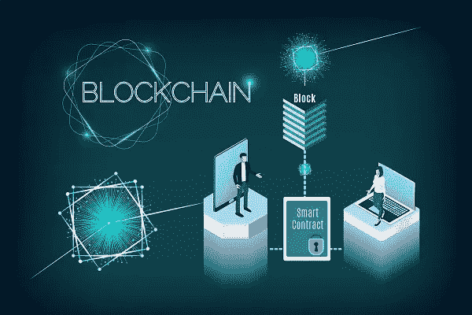

# 十大智能合同开发公司

> 原文：<https://medium.datadriveninvestor.com/top-10-smart-contract-development-companies-3320b166d1d3?source=collection_archive---------0----------------------->

**Top 10 smart contract development companies**

对十大智能合同开发公司名单的探索可能就到此为止了。这是一个简单的倡议，从我们这边来教育我们的读者寻找智能合同开发。智能合约编程有几个优点，它基本上能够以一种非常简单的方式交易现金、财产、股票或任何重要的东西，同时使你免受中间人的强制性限制。中间商或服务中介/聚合者的概念不同于中间商的传统定义。他们将简单地调解服务并从中扣除服务费。

智能合同的创新彻底改变了这一格局，让您可以自由地选择与您的业务架构完美契合的合适的业务解决方案。下面的列表将帮助您在同一个平台上获得必要的信息和指导。

 [## 你对智能凭证、J-Coin & c-lightning |数据驱动投资者了解多少

### 无数区块链/加密项目在我们周围涌现，承诺不同的真实世界用例。正在搜索…

www.datadriveninvestor.com](https://www.datadriveninvestor.com/2019/03/06/what-do-you-know-about-smart-credentials-j-coin-c-lightning/) 

## **HashCash 顾问公司**

**描述:**加州 [HashCash Consultants](https://www.hashcashconsultants.com/) 是一家全球知名的软件公司。这家企业为其客户提供区块链驱动的解决方案，并帮助他们实现跨多个平台的灵活性和可扩展性，如汇款、贸易融资、支付处理等。这些是实时交易，以前是在第三方的强制性合同下进行的。他们还运营数字资产交易服务 PayBito 和数字资产支付处理器 BillBitcoins。HashCash 引导企业在有限的时间内朝着增长和发展的方向前进。

**产品:**慧聪汇、慧聪企业支付、PayBito、慧聪商务、ICO Stage、HCX

**公司规模:** 50 加

## **Sumatosoft**

**描述:** [白俄罗斯的 Sumatosoft](https://sumatosoft.com/) 是 web、物联网和移动领域的专家。该公司专门开发具有挑战性的复杂项目。自 2012 年以来，该公司一直为全球领先的公司提供交钥匙解决方案，如丰田、Evolv、Dragon、油桃、Boxforward 等。作为十大智能合同开发公司之一，Sumatosoft 在 web、IoT 和移动领域成功实施了创新。预计它将在智能合同开发领域树立标杆。

**产品:**定制企业系统、冰箱传感器、在线送餐平台等

**公司规模:** 20 加

## 埃利克斯

**描述:** [乌克兰公司](https://eleks.com/)通过专业的软件工程和咨询服务帮助企业实现数字化转型。他们已经为许多财富 500 强公司提供了价值驱动的创新，这些公司正遭受着与他们的商业模式相关的一些限制。这个 IT 巨头背后有一支由 1400 多名专业人员组成的庞大队伍，他们在遍布东欧的交付中心和美国的销售办事处工作。

**产品:**概念验证开发、应用程序开发、应用程序再造、产品设计

**公司规模:** 150 加

## Solulab 公司

**描述:**[**Solulab Inc**](https://www.solulab.com/)**由高盛前副总裁、思杰前首席软件架构师创办。该企业为企业、初创公司和企业家提供全栈 360 度解决方案，帮助他们用一流的最终产品将想法变为现实。该公司专门帮助其客户通过分散的区块链发展解决方案主导商业格局。**

****产品:**区块链、手机 App 开发、聊天机器人开发&物联网**

**公司规模:40 多家**

## ****网络基础设施公司****

****描述:**作为一家交钥匙 IT 解决方案提供商，佐治亚州亚特兰大市的 Cyber Infrastructure Inc .在帮助企业取得不可估量的成功方面享有盛誉。该公司在过去的 12 年里一直参与这项业务。通过大量的 IT 服务，该公司正在向其客户提供最佳解决方案。**

****产品:** ESignly，FreeAsAir**

****公司规模:** 100 加**

## ****智能软件****

****描述:**这家位于加州的企业总部位于加州的帕洛阿尔托。这家企业只是编排了超越数字化一般概念的数字化转型。它们有助于采用更新的技术平台，并解决关键技术带来的业务复杂性。**

****产品:**金融科技解决方案、电子商务门户、保险应用和物流跟踪系统**

**公司规模: 50 加**

## ****留有余地赫兹****

****描述:**印度的 Leeway Hertz 以构建企业级区块链应用而闻名。他们在为全球供应链领域开发区块链解决方案、使用区块链的身份解决方案以及通过区块链生成公用事业账单方面拥有业经验证的专业知识。该企业已经开发了分布式分类帐技术，包括 Hyperledger、Ethereum、Hashgraph 和 R3Corda。**

****产品:**乘车共享平台，服装解决方案，借贷门户**

****公司规模:** 100 加**

## ****Quest 全球技术公司****

****描述:**Indore 的 Quest Global Technologies 是一家前沿软件开发企业，致力于量身定制的 ERP 解决方案、商务移动应用程序、Salesforce 和 Web 开发。Quest Global Technologies 被 Appfutura 评为顶级移动应用开发商。**

****产品:**航空发动机、医疗器械、电力、轨道等(数字解决方案)**

**公司规模: 200 多家**

## ****S-pro****

****描述:**这家总部位于乌克兰的公司提供软件开发、发布和维护解决方案，以及强大的分析深度、理解和实施能力。这家负责任的 IT 服务公司的一些与众不同之处在于，它拥有 150 多名内部专业人员、90 多种核心 IT 解决方案以及遍布 27 个国家的客户群。**

****产品:**用户界面/UX 设计、软件开发、习惯移动应用等**

**公司规模: 150 多家**

## ****硬币面料****

****描述:**该公司提供高级 API 和用户界面，以及比特币和以太坊的加密货币解决方案。该公司总部位于阿根廷，并承诺在区块链开发、人工智能和物联网领域留下印记。**

****产品:** JesseBot，Agareum，CoinBeat，矛头**

**公司规模:100 多家**

**十大智能合同开发公司带来了数字化趋势，改变了企业的整个生态系统。它通过智能合同开发为客户提供最佳解决方案，为企业创造了更好的机会。区块链技术为现代商业环境带来了很多希望。**