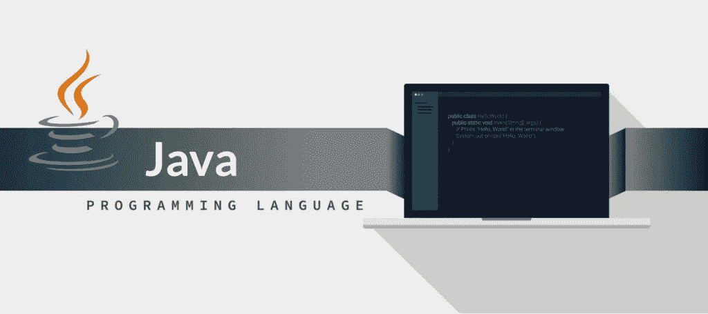

# 关于 JAVA 你不知道的 10 件事

> 原文：<https://medium.datadriveninvestor.com/top-10-things-you-didnt-know-about-java-25600454c9c?source=collection_archive---------2----------------------->

ava 是最著名和最广泛使用的编程语言之一。全世界数以百万计的设备都在使用它，因为它可读性强，简单明了。尽管 Java 如此受欢迎，但还有一些有趣的事实您可能不知道。这里有一些开发人员不知道的事情，你可以用它们来打动你的朋友和同事。

关于 Java 的有趣事实

# 1.它的原名是橡树

虽然这可能很难想象，但 Java 最初被称为一个非常不同的名字。Java 的创始人詹姆斯·高斯林当时在太阳微系统公司工作，他开发了一种新的编程语言。他以他在办公室窗外看到的橡树命名。后来，这个名字被改成了 Java。

 [## 2019 年最值得学习的编码语言|数据驱动的投资者

### 在我读大学的那几年，我跳过了很多次夜游去学习 Java，希望有一天它能帮助我在…

www.datadriveninvestor.com](https://www.datadriveninvestor.com/2019/02/21/best-coding-languages-to-learn-in-2019/) 

# 2.《我的世界》最初是用 Java 写的

《我的世界》是有史以来最受欢迎的电子游戏之一。它的创造者 Notch 首先用 Java 编写了这个游戏，仅仅是因为这是他习惯使用的编程语言。《我的世界》被微软收购后，它的新主人发布了一个 C++版本。

# 3.它教会你像程序员一样思考

大多数有抱负的程序员开始学习 Java 是有原因的。虽然它的语法有时可能很复杂，但它教会学生开始像程序员一样思考。换句话说，它说明了解决问题的技能类型，即使当学生继续学习更复杂的语言时，这些技能对他们也是有用的。

# 4.它是动态的

Java 最有趣的未知事实之一就是它的动态性。这可以分为两类:Java 插装和 Java 反射。第一类使您能够修改已经编译好的类，如果您决定在运行时更改代码，这将派上用场。诸如 AspectJ、ASM 等开源库允许 Java 插装。反射使您能够访问类的私有变量。所有这些在[编程软件](https://skywell.software/)时都很有帮助。

# 5.吉祥物的名字叫“公爵”

如果你熟悉电影《怪物史莱克》，那么你一定看过乔·帕朗的作品。然而，人们可能会认为他更出名的是“公爵”而不是“史莱克”,因为这个吉祥物在所有 JavaOne 大会上都有突出的展示，这些大会在开发者中非常受欢迎。

# 6.这一切都是意外

我们前面提到过，Java 的创始人詹姆斯·高斯林最初给了它一个非常不同的名字。但更幽默的是，这种语言的发明本身是一个意外。詹姆斯·高斯林和他的团队正在清理 C++，结果得到了一种全新的语言。另一方面，我们不应该太惊讶，因为我们今天使用的许多设备，如微波炉、喷墨打印机、x 光图像和其他许多设备也是偶然发明的。

# 7.Java 的流行

我们都知道 Java 极其流行，但是我们能量化一下吗？首先，世界上有 900 多万 Java 开发人员，它每年被下载超过 10 亿次。

# 8.找到工作的几率很高

由于 Java 如此受欢迎，对精通这种语言的程序员的需求越来越大。事实上，根据最受欢迎的求职网站之一 indeed.com 的调查，Java 是发布新工作的首选语言。事实上，去年 Java 开发人员的空缺超过 6 万个。

# 9.“最终”这个词是模糊的

Java 中“Final”一词有四种含义:

*   最终字段—表示常量字段
*   最终类——意味着该类是不可扩展的
*   最终变量-变量在分配后不能调整
*   最终方法—方法不能被覆盖

# 10.有许多 Java 平台

Java 平台包括:

*   Java 标准版——已经包含了所有的基本功能和库。
*   Java 企业版——包括大型企业构建应用程序所需的各种框架和库。
*   Java Micro Edition —包括为智能手机和平板电脑等设备创建应用程序的框架和库。
*   Java FX —包括图形库，可创建丰富的应用程序，提供跨平台的一致性能。

就像 Java 有很多很酷的事情可以做一样，也有很多你可能不知道的事情。尽管在你的职业道路上，你只需要用 Java 编程的技能和知识，但这些有趣的事实你可以随身携带，让你的朋友们惊叹不已。Java 创建于 1995 年，是最古老的编程语言之一。有趣的是记录它从卑微的开始到世界上最广泛使用的编程语言之一的发展过程。它有着非常丰富的历史，这意味着学习它和语言本身一样令人兴奋。与 Java 同时代的其他编程语言，如 Python 和 Visual Basic，是专门为编程目的而开发的。因此，深入挖掘 Java 是如何出现的，以及为什么在 20 多年的时间里一直如此受欢迎，是一件有趣的事情。

*最初发布于*[*https://sky well . software*](https://skywell.software/blog/top-10-things-you-didn-t-know-about-java/)*。*