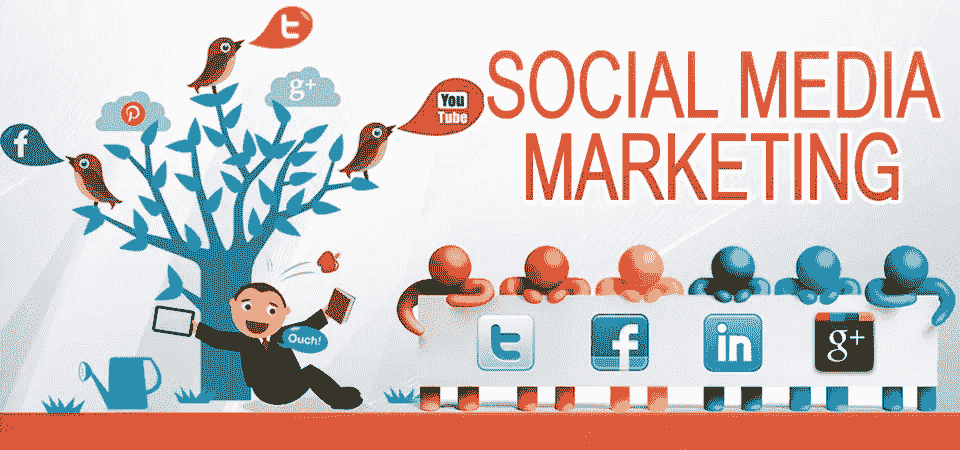
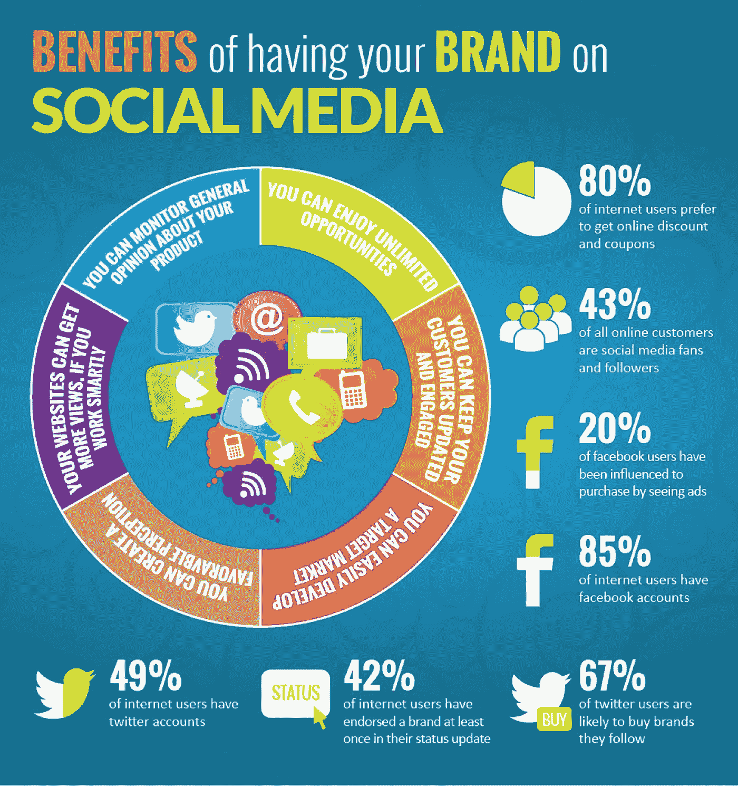
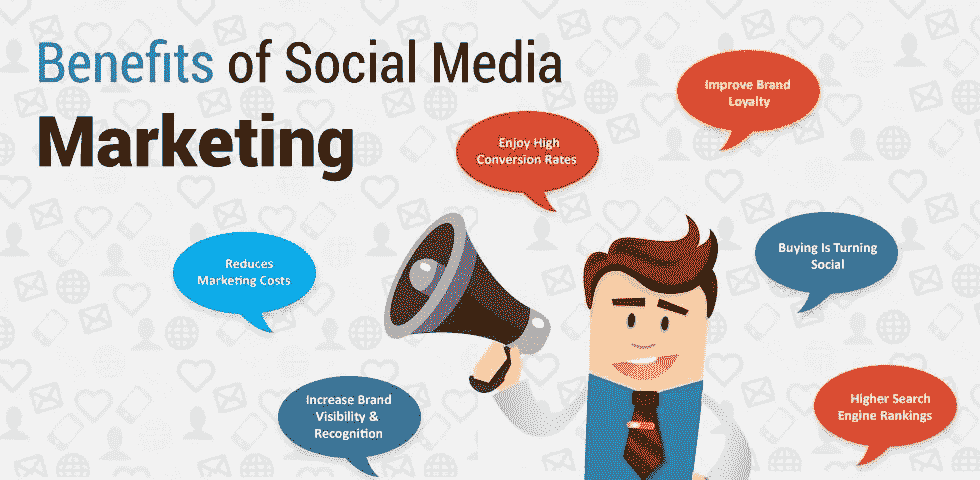

# 打造最佳社交媒体营销策略的 10 大技巧

> 原文：<https://medium.datadriveninvestor.com/top-10-tips-to-build-best-social-media-marketing-strategy-8720e552b028?source=collection_archive---------11----------------------->

什么是社交媒体营销及其重要性？

社交媒体最终会发展壮大，并对业务增长和品牌认知度产生影响。它通过利用社交媒体平台的影响力，为营销人员创造了新的机会。随着数字营销方法的出现，社交媒体平台已经成为企业不可或缺的一部分。从中小企业到大型组织，社交媒体平台正在使品牌受益。当然，每个用户都在寻找每个品牌的社交媒体，以应对最新的公告。建立独特的**社交媒体营销战略**肯定会跨越在线存在的障碍。

**社交媒体平台如何实现品牌知名度？**

今天，我们有大量的社交媒体平台来联系全球各地的人们。当然，他们以自己独特的内容策略为用户服务。在每一个社交媒体平台，我们都可以找到各种社区团体来接触目标受众。我们有选择年龄、性别和其他人口统计数据的规定，以便无处不在。因此，为每种媒体建立一个特定的社交媒体平台营销策略将会强化你的品牌。

Source: Digital Vidya

92%的营销人员表示他们通过社交媒体增加了曝光率，80%的营销人员看到了积极的流量结果。

让我们来看看最好的社交媒体平台营销策略。

**社交媒体收听:**

拥有一个社交媒体账户并定期发布更新可能不会引起用户的关注。然而，社交媒体收听是成功的社交媒体平台营销策略中要考虑的首要因素。作为社交媒体的活跃用户，你需要通过**行业关键词**寻找用户的疑问、需求、投诉、评论。采用能够洞察用户想法的专门监控软件。毫无疑问，早起的鸟儿将获得成功的温暖。

***视频内容分享:***

每个营销人员的最终目标都是用过多的内容模型创建一个重要的在线形象。视频内容是吸引用户的最佳内容模式之一。商业品牌可以制作自己的视频，并在 YouTube 和脸书等平台上分享。通过设计一个培育社交媒体平台的营销策略，用视频内容产生更多的商业转化。你可以向客户提供服务、员工体验、客户体验和成功案例。当然，这将在商界和客户之间建立信任因素。

**直播流媒体服务:**

随着脸书、LinkedIn、Twitter 和其他媒体等社交媒体平台的快速发展，用户互动变得越来越容易。早期，我们需要选择传统的营销策略，如电视广告和其他传统方法。现在，品牌可以通过直播会议直接与用户互动。在他们有活动的地方，品牌可以分析痛点来改善用户体验。这种社交媒体营销策略将比通常的内容营销吸引更多的注意力。

**论坛提交和社区团体:**

在社交媒体平台上，我们有很多共同兴趣用户的社区团体。作为这些群体的活跃用户，你可以经常推广你的业务。但要确保你不应该做激进的商业促销，这反过来会暂停你的帐户。类似地，为你的产品建立一个用户群，然后通过定期更新与他们保持联系。

另一个有效的 [**社交媒体平台营销策略**](http://www.googleseotrends.com/customer-retention-paid-ads/?utm_source=ReviveOldPost&utm_medium=social&utm_campaign=ReviveOldPost) 是论坛投稿。Quora 和 Reddit 是分享内容和与全球用户互动的最佳平台。为有效的用户参与，在各自的组中精心制作独特的内容和帖子。

***脸书、Twitter、LinkedIn 付费服务:***

虽然你设计了一个独特的社交媒体营销计划，但有时它可能不会像我们预期的那样到达目标受众。那么，付费服务是社交媒体平台营销策略的最佳途径。将**预算**分配到各个平台，并定期进行促销活动。毫无疑问，你可以看到用户覆盖面、参与度和点击率的大幅增长。

**带关键字的内容:**

最后但并非最不重要的一点是，内容总是会改变你的在线形象。通过包含相关的**关键词**来制作你自己的内容，以获得更多的在线流量和用户参与度。但是，请确保内容中不要填充不必要的关键字。建立搜索引擎优化友好的索引和查询搜索排名高的内容。最重要的是，在创建内容时，要始终站在用户的角度思考。

**可共享选项& CTA:**

在你的文章或博客的末尾，加入社交媒体平台的共享按钮。如果你这样做，访问者可以分享有价值的信息给他的连接，从而内容将达到更多的用户。同样，使用点击行动( **CTA** )项目来增加你网站的流量。

**发展影响者的关系:**

如今，影响者营销比付费营销更受关注。接触你所在领域的有影响力的人，定期更新你的信息，让他们关注你。最后，你可以让他们贡献一部分内容或者分享你的文章。它为您的内容增加了巨大的价值，并提高了真实性。

**竞争对手分析:**

竞争对手分析无疑是建立社交媒体营销战略的一项重要任务。了解你的竞争对手，跟踪他们是如何接近客户的。如今，**超过 60%** 的品牌通过社交媒体来吸引和吸引用户。他们通过专门的论坛和社区团体吸引潜在客户。总是提前提供折扣、免费试用或任何有限的优惠来吸引用户的注意。经常分享第三方内容，避免自我推广和销售的单调。

例如:如果你是一家数字营销机构，向他们提供一个月的免费试用期，并通过分析显示排名提高。

Source: IO web studio

**SEO:搜索引擎优化**

建议同时采用页面内和页面外优化方法，以获得更好的排名。优化你的内容来回答用户提出的问题。 [**白帽 SEO 方法**](https://medium.com/datadriveninvestor/search-engine-optimization-tips-and-hacks-on-page-off-page-optimization-9228ff6451dc) 总是比黑帽 SEO 做法更可取，更有长期效益。

这些是建立社交媒体营销策略以提高参与度和培养潜在客户的一些技巧和诀窍。

更多最新技术和谷歌趋势请关注[**# Clickongadget**](https://twitter.com/ClickonGadget)