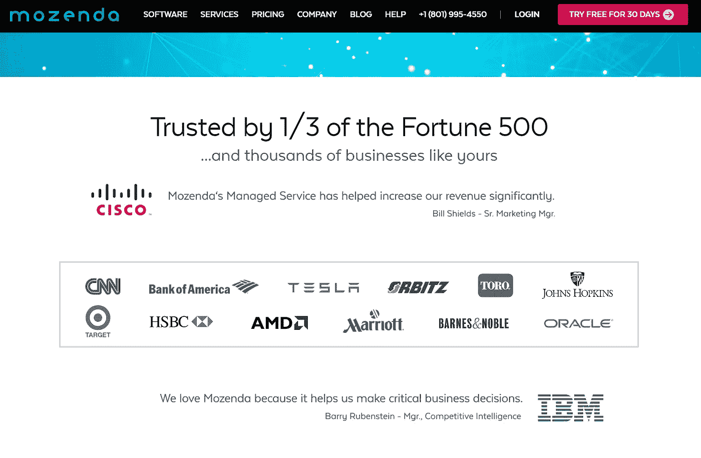
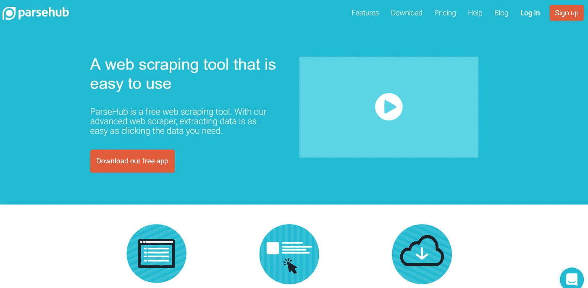
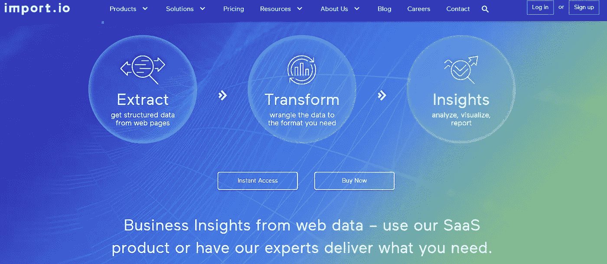
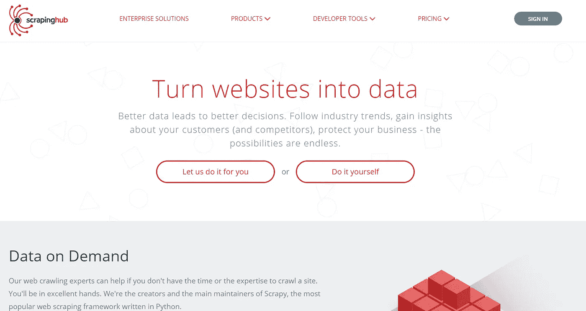
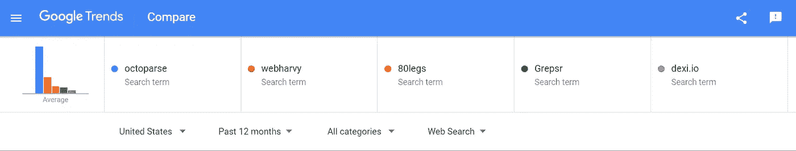
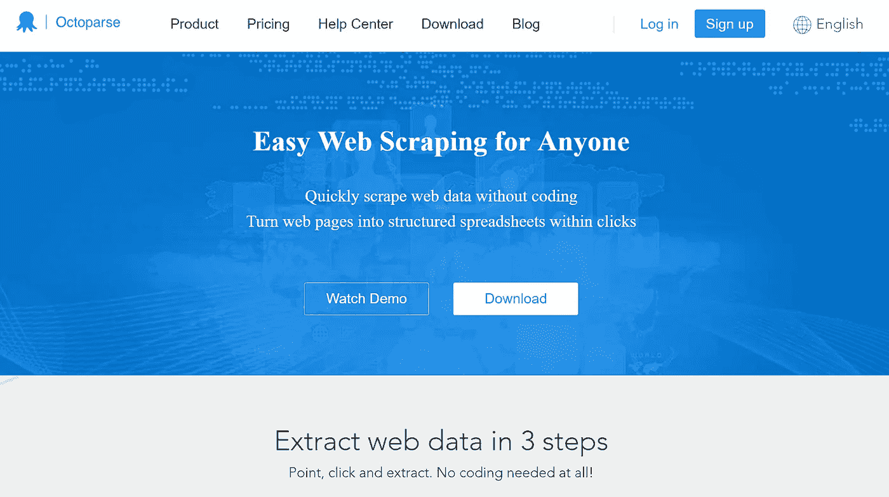
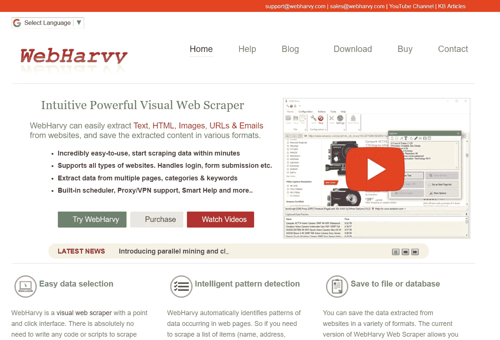
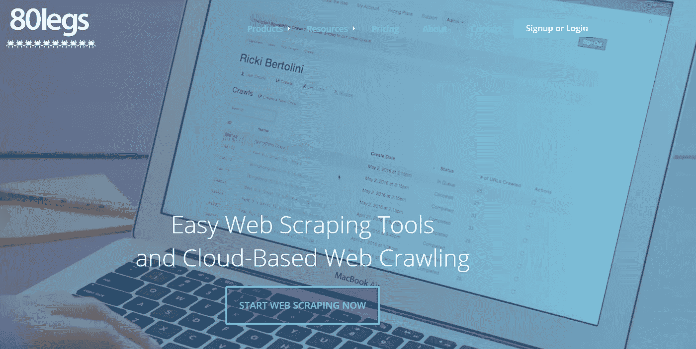
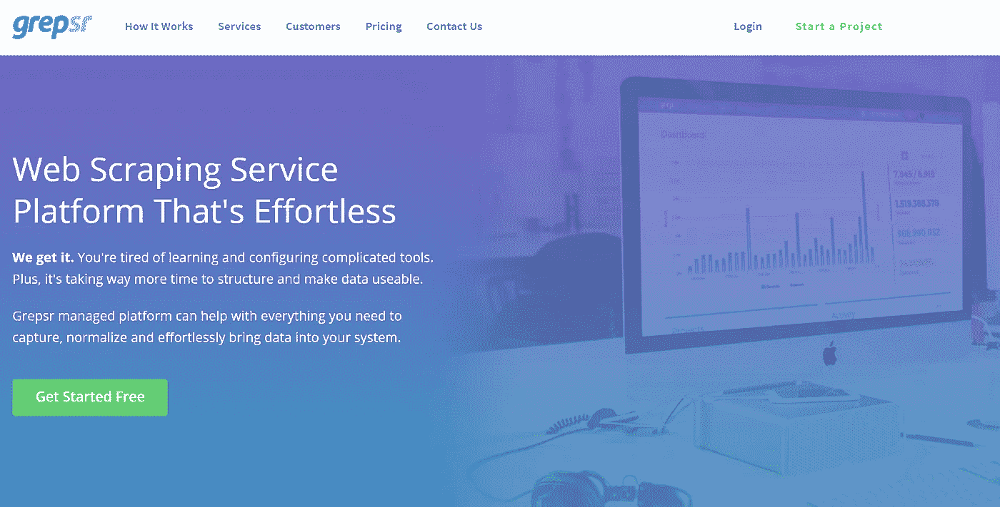
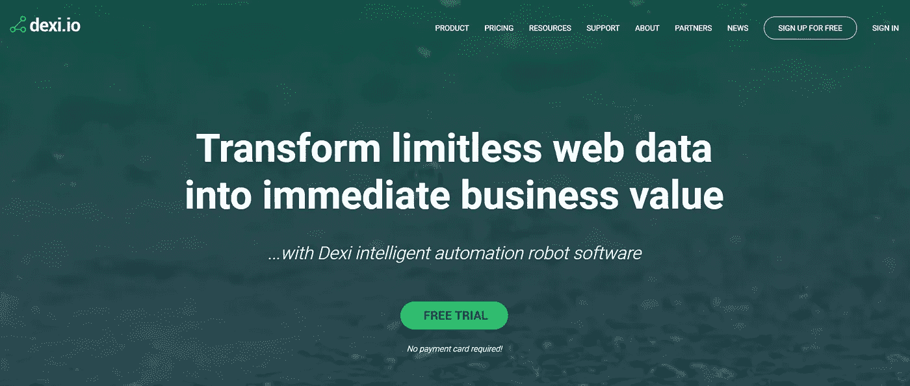

# 十大网页抓取工具

> 原文：<https://medium.datadriveninvestor.com/top-10-web-scraping-tools-5d8fc0b9a7d3?source=collection_archive---------1----------------------->

我已经从网上搜集数据超过 20 年了。我使用网络抓取的第一家公司是 Binoculars.com(2006 年卖给 hayneedle.com)。作为早期的互联网光学公司，我们有少数小众电商，被称为“品类杀手”。我们拥有网上最大的网站，销售太阳镜、双筒望远镜、望远镜和其他几种光学产品。我们被网络零售商命名为网络上最好的网站之一，并且三次以上进入 500 强(现在更容易了，因为它是 5000 强)。我们真的认为我们可以和亚马逊竞争。我们秘制酱料的成分之一是网络搜集。我们有机器人可以去我们所有的竞争对手那里获取他们的价格。然后我们会把数据带回来，如果有利可图，我们会改变我们的价格，成为网上最低的价格。我仍然每天使用数百个不同流程的数据抓取工具。我经常把网络抓取称为我的瑞士军刀，因为它帮助我在几乎所有情况下保持竞争力。当我经营我们的光学公司时，我们手工编码每一个网页抓取，但是今天有超过 100 个第三方工具帮助人们抓取网页，即使他们没有编程知识。凭借快速收集数据的能力，我已经收集了各种各样的数据，如挑选投资股票、寻找合适的员工，以及简单地收集竞争对手的价格和库存信息。

这篇文章包含了几个我使用过网络数据抓取的案例，以及十大最常用的网络抓取工具，这些工具可以让普通人(非程序员)像 Google 一样收集网络数据并将其丢弃。

抓取工具是为了从网站中提取信息而开发的。它们还被称为网络采集工具或网络数据提取工具。这些工具对任何试图从互联网上收集某种形式的数据的人都很有用。网络抓取是一种新的数据输入技术，不需要重复打字或复制粘贴。

该软件手动或自动监视新数据，检索新的或更新的数据，并将其存储起来供您简单访问。例如，您可以使用抓取机制从 Amazon 收集关于商品和相应价格的数据。今天，我将发布数据抓取工具的用例，包括 10 大网络抓取工具，以结构化数据，而无需编码。

**网络抓取工具的使用案例:**
网络抓取工具可以在各种场景下无限制的使用，但是我们将介绍一些适用于一般用户的常见使用案例。

**监控公司选股**
我搜集了数千种买入/卖出情景的数据，但有一个例子很管用，那就是对冲基金或个人投资者监控一家公开交易的零售网站，观察新产品的添加。使用 web scraper，你可以计算出这些新产品从网站上的一个特色位置移动到网站后面的折扣部分的速度。用这种信息武装自己将向投资者展示一家公司是否在销售他们的新产品，或者新款式是否是无用的。如果他们的产品卖得很好，他们留在主页上，你可能想买股票，但如果这些产品最终清仓，你可能想卖掉公司。

**为市场研究构建网络数据**
网络抓取工具可用于实时监控你的竞争对手或你投资的公司的发展趋势。企业经常监控竞争对手的评论，以了解竞争对手的问题所在，这样他们就可以集中营销信息，在竞争对手薄弱的地方展示自己的品牌是更好的选择。

**提取销售线索信息**
类似下面列出的提取软件还可以用于从多个站点收集电话号码、姓名和电子邮件等数据，使企业能够拥有销售线索、制造商或供应商的列表，以帮助数据录入和营销。

从你自己的网站下载评论我做的一个项目是在我们自己的网站上运行一个 web scraper，这样我们就可以从像 power reviews 这样的第三方来源结构化数据。通过分析我们自己的评论，我们可以将单个产品的星级与我们的谷歌分析进行比较，显示星级如何影响您的转化率。我发现如果一个 4 星的评价几乎没有影响，但是当一个评价降到 3 星的时候，转化率下降很快。

**寻找工作或候选人**
网络爬虫的一个非常常见的用途是让招聘人员寻找职位空缺。通过从 Monster 这样的资源中获取职位空缺，并汇编成一个可搜索的数据库，招聘人员可以了解最新情况，并比竞争对手更快地找到合适职位的合适候选人。

**追踪竞争对手定价或地图定价**
此类工具最常用于追踪定价。这是由希望具有竞争力的电子商务企业和试图阻止经销商以低于最低广告价格的价格折扣产品的制造商共同完成的。

**十大有益的网络抓取工具**
市场上有成千上万的网络抓取工具，这篇文章根据在谷歌趋势中分析的品牌搜索量，将其归结为十大最常用的网络数据抓取工具。

Top Web scraping Tools according to Google Trends

**1:**[**Mozenda.com**](https://www.mozenda.com/?utm_source=medium&utm_medium=WebScraperTools)
据 Google Trends 报道，Mozenda 是当今市场上最流行的网页抓取工具。它是一个高端的网页抓取工具，可以在非常复杂的情况下工作。他们为所有财富 500 强品牌中的 1/3 提供服务，并根据企业的网络抓取需求构建了自己的软件。Mozenda 提供了两种不同类型的网络抓取。一个可下载的软件，允许您构建代理并在云上运行，以及一个托管解决方案，他们为您创建代理。莫曾达的基地在犹他州的普罗沃。他们不提供该软件的免费版本，如果你想找一个能在你的 mac 上运行的版本，你必须去别处找。
Mozenda 已融资 150 万美元，并实现盈利。

[Mozenda.com](http://mozenda.com)

**2。**[**ParseHub.com**](http://ParseHub.com)
parse hub 是搜索次数第二多的网络采集工具，有免费下载版本。这个免费工具使得这个软件如此受欢迎。他们还以极具竞争力的价格提供软件的付费版本。ParseHub 的优点是它可以在包括 mac 在内的多种平台上运行，但是该软件不像其他软件那样健壮，它有一个复杂的用户界面，可以更好地简化。ParseHub 总部设在加拿大多伦多
未知的投资和盈利能力也是未知的。

**3。** **Diffbot 是第三大搜索网页抓取工具。Diffbot 已经从传统的 web 抓取工具过渡到销售预处理列表，也称为知识图。有定价是有竞争力的，他们的支持团队非常有帮助，但往往数据输出有点复杂。Diffbot 的总部在加州旧金山。自 2011 年以来，Diffbot 已经筹集了 1300 万美元，但尚未实现盈利。**

****

****4。**[**import . io**](http://Import.io)
import . io 是搜索次数第 4 多的数据抓取工具。该公司成立于英国，但于 2016 年迁至硅谷。他们凭借免费版本和软件将永远免费的承诺发展得非常快。今天他们不再提供免费版本，这导致他们的受欢迎程度下降。看看 capterra.com 的评论，他们在这个前 10 名名单的数据提取类别中有最低的评论。大多数投诉是关于支持和服务的。他们开始从一个纯粹的网页抓取平台转变为一个抓取和数据的操作平台。他们可能正在为生存做最后的努力。Import.io 已经筹集了 2280 万美元，尚未盈利。**

****

****5。**[**Scrapinghub.com**](http://Scrapinghub.com)
scraping hub 声称他们用行业领先的技术将网站转化为可用的数据。他们的解决方案是“按需提供数据”,适用于大大小小的抓取项目，以非常快的速度提供精确可靠的数据。他们提供领先的数据提取，并有一个网页抓取工程师团队。他们还提供 IP 代理管理快速抓取数据。
Scraping hub 不提供任何公共投资者关系，也不了解该公司的盈利能力。他们的总部设在爱尔兰的科克。**

****

**接下来的五个顶级互联网抓取工具:**

****

**6.[Octoparse.com](http://Octoparse.com)
octoporse 看起来是网络抓取“终身免费”营销风格的最新成员。它们的受欢迎程度增长得相当快，但我看到这么多公司提供免费的网站抓取服务，却发现它们在赔钱，需要开始收费。我们将会看到他们还能继续免费提供软件多久。Capterra 展示了一些对该软件的好评，网站也很干净。流量增长很快，但没有关于风险资本投资这家公司或他们是否盈利的信息。我没有亲自下载他们的软件，但他们作为网络抓取流派的新玩家出现在我的雷达上。Octoparse 是一个北加州。业务
未列出投资或盈利能力。**

****

**7.WebHarvy.com
WebHarvy 是一家有趣的公司，他们展示了一款常用的抓取工具，但该网站看起来像是回到了 2009 年。该公司总部设在印度，价格相当低。我认为，如果你想要一些便宜的东西，可以工作一晚上的技术支持，这可能是一个很好的公司，但他们在名单上有点远。
未列出任何投资或盈利能力。**

****

**8.80legs.com
80 legs 已经存在很多年了。他们有一个稳定的平台和一个非常快的爬行器。解析不是最强的，但是如果你需要很多简单的查询，fast 80legs 可以提供。您应该注意，80legs 已被用于 DDOS 攻击，虽然该爬虫很健壮，但它在过去已经关闭了许多站点。请记住，我们的排名越来越靠后，虽然 80legs 是一个很好的爬虫，但它们不是收集网络数据的最安全的解决方案。80 蛋的总部设在德克萨斯州的休斯顿。
未列出任何投资或盈利能力。**

****

**9.Grepsr.com 是一家总部位于尼泊尔加德满都的公司。我们再次看到第九个。该软件看起来相当便宜，如果你正在寻找一个简单的项目，不想花很多钱，Grepsr 可能是你最好的选择。网站看起来很新，价格也很低。我没有亲自使用过这家公司，但 Capterra 上的评论还可以，不是很好，但还可以。
未列出任何投资或盈利能力**

****

**10. [dexi.io](http://dexi.io) 我发现许多工作，从来没有冒险这么低的订单。Capterra 的评论对 dexi.io 来说非常好，它们已经存在了 6 年，总部设在英国伦敦。价格比大多数都低，但团队很小。如果你愿意花些时间尝试新事物，这家公司可能值得一试。他们说他们有启动资金，但是没有给出投资数字。我不知道他们是否盈利。**

****