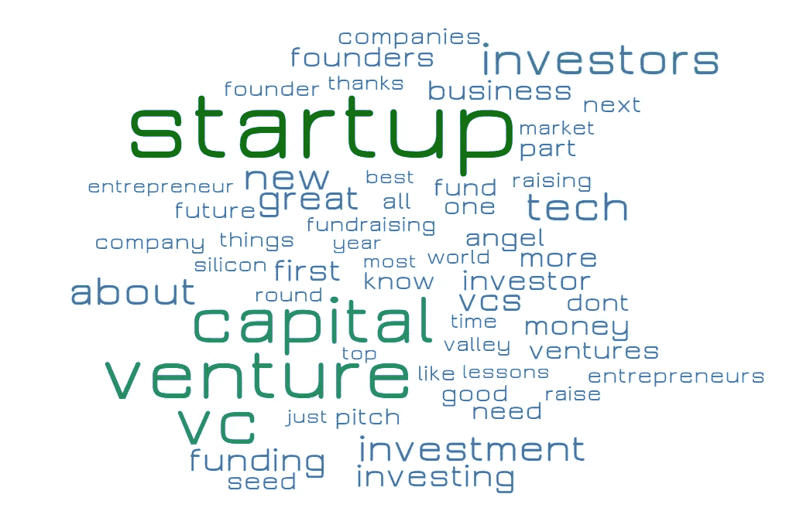
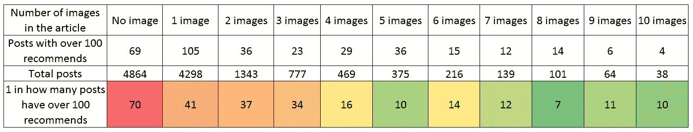
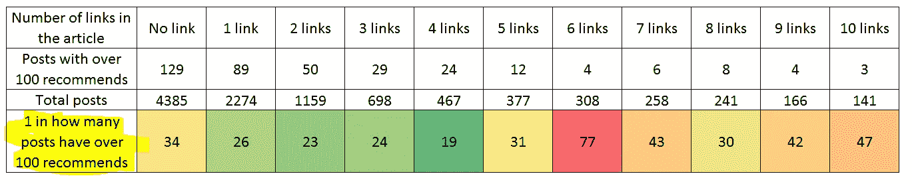

# 200 篇关于 medium.com 的风险投资文章(截止 2017 年 1 月)(带链接)

> 原文：<https://medium.datadriveninvestor.com/top-200-vc-venture-capital-articles-written-on-medium-com-until-jan-2017-with-links-db7a3ed7e587?source=collection_archive---------0----------------------->

> medium.com 的发展速度有多快？
> 
> 2016 年最后 5 个月，medium 上写的关于风险投资的文章比较多，然后是 2015 年 medium 上写的所有帖子。

截至 2017 年 1 月，共有 **12.888 篇关于中型、标签化风险投资的文章。**

**其中近 9000 篇写于 2016 年。**

WordCloud generated from the title of the first 8000 articles tagged venture capital on medium.

T *他的文章献给* [*蒂姆·德雷珀*](https://medium.com/u/6e3f40aa9e6a?source=post_page-----db7a3ed7e587--------------------------------) *。如果没有他，没有德雷珀大学，我不可能学到这么多关于创业公司和风险投资的相关信息，就像我在旧金山大学读书的三个月里学到的一样。*

> 如果你每天阅读 **8 小时**，你将需要 **82 天来阅读媒体上所有标有风险投资的文章。**
> 
> **所需时间**阅读刚刚**前 200 篇文章**，每天阅读 **4 小时**？
> 
> **5 天。**

# 关于媒体上贴有风险投资标签的帖子的随机统计。

*   一篇文章的平均阅读时间为 3 分钟。
*   平均每篇文章包含 2.8 个链接。
*   平均每篇文章包含 1.6 张图片。
*   平均推荐次数为 18 次。
*   **推荐数量的中位数是 1。**
*   一篇文章中图片的最大数量？ **88 张图片。**
*   一篇文章中的最大链接数？ **74 个环节。**
*   一篇文章最长的阅读时间？ **80 分钟。**

# 在媒体上给帖子添加图片有帮助吗？

> 数据显示，如果你在帖子中添加至少 3 张图片，你就有更好的机会获得更多的推荐。

如果你的帖子中没有图片，那么每 70 个帖子中就有一个有机会获得超过 100 个推荐。

如果你的帖子中有 1 到 3 张图片，那么你的帖子有 34-41 分之一的机会获得超过 100 张的推荐。
如果你的帖子中至少有 4 张图片，那么每 7-16 篇帖子中就有一篇会获得超过 100 个推荐。

# 添加到帖子中的链接数量会影响获得超过 100 条推荐的机会吗？

# 有多少文章是女人写的？

在以风险投资为标签的前 200 篇文章中，有 23 篇是由女性撰写的。这是我迄今为止分析过的性别差异最大的类别，而在分析编程语言时，女性作家的比例在 2-6%之间。

# **在媒体上贴有风险投资标签的帖子中，女作家的比例为 10%**

## *如果我们只考虑前 100 篇文章，这个比例是 14%*

萨拉·莫斯科普夫 2

玛蒂尔德·科林

詹妮弗，玛拉，阿斯特丽德&安妮娅 11

施巧灵·亨佩尔

劳伦·斯迈利 25

麦肯齐·伯内特 35 岁

埃丝特·克劳福德 38 岁

莎拉·米尔斯坦

梅根·奎恩 64 岁

金·麦·卡特勒

[蔡克敏](https://medium.com/u/3701728fd29b?source=post_page-----db7a3ed7e587--------------------------------) 78

[@](http://twitter.com/lkr) [lkr](http://twitter.com/lkr) 81

[@](http://twitter.com/girlziplocked)[girlziplocked](http://twitter.com/girlziplocked)86

玛丽·布雷尔

[萨昆塔拉](https://medium.com/u/2602d4ccdc0?source=post_page-----db7a3ed7e587--------------------------------) 123

梅林达·布里亚纳·艾普勒 131

莎拉·霍奇斯

[西尔维娅·李萨姆](https://medium.com/u/4890d480c6c5?source=post_page-----db7a3ed7e587--------------------------------) 148

[阿尔兰](https://medium.com/u/8601b269d0e6?source=post_page-----db7a3ed7e587--------------------------------) 149

卡琳·克莱因

金-麦·卡特勒

Elisa Schreiber 195

## 注意。数据比较老，我已经收集了 2016 年 12 月—2017 年 1 月的数据。

去年我去了美国三个月，在旧金山市，在 T21 德雷珀大学学习企业家精神。

为了做一些数据科学，我放弃了 medium.com 作为游乐场的数据库。2017 年 1 月，我从 medium 获得了一个 20GB 的数据库，里面有 600 万条帖子。

我是一名顾问，帮助需要数据收集、数据挖掘、数据科学/增长黑客方面帮助的公司和个人。

我 1 月份回到了罗马尼亚，计划寻找机会回到美国，直到 2017 年 12 月。但是后来，罗马尼亚政府搞砸了我的计划。这也是我为什么能登上福布斯 30 岁以下欧洲排行榜的原因。

> 布加勒斯特，2 月 10 日(路透社)——2 月 1 日，在罗马尼亚政府发布了一项被视为逆转该国反腐败斗争的法令几个小时后，弗罗林·巴蒂塔(Florin Badita)从他在西部城市克卢日的工作中停薪休假，前往首都布加勒斯特帮助动员应对措施。[..]
> 
> 通过他在 2015 年创建的脸书页面 Coruptia Ucide(腐败致死)，巴蒂塔在那年 10 月布加勒斯特的 Colectiv 夜总会发生致命火灾后，帮助召集了抗议者。政府垮台了，人们对官员贪污和疏忽文化的愤怒爆发了，正是这种文化使俱乐部无视安全条例。
> 
> 一年多一点后，巴蒂塔蹲在布加勒斯特胜利广场附近一个潮湿的地下室公寓里，其他几名活动人士趴在笔记本电脑前发布链接、上传视频和咨询抗议时间。
> 
> “这些抗议没有领袖，”这位身材瘦长的 28 岁地图分析师说，“充其量他们有推动者。”

 [## “我们看见你了”——罗马尼亚活动家成为强大的政治力量

### 布加勒斯特，2 月 10 日(路透社)——2 月 1 日，在罗马尼亚政府颁布了一项被认为是收回…

www.dailymail.co.uk](http://www.dailymail.co.uk/wires/reuters/article-4211874/We--Romanian-activists-potent-political-force.html) 

# 前 200 篇文章贴上了 medium.com 风险投资的标签，至少有一个链接。

## (我将跟进不包含帖子内部任何链接的媒体上的前 100 篇文章。)

1.中级用户克里斯·迪克森(Chris Dixon)总共得到了 7371 条推荐，这篇文章的标题是“计算的下一步是什么？”。
《邮报》有以下标签:“虚拟现实”、“风险投资”、“技术”。
文章阅读时间 10.8 分钟。
帖子包含 24 个链接和 23 张图片。

 [## 计算领域的下一步是什么？

### 计算机行业在两个基本独立的周期中发展:财务周期和产品周期。有很多…

medium.com](https://medium.com/software-is-eating-the-world/what-s-next-in-computing-e54b870b80cc) 

2.媒体用户 [Sara Mauskopf](https://medium.com/u/b486a183afd1?source=post_page-----db7a3ed7e587--------------------------------) 总共获得了 3970 条推荐，主题是“如何在没有空闲时间的情况下创办一家公司”。这篇文章有以下标签:创业，企业家，家庭，“风险投资”，为人父母。
文章阅读时间 4.3 分钟。帖子包含 1 个链接和 6 张图片。

 [## 没有空闲时间如何开公司

### 一年前，我辞掉了工作，创办了 Winnie，这是一款将父母与他们最需要的当地信息联系起来的应用。在…

medium.com](https://medium.com/startup-grind/how-to-start-a-company-with-no-free-time-b70fbe7b918a) 

3.媒介用户 [DHH](https://medium.com/u/54bcbf647830?source=post_page-----db7a3ed7e587--------------------------------) 共获得 3071 条推荐，主题为“风险投资将谋杀媒介”。这篇文章有以下标签:创业，“风险投资”。
文章阅读时间 2.4 分钟。
帖子包含 4 个链接和 1 张图片。

 [## 风险投资将谋杀媒体

### 真是奇耻大辱，真的。我喜欢中号。这是网络上最好的写作环境，他们为细节付出汗水…

m.signalvnoise.com](https://m.signalvnoise.com/venture-capital-is-going-to-murder-medium-656cbccf4829) 

4.媒体用户布莱斯·罗伯茨(Bryce Roberts)总共得到了 2748 条推荐，这篇文章的标题是“你不需要一个总体规划——你只需要开始”。
《邮报》有以下标签:创业，企业家精神，“风险投资”，技术，科技。
文章阅读时间 2 分钟。
帖子包含 1 个链接和 4 张图片。

 [## 你不需要一个总体规划——你只需要开始

### 如今，创业公司过于雄心勃勃

medium.com](https://medium.com/startup-grind/you-dont-need-a-master-plan-you-just-need-to-start-9a3ec0455866) 

5.媒体用户 Arlo Gilbert 共获得了 2294 条关于“硅谷的肮脏秘密”的推荐。这篇文章有以下标签:商业、技术、“风险投资”。
文章阅读时间 5.6 分钟。这篇文章包含 4 个链接和 1 张图片。

 [## 硅谷的肮脏秘密

### 硅谷有一个肮脏的秘密。山谷里的每个人都知道这个秘密，山谷外的许多人…

arlogilbert.com](https://arlogilbert.com/silicon-valley-s-dirty-secret-67b1f0efdce) 

6.媒体用户[安迪·邓恩](https://medium.com/u/9f68cbabd9ef?source=post_page-----db7a3ed7e587--------------------------------)总共得到了 2124 条推荐，标题是“没有承担的风险”。这篇文章有以下标签:创业，企业家精神，“风险投资”。
文章阅读时间 13.2 分钟。
帖子包含 1 个链接和 1 张图片。

 [## 没有承担的风险

medium.com](https://medium.com/@dunn/the-risk-not-taken-40cf0a8919cb) 

7.媒体用户[玛蒂尔德·科林](https://medium.com/u/1bfa342bdf2a?source=post_page-----db7a3ed7e587--------------------------------)总共获得了 1452 条推荐，标题为“前 A 系列甲板”。这篇文章有以下标签:初创公司，“风险投资”，筹款，SaaS，“首轮融资”。
文章阅读时间 2.5 分钟。
帖子包含 1 个链接和 0 张图片。

 [## 前 A 系列甲板

### 2 个月前，我们宣布了价值 1000 万美元的首轮融资:激动人心的时刻！

medium.com](https://medium.com/@collinmathilde/front-series-a-deck-f2e2775a419b) 

8.媒体用户苏尼尔·拉贾拉曼总共得到了 1351 条推荐，标题是“你的公司将变得巨大”。这个帖子有以下标签:创业，“风险投资”，“生活教训”，讽刺。
文章阅读时间 6.1 分钟。该帖子包含 2 个链接和 4 张图片。

 [## 你的公司会变得很大

### 你上周辞掉了你的工作。

thebolditalic.com](https://thebolditalic.com/your-company-is-going-to-be-huge-5abf559f5199) 

9.媒体用户大卫·帕克曼总共得到了 1169 条推荐，这篇文章的标题是“美元剃须俱乐部:迈克尔·杜宾如何创建了一个非常成功的公司并重新定义了 CPG”。
《邮报》有以下标签:创业，“风险投资”。
文章阅读时间 4.4 分钟。
帖子包含 1 个链接和 3 张图片。

 [## 美元剃须俱乐部:迈克尔杜宾如何创建一个非常成功的公司，并重新定义 CPG

### 成功有很多父亲，但在这种情况下，只有一个。

medium.com](https://medium.com/@pakman/dollar-shave-club-how-michael-dubin-created-a-massively-successful-company-and-re-defined-cpg-f2fa700af62b) 

10.媒体用户[戴夫·麦克卢尔](https://medium.com/u/ed0a2ab3c5be?source=post_page-----db7a3ed7e587--------------------------------)总共得到了 1149 条推荐，标题是“利基赢，宝贝。”。这篇文章有以下标签:创业，“风险投资”，“产品管理”。
文章阅读时间 4.2 分钟。
帖子包含 1 个链接和 1 张图片。

 [## 利基赢了，宝贝。

500hats.com](https://500hats.com/niche-to-win-baby-934eba97f28c) 

11.媒体用户[珍妮弗、玛拉、阿斯特丽德&阿尼娅](https://medium.com/u/717b7431e2c9?source=post_page-----db7a3ed7e587--------------------------------)总共获得了 1142 条推荐，标题为“性&创业”。这篇文章有以下标签:创业，“风险投资”，性。
文章阅读时间 5.3 分钟。
帖子包含 12 个链接和 5 张图片。

 [## 性与创业

### 创业公司和男性解剖学一样，是为流动性事件而设计的。想想这些隐喻:“种子”资金，“向上到…

medium.com](https://medium.com/@sexandstartups/sex-startups-53f2f63ded49) 

12.媒体用户[施巧灵·亨佩尔](https://medium.com/u/9eda8914b544?source=post_page-----db7a3ed7e587--------------------------------)总共得到了 1139 条推荐，标题是“BitTorrent 离奇崩溃的内幕”。这篇文章有以下标签:创业，技术，商业，“风险投资”，企业家精神。
文章阅读时间 12.6 分钟。
帖子包含 4 个链接和 7 张图片。

 [## BitTorrent 离奇倒闭的内幕

### 一群硅谷的外来者如何挥霍公司的现金并差点让它死掉。

medium.com](https://medium.com/backchannel/the-inside-story-of-bittorrents-bizarre-collapse-a0766a5442d7) 

13.媒体用户乔恩·邱(Jon Yau)总共得到了 1126 条推荐，标题是“昨晚我去参加了一个创业活动，但我得到的都是蓝球”。这篇文章有以下标签:企业家精神，创业，商业，技术，“风险投资”。
文章阅读时间 4 分钟。该帖子包含 2 个链接和 12 张图片。

 [## 昨晚我去参加了一个创业活动，但我得到的都是蓝球

blog.stockphoto.com](https://blog.stockphoto.com/i-went-to-a-startup-event-last-night-but-all-i-got-was-blue-balls-dcfc2b7f00d0) 

14.中级用户 [Product Hunt](https://medium.com/u/b8b4445269d0?source=post_page-----db7a3ed7e587--------------------------------) 总共得到了 1034 条推荐，标题是“本·霍洛维茨的最佳创业建议”。
《邮报》有以下标签:创业，“风险投资”。
文章阅读时间 6.5 分钟。
帖子包含 1 个链接和 9 张图片。

 [## 本·霍洛维茨的最佳创业建议

### 本·霍洛维茨无疑是硅谷最受尊敬、最成功的风险投资家之一。他是…

blog.producthunt.com](https://blog.producthunt.com/ben-horowitz-s-best-startup-advice-7e8c09c8de1b) 

15.中型用户[戴夫·麦克卢尔](https://medium.com/u/ed0a2ab3c5be?source=post_page-----db7a3ed7e587--------------------------------)总共得到了 1005 条推荐，这篇文章的标题是“泡沫，我的屁股:一些独角兽可能被高估了，但所有的恐龙都会死。”。这篇文章有以下标签:“风险投资”、“创业公司”、“股票市场”。
文章阅读时间 3.3 分钟。这篇文章包含 2 个链接和 1 张图片。

 [## 泡沫，我的屁股:一些独角兽可能被高估了，但所有的恐龙都会死。

500hats.com](https://500hats.com/bubble-my-ass-some-unicorns-might-be-overvalued-but-all-dinosaurs-gonna-die-fb0ce311a7bd) 

16.媒体用户罗斯·富比尼(Ross Fubini)总共收到了 1000 条推荐，这篇文章的标题是“科技界女性的问题不在于女性，而在于男性”。这篇文章有以下标签:科技，“科技女性”，“风险投资”。
文章阅读时间 2.4 分钟。
帖子包含 2 个链接和 0 张图片。

 [## 科技界女性的问题不在于女性，而在于男性

### 读到约翰·格雷特豪斯最近在《华尔街日报》发表的文章《为什么科技行业的女性可能…

medium.com](https://medium.com/athena-talks/the-problem-with-women-in-tech-isnt-the-women-it-s-the-men-7bc25ce96dc6) 

17.媒体用户[戴夫·麦克卢尔](https://medium.com/u/ed0a2ab3c5be?source=post_page-----db7a3ed7e587--------------------------------)总共得到了 984 条关于“独角兽树篱”的推荐。这篇文章有以下标签:“风险投资”，创业，投资，首次公开募股，“并购”。
文章阅读时间 9 分钟。
帖子包含 19 个链接和 17 张图片。

 [## 独角兽树篱

### 有泡沫…但不在科技领域

500hats.com](https://500hats.com/welcome-to-the-unicorn-hedge-2fd3c6b50f89) 

18.媒体用户 Mitchell Harper 得到了 935 条推荐，标题是“自 2011 年以来我用来筹集 1 . 25 亿美元的确切策略”。这篇文章有以下标签:创业，企业家精神，“风险投资”。
文章阅读时间 6.4 分钟。帖子包含 4 个链接和 6 张图片。

 [## 自 2011 年以来，我用来筹集 1.25 亿美元的确切推介策略

### 创建一个杀手级宣传平台并获得资助的正确方式——从某个自 2011 年以来已经筹集了 1.25 亿美元的人那里。

medium.com](https://medium.com/swlh/the-exact-pitch-deck-strategy-i-ve-used-to-raise-125m-since-2011-7e97b3007711) 

19.中级用户克里斯·麦肯(Chris McCann)的帖子名为“与玛丽莎·梅耶尔一起攀登谷歌和雅虎——斯坦福大学 CS183C 17 级笔记”，共获得 928 条推荐。
《邮报》有以下标签:创业，企业家精神，“风险投资”。
文章阅读时长 18.9 分钟。
帖子包含 2 个链接和 1 张图片。

 [## 与玛丽莎·梅耶尔一起挑战谷歌和雅虎——斯坦福大学 CS183C 级笔记

### 这是我的课堂笔记的短文版本，来自斯坦福大学的 CS183C 课程 17——技术使能…

medium.com](https://medium.com/cs183c-blitzscaling-class-collection/scaling-google-and-yahoo-with-marissa-mayer-class-17-notes-of-stanford-university-s-cs183c-c788ef1d4ddc) 

20.媒体用户 [Mike Troiano](https://medium.com/u/513fd8c6c48e?source=post_page-----db7a3ed7e587--------------------------------) 总共得到了 858 条推荐，标题是“安德森·霍洛维茨有什么特别之处？”。这篇文章有以下标签:创业，“风险投资”，企业家精神。
文章阅读时间 6.3 分钟。这篇文章包含 2 个链接和 3 张图片。

 [## 安德森·霍洛维茨有什么特别的？

### 一位波士顿企业家对 a16z 成功秘诀的看法。

medium.com](https://medium.com/swlh/whats-so-special-about-andreessen-horowitz-85416438a414) 

21.媒体用户 Alex Fishman 得到了 829 条推荐，他的帖子标题是“我的联合创始人说‘我爱我们是 doing”，我们关闭了我们的创业公司’”。
帖子有以下标签:创业，创业，失败，“风险投资”，商业。
文章阅读时间 8.3 分钟。
帖子包含 6 个链接和 1 张图片。

 [## 我的联合创始人说“我喜欢我们正在做的事情”，然后我们关闭了我们的创业公司

### 午餐

entrepreneurs.maqtoob.com](https://entrepreneurs.maqtoob.com/my-cofounder-said-i-love-what-were-doing-and-we-shut-down-our-startup-80d5e710c2b2) 

22.媒体用户 Chris McCann 总共得到了 816 条推荐，这篇文章的标题是“埃里克·施密特、雷德·霍夫曼、玛丽莎·梅耶尔、布莱恩·切斯基、黛安·格林的 16 堂缩放课”。这篇文章有以下标签:创业，企业家精神，“风险投资”。
文章阅读时间 25.2 分钟。该帖子包含 21 个链接和 43 张图片。

 [## Eric Schmidt、雷德·霍夫曼、Marissa Mayer、Brian Chesky、Diane Greene 提供的 16 堂关于扩展的课程…

### 从 2015 年 9 月到 2015 年 12 月，我参加了斯坦福大学的 CS183C 课程——技术支持的闪电式扩展…

medium.com](https://medium.com/cs183c-blitzscaling-class-collection/16-lessons-on-scaling-from-eric-schmidt-reid-hoffman-marissa-mayer-brian-chesky-diane-greene-3d6367e63a42) 

23.媒体用户[施巧灵·亨佩尔](https://medium.com/u/9eda8914b544?source=post_page-----db7a3ed7e587--------------------------------)得到了 816 条推荐，标题是“走进彼得·泰尔的天才工厂”。
《邮报》有以下标签:创业、企业家精神、“唐纳德·川普”、“风险投资”、科技。
文章阅读时间 16.4 分钟。
帖子包含 1 个链接和 17 张图片。

 [## 彼得·泰尔天才工厂内部

### 这位热爱特朗普的风投试图证明，聪明的孩子不需要大学。事情是这样的。

medium.com](https://medium.com/backchannel/inside-peter-thiels-genius-factory-7bf38303c7be) 

24.媒体用户 [Samuel Gil，CFA](https://medium.com/u/e2ef0707087f?source=post_page-----db7a3ed7e587--------------------------------) 共获得 793 条推荐，标题为“有意义的风险投资退出”。这篇文章有以下标签:“风险投资”，创业，投资，企业家精神。
文章阅读时间 6.2 分钟。这篇文章包含 2 个链接和 3 张图片。

 [## 有意义的风险投资退出

### 你的创业能产生风险投资规模的回报吗？

medium.com](https://medium.com/jme-venture-capital/meaningful-vc-exits-2bb5702776e2) 

25.中等用户[劳伦·斯迈利](https://medium.com/u/9a897be0550e?source=post_page-----db7a3ed7e587--------------------------------)总共得到了 777 条推荐，因为帖子的标题是“迈克·罗森伯格的风投公司年轻、引人注目、资金雄厚。现在一切都崩溃了”。这篇文章有以下标签:创业，“风险投资”，科技，“虚拟现实”，投资。
文章阅读时间 22.7 分钟。
帖子包含 1 个链接和 20 张图片。

 [## 迈克·罗森伯格的风险投资公司年轻、引人注目、资金雄厚。现在一切都崩溃了

### 独家报道:硅谷梦想破灭的内幕。

medium.com](https://medium.com/backchannel/mike-rothenbergs-vc-firm-was-young-splashy-and-loaded-with-cash-now-it-s-all-come-crashing-down-e76fa076c7c5) 

26.媒体用户大卫·凯尔纳(David Kelnar)总共获得了 774 条推荐，主题是“第四次工业革命:人工智能(AI)入门”。
帖子有以下标签:“人工智能”、“机器学习”、“风险投资”、研究、见解。
文章阅读时间 16 分钟。
帖子包含 2 个链接和 14 张图片。

 [## 第四次工业革命:人工智能入门

### “过去 10 年，我们一直在建设一个移动优先的世界。在未来 10 年，我们将转向…

medium.com](https://medium.com/mmc-writes/the-fourth-industrial-revolution-a-primer-on-artificial-intelligence-ai-ff5e7fffcae1) 

27.媒体用户 [Adrien Roose](https://medium.com/u/a60d22b59d26?source=post_page-----db7a3ed7e587--------------------------------) 总共得到了 763 条推荐，主题是“从 0 到 100 万到？”。
这个帖子有以下标签:创业，“风险投资”，交付，“按需”，市场。
文章阅读时间 5 分钟。
帖子包含 5 个链接和 5 张图片。

 [## 从 0 到 100 万到？

### 从 0 到 100 万

去哪？从 0 到 1，000，000](https://medium.com/@adrienroose/from-0-to-1-000-000-to-ecb4e2f863c7) 

28.中级用户克里斯·麦肯(Chris McCann)的帖子名为“与布莱恩·切斯基一起攀登 Airbnb 斯坦福大学 CS183C 的 18 级笔记”，共获得 739 条推荐。这篇文章有以下标签:创业，“风险投资”，企业家精神。
文章阅读时间 27.9 分钟。这篇文章包含 2 个链接和 3 张图片。

 [## 与布莱恩·切斯基一起攀登 Airbnb 斯坦福大学 CS183C 级笔记

### 这是我的课堂笔记的短文版本，来自斯坦福大学的 CS183C——技术使能…

medium.com](https://medium.com/cs183c-blitzscaling-class-collection/scaling-airbnb-with-brian-chesky-class-18-notes-of-stanford-university-s-cs183c-3fcf75778358) 

29.媒体用户 [Philipp Moehring](https://medium.com/u/ec37d70f822?source=post_page-----db7a3ed7e587--------------------------------) 总共得到了 734 条推荐，标题是“这就是你如何在 2016 年筹集种子资金。”。这篇文章有以下标签:创业，“风险投资”，成长。
文章阅读时间 6.5 分钟。
帖子包含 1 个链接和 0 张图片。

 [## 这就是你如何在 2016 年筹集一轮种子资金。

### 在欧洲创业领域，一切都很好。种子和早期生态系统非常健康，有很多好的…

medium.com](https://medium.com/@pmoe/this-is-how-you-raise-a-seed-round-in-2016-c2b7c4c1beb6) 

30.媒体用户 Tomer Dean 总共得到了 714 条推荐，这篇文章的标题是“让我了解风投真相以及他们如何不赚钱的会议”。这篇文章有以下标签:“风险投资”，创业，投资，投资，技术。
文章阅读时间 6.6 分钟。
帖子包含 2 个链接和 8 张图片。

 [## 这次会议向我展示了风险投资的真相，以及他们是如何不赚钱的

### 昨天和一个知名创业投资人见了面。不知何故，话题转到了我寻找种子的创业公司…

medium.com](https://medium.com/the-mission/the-meeting-that-showed-me-the-truth-about-vcs-and-how-they-don-t-make-money-ab72b52b50cd) 

31.媒体用户安迪·邓恩(Andy Dunn)总共得到了 712 条推荐，他的帖子名为“做对一件事”。
《邮报》有以下标签:企业家精神，“风险投资”，零售。
文章阅读时间 10.2 分钟。
帖子包含 3 个链接和 4 张图片。

 [## 做对一件事

medium.com](https://medium.com/@dunn/get-one-thing-right-89390244c553) 

32.媒体用户 [M.G .西格勒](https://medium.com/u/5c6977d2a94f?source=post_page-----db7a3ed7e587--------------------------------)总共得到了 680 条推荐，标题是“第一！”。这篇文章有以下标签:创业，“风险投资”，商业。
文章阅读时间 1.5 分钟。帖子包含 8 个链接和 1 张图片。

 [## 首先！

500ish.com](https://500ish.com/first-61858a79d6de) 

33.媒体用户 [Jason Fried](https://medium.com/u/c030228809f2?source=post_page-----db7a3ed7e587--------------------------------) 总共得到了 658 条推荐，这篇文章的标题是“我们如何做一个简单的交易来剥离了解你的公司”。这篇文章有以下标签:创业、企业家精神、风险投资、并购、小企业。
文章阅读时间 3 分钟。
帖子包含 1 个链接和 2 张图片。

 [## 我们如何做一个简单的交易来了解你的公司

### 很简单，直到你把它变得复杂。所以不要。

m.signalvnoise.com](https://m.signalvnoise.com/how-we-put-together-a-simple-deal-to-spin-off-know-your-company-48131a0f6b8) 

34.媒体用户 [Point Nine Capital](https://medium.com/u/af819eb84cd6?source=post_page-----db7a3ed7e587--------------------------------) 总共获得了 594 条关于题为“打造 1 亿美元业务的 5 种方法”的推荐。这篇文章有以下标签:SaaS，“风险投资”，商业。
文章阅读时间 0.6 分钟。
帖子包含 1 个链接和 2 张图片。

 [## 打造 1 亿美元企业的 5 种方法

### 你好，我们是 Point Nine Capital，一家专注于 SaaS 和市场的风险投资公司。如果您想随时了解我们的…

medium.com](https://medium.com/point-nine-news/5-ways-to-build-a-100-million-business-c5066181bf50) 

35.媒体用户麦肯齐·伯内特(Mackenzie Burnett)获得了 545 条推荐，标题是“科技领域女性天使和早期投资者名单”。这篇文章有以下标签:“风险投资”，创业，企业家精神。
文章阅读时间 25.8 分钟。该帖子包含 6 个链接和 1 张图片。

 [## 科技领域女性天使和早期投资者名单

### 我和几个朋友一起开了一家软件公司。作为一个男女混合的创始团队，我们都坚信性别…

medium.com](https://medium.com/ladies-storm-hackathons/finding-female-angel-and-early-stage-investors-in-tech-a67c998e2e9f) 

36.媒体用户布莱斯·罗伯茨(Bryce Roberts)的帖子名为“大多数创业公司都不是垃圾”，共获得 536 条推荐。
《邮报》有以下标签:创业，“风险投资”，企业家精神。
文章阅读时间 1 分钟。
帖子包含 1 个链接和 0 张图片。

 [## 大多数创业公司都不是垃圾

### 风投们说了最不可思议的话。

medium.com](https://medium.com/@bryce/most-startups-aren-t-crap-db6bbf954273) 

37.媒体用户 Jonathan Hsu 共获得 533 条推荐，文章标题为“社会资本的勤奋第一部分:考虑用户增长”。这篇文章有以下标签:“风险投资”，创业，成长。
文章阅读时间 6.7 分钟。帖子包含 8 个链接和 8 张图片。

 [## 社会资本的勤奋第 1 部分:用户增长的会计

### 在社会资本，我们花大量时间对潜在投资进行尽职调查。在接下来的几周里，我们…

medium.com](https://medium.com/swlh/diligence-at-social-capital-part-1-accounting-for-user-growth-4a8a449fddfc) 

38.媒体用户 Esther Crawford 总共得到了 528 条推荐，因为这篇文章的标题是“创业公司的死亡是机器人的诞生”。这篇文章有以下标签:消息、机器人、创业、科技、“风险投资”。
文章阅读时间 4.6 分钟。
帖子包含 9 个链接和 4 张图片。

 [## 创业公司的死亡就是机器人的诞生

### 警告:在这篇文章的结尾，你会想要一个你自己的私人机器人。

medium.com](https://medium.com/the-mission/the-death-of-a-startup-was-the-birth-of-a-bot-3bc2b80bbca8) 

39.媒体用户大卫·帕克曼(David Pakman)总共获得了 520 条推荐，他的帖子名为“音乐行业埋葬了 150 多家初创公司——现在只剩下它们与巨头共舞”。这篇文章有以下标签:音乐，“风险投资”，“音乐商业”。
文章阅读时间 4.1 分钟。
帖子包含 3 个链接和 1 张图片。

 [## 音乐行业埋葬了 150 多家初创公司——现在他们只能与巨头共舞

### 高版税阻止了盈利企业的出现

medium.com](https://medium.com/cuepoint/the-music-industry-buried-more-than-150-startups-now-they-are-left-to-dance-with-the-giants-ecfd0b20243e) 

40.媒体用户萨姆拉特·辛格(Samrat Singh)总共获得了 510 条推荐，帖子的标题是“这就是你在即将成为印度硅谷(Gurgaon)的生活”。这篇文章有以下标签:初创公司，“风险投资”，古尔冈，技术，印度。
文章阅读时间 5.4 分钟。
帖子包含 4 个链接和 1 张图片。

 [## 这是你在即将成为印度硅谷的生活

### 这个帖子是为了幽默，灵感来自 Sunil Rajaraman，Lizzie Chapman & Sumanth Raghavendra 的帖子。的…

medium.com](https://medium.com/@samratsingh23/this-is-your-life-in-the-soon-to-be-silicon-valley-of-india-gurgaon-df45e9f653fa) 

41.媒体用户 [InventHelp](https://medium.com/u/fd65ff988586?source=post_page-----db7a3ed7e587--------------------------------) 总共获得了 500 条推荐，主题是“如何为你的发明创意联系潜在投资者”。
《邮报》有以下标签:创业，“风险投资”，投资，“小企业”，筹款。
文章阅读时间 2.9 分钟。
帖子包含 1 个链接和 1 张图片。

 [## 如何为你的发明创意联系潜在投资者

### 试图把你的发明从想法变成市场需要工作、时间和金钱。即使把你的全部时间和…

medium.com](https://medium.com/marketing-and-entrepreneurship/how-to-contact-potential-investors-for-your-invention-idea-a5229498cb6d) 

42.媒体用户[本·爱因斯坦](https://medium.com/u/db7fed67c0a6?source=post_page-----db7a3ed7e587--------------------------------)共获得 470 条推荐，主题为“硬币的失败”。这篇文章有以下标签:硬件、创业、“产品设计”、“风险投资”。
文章阅读时间 4.4 分钟。帖子包含 1 个链接和 5 张图片。

 [## 硬币的失败

### 几周前，有消息称 Fitbit 购买了 Coin 的大部分资产。现有的硬币卡将继续…

blog.bolt.io](https://blog.bolt.io/the-failure-of-coin-20615dca2de) 

43.媒体用户 [Benjamin Hoffman](https://medium.com/u/8cd23e85c9ad?source=post_page-----db7a3ed7e587--------------------------------) 共获得 462 条推荐，标题为“14 天内从零到产品”。这篇文章有以下标签:创业，“风险投资”，“产品管理”。
文章阅读时间 7.5 分钟。
帖子包含 3 个链接和 12 张图片。

 [## 14 天内从零到产品

### 我们给了自己两周的时间为 VC 社区构建一个功能丰富的 MVP。我们是这样做的。

medium.com](https://medium.com/the-mission/from-zero-to-product-in-14-days-b8a0c109c8cb) 

44.中级用户 [Hunter Walk](https://medium.com/u/209207e81261?source=post_page-----db7a3ed7e587--------------------------------) 总共获得了 455 条推荐，文章标题为“谷歌员工知道你可能不知道的事情”。这篇文章有以下标签:创业、招聘、“风险投资”。
文章阅读时间 2.1 分钟。
帖子包含 1 个链接和 0 张图片。

 [## 有哪些在谷歌工作的人知道而你可能不知道的事情

### 好吧，这完全是一个巨魔标题。

medium.com](https://medium.com/startup-grind/what-people-who-worked-at-google-know-that-you-probably-don-t-53a88ed64c29) 

45.中级用户 Antonio García Martínez 总共获得了 448 条推荐，因为他的帖子名为“我如何把公司卖给 Twitter，去了脸书，和我的联合创始人搞上了”。
《华盛顿邮报》有以下标签:科技、初创公司、脸书、“战争故事”、“风险投资”。
文章阅读时间 12.2 分钟。
帖子包含 2 个链接和 7 张图片。

 [## 我如何把我的公司卖给 Twitter，去脸书，和我的联合创始人上床

### AdGrok 的命运，正如这位实现了硅谷最惊人成果之一的 CEO 所说

medium.com](https://medium.com/backchannel/tuesday-april-5-2011-6c783a5dce42) 

46.媒体用户[莎拉·米尔斯坦](https://medium.com/u/ae7b16290f25?source=post_page-----db7a3ed7e587--------------------------------)总共得到了 442 条推荐，因为帖子的标题是“创业公司几乎从不谈论这个——但他们应该这样做”。这篇文章有以下标签:“风险投资”，创业，科技。
文章阅读时间 6.1 分钟。这篇文章包含 4 个链接和 5 张图片。

 [## 创业公司几乎从不谈论这个——但是他们应该谈论

### 上周末，Mattermark 首席执行官丹妮尔·莫里尔(Danielle Morrill)在推特上为寻求融资的初创公司提供了大量可靠的建议

medium.com](https://medium.com/swlh/startups-almost-never-talk-about-this-but-they-should-1cec58faba1c) 

47.媒体用户 [Aaron Batalion](https://medium.com/u/6969c2e67361?source=post_page-----db7a3ed7e587--------------------------------) 总共得到了 440 条推荐，因为这篇题为““Bot”是个错误的名字..以及为什么认为自己很傻的人是错的。”。这篇文章有以下标签:移动，脸书，“风险投资”。
文章阅读时间 3.4 分钟。
帖子包含 4 个链接和 3 张图片。

 [## “机器人”是个错误的名字..以及为什么认为自己很傻的人是错的。

### 现在，一些人看到了像天气猫和用人工智能在笨拙的用户界面上订购鲜花这样的例子，这是可以的，不是很好…

medium.com](https://medium.com/lightspeed-venture-partners/bot-is-the-wrong-name-and-why-people-who-think-they-are-silly-are-wrong-dc0c0b76ae18) 

48.媒体用户[小迈克·梅普斯(Mike Maples，Jr.](https://medium.com/u/35957e117fed?source=post_page-----db7a3ed7e587--------------------------------) )总共得到了 438 条推荐，标题是“寻找十亿美元的秘密”。这篇文章有以下标签:创业，“风险投资”。
文章阅读时间 8.4 分钟。
帖子包含 2 个链接和 2 张图片。

 [## 发现亿万美元的秘密

### 如果你渴望做一些真正传奇的事情，在商业或任何其他领域，你会发现最大的…

austinstartups.com](https://austinstartups.com/finding-billion-dollar-secrets-95fb2b6489fb) 

49.媒体用户 Andy Sparks 得到了 436 条推荐，这篇文章的标题是“所有的公共创业公司都在一个地方”。
《邮报》有以下标签:创业，企业家精神，“风险投资”，创业，筹款。
文章阅读时间 1.4 分钟。
帖子包含 19 个链接和 1 张图片。

 [## 所有上市创业公司的宣传资料都集中在一个地方

### 几周前，Joshua Levy 和我宣布我们开始着手创业融资公开指南的工作。说…

medium.com](https://medium.com/startup-grind/all-the-public-startup-pitch-decks-in-one-place-7d3ddff33bdc) 

50.中级用户 Alexander Pack 得到了 435 条推荐，这篇文章的标题是“作为 AngelList 投资团队的第一位分析师，我学到了什么”。这篇文章有以下标签:“风险投资”，创业，技术，职业，资金。
文章阅读时间 5.1 分钟。帖子包含 3 个链接和 5 张图片。

 [## 作为 AngelList 投资团队的第一个分析师，我学到了什么

medium.com](https://medium.com/startup-grind/what-i-learned-as-the-first-analyst-on-angellists-investment-team-59d997345c9f) 

51.媒体用户 [Brenden Mulligan](https://medium.com/u/1468f6fb1a30?source=post_page-----db7a3ed7e587--------------------------------) 总共得到了 428 条推荐，标题是“每个种子阶段的创始人都应该每月向投资者发送更新。”。这篇文章有以下标签:创业公司、风险投资、天使投资者。
文章阅读时间 2.8 分钟。
帖子包含 2 个链接和 2 张图片。

 [## 每个种子期创始人都应该每月向投资者发送更新。

### 你可以腾出时间。

medium.com](https://medium.com/on-startups/every-seed-stage-founder-should-send-monthly-investor-updates-e4d7380881f4) 

52.媒体用户 [Stefano Bernardi](https://medium.com/u/ce9b393bacac?source=post_page-----db7a3ed7e587--------------------------------) 共获得 427 条推荐，职位名称为“26 家最具创新性的风险投资公司”。这篇文章有以下标签:“风险投资”，创业，投资，企业家精神，创业公司。
文章阅读时间 15.5 分钟。
帖子包含 5 个链接和 4 张图片。

 [## 26 家最具创新性的风险投资公司

### 看看是谁在创新资助创新的业务

medium.com](https://medium.com/startup-grind/the-most-innovative-venture-capital-firms-baba2d5a7b38) 

53.媒体用户[米卡·鲍德温](https://medium.com/u/12b85e642998?source=post_page-----db7a3ed7e587--------------------------------)总共得到了 408 条推荐，标题是“当创始人驾驶保时捷时，一切都变了”。这篇文章有以下标签:创业，企业家精神，“风险投资”。
文章阅读时间 3.3 分钟。帖子包含 7 个链接和 0 张图片。

 [## 当创始人驾驶保时捷时，一切都变了

### 我在 2010 年写了以下内容。最近一个朋友提起，有了关于 Foursquare 的加薪消息…

medium.com](https://medium.com/@micah/it-all-changes-when-the-founder-drives-a-porsche-32ac25c713ad) 

54.媒体用户 [Aaron Batalion](https://medium.com/u/6969c2e67361?source=post_page-----db7a3ed7e587--------------------------------) 总共得到了 401 条推荐，这篇文章的标题是“如果你想成为一名风投，现在就想一个开始的方法。”。
《邮报》有以下标签:“风险投资”、“创业”、“自我提升”。
文章阅读时间 1.8 分钟。
帖子包含 5 个链接和 1 张图片。

 [## 如果你想成为一名风险投资家，现在就开始想一个办法。

### 我的光速伙伴杰里米·刘最近写道，如果你知道你未来想成为什么，现在就开始做吧。他…

medium.com](https://medium.com/lightspeed-venture-partners/if-you-want-to-be-a-vc-thoughts-on-one-way-to-start-now-cc6e172af4ca) 

55.媒体用户 [steve blank](https://medium.com/u/16b8f3e95f9b?source=post_page-----db7a3ed7e587--------------------------------) 总共得到了 400 条推荐，主题是“为什么风投应该首先成为初创公司 CEO”。这篇文章有以下标签:“风险投资”，创业，企业家，企业家，投资。
文章阅读时间 5.6 分钟。帖子包含 2 个链接和 6 张图片。

 [## 为什么风投应该先做创业公司 CEO

### 一个抓住猫尾巴的人会学到一些他用其他方法学不到的东西。

medium.com](https://medium.com/startup-grind/why-vcs-should-first-be-startup-ceos-5358561b55dc) 

56.中等用户[戴夫·麦克卢尔](https://medium.com/u/ed0a2ab3c5be?source=post_page-----db7a3ed7e587--------------------------------)总共得到了 399 条推荐，因为他的帖子标题是“和 Others”".玩得很好”这篇文章有以下标签:创业，“风险投资”，“500 家创业公司”。
文章阅读时间 8 分钟。
帖子包含 5 个链接和 1 张图片。

 [## “与他人合作愉快”

### 企业家相当傲慢。

medium.com](https://medium.com/@davemcclure/plays-well-with-others-e36ccf61483a) 

57.媒体用户 [Nicolas Colin](https://medium.com/u/c842401c1ec4?source=post_page-----db7a3ed7e587--------------------------------) 总共得到了 399 条推荐，主题是“什么造就了一个创业生态系统？”。
帖子有以下标签:“风险投资”，创业，经济，论文。
文章阅读时间 22.4 分钟。该帖子包含 23 个链接和 29 张图片。

 [## 什么造就了一个创业生态系统？

### 哪里有技术、资本和反叛，哪里就有创业经济

salon.thefamily.co](https://salon.thefamily.co/what-makes-an-entrepreneurial-ecosystem-815f4e049804) 

58.媒体用户 [Ben Einstein](https://medium.com/u/db7fed67c0a6?source=post_page-----db7a3ed7e587--------------------------------) 总共得到了 389 条推荐，标题是“产品开发图解指南(第一部分:构思)”。
《邮报》有以下标签:硬件，“风险投资”，“产品设计”。
文章阅读时间 6.4 分钟。
帖子包含 3 个链接和 15 张图片。

 [## 产品开发图解指南(第一部分:构思)

blog.bolt.io](https://blog.bolt.io/the-illustrated-guide-to-product-development-part-1-ideation-ab797df1dac7) 

59.媒体用户 [Product Hunt](https://medium.com/u/b8b4445269d0?source=post_page-----db7a3ed7e587--------------------------------) 共获得 382 条推荐，帖子标题为“19 岁的哈利·斯特宾斯如何成为风险投资明星”。这篇文章有以下标签:“风险投资”，创业。
文章阅读时间 6.3 分钟。帖子包含 5 个链接和 4 张图片。

 [## 19 岁的哈利·斯特宾斯如何成为风险投资明星

### 以下内容最初发布在 Ty Danco 的博客上，经许可，现予以转载。🙂

blog.producthunt.com](https://blog.producthunt.com/how-19-year-old-harry-stebbings-became-a-venture-capital-star-1ce1dfc08838) 

60.中型用户[第一轮](https://medium.com/u/aef2a725508e?source=post_page-----db7a3ed7e587--------------------------------)共获得 380 条推荐，主题为“初创公司的沃特尼法则——以及回归‘旧常态’”。这篇文章有以下标签:“风险投资”，初创公司，企业家精神。
文章阅读时间 10.1 分钟。
帖子包含 7 个链接和 1 张图片。

 [## 初创公司的沃特尼规则——以及回归“旧常态”

### 大约一年前，我们发布了一封致有限合伙人的季度信，信中我们谈到了…

medium.com](https://medium.com/@firstround/the-watney-rule-for-startups-and-the-return-to-the-old-normal-cba75583365e) 

61.媒体用户[约翰·巴特利](https://medium.com/u/dac511047268?source=post_page-----db7a3ed7e587--------------------------------)共获得 367 条推荐，标题为“这六家公司很可能改变世界”。我们都应该支持他们”。这篇文章有以下标签:“风险投资”、“创业”、“新公司”、“使命”、“商业”。
文章阅读时间 4.5 分钟。
帖子包含 3 个链接和 2 张图片。

 [## 这六家公司很可能会改变世界。我们都应该支持他们

### 对于他们的第二幕,“Total NewCos”的创始人们想要的不仅仅是一份薪水。

shift.newco.co](https://shift.newco.co/these-six-companies-may-well-change-the-world-we-should-all-be-rooting-for-them-f15dbf7f6da1) 

62.中级用户 [Hunter Walk](https://medium.com/u/209207e81261?source=post_page-----db7a3ed7e587--------------------------------) 共获得 365 条推荐，标题为“2017 年，通用电气将收购比谷歌更多的科技创业公司”。
《邮报》有以下标签:创业，“风险投资”，技术，商业，“个人成长”。
文章阅读时间 5.2 分钟。
帖子包含 7 个链接和 2 张图片。

 [## 2017 年，通用电气将收购比谷歌更多的科技创业公司

### 当《华尔街日报》和《纽约时报》写同样的趋势报道时，你可以假设这是一个由人们推动的叙述…

thinkgrowth.org](https://thinkgrowth.org/in-2017-ge-will-buy-more-tech-startups-than-google-6864bba5a6ec) 

63.媒介用户 [@catherineellen](http://twitter.com/catherineellen) 共获得 365 条推荐，为“女性创业者 50+资源”的帖子。这篇文章有以下标签:企业家精神、创业、科技、“女性创始人”、“风险投资”。
文章阅读时间 5.4 分钟。帖子包含 4 个链接和 6 张图片。

 [## 女性企业家的 50 多种资源

medium.com](https://medium.com/the-mission/50-resources-for-the-female-entrepreneur-857a94091522) 

64.媒体用户[梅根·奎因](https://medium.com/u/976f974def1b?source=post_page-----db7a3ed7e587--------------------------------)总共得到了 363 条推荐，标题是“新事物的火花”。这篇文章有以下标签:“风险投资”，创业。
文章阅读时间 1.5 分钟。
帖子包含 1 个链接和 0 张图片。

 [## 新事物的火花

### 三年半前，我从产品设计师转型为投资者。这是一个令人惊讶和谦卑的…

medium.com](https://medium.com/@msquinn/a-spark-of-something-new-6513a420daae) 

65.中等用户[布莱克·罗宾斯](https://medium.com/u/d0c6187860a2?source=post_page-----db7a3ed7e587--------------------------------)总共获得了 363 条推荐，帖子标题为“推特、尴尬的西装和忙碌:我如何在 22 岁时成为底特律的一名风投”。这篇文章有以下标签:创业，企业家精神，“风险投资”。
文章阅读时间 14.6 分钟。
帖子包含 2 个链接和 4 张图片。

 [## 推特、尴尬的西装和忙碌:我如何在 22 岁时成为底特律的一名风投

### 截至上周，我已经在勒德洛全职工作了 3 个多月。我写了一个小帖子，宣布我是…

associate.vc](https://associate.vc/tweets-awkward-suits-and-hustle-how-i-became-a-vc-in-detroit-at-22-c41ea22884e1) 

66.中型用户米切尔·哈珀(Mitchell Harper)总共得到了 362 条推荐，这篇文章的标题是“如何产生 100 万美元以上的资金来支持你的初创公司前两年的发展”。这篇文章有以下标签:创业，企业家精神，“风险投资”。
文章阅读时间 2.7 分钟。
帖子包含 1 个链接和 1 张图片。

 [## 如何获得 100 万美元以上的资金来支持你的初创企业头两年的发展

### 想着筹钱？先看这个。

medium.com](https://medium.com/marketing-and-entrepreneurship/how-to-generate-1m-to-fund-your-startups-first-2-years-of-growth-66631a5187a2) 

67.媒体用户[大卫·斯宾克斯](https://medium.com/u/d5e6039d3964?source=post_page-----db7a3ed7e587--------------------------------)总共得到了 353 条推荐，标题是“独角兽之地的自举”。
《邮报》有以下标签:“风险投资”、“初创企业”、“创业”。
文章阅读时间 7.8 分钟。
帖子包含 3 个链接和 5 张图片。

 [## 独角兽之地的自举

### 为什么你应该考虑不接受投资者的钱。

medium.com](https://medium.com/@davidspinks/bootstrapping-in-unicorn-land-24b5e2d0bcf5) 

68.媒体用户[Levent a skan](https://medium.com/u/72ac1c7f2c56?source=post_page-----db7a3ed7e587--------------------------------)总共获得了 351 条关于“媒体上关注的顶级企业家账户”的推荐。这篇文章有以下标签:创业，企业家精神，“风险投资”，技术，科技。
文章阅读时间 6 分钟。这篇文章包含 42 个链接和 5 张图片。

 [## 媒体上值得关注的顶级创业账户

### 2000 年代最流行的术语是创业和企业家精神。这就像一种趋势，竞争非常激烈…

medium.com](https://medium.com/startup-grind/top-entrepreneurship-accounts-to-follow-on-medium-1e0a2e83d4f9) 

69.媒体用户[第一轮](https://medium.com/u/aef2a725508e?source=post_page-----db7a3ed7e587--------------------------------)共获得 338 条推荐，职位名称为“合伙人”。这篇文章有以下标签:“风险投资”，创业，合伙，投资，企业家精神。
文章阅读时间 3.4 分钟。
帖子包含 3 个链接和 1 张图片。

 [## 伙伴

### 乔希·科佩尔曼

medium.com](https://medium.com/@firstround/partners-929cf69f3b07) 

70.媒体用户 [Buzz Andersen](https://medium.com/u/7e6927bbe7dd?source=post_page-----db7a3ed7e587--------------------------------) 总共获得了 320 条推荐，标题为“No Exit”。这篇文章有以下标签:创业，“风险投资”。
文章阅读时间 16.8 分钟。
帖子包含 15 个链接和 0 张图片。

 [## 没有出口

### 股权薪酬长期以来一直是创业神话的基本要素，也是一个系统的经济关键…

thinkpiece.club](https://thinkpiece.club/no-exit-d6f67879a95d) 

71.媒体用户[比兹·斯通](https://medium.com/u/b258af3c1e92?source=post_page-----db7a3ed7e587--------------------------------)得到了 318 条关于“筹集风险资本”的推荐。这篇文章有以下标签:“风险投资”，创业，科技。
文章阅读时间 4.2 分钟。
帖子包含 1 个链接和 5 张图片。

 [## 论风险资本的筹集

### 我不是风险投资家，但有时我是天使投资者。更重要的是，我是一个已经…

medium.com](https://medium.com/the-biz-stone-collection/on-raising-venture-capital-a25461c9f1b4) 

72.媒介用户 [Indie.vc](https://medium.com/u/2932d151e989?source=post_page-----db7a3ed7e587--------------------------------) 共获得 312 条推荐，针对标题为“Indie.vc v.2 发行说明”的帖子。
《邮报》有以下标签:“风险投资”、“创业”、“投资”。
文章阅读时间 4.9 分钟。
帖子包含 1 个链接和 1 张图片。

 [## Indie.vc v.2 发行说明

### 一年多以前，我们在 Indie.vc 旗下投资了八家公司。当时，我们意识到…

medium.com](https://medium.com/strong-words/indie-vc-v-2-release-notes-b5657418dd95) 

73.中型用户 [Greylock Partners](https://medium.com/u/f3955f4bf101?source=post_page-----db7a3ed7e587--------------------------------) 总共收到了 310 条关于“世界上最长的招聘流程:”的推荐。这篇文章有以下标签:创业，“风险投资”，新闻。
文章阅读时间 5.7 分钟。
帖子包含 1 个链接和 1 张图片。

 [## 世界上最长的招聘流程:

### 乔希·麦克法兰将成为格雷洛克的合伙人

news.greylock.com](https://news.greylock.com/the-worlds-longest-recruiting-process-c541c4ec590f) 

74.媒体用户 [Bryce Roberts](https://medium.com/u/510b99e51849?source=post_page-----db7a3ed7e587--------------------------------) 共获得 309 条推荐，标题为“创业麻烦的早期预警信号”。这篇文章有以下标签:创业，企业家精神，“风险投资”。
文章阅读时间 2.7 分钟。
帖子包含 2 个链接和 0 张图片。

 [## 启动故障的早期预警信号

### 在一篇旧帖子中，史蒂夫·布兰克讲述了他与一位公司陷入困境的创始人的一系列互动。尽管有些…

medium.com](https://medium.com/@bryce/early-warning-signs-of-startup-trouble-10c0fbfe9df) 

75.媒体用户 [Jonathan Hsu](https://medium.com/u/d36f2b50d1c3?source=post_page-----db7a3ed7e587--------------------------------) 共获得 307 条推荐，文章标题为“社会资本的勤奋，尾声:介绍 Startups”".的 8 球和 GAAP”这篇文章有以下标签:创业，“风险投资”，科技。
文章阅读时间 4.5 分钟。
帖子包含 4 个链接和 1 张图片。

 [## 社会资本的勤奋，尾声:介绍 8 球和“创业公司的 GAAP”

### 在过去的几个月里，我们已经写了关于我们如何进行量化的尽职调查…

medium.com](https://medium.com/swlh/diligence-at-social-capital-epilogue-introducing-the-8-ball-and-gaap-for-startups-7ab215c378bc) 

76.媒体用户 [Kim-Mai Cutler](https://medium.com/u/abde808a8475?source=post_page-----db7a3ed7e587--------------------------------) 总共得到了 299 条推荐，标题是“初始化资本”。
帖子有以下标签:“硅谷”、“初始化资本”、“风险投资”、“创业”、“初始化新闻”。
文章阅读时间 3 分钟。
帖子包含 2 个链接和 2 张图片。

 [## 初始资本

### 一点新闻。

medium.com](https://medium.com/initialized-capital/initialized-capital-ad8f13acf277) 

77.媒体用户[安迪·邓恩](https://medium.com/u/9f68cbabd9ef?source=post_page-----db7a3ed7e587--------------------------------)总共得到了 296 条推荐，主题是“创造文化”。这篇文章有以下标签:创业，企业家精神，文化，“风险投资”，电子商务。
文章阅读时间 12.8 分钟。这篇文章包含 1 个链接和 0 张图片。

 [## 创造文化

### 不完美的食谱

medium.com](https://medium.com/@dunn/creating-culture-21a117803f80) 

78.媒体用户 Christine Tsai[总共得到了 287 条推荐，帖子的标题是“当你的公司达到 100 人时的 6 件事”。这篇文章有以下标签:初创公司，“风险投资”，创始人。
文章阅读时间 6.9 分钟。
帖子包含 2 个链接和 7 张图片。](https://medium.com/u/3701728fd29b?source=post_page-----db7a3ed7e587--------------------------------)

 [## 当你的公司达到 100 人时，6 件事值得期待

### 本月早些时候，整个 500 人团队在巴亚尔塔港参加我们一年一度的冬季休假。鉴于我们是如此分散…

medium.com](https://medium.com/@christinetsai/6-things-to-expect-when-your-company-hits-100-people-c9de032f29d5) 

79.媒体用户布莱恩·约翰逊(Bryan Johnson)总共得到了 283 条推荐，主题是“重写操作系统，改变世界”。这篇文章有以下标签:“风险投资”，科学，技术。
文章阅读时间 5 分钟。
帖子包含 3 个链接和 1 张图片。

 [## 重写操作系统，改变世界

### 这是一个值得我们这一代最伟大的心灵去迎接的挑战

medium.com](https://medium.com/the-os-fund/rewrite-the-os-68fb43ddc95f) 

80.中型用户 [Hunter Walk](https://medium.com/u/209207e81261?source=post_page-----db7a3ed7e587--------------------------------) 共获得了 283 条推荐，帖子标题为“2016 年风投半个想法:行业已经转向投资技术，而不是商业”。这篇文章有以下标签:“风险投资”，创业，投资，科技，商业。
文章阅读时间 2.3 分钟。该帖子包含 4 个链接和 4 张图片。

 [## 2016 VC 半思:行业已经转回投资技术，而不是商业…

### 本着清除一些不完整想法的精神，我们又一次处于一个最…

medium.com](https://medium.com/startup-grind/2016-vc-half-thoughts-the-industry-has-shifted-back-to-investing-in-technology-not-business-fd8237758467) 

81.媒体用户劳拉·罗德尔(Laura Roeder)总共得到了 280 条推荐，帖子的标题是“为什么 Zirtual 的消亡让我很高兴我拒绝了数百万美元的资助”。
这个帖子有以下标签:创业，“风险投资”，Zirtual。
文章阅读时间 2.6 分钟。
帖子包含 1 个链接和 1 张图片。

 [## 为什么 Zirtual 的倒闭让我很高兴我拒绝了数百万的资助

### 当我在 2014 年推出我的社交媒体软件公司时，我必须做出一个非常重要的决定:自筹资金，或者去…

lauraroeder.com](https://lauraroeder.com/why-zirtual-s-demise-makes-me-glad-i-turned-down-millions-in-funding-b15c6c945f6e) 

82.媒体用户亚历克斯·陶西格(Alex Taussig)总共得到了 278 条推荐，他的帖子题为“当私募股权收购你的竞争对手时会发生什么？”。这篇文章有以下标签:“风险投资”，创业，金融。
文章阅读时间 3.8 分钟。这篇文章包含 2 个链接和 4 张图片。

 [## 私募股权收购你的竞争对手会怎么样？

### 如果你周三早上在推特上，你可能见证了马克·安德森和…

medium.com](https://medium.com/lightspeed-venture-partners/what-happens-when-private-equity-buys-your-competitor-6095cb3c43) 

83.媒介用户罗杰·埃伦贝尔总共得到了 275 条关于“我的风险投资之路”的推荐。这篇文章有以下标签:“风险投资”，创业。
文章阅读时间 6.4 分钟。
帖子包含 1 个链接和 0 张图片。

 [## 我的风险投资方法

### 自从我的合伙人布拉德(Brad)写了一篇关于他如何投资的精彩文章后，我就想写一篇类似的宣言。我已经…

hackernoon.com](https://hackernoon.com/my-approach-to-venture-investing-6ee0b468c5ac) 

84.媒体用户 [Shane Mac](https://medium.com/u/dd01ab5cff35?source=post_page-----db7a3ed7e587--------------------------------) 总共得到了 274 条推荐，标题是“我们的圣诞奇迹:现在 5.5 美元”。这篇文章有以下标签:创业，企业家精神，筹款，科技，“风险投资”。
文章阅读时间 12.3 分钟。
帖子包含 3 个链接和 20 张图片。

 [## 我们的圣诞奇迹:现在 5.5 美元

### 这个故事是关于没有他妈的线索会发生什么，一个幸运的电子邮件，和无知的道路提高部分…

medium.com](https://medium.com/assist/we-raised-5-5-975d8ac1d9b1) 

85.媒体用户 [Nathan Benaich](https://medium.com/u/7c25066d2234?source=post_page-----db7a3ed7e587--------------------------------) 总共获得了 274 条推荐，标题是“人工智能和机器学习的 6 个领域值得密切关注”。
帖子有以下标签:“机器学习”、“人工智能”、“风险投资”、“深度学习”、技术。
文章阅读时间 8.6 分钟。
帖子包含 5 个链接和 1 张图片。

 [## 人工智能和机器学习的 6 个领域值得密切关注

### 人工智能的六个领域在影响数字产品和服务的未来方面特别值得注意…

medium.com](https://medium.com/@NathanBenaich/6-areas-of-artificial-intelligence-to-watch-closely-673d590aa8aa) 

86.媒介使用者[霍利·伍德博士🌹标题为“这就像是优步，但却是为无依无靠的人准备的”的帖子总共得到了 268 条推荐。这篇文章有以下标签:政治、科技、不平等、多样性、“风险投资”。
文章阅读时间 3.1 分钟。
帖子包含 1 个链接和 1 张图片。](https://medium.com/u/e344a723d53e?source=post_page-----db7a3ed7e587--------------------------------)

 [## 这就像优步，但对那些一无所有的人来说

### 科技没有秘密。它不会说谎。但是科技公司现在可以为所欲为，因为政府不能…

medium.com](https://medium.com/@girlziplocked/its-like-uber-but-for-the-dispossessed-57bdbc1906aa) 

87.媒体用户 [Scott Belsky](https://medium.com/u/f8025419d9c8?source=post_page-----db7a3ed7e587--------------------------------) 总共得到了 265 条推荐，标题是“回到早期”。这篇文章有以下标签:“风险投资”，创业。
文章阅读时间 2.4 分钟。
帖子包含 1 个链接和 0 张图片。

 [## 回到早期

### 虽然创业的开始和结束占据了所有的头条，但中间的旅程基本上没有记录。这是…

medium.com](https://medium.com/positiveslope/back-to-the-early-days-a8b01d0121b) 

88.中型用户 [Slack API](https://medium.com/u/272cd95a3742?source=post_page-----db7a3ed7e587--------------------------------) 总共得到了 264 条推荐，标题是“投资工作的未来”。这个帖子有以下标签:Slack，机器人，投资，“风险投资”，工作。
文章阅读时间 2.8 分钟。
帖子包含 1 个链接和 2 张图片。

 [## 投资未来的工作

### 来自 Slack 基金的消息

medium.com](https://medium.com/slack-developer-blog/investing-in-the-future-of-work-d4ffb87f985) 

89.媒体用户史蒂文·利维得到了总共 263 条推荐，标题是“奥斯卡正在飓风中破坏医疗保健”。这篇文章有以下标签:医疗保健，“风险投资”，科技，创业，奥巴马医改。
文章阅读时间 17.8 分钟。帖子包含 3 个链接和 18 张图片。

 [## 奥斯卡在飓风中破坏了医疗保健

### 医疗保险的优步如何应对高成本、奥巴马医改的废除以及与川普儿子的兄弟情谊…

medium.com](https://medium.com/backchannel/oscar-is-disrupting-health-care-in-a-hurricane-65480bfed940) 

90.中型用户 [Ben Einstein](https://medium.com/u/db7fed67c0a6?source=post_page-----db7a3ed7e587--------------------------------) 总共收到了 259 条推荐，这篇文章的标题是“对联网硬件初创公司至关重要的 3 种商业模式”。
《华盛顿邮报》有以下标签:硬件、“风险投资”、“商业模式”。
文章阅读时间 6.1 分钟。
帖子包含 1 个链接和 7 张图片。

 [## 对互联硬件初创公司至关重要的 3 种商业模式

### 现代硬件业务是软件的特洛伊木马。

blog.bolt.io](https://blog.bolt.io/the-3-business-models-that-matter-for-connected-hardware-startups-32fbf59506e5) 

91.媒体用户 Stefano Bernardi 总共得到了 258 条关于“如何建立自己的风险投资基金”的推荐。这篇文章有以下标签:“风险投资”，创业，职业。
文章阅读时间 6.6 分钟。帖子包含 3 个链接和 0 张图片。

 [## 创建自己的风险投资基金需要什么

### 似乎成为一名风险投资家是许多人的梦想，事实也的确如此:这的确是一份非常棒的工作。

startupsventurecapital.com](https://startupsventurecapital.com/what-it-takes-to-start-your-own-venture-capital-fund-6831ce63f510) 

92.媒体用户 Josh Felser 得到了 254 条推荐，标题是“别想成为风投”。这篇文章有以下标签:创业，“风险投资”，科技。
文章阅读时间 1.8 分钟。
帖子包含 1 个链接和 1 张图片。

 [## 🎉🐢想都别想成为风投

### 至少现在还没有。我在杜克大学面试一个新的自由式实习项目的学生，几个学生…

hackernoon.com](https://hackernoon.com/don-t-even-think-about-becoming-a-vc-7a0f2c29e270) 

93.媒体用户[第一轮](https://medium.com/u/aef2a725508e?source=post_page-----db7a3ed7e587--------------------------------)共获得 253 条推荐，标题为“继续前进:第一轮世代更替”。这篇文章有以下标签:“风险投资”，创业。
文章阅读时间 3.3 分钟。
帖子包含 1 个链接和 0 张图片。

 [## 继续前进:第一轮世代更替

### 霍华德·摩根

medium.com](https://medium.com/@firstround/moving-on-generational-change-at-first-round-419dcdc35722) 

94.中型用户 [The Startup Grind Team](https://medium.com/u/a81d7d77d923?source=post_page-----db7a3ed7e587--------------------------------) 共获得 251 条推荐，主题为“维诺德·科斯拉:你不需要 CEO，你需要一个创始人来领导&创新”。
这个帖子有以下标签:企业家精神、初创公司、“风险投资”、初创公司、招聘。
文章阅读时间 4 分钟。
帖子包含 1 个链接和 5 张图片。

 [## 维诺德·科斯拉:你不需要首席执行官，你需要一个创始人来领导和创新

### 安德鲁·布罗德本特在《创业研磨》上写道

medium.com](https://medium.com/startup-grind/vinod-khosla-you-dont-need-a-ceo-you-need-a-founder-to-lead-innovate-e1dc0f91394e) 

95.中型用户 [Andy Sparks](https://medium.com/u/1386f3effca?source=post_page-----db7a3ed7e587--------------------------------) 总共得到了 248 条推荐，帖子的标题是“关于 CRISPR 你应该知道的一切——以及在哪里可以了解更多”。这篇文章有以下标签:科学，遗传学，“风险投资”，创业公司，Crispr。
文章阅读时间 11 分钟。帖子包含 19 个链接和 5 张图片。

 [## 关于 CRISPR 您应该知道的一切，以及在哪里可以了解更多

### 给我们其他人的基因编辑入门

medium.com](https://medium.com/startup-grind/a-primer-on-crispr-and-how-to-learn-more-c1b4ca7159f6) 

96.《金融时报》的媒体用户[共收到了 246 条关于“与《金融时报》共进午餐:马克·安德森”的推荐。这篇文章有以下标签:技术，企业家精神，创业，“风险投资”，创新。
文章阅读时间 10.3 分钟。
帖子包含 1 个链接和 4 张图片。](https://medium.com/u/edb4c644ad37?source=post_page-----db7a3ed7e587--------------------------------)

 [## 与英国《金融时报》共进午餐:马克·安德森

### 《投资者》在 Tamarine 谈论市场和企业家

medium.com](https://medium.com/financial-times/lunch-with-the-ft-marc-andreessen-8478fa9476b3) 

97.媒体用户[首轮](https://medium.com/u/aef2a725508e?source=post_page-----db7a3ed7e587--------------------------------)共获得 246 条推荐，标题为“这是我首轮的第一天”。这篇文章有以下标签:创业，企业家精神，“风险投资”。
文章阅读时间 3.2 分钟。
帖子包含 1 个链接和 0 张图片。

 [## 这是我第一天参加第一轮比赛

### 作者海莉·拜尔娜

medium.com](https://medium.com/@firstround/it-s-my-first-day-at-first-round-a9042eeeda6) 

98.中型用户德米特里·达维多夫总共得到了 243 条推荐，标题是“美国软件公司应该了解世界其他地方的什么”。这篇文章有以下标签:“风险投资”、“创业公司”、“硅谷”。
文章阅读时间 6.5 分钟。该帖子包含 6 个链接和 1 张图片。

 [## 美国软件公司应该了解世界其他地方。

### 我出生在俄罗斯。尽管我已经在美国读完了高中(为德尔奥罗高中奋斗，奋斗，奋斗),然后…

hackernoon.com](https://hackernoon.com/what-us-software-companies-should-understand-about-the-rest-of-the-world-783e8dbca758) 

99.媒介用户[第一轮](https://medium.com/u/aef2a725508e?source=post_page-----db7a3ed7e587--------------------------------)共获得 241 条推荐，为题为“2015 年我读过的 15 本最好的商业书籍”的帖子。
《邮报》有以下标签:创业、书籍、“风险投资”。
文章阅读时间 5.7 分钟。
帖子包含 2 个链接和 15 张图片。

 [## 2015 年我读过的 15 本最好的商业书籍

### 克里斯·弗拉里奇

medium.com](https://medium.com/@firstround/the-15-best-business-books-i-read-in-2015-ab4d58dc4b33) 

100.媒体用户 John Greathouse 共获得了 236 条推荐，主题是“我为什么错过了优步的种子期”。这篇文章有以下标签:优步，企业家，企业家，“风险投资”，创业。
文章阅读时间 5.5 分钟。帖子包含 1 个链接和 5 张图片。

 [## 为什么我不参加优步的种子赛

### 十亿美元的电子邮件

medium.com](https://medium.com/startup-grind/why-i-passed-on-ubers-seed-round-a1bb06d04ef3) 

101.中等用户 [Ben Einstein](https://medium.com/u/db7fed67c0a6?source=post_page-----db7a3ed7e587--------------------------------) 总共得到了 235 条推荐，标题是“停止说硬件是 Hard”".”这篇文章有以下标签:硬件、创业、“风险投资”。
文章阅读时间 3.2 分钟。
帖子包含 1 个链接和 4 张图片。

 [## 不要再说“硬件很硬”

### 我一周听到几十次“硬件很硬”这句话。重复这种陈词滥调既没有抓住重点，也没有抓住…

blog.bolt.io](https://blog.bolt.io/stop-saying-hardware-is-hard-62fdd3052a2) 

102.媒体用户 [Nathan Benaich](https://medium.com/u/7c25066d2234?source=post_page-----db7a3ed7e587--------------------------------) 共获得 234 条推荐，标题为“投资人工智能”。
帖子有以下标签:“机器学习”、“人工智能”、“风险投资”、“深度学习”、技术。
文章阅读时间 9.3 分钟。
帖子包含 8 个链接和 0 张图片。

 [## 投资人工智能

### 更多人工智能新闻和分析，请在这里注册我的时事通讯。

medium.com](https://medium.com/@NathanBenaich/investing-in-artificial-intelligence-a-vc-perspective-afaf6adc82ea) 

103.中型用户[初创公司 Grind 团队](https://medium.com/u/a81d7d77d923?source=post_page-----db7a3ed7e587--------------------------------)总共得到了 230 条推荐，主题是“精益初创公司先驱史蒂夫·布兰克:风险投资是流动性庞氏 Scheme”".”这篇文章有以下标签:创业，企业家精神，技术，“精益创业”，“风险投资”。
文章阅读时间 3 分钟。
帖子包含 1 个链接和 5 张图片。

 [## 精益创业先驱史蒂夫·布兰克:风险投资是“流动性庞氏骗局”

### 精益创业先锋和硅谷传奇史蒂夫·布兰克对寻求资金的创业公司有一些尖锐的建议:

medium.com](https://medium.com/startup-grind/lean-startup-pioneer-steve-blank-venture-capital-is-liquidity-ponzi-scheme-ac1d28b392ec) 

104.媒体用户 Alexander Taub 得到了 228 条推荐，这篇文章的标题是“一个非常简单+公式化的方法来提高你的种子回合”。
《邮报》有以下标签:创业，“风险投资”，筹款。
文章阅读时间 5.9 分钟。
帖子包含 1 个链接和 5 张图片。

 [## 一个非常简单+公式化的方法来提高你的种子回合

### 在这篇文章中，我假设你已经有了一个产品的原型或者早期版本，有了一些吸引力，一个…

medium.com](https://medium.com/swlh/a-very-simplified-formulaic-way-to-raise-your-seed-round-626ad62ee229) 

105.媒体用户 [M.G .西格勒](https://medium.com/u/5c6977d2a94f?source=post_page-----db7a3ed7e587--------------------------------)总共得到了 225 条关于“我为什么写作(这些天)”的推荐。这篇文章有以下标签:“风险投资”，创业，写作，博客，风险投资。
文章阅读时间 2.4 分钟。这篇文章包含 4 个链接和 1 张图片。

 [## 我为什么写作(这些天)

### 一个关于风投博客的风投博客

500ish.com](https://500ish.com/why-i-write-these-days-38742cc95d02) 

106.媒体用户 [David Willbe](https://medium.com/u/4a1925ce623f?source=post_page-----db7a3ed7e587--------------------------------) 总共收到了 225 条关于“如何阅读投资条款清单:理解估值”的推荐。这篇文章有以下标签:创业，“风险投资”，法律，筹款，企业家精神。
文章阅读时间 5 分钟。
帖子包含 1 个链接和 6 张图片。

 [## 如何阅读投资条款清单:理解估值

### 估价

medium.com](https://medium.com/startup-grind/how-to-read-an-investment-termsheet-part-1-8fe1d6a3e076) 

107.媒体用户 Stefano Bernardi 总共得到了 224 条推荐，主题是“为什么我们需要风险投资的替代品”。
帖子有以下标签:“风险投资”、“创业公司”、“自举”、“独角兽”、“硅谷”。
文章阅读时间 7.3 分钟。
帖子包含 4 个链接和 3 张图片。

 [## 为什么我们需要风险投资的替代品

### 最近离开旧金山前往意大利阿尔卑斯山，我一直在思考很多机会和问题…

medium.com](https://medium.com/the-mission/why-we-need-an-alternative-to-venture-capital-30eb9d59981b) 

108.媒体用户[哈里·阿尔福德](https://medium.com/u/6d3266d9a2d7?source=post_page-----db7a3ed7e587--------------------------------)总共得到了 224 条推荐，标题是“天使投资者如何评估预营收初创公司(第一部分)”。
这个帖子有以下标签:创业，“风险投资”，“天使投资人”，企业家精神，投资。
文章阅读时间 2.8 分钟。
帖子包含 1 个链接和 4 张图片。

 [## 天使投资者如何评估预营收初创企业(上)

### 记分卡估价方法

hackernoon.com](https://hackernoon.com/how-angel-investors-value-pre-revenue-startups-250b5fdcd1e6) 

109.中型用户 [The Startup Grind Team](https://medium.com/u/a81d7d77d923?source=post_page-----db7a3ed7e587--------------------------------) 总共收到了 217 条关于这篇名为“创建成功推介平台的快速而肮脏的指南”的帖子的推荐。这篇文章有以下标签:创业，“风险投资”，推销，营销，指南。
文章阅读时间 12.4 分钟。帖子包含 3 个链接和 17 张图片。

 [## 创建成功推介资料的快速指南

### 亚历克斯·庄为《创业研磨》撰稿

medium.com](https://medium.com/startup-grind/the-quick-and-dirty-guide-to-creating-a-winning-pitch-deck-fce8c1867828) 

110.媒体用户 [Niko Bonatsos](https://medium.com/u/c28e1e1c42d7?source=post_page-----db7a3ed7e587--------------------------------) 共获得 213 条推荐，标题为“RIP `Me Toos”。这篇文章有以下标签:初创公司、风险投资、硅谷。
文章阅读时间 3.9 分钟。
帖子包含 1 个链接和 3 张图片。

 [## 把我撕成碎片

### 欢迎来到 2016 届创业班

medium.com](https://medium.com/@bonatsos/rip-me-toos-de2efbdafd16) 

111.中型用户[本·爱因斯坦](https://medium.com/u/db7fed67c0a6?source=post_page-----db7a3ed7e587--------------------------------)总共得到了 213 条推荐，针对标题为“Kickstarter 是债务”的帖子。
帖子有以下标签:“风险投资”，众筹，资本。
文章阅读时间 5.5 分钟。
帖子包含 3 个链接和 4 张图片。

 [## Kickstarter 是债务

### 硬件创业公司努力管理他们的现金。支付大笔费用(如工具和库存)是很常见的 9…

blog.bolt.io](https://blog.bolt.io/kickstarter-is-debt-e3b6a70ce180) 

112.媒体用户詹姆斯·华金得到了 211 条推荐，标题是“世界正面条款清单”。这篇文章有以下标签:创业，“风险投资”，世界积极，金融，企业家精神。
文章阅读时间 6.9 分钟。这篇文章包含 3 个链接和 10 张图片。

 [## 世界正条款清单

### 将价值带入风险等式

worldpositive.com](https://worldpositive.com/the-world-positive-term-sheet-3aa5433ec5ef) 

113.媒体用户布莱斯·罗伯茨(Bryce Roberts)总共得到了 210 条推荐，标题是“每个人都曾年少”。
《邮报》有以下标签:“风险投资”、“创业”、“企业家精神”。
文章阅读时间 1.8 分钟。
帖子包含 2 个链接和 0 张图片。

 [## 每个人都曾经是少年

### 我的肩膀上有一个芯片。或者像一个朋友曾经告诉我的那样，我的双肩都有筹码，这让我保持良好的平衡。

startupsventurecapital.com](https://startupsventurecapital.com/everyone-was-junior-once-69f8f854631b) 

114.媒体用户[斯科特·贝尔斯基](https://medium.com/u/f8025419d9c8?source=post_page-----db7a3ed7e587--------------------------------)总共得到了 208 条推荐，标题是“留在你的重叠中”。这篇文章有以下标签:投资、设计、创业、管理，“风险投资”。
文章阅读时间 1.8 分钟。
帖子包含 1 个链接和 1 张图片。

 [## 呆在你们的重叠区

### 作为一个创造者和/或投资者，你的竞争优势在于你对你的…

medium.com](https://medium.com/positiveslope/makers-investors-stay-in-your-overlaps-5295ad920d17) 

115.媒体用户[迈克尔·沃尔夫](https://medium.com/u/c23ebda5f962?source=post_page-----db7a3ed7e587--------------------------------)总共获得了 208 条推荐，文章标题为“Gigaom:一家风险投资媒体初创公司的生死存亡”。这篇文章有以下标签:GigaOm，“风险投资”，媒体。
文章阅读时间 17.8 分钟。
帖子包含 1 个链接和 7 张图片。

 [## Gigaom:风险投资媒体创业公司的生与死

### 众所周知，我们上周失去了 Gigaom。这是一个广受喜爱的科技媒体公司的突然去世，它已经…

medium.com](https://medium.com/@michaelwolf/gigaom-the-life-and-death-of-a-venture-funded-media-startup-eb3fbdc4e732) 

116.中等用户 [Paige Craig](https://medium.com/u/56b7c5653ea8?source=post_page-----db7a3ed7e587--------------------------------) 总共得到了 208 条推荐，标题是“我们一半的初创公司是由女性创立的，我感到惊讶和高兴。”。这篇文章有以下标签:“科技领域的女性”、“初创公司”、“风险投资”。
文章阅读时间 8.1 分钟。
帖子包含 14 个链接和 2 张图片。

 [## 我们一半的初创公司是由女性创立的——我既惊讶又高兴。

### 不知何故，在我们经营 Arena Ventures 的第一年后，我们一半的初创公司都是由女性领导或共同创立的。惊讶吗？是啊…

medium.com](https://medium.com/the-mission/half-our-startups-are-founded-by-women-and-i-m-surprised-and-delighted-13194b7346b5) 

117.媒体用户 [Accel](https://medium.com/u/ecb02a5784d9?source=post_page-----db7a3ed7e587--------------------------------) 总共获得了 206 条推荐，主题为“反思 2015，展望 2016”。
《邮报》有以下标签:技术、创业、加速、新闻、“风险投资”。
文章阅读时间 3.9 分钟。
帖子包含 3 个链接和 3 张图片。

 [## 回顾 2015 年，展望 2016 年

### 随着 2015 年的过去，我们想分享一些关于这一年的想法，以及它对 2016 年可能意味着什么。

medium.com](https://medium.com/accel-insights/reflecting-on-2015-and-looking-ahead-to-2016-ddc7b7ab0086) 

118.媒体用户 [Kevin Thau](https://medium.com/u/ba7fbe03e5bd?source=post_page-----db7a3ed7e587--------------------------------) 总共得到了 206 条关于“我们对媒体的投资:正确的工具，正确的网络，正确的时间”的推荐。这篇文章有以下标签:媒体，“星火资本”，投资组合，“风险投资”。
文章阅读时间 2 分钟。这篇文章包含 4 个链接和 0 张图片。

 [## 我们对媒体的投资:正确的工具、正确的网络、正确的时间

### 2008 年，我在伊万·威廉姆斯做了第一笔投资，不是用我的钱，而是用我的未来。我之前花了…

knowledge.sparkcapital.com](https://knowledge.sparkcapital.com/our-investment-in-medium-right-tool-right-network-right-time-e081438d30f) 

119.媒体用户 [Mehul Patel](https://medium.com/u/e1faa2565445?source=post_page-----db7a3ed7e587--------------------------------) 共获得了 205 条推荐，推荐的帖子名为“创业融资的新规则”。这篇文章有以下标签:创业，企业家精神，“风险投资”。
文章阅读时间 6 分钟。
帖子包含 2 个链接和 3 张图片。

 [## 创业融资的新规则

### 从 Hired 最近的沙丘之旅中吸取的教训

medium.com](https://medium.com/@Mehul_Patel/the-new-rules-of-startup-fundraising-43267ffa2be9) 

120.媒体用户 [Marie Brayer](https://medium.com/u/889a4e95494c?source=post_page-----db7a3ed7e587--------------------------------) 总共得到了 205 条推荐，标题是“终极法国风投名单”。这篇文章有以下标签:“风险投资”，初创公司，法国。
文章阅读时间 5.5 分钟。
帖子包含 1 个链接和 9 张图片。

 [## 终极法国风投排行榜

### 下面的列表是为科技初创企业准备的——医疗科技和生物科技初创企业是完全不同的东西。这是…

blog.serenacapital.com](https://blog.serenacapital.com/the-ultimate-french-vc-list-64034164b081) 

121.中型用户 [The Startup Grind Team](https://medium.com/u/a81d7d77d923?source=post_page-----db7a3ed7e587--------------------------------) 共获得 204 条推荐，标题为“多产投资人克里斯·萨卡的 5 大失误”。
《邮报》有以下标签:创业，“风险投资”，科技，投资，商业。
文章阅读时间 3.2 分钟。
帖子包含 2 个链接和 5 张图片。

 [## 多产投资者克里斯·萨卡的 5 大失误

### 名单包括 Pinterest，Airbnb，Snapchat，…

medium.com](https://medium.com/startup-grind/chris-saccas-5-biggest-misses-f8b02dc34020) 

122.媒体用户 Jeremy Liew 总共得到了 203 条推荐，帖子的标题是“如果你知道你将来想成为什么，现在就开始做吧。”。这篇文章有以下标签:创业，职业，“风险投资”。
文章阅读时间 3.4 分钟。这篇文章包含 2 个链接和 2 张图片。

 [## 如果你知道你将来想成为什么，现在就开始做吧。

### 我已经是光速投资公司的合伙人十年了。因此，人们有时会问我如何获得…

medium.com](https://medium.com/lightspeed-venture-partners/if-you-know-what-you-want-to-be-in-the-future-start-being-it-now-dcf3171353cc) 

123.媒体用户 [Sakunthala](https://medium.com/u/2602d4ccdc0?source=post_page-----db7a3ed7e587--------------------------------) 共获得了 201 条推荐，标题为“高科技酷猎”。这篇文章有以下标签:“风险投资”，创业，投资。
文章阅读时间 8.9 分钟。
帖子包含 8 个链接和 5 张图片。

 [## 高科技酷猎

### 科技领域许多最重要的想法都来自边缘。我们如何在早期发现它们？

medium.com](https://medium.com/software-is-eating-the-world/high-tech-coolhunting-8b55879ea436) 

124.媒体用户 Stephan von Perger 总共收到了 201 条推荐，主题是“你的初创公司应该筹集多少资金，估值是多少？”。这篇文章有以下标签:创业，“风险投资”，估值。
文章阅读时间 6.9 分钟。
帖子包含 4 个链接和 8 张图片。

 [## 你的创业公司应该筹集多少资金，估值是多少？

### TL；大卫:当考虑下一轮融资的最佳$ number 美元时，请记住投资者通常…

medium.com](https://medium.com/entrepreneur-toolkit/how-much-should-your-startup-raise-and-at-what-valuation-d15df45cfcf5) 

125.中型用户 [Alexander Pack](https://medium.com/u/9d1ec7c7d97?source=post_page-----db7a3ed7e587--------------------------------) 共获得 201 条推荐，主题为“未来是什么样的:2016 年创业投资的主要趋势”。
《邮报》有以下标签:“风险投资”、“创业”、“科技”、“投资”、“企业家精神”。
文章阅读时间 8 分钟。
帖子包含 13 个链接和 5 张图片。

 [## 未来是什么样的:2016 年创业投资的主要趋势

### “预测未来的最好方法是创造未来。第二个最好的方法是融资。”

medium.com](https://medium.com/startup-grind/what-the-future-looks-like-top-trends-in-2016-startup-investing-7411c28e6174) 

126.中级用户 Ryan Metzger 总共得到了 199 条推荐，这篇文章的标题是“一年风投成长过程中的 10 个教训”。这篇文章有以下标签:成长、营销、创业、“风险投资”、科技。
文章阅读时间 8.2 分钟。帖子包含 1 个链接和 4 张图片。

 [## 一年风险投资成长经历的 10 个教训

### 一年前，我利用了一个难得的机会，接受了一家风险投资公司的“成长角色”。我的工作是帮助…

medium.com](https://medium.com/madrona-venture-group/10-lessons-from-1-year-in-a-vc-growth-role-29f50665aa18) 

127.媒体用户 [Rob Moffat](https://medium.com/u/2b0421fd8f27?source=post_page-----db7a3ed7e587--------------------------------) 共获得 195 条推荐，标题为“扰乱保险”。这篇文章有以下标签:保险、金融科技、风险投资。
文章阅读时间 8.8 分钟。
帖子包含 4 个链接和 4 张图片。

 [## 扰乱保险

### 在 2015 年的大部分时间里，我一直在谈论颠覆保险业(或者用科技术语来说，如果你喜欢这种行话的话)。我会…

medium.com](https://medium.com/@robmoff/disrupting-insurance-4cf61fb8c551) 

128.媒体用户拉里·金(Larry Kim)总共得到了 194 条推荐，这篇文章的标题是“揭穿 5 个企业家的神话”。这个帖子有以下标签:创业、生活、创业、商业、“风险投资”。
文章阅读时间 3.5 分钟。
帖子包含 1 个链接和 2 张图片。

 [## 5 个创业神话被揭穿

### 企业家花了大量的时间学习如何发展业务，但几乎没有足够的时间提问…

thinkgrowth.org](https://thinkgrowth.org/5-entrepreneurial-myths-debunked-ad8cf2936fe8) 

129.媒体用户布莱斯·罗伯茨(Bryce Roberts)总共得到了 192 条推荐，他的帖子名为“每家企业都是生活方式企业”。
这个帖子有以下标签:创业，“风险投资”，企业家精神，“生活课程”，生活。
文章阅读时间 3.3 分钟。
帖子包含 1 个链接和 4 张图片。

 [## 每个行业都是生活方式行业

### 当我们绕着街区走，远离团队和办公室的屏幕时，这位创始人开始敞开心扉:

medium.com](https://medium.com/startup-grind/every-business-is-a-lifestyle-business-da83c7ea1e60) 

130.中型用户 [Hunter Walk](https://medium.com/u/209207e81261?source=post_page-----db7a3ed7e587--------------------------------) 共获得 191 条推荐，标题为“对不起，创业公司 100 号员工，你的股票可能不会让你变得富有”。这篇文章有以下标签:创业，“风险投资”，金钱。
文章阅读时间 2.5 分钟。
帖子包含 1 个链接和 1 张图片。

 [## 抱歉，创业员工#100，你的股票可能不会让你变得富有

### 彭博的那篇关于中层员工创业公司 IPO 财务收益低于预期的文章令人难以接受…

medium.com](https://medium.com/startup-grind/sorry-startup-employee-100-your-equity-probably-won-t-make-you-rich-d6549ece71bd) 

131.媒体用户 [Melinda Briana Epler](https://medium.com/u/f974780e0ce3?source=post_page-----db7a3ed7e587--------------------------------) 总共收到了 189 条关于“女企业家的 50 个资金来源”的推荐。
帖子有以下标签:“风险投资”、“创业”、“天使投资人”。
文章阅读时间 2.1 分钟。
帖子包含 3 个链接和 1 张图片。

 [## 50 女企业家的资金来源

### 对于妇女和所有代表性不足的企业家来说，获得资本是一个真正的问题。资本就是流动不好…

blog.techinclusion.co](https://blog.techinclusion.co/50-sources-of-funding-for-women-entrepreneurs-c9d2aaeb83a8) 

132.中型用户 Sam DeBrule 总共得到了 188 条推荐，这篇文章的标题是“纽约创业生态系统每日指南”。这篇文章有以下标签:创业，企业家精神，“纽约”，“风险投资”，科技。
文章阅读时间 6.7 分钟。
帖子包含 7 个链接和 8 张图片。

 [## 纽约创业生态系统每日指南

### 所以那是一次疯狂的旅行。

medium.com](https://medium.com/@samdebrule/the-secret-daily-guide-to-new-yorks-startup-ecosystem-42f5d38b22d) 

133.媒体用户 Jason m . lem kin 总共得到了 186 条推荐，他的帖子标题是“为什么一些 SaaS 在 2000 万美元的收入上碰壁”。
这个帖子有以下标签:SaaS、创业、企业家精神、销售、“风险投资”。
文章阅读时间 4.6 分钟。
帖子包含 1 个链接和 1 张图片。

 [## 为什么有些 SaaS 在 2000 万美元的收入上碰壁了

### 当我投资一家初创公司时，我的部分工作就是让人们对这家公司感到兴奋。没那么难。因为我是…

medium.com](https://medium.com/@jasonlk/why-some-saas-hit-a-wall-at-20m-in-revenues-fb945be0e96) 

134.媒体用户[《加州评论》](https://medium.com/u/7b3d32a13dee?source=post_page-----db7a3ed7e587--------------------------------)总共得到了 184 条推荐，标题是“送餐死亡之星”。这篇文章有以下标签:创业，技术，科技，“风险投资”，“食品的未来”。
文章阅读时间 11 分钟。这篇文章包含 17 个链接和 13 张图片。

 [## 送餐死亡之星

### 风投仍然给送餐创业公司数十亿美元。但是他们的最终目的是什么？

medium.com](https://medium.com/@review/the-food-delivery-death-star-85f9a121313) 

135.中型用户 [Ben Einstein](https://medium.com/u/db7fed67c0a6?source=post_page-----db7a3ed7e587--------------------------------) 共获得 184 条推荐，为题为“硬件创业公司可以向 Pebble 学习什么”的帖子。
帖子有以下标签:硬件，“风险投资”，智能手表，Pebble。
文章阅读时间 4.4 分钟。
帖子包含 2 个链接和 6 张图片。

 [## 有哪些硬件创业公司可以向 Pebble 学习

### 上周，有消息称，现代众筹时代最受欢迎的硬件公司之一 Pebble 正被…

blog.bolt.io](https://blog.bolt.io/what-hardware-startups-can-learn-from-pebble-3742e2819a45) 

136.媒体用户瑞安·谢弗(Ryan Sheffer)总共得到了 180 条推荐，他的帖子名为“在筹集种子资金之前我希望知道的 15 件事”。这篇文章有以下标签:创业，企业家精神，“风险投资”，商业。
文章阅读时间 7.1 分钟。
帖子包含 1 个链接和 15 张图片。

 [## 在筹集种子资金之前，我希望知道的 15 件事

### 去年，我和我的团队筹集了我们有史以来的第一轮种子资金。第一次创业的人每周都会问我，我们是如何…

artplusmarketing.com](https://artplusmarketing.com/15-things-i-wish-i-knew-before-raising-a-seed-round-ff94576ec2f6) 

137.媒体用户 Alex Danco 得到了总共 179 条推荐，这篇文章的标题是“范式转换机器，第一部分:技术增加了获取稀缺资源的途径”。
这个帖子有以下标签:技术、科技、创业、“风险投资”、“社会资本帖子”。
文章阅读时间 14.6 分钟。
帖子包含 7 个链接和 4 张图片。

 [## 范式转换机器，第 1 部分:技术增加获取稀缺资源的途径

### 软件和互联网有一些奇怪和特殊的东西，很难在一段时间内解释清楚…

medium.com](https://medium.com/social-capital/paradigm-shift-machine-part-1-technology-increases-access-to-what-is-scarce-1ed5cbc82537) 

138.媒体用户[马来甘地](https://medium.com/u/11a5fd3af85e?source=post_page-----db7a3ed7e587--------------------------------)共获得 179 条推荐，标题为“建立一家大型健康科技公司”。这篇文章有以下标签:医疗保健，“数字健康”，“风险投资”，“健康技术”，“综合实验室”。
文章阅读时间 15.7 分钟。帖子包含 2 个链接和 8 张图片。

 [## 建立一家大型健康科技公司

### 我们需要一个不同的医疗体系，而不仅仅是一个更好的

medium.com](https://medium.com/@malay/building-a-big-health-tech-company-76f51ab4da64) 

139.媒体用户拉里·金(Larry Kim)总共获得了 178 条推荐，他的帖子名为“在 Twitter 上关注 17 位风险投资者和天使投资者”。这篇文章有以下标签:创业，“风险投资”，投资，创业，商业。
文章阅读时间 5.9 分钟。
帖子包含 1 个链接和 2 张图片。

 [## 17 位风险资本和天使投资者在 Twitter 上关注

### 关注这些超级博学的创业投资者，获取真知灼见和建议。

medium.com](https://medium.com/marketing-and-entrepreneurship/17-venture-capital-and-angel-investors-to-follow-on-twitter-491b6683a4f3) 

140.媒体用户[马特·格雷夫斯](https://medium.com/u/2b5c1354e3d1?source=post_page-----db7a3ed7e587--------------------------------)总共得到了 178 条关于“Napster 的不可思议之旅”的推荐。这篇文章有以下标签:音乐，“音乐商业”，流媒体，科技，“风险投资”。
文章阅读时间 6.7 分钟。
帖子包含 14 个链接和 8 张图片。

 [## Napster 不可思议的旅程

### 1999 年的反叛文件共享软件如何成为 2016 年的合法音乐服务

medium.com](https://medium.com/cuepoint/napsters-improbable-journey-ac73e9915e6a) 

141.媒体用户托尼·康拉德(Tony Conrad)总共收到了 176 条关于“筹集资金——你应该准备回答的一些问题”的推荐。
《邮报》有以下标签:创业，“风险投资”，筹款。
文章阅读时间 5.8 分钟。
帖子包含 1 个链接和 5 张图片。

 [## 筹集资金——你应该准备好回答一些问题

### 这个月，我一直在为《entrepreneurship》撰写企业家精神的每周专栏。我将把……的内容缩减到 500 字

medium.com](https://medium.com/swlh/raising-capital-some-q-s-you-should-be-prepared-to-answer-38fc0b1f1688) 

142.媒体用户[安迪·邓恩](https://medium.com/u/9f68cbabd9ef?source=post_page-----db7a3ed7e587--------------------------------)总共得到了 176 条推荐，标题是“商场已死”。这篇文章有以下标签:零售、创业、“风险投资”、品牌、企业家精神。
文章阅读时间 3.5 分钟。
帖子包含 1 个链接和 1 张图片。

 [## 购物中心死了

### 在 Bonobos，我们确信购物中心已经死了。为了验证我们的假设，我们正在开几家大型购物中心…

medium.com](https://medium.com/@dunn/malls-are-dead-70626538d1f6) 

143.媒体用户[布莱斯·罗伯茨](https://medium.com/u/510b99e51849?source=post_page-----db7a3ed7e587--------------------------------)总共得到了 175 条关于“创新的问题”的推荐。这篇文章有以下标签:创业，“风险投资”，企业家精神。
文章阅读时间 1.4 分钟。
帖子包含 1 个链接和 0 张图片。

 [## 创新的问题

### 上周，当我催促一位推销企业家介绍他的竞争环境时，我一口气说出了潜在的竞争对手…

medium.com](https://medium.com/@bryce/the-problem-with-innovation-fff1ae501d09) 

144.中级用户约翰·莉莉(John Lilly)总共得到了 175 条关于“现在玩:闪电战”的推荐。这篇文章有以下标签:初创公司、风险投资、合作伙伴观点。
文章阅读时间 3.5 分钟。
帖子包含 5 个链接和 1 张图片。

 [## 正在玩:闪电战

### 去年，我和艾伦·布鲁、克里斯·叶在斯坦福大学雷德·霍夫曼分校教授了一门关于企业家精神的课程

news.greylock.com](https://news.greylock.com/now-playing-blitzscaling-9c7b333cc379) 

145.媒体用户安迪·斯帕克斯(Andy Sparks)总共得到了 174 条推荐，推荐的帖子名为“帮助建立创业融资开放指南”。这篇文章有以下标签:创业，技术，筹款，“风险投资”，技术。
文章阅读时间 3.3 分钟。这篇文章包含 4 个链接和 5 张图片。

 [## 帮助建立创业融资开放指南

### 三周前，我发表了一篇名为 CRISPR 的基因组编辑技术的综合指南。这篇文章是一个测试…

medium.com](https://medium.com/startup-grind/help-build-the-open-guide-to-startup-fundraising-b1c206da808f) 

146.媒体用户莎拉·霍奇斯(Sarah Hodges)总共得到了 173 条推荐，标题是“你是首席执行官”。你是一只蜜獾。”。
《邮报》有以下标签:企业家精神、初创企业、“风险投资”、领导力、管理。
文章阅读时间 2.4 分钟。
帖子包含 4 个链接和 5 张图片。

 [## 你是首席执行官。你是一只蜜獾。

### 如果你不熟悉蜜獾，现在就停下来看看这个视频。不客气

medium.com](https://medium.com/startup-grind/you-are-a-ceo-you-are-a-honey-badger-b37d532f39ad) 

147.媒体用户[达尼洛·坎波斯](https://medium.com/u/1ef6c21fe813?source=post_page-----db7a3ed7e587--------------------------------)共收到 171 条推荐，主题是“关于创业公司和技术投机行业我希望知道的一切”。这篇文章有以下标签:初创公司、风险投资、社交媒体。
文章阅读时间 10.8 分钟。这篇文章包含 4 个链接和 0 张图片。

 [## 关于创业公司和技术投机行业，我希望知道的一切

write.danilocampos.com](https://write.danilocampos.com/everything-i-wish-i-d-known-about-technology-speculation-bd20868cfaf0) 

148.媒体用户 Silvia Li Sam 总共得到了 169 条推荐，文章标题是“超越好莱坞:阿什顿·库彻如何在科技投资中胜出”。这篇文章有以下标签:创业、风险投资、企业家、好莱坞、名人。
文章阅读时间 3.6 分钟。
帖子包含 1 个链接和 6 张图片。

 [## 超越好莱坞:阿什顿·库彻如何赢得科技投资

### 最初发布于全球创业社区 Startup Grind。

medium.com](https://medium.com/startup-grind/beyond-hollywood-how-ashton-kutcher-is-winning-in-tech-investments-3bafae678fa) 

149.媒体用户阿尔兰总共得到了 167 条推荐，文章标题是“亲爱的白人风险投资家:如果你正在读这篇文章，那几乎是!”！)太晚了。”。这篇文章有以下标签:“风险投资”、“多元化”、“创业”。
文章阅读时间 6.8 分钟。
帖子包含 2 个链接和 1 张图片。

 [## 亲爱的白人风险投资家:如果你正在读这篇文章，它(几乎！)太晚了。

### 风险资本:投资于一个项目的资本，在该项目中存在大量风险因素，通常是新的或…

medium.com](https://medium.com/female-founders/dear-white-venture-capitalists-if-you-re-not-actively-searching-for-and-seeding-qualified-4f382f6fd4a7) 

150.媒介用户 [Transit](https://medium.com/u/5790c7ea0437?source=post_page-----db7a3ed7e587--------------------------------) 共获得 166 条推荐，为题为“Transit 4.0 现已上线”的帖子。
《邮报》有以下标签:交通运输，“公共交通”，科技，“风险投资”。
文章阅读时间 8.2 分钟。
帖子包含 8 个链接和 19 张图片。

 [## Transit 4.0 现已上线

### 数百万骑手。数十亿次旅行。我们才刚刚开始。

medium.com](https://medium.com/transit-app/transit-4-0-is-now-live-2329f60fb3bb) 

151.媒体用户 [Max Niederhofer](https://medium.com/u/8ebd59d97a10?source=post_page-----db7a3ed7e587--------------------------------) 总共得到了 166 条推荐，帖子的标题是“为什么(一些)老风投是这样的混蛋”。这篇文章有以下标签:创业，“风险投资”，欧洲，技术，科技。
文章阅读时间 1.4 分钟。这篇文章包含 1 个链接和 0 张图片。

[https://medium . com/max-niederhofer/why-some-older-VCS-is-that-dicks-793 f1 d0 ADB 61](https://medium.com/max-niederhofer/why-some-older-vcs-are-such-dicks-793f1d0adb61)

152.媒体用户 [Josh Felser](https://medium.com/u/dc25370396a2?source=post_page-----db7a3ed7e587--------------------------------) 总共得到了 165 条关于“亲爱的创始人”的推荐。这篇文章有以下标签:企业家精神，“风险投资”，创业。
文章阅读时间 5.8 分钟。
帖子包含 2 个链接和 1 张图片。

 [## 亲爱的创始人们:

### 你们中的许多人已经认识我和戴夫了。对于那些不知道的人:两个家伙走进了费尔蒙特酒店的一个会议…

medium.com](https://medium.com/@joshmedia/dear-founders-2cba1d2007ea) 

153.媒体用户 [Bryce Roberts](https://medium.com/u/510b99e51849?source=post_page-----db7a3ed7e587--------------------------------) 总共得到了 165 条推荐，标题是“一个明显的遗漏”。这篇文章有以下标签:创业，“风险投资”，企业家精神。
文章阅读时间 2.5 分钟。
帖子包含 1 个链接和 0 张图片。

 [## 一个明显的遗漏

### “为什么独角兽融资市场变得如此危险……对所有参与者而言。”这就是《重磅炸弹》的标题…

medium.com](https://medium.com/strong-words/a-notable-omission-7a0370a07607) 

154.媒体用户[卡琳·克莱恩](https://medium.com/u/c372509e932f?source=post_page-----db7a3ed7e587--------------------------------)总共得到了 163 条推荐，主题是“风投性别包容难题中缺失的一块:LPs”。这篇文章有以下标签:“风险投资”，创业，科技，包容性，多样性。
文章阅读时间 3.5 分钟。该帖子包含 8 个链接和 1 张图片。

 [## 风险投资性别包容拼图中缺失的一块:有限合伙人

### 女人发明了雨刷，第一个电脑程序，救生筏，无线传输技术，纸…

medium.com](https://medium.com/@Karin/the-missing-piece-of-the-vc-gender-inclusion-puzzle-lps-3a30a24ab958) 

155.媒体用户 Ben Werdmuller 总共收到了 163 条关于“什么是硅谷？”。
《邮报》有以下标签:“风险投资”、“初创公司”、“硅谷”、“商业”、“技术”。
文章阅读时间 22 分钟。
帖子包含 16 个链接和 11 张图片。

 [## 什么是硅谷？

### 为什么它会扼杀你的行业？

words.werd.io](https://words.werd.io/what-is-silicon-valley-87fcf49f30c8) 

156.媒体用户 [Mitchell Harper](https://medium.com/u/42824e6543f3?source=post_page-----db7a3ed7e587--------------------------------) 总共得到了 163 条推荐，这篇文章的标题是“如何敲定你的投资者推介并带着多份投资意向书离开”。这篇文章有以下标签:创业，企业家精神，“风险投资”。
文章阅读时间 5.9 分钟。这篇文章包含 10 个链接和 6 张图片。

 [## 如何敲定你的投资者推介，并带着多份投资条款清单离开

### 在向 40 多位投资者推销并筹集了 1 . 25 亿美元的风险投资后，我学到了 9 件最重要的事情…

medium.com](https://medium.com/swlh/how-to-nail-your-investor-pitch-and-walk-away-with-multiple-term-sheets-f9ada7d20909) 

157.中型用户特里斯坦·波洛克(Tristan Pollock)总共获得了 162 条推荐，他的帖子名为“新西兰的科技场景比你的更热”。这篇文章有以下标签:企业家精神，创业，“新西兰”，科技，“风险投资”。
文章阅读时间 4.4 分钟。
帖子包含 1 个链接和 4 张图片。

 [## 新西兰的科技场景比你的更热

### “新西兰已经是乌托邦了。”—彼得·泰尔

medium.com](https://medium.com/@writerpollock/new-zealands-tech-scene-is-hotter-than-yours-ac02da0109bb) 

158.媒体用户 [Brendan](https://medium.com/u/3147ca7cd80?source=post_page-----db7a3ed7e587--------------------------------) 总共得到了 161 条推荐，主题是“如何(可能)在风险投资领域找到一份工作”。这篇文章有以下标签:创业，企业家精神，“风险投资”。
文章阅读时间 7.1 分钟。
帖子包含 1 个链接和 1 张图片。

 [## 如何(可能)在风险投资领域找到一份工作

### 所以你一直在考虑申请一份风投助理的工作。这似乎是一个有趣的演出，你认为你会很好…

medium.com](https://medium.com/@brendanbaker/how-to-possibly-get-a-job-in-venture-capital-14e9f75c42aa) 

159.媒体用户达斯汀·罗森(Dustin Rosen)总共得到了 161 条推荐，他的帖子名为“微牵引力:当“seed”投资者不可避免地要求看到更多牵引力时该怎么办”。
《邮报》有以下标签:创业，“风险投资”，技术，“种子投资”，企业家精神。
文章阅读时间 4.9 分钟。
帖子包含 3 个链接和 1 张图片。

 [## 微观牵引:当“种子”投资者不可避免地要求看到更多牵引时该怎么办。

### “我喜欢你正在建设的东西，我想投资，但我只是需要看到一些更有意义的牵引。”-每一个风投…

medium.com](https://medium.com/@duro/micro-traction-what-to-do-when-seed-investors-inevitably-ask-to-see-more-traction-c1e50970bb3d) 

160.媒体用户[天香卓](https://medium.com/u/7d46e22e155f?source=post_page-----db7a3ed7e587--------------------------------)总共得到了 161 条推荐，主题是“市场的 20/20/20 法则”。这篇文章有以下标签:创业，“风险投资”，商业。
文章阅读时间 2.6 分钟。这篇文章包含 2 个链接和 1 张图片。

 [## 市场的 20/20/20 法则

### 由于双边市场是我们基金的核心投资领域，我花了很多时间思考什么是…

medium.com](https://medium.com/@TXZhuo/the-20-20-20-rule-for-marketplaces-6cbc4defad84) 

161.中型用户[罗德里戈·马丁内斯](https://medium.com/u/41c210e282a2?source=post_page-----db7a3ed7e587--------------------------------)共获得 160 条推荐，标题为“2016 年 18 个极客预测”。这篇文章有以下标签:创业，“风险投资”，科技。
文章阅读时间 2.3 分钟。
帖子包含 2 个链接和 4 张图片。

 [## 2016 年的 18 个极客预测

### 风投们认为他们可以预测未来的季节即将开始，准备好吧！

medium.com](https://medium.com/point-nine-news/18-geeky-predictions-for-2016-af891f24ec12) 

162.媒体用户[杰森·舒曼](https://medium.com/u/e9a79833d899?source=post_page-----db7a3ed7e587--------------------------------)总共收到了 160 条关于“交易破坏者，第一部分:顶级风投的危险信号列表”的推荐。这篇文章有以下标签:初创公司，“风险投资”，创始人。
文章阅读时间 12.6 分钟。
帖子包含 2 个链接和 2 张图片。

 [## 交易破坏者，第一部分:顶级风投的危险信号列表

### 风投们经常在各种空间写下他们的想法，或者他们在公司和创始人身上寻找什么样的品质…

medium.com](https://medium.com/@JasonShuman/deal-breakers-part-1-red-flags-from-top-vcs-30122fb3c488) 

163.媒体用户克里斯·麦肯(Chris McCann)共获得了 159 条推荐，他的帖子名为“用希希尔·梅赫罗特拉(Shishir Mehrotra)攀登 YouTube 斯坦福大学 CS183C 的 13 级笔记”。
《邮报》有以下标签:创业，企业家精神，“风险投资”。
文章阅读时间 11 分钟。
帖子包含 3 个链接和 6 张图片。

 [## 与 Shishir Mehrotra 一起攀登 YouTube 斯坦福大学 CS183C 级笔记

### 这是我的课堂笔记的短文版本，来自斯坦福大学的 CS183C——技术使能…

medium.com](https://medium.com/cs183c-blitzscaling-class-collection/scaling-youtube-with-shishir-mehrotra-class-13-notes-of-stanford-university-s-cs183c-db09ae761499) 

164.媒体用户 [Louis Coppey](https://medium.com/u/15a111b77998?source=post_page-----db7a3ed7e587--------------------------------) 总共得到了 158 条推荐，主题是“为什么风投公司会成为平台？(或者说 a16z 为什么这么成功)”。这篇文章有以下标签:“风险投资”、“创业公司”、“平台”、“天使投资人”、“安德森·霍洛维茨”。
文章阅读时间 10.5 分钟。帖子包含 1 个链接和 9 张图片。

 [## 风投公司为什么会成为平台？(或者说 a16z 为什么这么成功)

### 采访欧美主要风险投资者后的 4 点感悟

medium.com](https://medium.com/startup-grind/why-do-vc-firms-become-platforms-or-why-a16z-is-so-successful-be12b2d7ce2e) 

165.媒体用户 [Nicolas Colin](https://medium.com/u/c842401c1ec4?source=post_page-----db7a3ed7e587--------------------------------) 总共得到了 158 条推荐，文章标题为“世界(风险投资)简史”。
帖子有以下标签:“风险投资”、“金融”、“科技”、“论文”。
文章阅读时间 20.5 分钟。
帖子包含 16 个链接和 24 张图片。

 [## 世界(风险资本)简史

### 我们理解为什么风险投资在数字经济中蓬勃发展，但它的历史并不为人所知。

salon.thefamily.co](https://salon.thefamily.co/a-brief-history-of-the-world-of-venture-capital-65a8610e7dc2) 

166.媒体用户 [Kim-Mai Cutler](https://medium.com/u/abde808a8475?source=post_page-----db7a3ed7e587--------------------------------) 总共得到了 157 条推荐，主题是“人工智能的公共政策含义”。
帖子有以下标签:“人工智能”、“机器学习”、“创业公司”、“风险投资”、“公共政策”。
文章阅读时间 12.4 分钟。
帖子包含 5 个链接和 1 张图片。

 [## 人工智能的公共政策含义

### 杰克·克拉克和我都是退休的科技记者，他写了我今年最喜欢的新闻通讯之一…

medium.com](https://medium.com/initialized-capital/the-public-policy-implications-of-artificial-intelligence-1df075c49755) 

167.中型用户 [Rodrigo Martinez](https://medium.com/u/41c210e282a2?source=post_page-----db7a3ed7e587--------------------------------) 总共得到了 157 条推荐，标题是“从发布到 A 系列:在你到达 10k MRR 之前的 10 辆 Prios——SaaS SMBs Ed”。(1/10)".
《邮报》有以下标签:SaaS、初创公司、“风险投资”、融资、初创公司。
文章阅读时间 5.1 分钟。
帖子包含 3 个链接和 7 张图片。

 [## 从发布到 A 系列:在你到达 10k MRR-SaaS SMBs Ed 之前 10 个 Prios。(1/10)

### 第一要务:设定正确的目标

medium.com](https://medium.com/point-nine-news/from-launch-to-series-a-10-prios-before-you-reach-10k-mrr-saas-smbs-ed-1-10-e0ca8605553c) 

168.媒体用户 [Bryce Roberts](https://medium.com/u/510b99e51849?source=post_page-----db7a3ed7e587--------------------------------) 总共得到了 156 条推荐，帖子的标题是“现在是找不到的好时机”。这篇文章有以下标签:创业，“风险投资”，企业家精神。
文章阅读时间 1.2 分钟。这篇文章包含 1 个链接和 0 张图片。

 [## 现在是不被发现的好时机

### 我们资助过的每一家公司在大部分筹资过程中都多次听到“不”字。从我们这里…

medium.com](https://medium.com/@bryce/now-is-a-great-time-to-be-unfundable-aada29ce19a8) 

169.媒体用户[泰迪·西特林](https://medium.com/u/8f6a1c5d2e7a?source=post_page-----db7a3ed7e587--------------------------------)总共得到了 156 条关于“脸书集团的后裔”的推荐。这篇文章有以下标签:创业，“社交媒体”，科技，“风险投资”，脸书。
文章阅读时间 1.6 分钟。
帖子包含 1 个链接和 1 张图片。

 [## 脸书集团的后裔

### 我总是对那些生活在没有很好维护的平台上的高度参与的互联网社区感兴趣。什么是最…

medium.com](https://medium.com/@tcitrin/the-spawn-of-facebook-groups-efcbee9e6655) 

170.媒体用户[比尔·威尔逊](https://medium.com/u/7af414aedf40?source=post_page-----db7a3ed7e587--------------------------------)总共收到了 156 条推荐，标题是“创业公司如何创造 10 倍令人难忘的宣传资料”。这个帖子有以下标签:创业，企业家精神，“风险投资”，推销。
文章阅读时间 5 分钟。
帖子包含 4 个链接和 3 张图片。

 [## 创业公司如何创造 10 倍令人难忘的宣传资料

### 什么是一个伟大的球场甲板？

medium.com](https://medium.com/swlh/how-startups-can-create-pitch-decks-that-are-10-times-more-memorable-bd6ae0a32a56) 

171.媒体用户布莱斯·罗勃兹总共得到了 154 条推荐，帖子的标题是“当我们谈论雄心时，我们是如何谈论的”。这篇文章有以下标签:“风险投资”，创业。
文章阅读时间 3 分钟。
帖子包含 2 个链接和 0 张图片。

 [## 当我们谈论雄心时，我们是如何谈论的

### 很多年前，我接到一个风投朋友的电话，他正在传递我给他的一笔投资。这并不罕见…

medium.com](https://medium.com/@bryce/how-we-talk-when-we-talk-about-ambition-5fdb4f6fe9cf) 

172.媒体用户 Jonathan Hsu 得到了 154 条推荐，这篇文章的标题是“社会资本的勤奋第三部分:LTV 的伙伴和收入”。
《邮报》有以下标签:初创公司、SaaS、“风险投资”。
文章阅读时间 9.7 分钟。
帖子包含 8 个链接和 10 张图片。

 [## 社会资本的勤奋第 3 部分:群组和(收入)LTV

### 我们在这些帖子上得到了大量的反馈，我们真的很兴奋，它提供了一个有用的和有价值的…

medium.com](https://medium.com/swlh/diligence-at-social-capital-part-3-cohorts-and-revenue-ltv-ab65a07464e1) 

173.中型用户 Sam Gerstenzang 总共收到了 151 条关于“2017 年我将如何投资”的推荐。这篇文章有以下标签:创业，“风险投资”。
文章阅读时间 2.4 分钟。帖子包含 8 个链接和 0 张图片。

 [## 我将如何在 2017 年投资

### 2017 年，希望对创业公司进行一些个人投资。我发现它对我自己有用，希望对你也有用…

medium.com](https://medium.com/@gerstenzang/how-ill-be-investing-in-2017-da71450076be) 

174.媒体用户[费德里科·温吉](https://medium.com/u/f3402b655623?source=post_page-----db7a3ed7e587--------------------------------)总共得到了 150 条推荐，主题是“你会说 VC 吗？你应该知道的 30 多个术语和首字母缩写”。这篇文章有以下标签:“风险投资”，创业，企业家精神，金融，科技。
文章阅读时间 2.5 分钟。
帖子包含 2 个链接和 0 张图片。

 [## 你会说 VC 吗？你应该知道的 30 多个术语和首字母缩写

### 每当我第一次进入一个新的行业(4 年前是投资银行，3 年前是科技风险投资)

medium.com](https://medium.com/paua-insights/do-you-speak-vc-30-jargons-and-acronyms-you-should-know-cfeca9e37945) 

175.媒体用户 Rafe Furst 总共得到了 150 条推荐，主题是“VC 大数定律”。这篇文章有以下标签:扑克、统计、“风险投资”、创业、投资。
文章阅读时间 4.9 分钟。
帖子包含 5 个链接和 5 张图片。

 [## VC &大数定律

### Rafe Furst 讨论了扑克和风险投资中运气与技巧的相似之处

medium.com](https://medium.com/@RafeFurst/vc-the-law-of-large-numbers-97037ef9698f) 

176.媒体用户[第一轮](https://medium.com/u/aef2a725508e?source=post_page-----db7a3ed7e587--------------------------------)共获得 148 条推荐，主题为“成长不是黑客”。
《华盛顿邮报》有以下标签:“增长黑客”、“风险投资”、“营销”。
文章阅读时间 3.9 分钟。
帖子包含 1 个链接和 1 张图片。

 [## 增长不是黑客

### 作者:芬·巴恩斯

medium.com](https://medium.com/first-round-insiders/growth-is-not-a-hack-49a27a398f41) 

177.中型用户 [Hunter Walk](https://medium.com/u/209207e81261?source=post_page-----db7a3ed7e587--------------------------------) 总共得到了 147 条推荐，标题是“这里是一个创业补偿策略指南”。这篇文章有以下标签:创业，“风险投资”，招募，雇佣，金钱。
文章阅读时间 2.7 分钟。这篇文章包含 2 个链接和 5 张图片。

 [## 这里有一个创业补偿策略的指南

### "做大馅饼，不要只拿走我们的一份。"这是我和萨提亚创立家酿啤酒公司时的一句创始咒语…

medium.com](https://medium.com/startup-grind/heres-a-guide-to-startup-compensation-strategies-14043a103b0) 

178.媒体用户布莱斯·罗伯茨(Bryce Roberts)总共得到了 146 条推荐，这篇文章的标题是“打破风险投资瘾的 12 个步骤”。这篇文章有以下标签:“风险投资”，创业，企业家精神，筹款，技术。
文章阅读时间 2.3 分钟。
帖子包含 2 个链接和 4 张图片。

 [## 打破风险投资瘾的 12 步计划

### 风险投资是一剂猛药。

medium.com](https://medium.com/startup-grind/a-12-step-program-for-breaking-an-addiction-to-venture-capital-3dd07162df00) 

179.媒体用户[方正集体](https://medium.com/u/f49435c6fa9?source=post_page-----db7a3ed7e587--------------------------------)共获得 146 条推荐，标题为《宣布方正集体三》。这篇文章有以下标签:“风险投资”，创业，技术，企业家，技术。
文章阅读时间 2.8 分钟。
帖子包含 10 个链接和 1 张图片。

 [## 宣布创始人集体三

### 今天，我们自豪地宣布，我们的第三只基金以 7500 万美元的总资本承诺结束。这个新基金…

hackernoon.com](https://hackernoon.com/announcing-founder-collective-iii-6fad299bb2b1) 

180.媒体用户达尔梅什·沙阿(T21)总共得到了 145 条推荐，推荐的帖子名为“致 HubSpot 员工的公开信:关注价值，而非估值”。这篇文章有以下标签:“风险投资”，创业，估值，企业家精神，商业。
文章阅读时间 2.5 分钟。该帖子包含 2 个链接和 2 张图片。

 [## 致 HubSpot 员工的公开信:关注价值，而非估值

### 我在 HubSpot 的内部维基上向 HubSpot 的员工(我们共有 1100 人)发布了以下信件。注定是一个…

thinkgrowth.org](https://thinkgrowth.org/an-open-letter-to-hubspot-employees-focus-on-value-not-valuation-226fed123d2b) 

181.媒体用户罗伊·巴哈特(Roy Bahat)的帖子名为“一个风投在感恩节的自白”，共获得了 145 条推荐。
《邮报》有以下标签:“风险投资”、“创业”、“建议”。
文章阅读时间 3.6 分钟。
帖子包含 1 个链接和 2 张图片。

 [## 一个风投在感恩节的自白

### 敬我们的创始人，

shift.newco.co](https://shift.newco.co/one-vcs-confession-on-thanksgiving-9619771b532c) 

182.媒体用户安迪·邓恩(Andy Dunn)总共收到了 145 条关于“电子商务百科全书——数字原生垂直品牌列表”的推荐。这篇文章有以下标签:创业，“风险投资”，电子商务，企业家精神，品牌。
文章阅读时间 1.3 分钟。
帖子包含 1 个链接和 1 张图片。

 [## DNVB 百科全书

### 越来越多的数字原生垂直品牌

medium.com](https://medium.com/@dunn/the-emerging-encyclopedia-of-digitally-native-vertical-brands-dnvbs-74bfd0e581bb) 

183.中型用户马克·罗杰尔总共得到了 145 条推荐，帖子的标题是“我爱上法国创业生态系统的三个原因”。这篇文章有以下标签:创业，“风险投资”，企业家精神，法国科技，创业公司。
文章阅读时间 6.6 分钟。
帖子包含 2 个链接和 5 张图片。

 [## 我爱上法国创业生态系统的三个原因

### 6 个月前，当我在旧金山与 Scoop.it 合作时，我认为我长期的企业家冒险已经到达了一个…

medium.com](https://medium.com/@marcfuseki/three-reasons-why-im-in-love-with-the-french-startup-ecosystem-6cd0dd910480) 

184.媒体用户 Darren Herman 总共得到了 144 条推荐，他的帖子标题是“技术被否决了，所以让我们来谈谈服务”。这篇文章有以下标签:广告、战略、“风险投资”、收藏夹。
文章阅读时间 3 分钟。
帖子包含 4 个链接和 0 张图片。

 [## 技术是该死的，所以让我们来谈谈服务

### 如果你读了流行的博客，你会注意到现在科技行业阴云密布…

artplusmarketing.com](https://artplusmarketing.com/tech-is-f-cked-so-lets-talk-about-services-3ea51f1128f4) 

185.媒体用户拉里·金(Larry Kim)总共得到了 143 条推荐，这篇文章的标题是“投资者拒绝信教会我的 4 件事”。
《邮报》有以下标签:创业，“风险投资”，生活，投资，创业。
文章阅读时间 4.2 分钟。
帖子包含 1 个链接和 5 张图片。

 [## 投资者拒绝信教会我的 4 件事

### 它们不容易读懂——但它们通常包含了你需要听到的、让你的企业步入正轨的信息。

byrslf.co](https://byrslf.co/4-things-investor-rejection-letters-taught-me-d88ef0804924) 

186.媒体用户 [Richard Bagdonas](https://medium.com/u/5c1846619f68?source=post_page-----db7a3ed7e587--------------------------------) 总共获得了 142 条推荐，标题是“奥斯汀创业资本的黑暗时代”。这篇文章有以下标签:创业，“风险投资”，奥斯汀。
文章阅读时间 6.3 分钟。帖子包含 3 个链接和 1 张图片。

 [## 奥斯汀创业资本的黑暗时代

### 最近，一家总部位于奥斯汀的风险投资公司出价 40 万美元收购我的公司 40%的股权。这是一周前…

austinstartups.com](https://austinstartups.com/the-dark-ages-of-austin-startup-capital-5ada7c8510c9) 

187.中型用户 [Ben Einstein](https://medium.com/u/db7fed67c0a6?source=post_page-----db7a3ed7e587--------------------------------) 总共得到了 142 条推荐，主题是“谁投资硬件初创公司？”。这篇文章有以下标签:硬件，“风险投资”，资本。
文章阅读时间 4.2 分钟。
帖子包含 2 个链接和 8 张图片。

 [## 谁投资硬件创业公司？

### 硬件初创公司的风险投资增长了 30 多倍

blog.bolt.io](https://blog.bolt.io/who-invests-in-hardware-startups-d1612895a31a) 

188.媒体用户[杰森](https://medium.com/u/94d84a13781c?source=post_page-----db7a3ed7e587--------------------------------)总共得到了 141 条推荐，帖子的标题是“从今天开始，“civilians”可以成为天使投资人了——他们应该吗？”。这篇文章有以下标签:“风险投资”，创业。
文章阅读时间 6.6 分钟。
帖子包含 4 个链接和 2 张图片。

 [## 从今天开始，“平民”可以成为天使投资者——他们应该吗？

### 这个月我完成了我的第一个天使基金，启动基金的投资。用了 35 个月的时间在 85 年部署了 1000 万美元的基金…

medium.com](https://medium.com/@jason/starting-today-civilians-can-be-angel-investors-should-they-7fef6023b6de) 

189.中型用户 [Point Nine Capital](https://medium.com/u/af819eb84cd6?source=post_page-----db7a3ed7e587--------------------------------) 共获得 141 条推荐，推荐的帖子名为“成长中的 SaaS 式 Marketplace”生态系统概述”。
这篇文章有以下标签:创业，SaaS，市场，“风险投资”。
文章阅读时间 6.1 分钟。
帖子包含 5 个链接和 4 张图片。

 [## 不断发展的“SaaS 支持的市场”生态系统概述

### 你好，我们是 Point Nine Capital，一家专注于 SaaS 和市场的风险投资公司。如果您想随时了解我们的…

medium.com](https://medium.com/point-nine-news/an-overview-of-the-growing-saas-enabled-marketplace-ecosystem-b4f5314356e5) 

190.媒体用户 [Andrew Michael](https://medium.com/u/7d612ffebe35?source=post_page-----db7a3ed7e587--------------------------------) 总共获得了 139 条推荐，主题是“我们如何在没有产品的情况下为我们的初创公司筹集了 70 万美元”。这篇文章有以下标签:创业，“风险投资”，筹款。
文章阅读时间 19 分钟。这篇文章包含 10 个链接和 34 张图片。

 [## 我们如何在没有产品的情况下为我们的初创公司筹集了 70 万美元

### 索引

medium.com](https://medium.com/startup-study-group/how-we-raised-700-000-for-our-startup-without-a-product-360f1e6ab1e2) 

191.媒体用户[杰森·戈德堡](https://medium.com/u/e1698c392e7a?source=post_page-----db7a3ed7e587--------------------------------)总共得到了 139 条推荐，是关于题为“网购在风险投资中很可怕”的帖子。这篇文章有以下标签:创业，“风险投资”。
文章阅读时间 5.1 分钟。
帖子包含 1 个链接和 0 张图片。

 [## 网上购物在风险投资中是可怕的

### 我昨天读了 TechCrunch 的这篇文章，“风险投资在网上购物方面很糟糕”，我对此很感兴趣…

startupsventurecapital.com](https://startupsventurecapital.com/online-shopping-is-terrible-at-venture-capital-847d62abec3) 

192.媒体用户本·马修斯总共得到了 138 条推荐，标题是“视频正在吞噬互联网”。
帖子有以下标签:视频，“风险投资”，投资，思考，创业。
文章阅读时间 3.4 分钟。
帖子包含 3 个链接和 3 张图片。

 [## 视频正在蚕食互联网。

### 视频是大趋势。它不仅仅是网络的一大部分；它正在成为我们消费的主要方式…

medium.com](https://medium.com/think-with-bvp/video-is-eating-the-internet-f91a9fbad57c) 

193.媒介用户[第一轮](https://medium.com/u/aef2a725508e?source=post_page-----db7a3ed7e587--------------------------------)共获得 137 条推荐，为题为“为什么移动会在 VR 中先赢”的帖子。帖子有以下标签:“虚拟现实”、“风险投资”、手机。
文章阅读时间 6.5 分钟。帖子包含 9 个链接和 5 张图片。

 [## 为什么移动会在 VR 上先赢

### 克里斯·弗拉里奇

medium.com](https://medium.com/@firstround/why-mobile-will-win-first-in-vr-af542820c2a0) 

194.媒体用户尼古拉斯·科林(Nicolas Colin)总共收到了 135 条关于“家庭必读书目”的推荐。
《邮报》有以下标签:创业，“风险投资”，经济，论文。
文章阅读时间 3 分钟。
帖子包含 18 个链接和 2 张图片。

 [## 家庭必读书目

### 前阵子，我们不得不选出 20 篇文章，每个人都可以阅读，以更好地了解数字经济。

salon.thefamily.co](https://salon.thefamily.co/an-essential-reading-list-by-thefamily-20360b3da2d6) 

195.媒体用户 [Elisa Schreiber](https://medium.com/u/6dd5e48b9725?source=post_page-----db7a3ed7e587--------------------------------) 总共获得了 135 条推荐，标题为“2016 年什么让我们感到惊讶。以及我们对 2017 年的期待。”。这篇文章有以下标签:“风险投资”、“合作伙伴视角”、人工智能、创业、投资。
文章阅读时间 4.5 分钟。帖子包含 11 个链接和 3 张图片。

 [## 2016 年有什么让我们惊喜。以及 2017 年我们激动的事情。

### 回顾和展望技术

news.greylock.com](https://news.greylock.com/what-surprised-us-in-2016-and-what-were-excited-for-in-2017-6ab3686110ca) 

196.中型用户 Shawn Livermore[总共得到了 134 条推荐，标题是“我的初创公司产生了近 200 万美元，所以我关闭了它”。这篇文章有以下标签:企业家精神，科技明星，创业，“风险投资”，商业。
文章阅读时间 28.3 分钟。
帖子包含 3 个链接和 11 张图片。](https://medium.com/u/c996b3ed84ae?source=post_page-----db7a3ed7e587--------------------------------)

 [## 我的创业公司赚了将近 200 万美元，所以我关闭了它

### 收入是一个虚荣的指标

medium.com](https://medium.com/@shawnypants/my-startup-generated-almost-2-million-dollars-so-i-shut-it-down-5277dc196879) 

197.媒体用户 Jonathan Hsu 总共得到了 134 条推荐，文章标题为“社会资本的勤奋第二部分:收入增长的原因”。这篇文章有以下标签:SaaS，创业，“风险投资”。
文章阅读时间 5.6 分钟。
帖子包含 9 个链接和 8 张图片。

 [## 社会资本的勤奋第 2 部分:收入增长的会计

### 在本系列的上一篇文章中，我们通过显示每月活跃用户(MAU…

medium.com](https://medium.com/swlh/diligence-at-social-capital-part-2-accounting-for-revenue-growth-551fa07dd972) 

198.中型用户 [Jonathan Userovici](https://medium.com/u/2ab1b1d7aaf0?source=post_page-----db7a3ed7e587--------------------------------) 总共得到了 132 条推荐，标题是“140+热门丹麦创业公司值得关注”。
《邮报》有以下标签:创业，“风险投资”，科技，企业家精神，商业。
文章阅读时间 4.3 分钟。
帖子包含 1 个链接和 11 张图片。

 [## 140 多家热门丹麦创业公司紧随其后

### 大约一年前，当我开始在 Idinvest Partners 工作时，我们的计划是提高投资节奏，不仅仅是…

medium.com](https://medium.com/startup-grind/140-hot-danish-startups-to-follow-f3b230619604) 

199.媒体用户 [William H. Janeway](https://medium.com/u/b94eedeb9ed2?source=post_page-----db7a3ed7e587--------------------------------) 总共获得了 131 条推荐，职位名为“企业软件:死亡和变形”。这篇文章有以下标签:“企业技术”、“企业家精神”、“风险投资”。
文章阅读时间 16.5 分钟。
帖子包含 1 个链接和 1 张图片。

 [## 企业软件:死亡和变形

### 曾几何时——那是一段持续了大约三十年的时间——没有比这更好的地方让风投投资于…

wtfeconomy.com](https://wtfeconomy.com/enterprise-software-death-and-transfiguration-99eb1d3fc4c0) 

200.媒体用户埃利奥特·佩珀(Eliot Peper)总共收到了 131 条推荐，他的帖子名为“创始人与天使投资人合作指南”。这篇文章有以下标签:“风险投资”，创业，投资，企业家，金融。
文章阅读时间 11.9 分钟。
帖子包含 2 个链接和 5 张图片。

 [## 与天使投资者合作的创始人指南

### 用传统的方式筹集资金。

medium.com](https://medium.com/swlh/a-founders-guide-to-working-with-angel-investors-dec8619b50b6) 

# 如果你在我创造的东西中发现了价值，你可以支持这个中型文章系列的创作:

 [## 弗罗林·巴蒂塔正在创造统计，数据可视化

### 去 paypal.me/florinbadita 输入金额。既然是 PayPal，那就简单又安全。没有 PayPal…

www.paypal.me](https://www.paypal.me/florinbadita) 

谢了。

**相关帖子**我在哪里玩过 Medium.com 数据库:

 [## 走进 Medium.com 1000 大标签——第一部分

### 在我呆在美国的 3 个月里，我最喜欢的一个项目就是下载所有关于 medium.com 的帖子。它花了大约…

medium.com](https://medium.com/@baditaflorin/inside-the-top-1000-tags-on-medium-com-part-1-a1ff96356639)  [## 分析 150K 中型标签—第 1 部分。

### 为什么要这样做？

medium.com](https://medium.com/@baditaflorin/analyzing-150k-medium-tags-part-1-b63445563eb6)  [## medium.com 内部 30000 篇文章链接。

### 有些人喜欢链接，有些人喜欢图片，还有一些人，他们把一半和一半。

medium.com](https://medium.com/@baditaflorin/inside-medium-com-top-30000-articles-with-links-b1268abc1d6e) 

写 AI/ML/DL 的前 100 名作家

 [## 写人工智能/机器学习/深度学习的媒体作家前 100 名

### 有超过 6500 篇关于 AI/ML/DL 的文章写在介质上，如果你想读完它们，你需要…

hackernoon.com](https://hackernoon.com/top-100-medium-writers-that-wrote-about-artificial-intelligence-machine-learning-deep-learning-c485dd5b8c6c) 

**AI/ML/DL 前 100 篇文章的列表可以在这里找到:**

 [## medium.com 100 强

### 我们已经看到了获得最多推荐的前 100 名中等用户，但这对我们的探索毫无帮助…

medium.com](https://medium.com/@baditaflorin/top-100-medium-com-c2695ab3270c) 

关于 JavaScript 的前 200 篇文章

 [## 媒体上的前 200 篇 JavaScript 文章(截至 2017 年 1 月)

### 我目前的重点是编程，而我在冬天处理了 medium 的 600 万篇文章

hackernoon.com](https://hackernoon.com/top-200-javascript-articles-on-medium-until-jan-2017-a0c6a1bfe094) 

关于 Python 的前 100 篇文章

 [## 媒体上的 100 篇 Python 文章(截至 2017 年 1 月)

### 截至 2017 年 1 月，medium.com 上有 553 篇标记为 Python 的文章，由 367 名中等用户撰写。总阅读时间…

medium.com](https://medium.com/@baditaflorin/top-100-python-articles-on-medium-until-jan-2017-23ca8bc5ee87) 

**标签为人工智能/机器学习/深度学习的中型岗位的关键区别**

 [## 标签为人工智能/机器学习/深度的中型帖子之间的主要区别…

### 有超过 6500 篇关于 AI/ML/DL 的文章写在介质上。

medium.com](https://medium.com/@baditaflorin/key-differences-between-medium-posts-tagged-artificial-intelligence-machine-learning-deep-f9b3826a3f27) 

我很想听听你对我废弃的中型数据库有什么其他想法:)

## 关于我

在过去的 3 年里，我与 Rise 项目合作，进行数据分析和模式识别，以发现非结构化数据集中的腐败模式。

我是世界银行的顾问。

目前，作为一份工作，我是一名高级地图分析师，处理 OpenStreetMap 数据。

2016 年 9 月，我搬到 T4 三藩市住了 3 个月，开始新生活。

 [## 为什么我刷爆了信用卡&搬到硅谷成为一名企业家。

### 为什么我刷爆了信用卡&搬到硅谷成为一名企业家。

为什么我刷爆了信用卡&搬到硅谷成为 Entrepreneur.medium.com](https://medium.com/@baditaflorin/why-i-maxed-out-my-credit-card-moved-to-silicon-valley-to-become-a-entrepreneur-a6aaced118f3) 

现在我回到了罗马尼亚，在这里/另一个国家寻找一份远程/兼职/全职工作，在那里我可以应用我与数据科学相关的专业知识。

## 目前:

*   开发一个工具，在虚假的病毒式新闻传播之前检测出它们。

 [## 爆发——自动检测虚假病毒新闻。

### 两周前，我在 medium 上发表了这篇文章，内容是关于我们如何使用病毒爆发这一工具来检测虚假的病毒新闻…

hackernoon.com](https://hackernoon.com/the-outbreak-detecting-fake-viral-news-automatically-3acded3a97cb) 

*   **将脸书反应与情感分析相结合，创建一篇文章、一个页面的情感指纹**

 [## 使用谷歌情感分析了解脸书的反应

### 如果你不知道什么是情绪分析，你可以在这里阅读 Matt Kiser 写的一篇文章:

medium.com](https://medium.com/google-cloud/understanding-facebook-reactions-using-sentiment-analysis-f17b6e561ff3) 

*   从罗马尼亚排名前 12.000 的 FB 页面下载**的所有公开帖子。**至今已有 1900 万帖子**下载。请看这里的一个用例，[分析抗议趋势。](https://www.slideshare.net/baditaflorin/point-conference-2017-romanian-protests-florin-badita) *需要$10K 种子投资才能获得存储/数据库空间，这样我就可以刮全球前 200 万 facebook 页面。***

*   学习 ML，全文搜索，玩大数据等。

 [## Python 导入语句中的命名约定。使用 Github 数据库转储的 BigQuery 冒险。

### 6 月，费利佩·霍法发表了一篇描述谷歌和 GitHub 合作关系的文章，允许你查询…

medium.com](https://medium.com/google-cloud/naming-conventions-in-python-import-statements-a-bigquery-adventure-using-the-github-db-dump-d900159ab680) 

创建开放的图形发布标准

 [## 改变出版世界——创建开放的图表标准

### 通过将这种上下文信息作为元数据添加到一篇文章中，我们将创建一个全球图表…

medium.com](https://medium.com/@baditaflorin/changing-the-world-of-publishing-creating-a-open-graph-standard-7fd3191038c6) 

你可以在媒体上找到我**在线** [**弗罗林【Badita】、**](https://medium.com/u/3b723c70c152?source=post_page-----db7a3ed7e587--------------------------------)**[**AngelList**](https://angel.co/florin-badita)**、**[**Twitter**](https://twitter.com/baditaflorin)**、L** [**inkedin、**](http://linkedin.com/in/baditaflorin)**O**[**penstreetmap**](https://www.openstreetmap.org/user/baditaflorin/diary)**