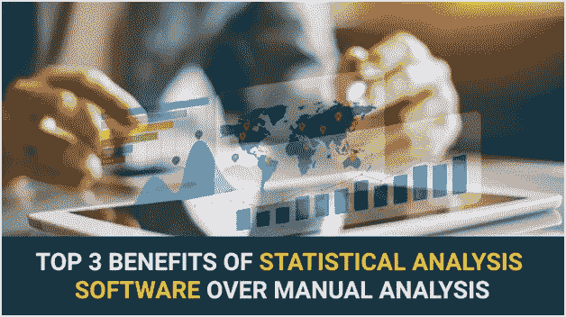

# 统计分析软件优于手动分析的三大优势

> 原文：<https://medium.datadriveninvestor.com/top-3-benefits-of-statistical-analysis-software-over-manual-analysis-9caa6cd1f5d1?source=collection_archive---------1----------------------->

统计分析是收集、转换和组织数据以发现有用信息从而做出明智决策的过程。统计分析为业务经理提供了关于复杂情况的实时数据，以帮助他们根据事实而不是直觉做出决策。

统计学最常见的用途是衡量绩效，无论是强化营销策略的绩效、新产品系列的绩效还是员工的绩效。此外，它还能帮助企业预测和应对风险，并优化投资回报。

 [## 数据科学和软件工程哪个更有前途？数据驱动的投资者

### 大约一个月前，当我坐在咖啡馆里为一个客户开发网站时，我发现了这个女人…

www.datadriveninvestor.com](https://www.datadriveninvestor.com/2019/01/23/which-is-more-promising-data-science-or-software-engineering/) 

随着越来越多的行业选择 [**最佳大数据分析公司**](https://www.goodfirms.co/big-data-analytics) 来帮助产生数据，对数据统计分析的需求也在增加。统计分析为充分利用大量可用数据带来了许多好处，如帮助市场研究、产品开发、绘制公司增长率图、提高公司效率等。

但是，手动分析业务生成的数据会导致误导性的结论和严重的失真。企业必须承认不利之处，以掌握统计分析的概念。

让我们分析数据分析的主要缺点，以及统计分析软件如何帮助避免这些缺点。

1.  **采样误差**

统计分析的成功主要取决于收集的数据。当数据科学家基于有偏见或错误的程序收集数据时，结果会完全变得无用。当实际总体与样本总体之间存在差距时，就会出现抽样误差。包含大量表示的样本可能会产生较小的误差。然而，如果样本人群与重点人群不相关，结果可能会产生误导。例如，如果专注于寻找最有效的酒店管理软件的研究包括大多数在零售或医疗保健行业工作的参与者，结果将是不确定的。同样，如果更多的参与者来自同一组酒店，结果也会有偏差。

**解决方案:**

统计分析软件可以访问更大的数据库，并提供简单的定制。这两个属性结合在一起，使企业能够确保评估正确的数据，并确保随后的数字是公正的和决定性的。此外，该软件还分析企业中预先存在的数字和信息。由于大多数统计软件都是自动化的，所以不需要反复手工输入数据，减少了工作量。

**2。** **简单化的解决方案**

统计分析为特别复杂的问题提供了极其简单的答案。当仔细检查有限的数据时，这可以被认为是一种优势。然而，当考虑大量信息时，过于简化的解决方案会被认为是不正确的分析。例如，在单个变量的帮助下学习一个多元概念。不充分的片段集会导致错误的假设。分析工具的范围很广，手动计算使用不适合特定情况的工具的可能性非常高。此外，统计分析做出评估样本、变量等属性的假设。在特定条件下放弃某些假设以简化结果是可以接受的。然而，违反一个关键的假设将导致产生误导性的结果。

**解决方案:**

统计分析软件了解创建易于理解的解决方案的需求，同时保持结果的准确性。该软件知道何时评估组均值或中位数，以及是否断言与数据的线性关系或非线性关系。 [**best 统计分析软件**](https://www.goodfirms.co/statistical-analysis-software/) 提供多元分析、回归分析、统计过程控制等功能。来处理数据的运作。这些特征控制过程以避免遗漏关键数据，同时保持结果的可理解性。

**3。** **相关性与因果关系**

统计分析倾向于过度概括结果。有时，研究人员经常发现显示两个变量之间相关性的证据。然而，这并不意味着一个变量是另一个变量的原因。例如，一个网站实现了新的网页设计；网页流量开始同步增加。现在的问题是，新设计是流量增加的原因，还是流量增加是有机的，并且与新设计的发布时间相关？对数据的手动分析可能会推断出两个场景之间不存在的关联，并可能给决策者错误的想法或印象。

**解决方案:**

为了确定两个变量之间的因果关系，广泛测试因变量和自变量之间的关联是很重要的。统计分析软件帮助企业根据准确的预测做出决策。该软件采用算法和机器学习来识别因果关系。该软件执行假设检验和 A/B/n 实验，研究多种设置下的随机实验结果，以验证结果是否代表因果关系。理解关键结果和客户行为之间的联系是开发产品的基础。

**最后的话:**

在当今时代，数据是任何业务结构的支柱，数据挖掘至关重要。即使分析师非常谨慎地执行手动数据分析，如果数据集调查时间过长，结果也可能不正确。在统计分析软件的帮助下，统计人员可以有效地跟踪在研究过程中进行的测试数量，并在适当的背景下显示结果。总之，统计分析软件帮助企业小心谨慎地走这条路，避免上述缺陷。

大多数统计分析软件都有非常友好的用户界面，进一步简化了过程。它可以快速生成图表和图形来表示描述性统计数据。此外，整合统计分析软件不需要雇佣内部数据科学家团队。然而，明智的做法是在投资之前选择免费试用该软件，以验证其工作情况。

您还可以访问 GoodFirms.co查看无数软件和服务，如商业智能软件、数据提取软件、大数据分析公司等，帮助企业高效获取、评估和分析大量可用数据。