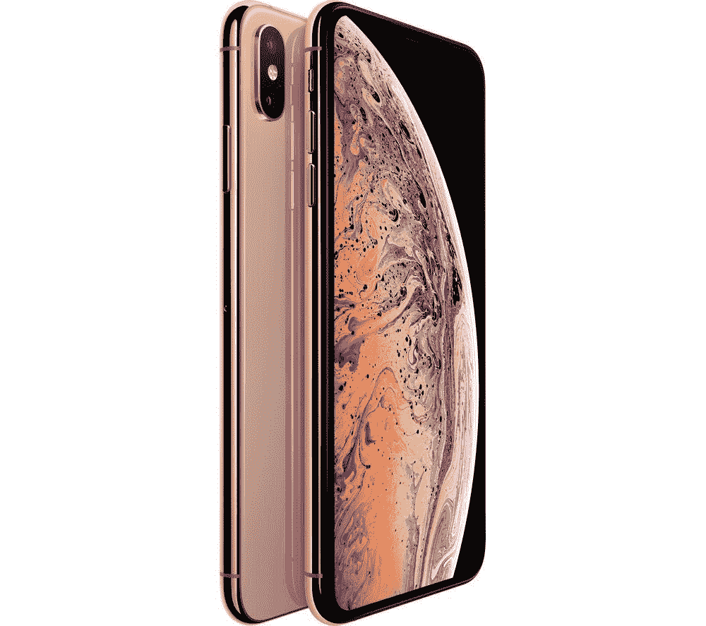
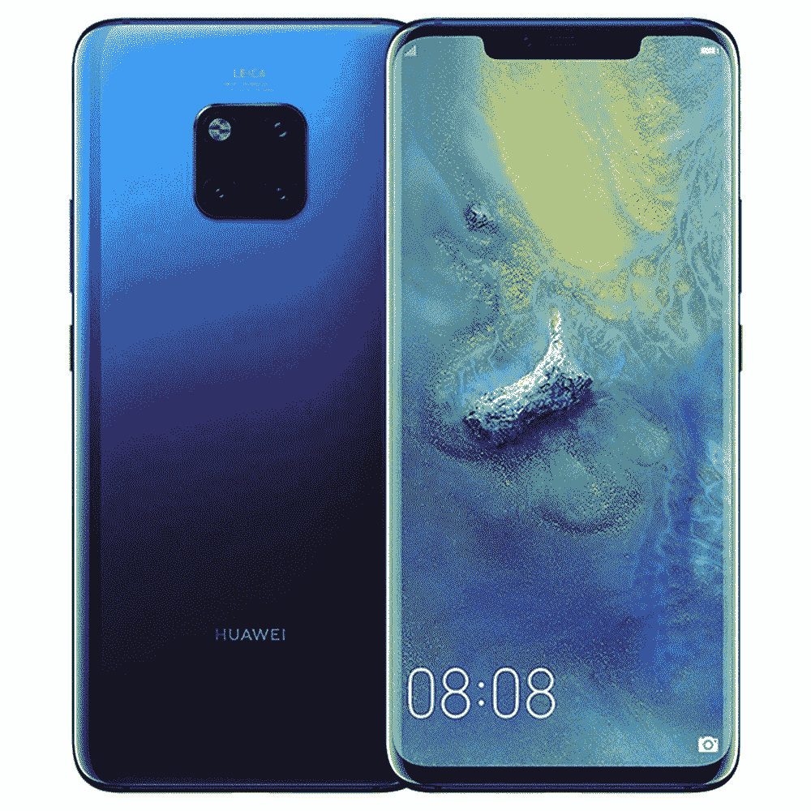
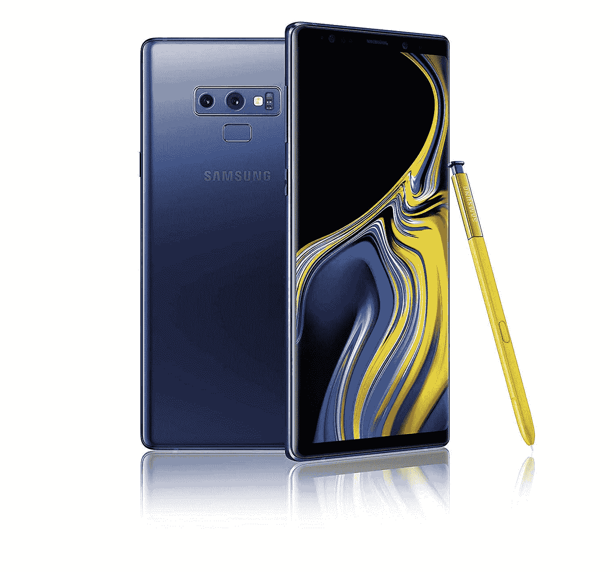

# 2018 年三大旗舰智能手机

> 原文：<https://medium.datadriveninvestor.com/top-3-flagship-smartphones-of-2018-dadb809af04d?source=collection_archive---------32----------------------->

阅读时间:3 分钟

旗舰智能手机总是(几乎总是)凭借其配备的一系列令人惊叹的功能在市场上大受欢迎。

旗舰智能手机对品牌来说至关重要，其设计方式适合更广泛的受众。

另请阅读: [Galaxy A9 (2018)是第一款配有四摄像头的智能手机](https://garimashares.com/2018/10/11/samsung-galaxy-a9-2018-is-the-worlds-first-quad-camera-smartphone/)

它可能没有最好的功能，但作为一个整体，它对于普通消费者来说是一款平衡的手机。**福**

随着 2018 年接近尾声，让我们来回顾一下 2018 年的 3 大旗舰智能手机。

# 3.iPhone XS Max

这款手机配备了目前市场上最快的芯片，苹果 A12 Bionic (7 纳米)。iPhone XS Max 和 iPhone XS 的处理器一样，区别在于大小。

与其他版本相比， [iPhone XS Max](https://amzn.to/2zTRDPh) 的主要升级是改进后的 12MP+12MP 后置双摄像头。

扬声器也有更好的沉浸效果。它支持快速充电，并具有优质的外观。

虽然这款手机有明显的进步，但价格标签非常高，就像大多数苹果产品一样。

在印度，基础版 iPhone XS Max 的售价为 **Rs。10.9 万**还有顶配版定价 **Rs。14.5 万**。

# 2.华为 Mate 20 Pro

[华为 Mate 20 Pro](https://amzn.to/2UyuUkm) 支持全球最快无线充电。它有一个 40W 的快速充电器和一个 4,500mAh 的电池。

一部普通的快速充电手机大约有 8-12W 的快速充电器。该手机还支持反向充电。

这款智能手机上的芯片组是华为的
海思麒麟 980 (7 nm)，速度非常快，在使用手机时不会产生延迟。

后置摄像头是 40MP+20MP+8MP 的三摄像头，拥有广角镜头。如果摄影是你重要的事情之一，华为 Mate 20 Pro 是一个完美的选择。

另请阅读:[摄影中的引导线是什么以及如何使用它们](https://garimashares.com/2018/12/06/what-are-leading-lines-in-photography/)

有了这样一个令人惊叹的后置摄像头，令人沮丧的是，尽管前置摄像头只有 2400 万像素，但性能却没有达到那个标准。根据用户的评论，双扬声器的性能很弱。

[华为 Mate 20 Pro](https://amzn.to/2UyuUkm) 印度售价在 **Rs 左右。76，000** 用于其 128 GB 内部存储和 6GB RAM 变体。

# 1.三星 Galaxy Note 9

三星用这个更新的版本 [Galaxy Note 9](http://fkrt.it/NUhAQnuuuN) 真正升级了之前的 Galaxy Note 8。

它有更好的电池寿命，电池为 4,000mAh。该显示器拥有高达 516ppi 的分辨率，确保了清晰的屏幕。

制造质量是影响你选择智能手机的一个重要因素，而 [Galaxy Note 9](http://fkrt.it/NUhAQnuuuN) 在列表中拥有最好的制造。

我对三星手机的感觉是，在未来的某个时候，它们在你的手机中导航时往往不会流畅和快速，动画滞后相当多。

如果我们仔细观察，华为 Mate 20 Pro 以更好的电池寿命击败了它，[谷歌 Pixel 3XL](http://fkrt.it/NSYuHnuuuN) 拥有更好的摄像头，但 [Galaxy Note 9](http://fkrt.it/NUhAQnuuuN) 仍然位居榜首，因为它在任何一个领域都不缺乏。

它包含了适量的功能，没有什么大的缺陷。

三星 Galaxy Note 9 起价 Rs。61，500 英镑，在 Flipkart 上可以买到。

*原载于 2018 年 12 月 10 日*[*garimashares.com*](https://garimashares.com/2018/12/10/top-3-flagship-smartphones-of-2018/)*。*