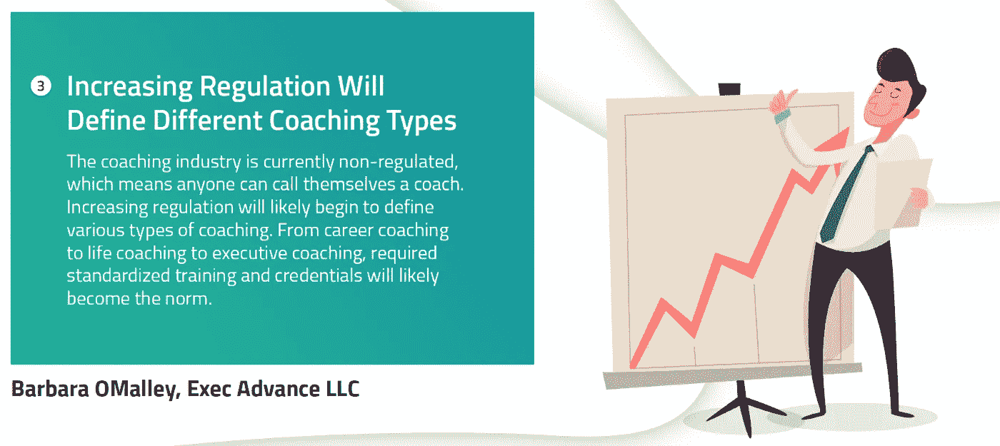

# 领导者的 4 大辅导方法

> 原文：<https://medium.datadriveninvestor.com/top-4-coaching-methods-for-leaders-22a7931189a0?source=collection_archive---------1----------------------->

***久经考验的执教方法***

随着时间的推移，不同的方法随着不同的途径而发展。正如[芭芭拉·欧玛利](https://twitter.com/barbomalley)所描述的，未来将给我们带来标准化和规范化的教练方法。在下文中，您可以找到教练类型和方法的选择，它们提供了应用教练方法的基本框架。

**答:以解决方案为中心的辅导**

我们的许多转型方法都是面向问题的——我们试图通过检查问题来改变。问题是什么。
这个效果很好，特别是对于机器和流程。但是当我们与人一起工作时，对根本原因的识别往往给我们提供了很少的解决方案，并且可能使情况变得更糟！忘掉它，集中精力解决问题。这种面向解决方案的方法包括:
找出有效的方法并做更多的工作。
这并不意味着我们拒绝讨论问题，而是意味着发现这个人想做什么和想学什么。这是他们的承诺和激情，并加以改善。这个方法由
[Paul Z. Jackson](https://amzn.to/2vF0kug) 描述。

 [## 想知道领导是谁？请他决定。数据驱动的投资者

### 一个有效的领导者能为组织提供的最有价值的东西之一是决策能力…

www.datadriveninvestor.com](https://www.datadriveninvestor.com/2019/01/25/want-to-know-who-the-leader-is-ask-him-to-decide/) 

如果你正在寻找一种数字化的方式来为自己实践以解决方案为中心的辅导，看看 [ROCKY。艾把领导蔻驰揣在兜里](https://www.rocky.ai/)。

以解决方案为中心的辅导解释

**B .转型辅导**

这种方法正在改变我们看待自己的方式。这甚至可能包括改变我们的自我形象或对我们和我们的局限性的看法。通过正念培养意识和做决定从改变我们的观点开始。第二步是重塑我们的思维模式，最后一步是逐步改进我们的实践。这也是最接近生活指导的方式。关于这种教练方法的著名作者是罗伯特·哈格罗夫。

Transformational Coaching method explained

**C .情商辅导**

自我意识在这里也是一个基础。识别和理解情绪、情感和驱动力。这也需要学习自我管理。管理或重新引导破坏性冲动和情绪以及暂停判断的能力。带着行动前先思考的意图。意识到他人是识别和理解他人的情绪和动力以及这些情绪和动力对我们关系的影响的关键能力。最后，社会软技能到位，以管理和建立网络的能力，找到共同点，建立信任。你可以通过 [Liz Wilson](https://amzn.to/2Jnnsp4) 找到一些关于这种方法的文献。

Emotional Intelligence Coaching explained

**婷成长教练**

这种教练类型由[约翰·惠特莫尔和理查德·莱登](https://amzn.to/2LpsLr0)开发，面向目标设定和问题解决。目标是终点，是我们想要到达的地方。必须明确定义它来衡量成就。然后你就有了当前的现实。有哪些问题、挑战，通往目标的旅程是什么？当然会有阻碍你进步的障碍。一旦发现了障碍，你需要找到解决它们的方法。这些是选项。最后，你有了前进的方向。它由将使我们更接近预期结果的行动步骤组成。这种方法与谷歌实现 [OKR](https://en.wikipedia.org/wiki/OKR) 目标和关键结果的方法有相似之处。

GROW Coaching method explained