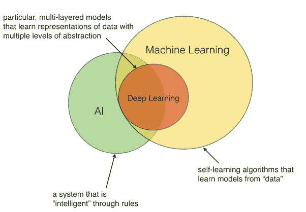
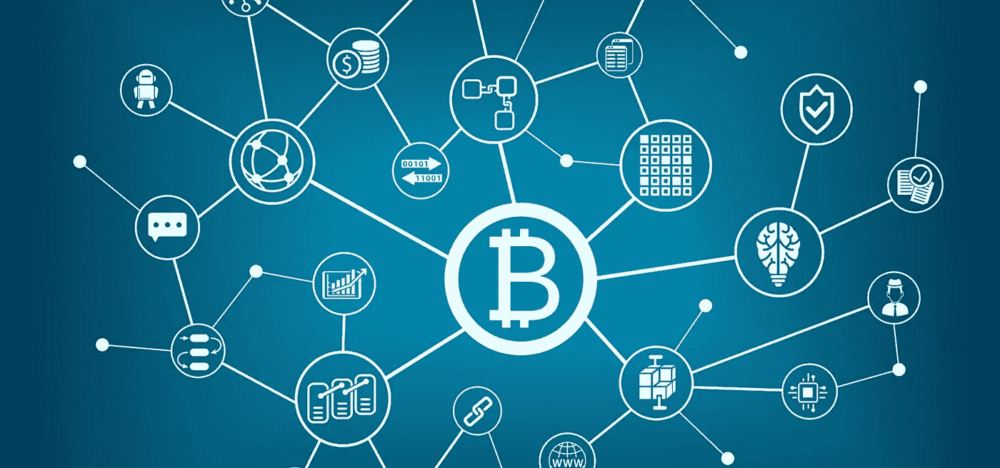
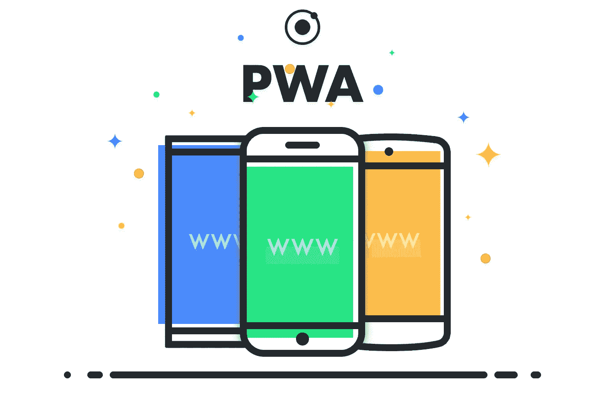
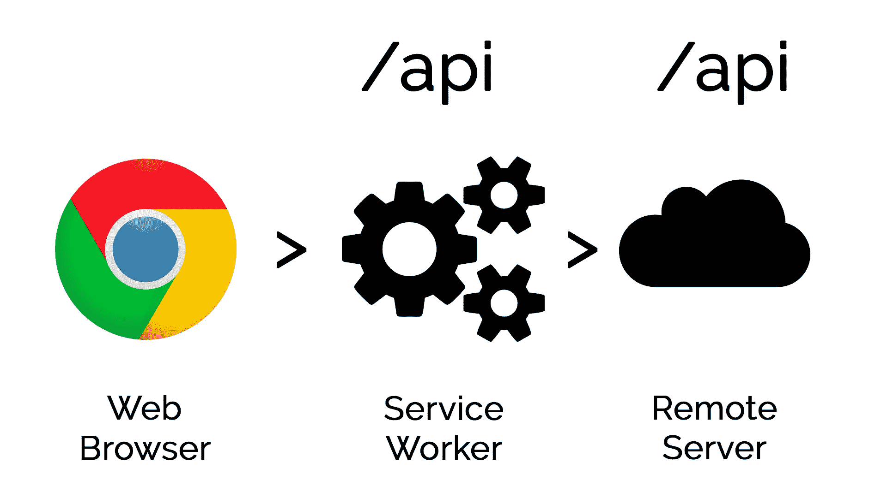
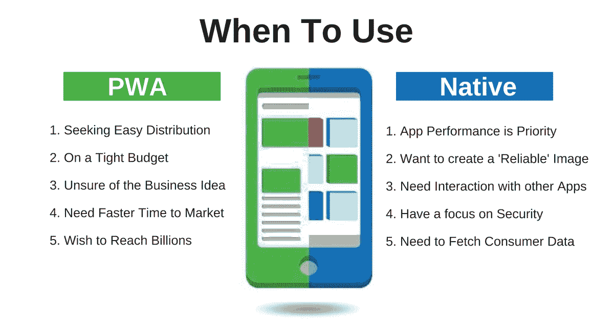

# 2019 年将创造更多就业机会的 4 大技术

> 原文：<https://medium.datadriveninvestor.com/top-4-technologies-that-will-generate-more-employment-in-2019-91ca97f8a79a?source=collection_archive---------18----------------------->

大家好！2018 年几乎已经结束，对我来说这是梦幻般的一年。希望今年对你来说也是令人敬畏的一年。将我的技术领域从一名 Web 开发人员扩展到现在学习更多关于人工智能和区块链的知识，我看到了一些突破性技术在这一年中的巨大增长和需求。

所以，如果你是刚刚开始编程之旅的人，或者是正在寻求转型的人，我相信你来对地方了。因此，在这篇文章中，我将讨论 4 大技术，在我看来，这将在 2019 年创造大量就业机会，如果你看看统计数据和这些技术从社区获得的兴趣，这个过程已经开始。如果你想创业或者正在找工作，我想这四项技术肯定是你必须要找的。所以事不宜迟，我们开始吧。

# 1.人工智能

如果你是一个热衷于软件开发的人(或者至少计划成为一个)，人工智能开发是你应该关注的事情。人工智能已经在几乎所有的行业中找到了自己，主要原因是**的数据。“如果没有数据，就没有业务。”**如今，大多数组织在过去几年中收集了大量数据，他们可以利用这些数据得出有用的预测/见解，帮助他们提升现有业务，毫无疑问，对**数据科学家**的需求与日俱增。所以，如果你是一个刚刚起步的人，或者想转型，不要想太多，直接投入进去，有太多东西要学，人工智能本身就是一个非常广阔的领域，有太多东西要覆盖。

此外，你可能会考虑学习人工智能，因为谁知道它可能会威胁到你自己的工作，这要感谢人工智能算法给我们带来的惊人的自动化能力，当然，在自动化的地方，人类的工作肯定会受到威胁，因为机器更聪明，可以更快更精确地做事情，但它们也很笨，不能到处使用。只要投入到这项惊人的技术中，你就会知道我在说什么。

首先，https://www.deeplearning.ai/是个好地方。

# **2。区块链**

各行各业的组织已经开始构建基于区块链的**分散式应用**毫无疑问，这将在未来的时间内增加，因此对区块链开发者的需求将会很高。

Web 3.0 正在兴起，如果你是一家初创公司，担心大型科技巨头，如 T2、谷歌、脸书等。认为你无法在这场科技竞赛中竞争，这可能是你最好的选择。去中心化是一条必由之路，毫无疑问，它获得了开发者社区的极大兴趣。你可能已经听说过加密货币，如**比特币、以太坊、Monero 等等。构建去中心化的应用程序是一项非常需要的技能，毫无疑问，你越早学会，对你越有好处。**

因此，如果你想了解更多这方面的知识，了解更多关于区块链和**以太坊**的**基础知识将是一个很好的起点。你会在网上找到大量的资源，这相对来说是一项新技术，有很多东西需要学习，所以最好尽快开始学习。绝对是未来时代的游戏改变者。**

# 3.渐进式网络应用(PWAs)

如果你是一名 Web 开发人员，那么目前在社区中有很多关于这个东西的炒作**、**所谓的**渐进式 Web 应用。需求已经在快速增长。谷歌认为 pwa 是网络应用的未来，他们已经在这方面做了很多工作。o 你们想到的下一个问题是，PWA 到底是什么？简单来说，PWA 就是解决移动网络痛点的持续解决方案。关注术语**进行中的**，因为它们仍处于开发阶段，仍有许多内容有待探索。基本上，公共福利援助计划的核心工作是基于**服务工作者的概念。****

基本上，服务工作者就像客户端和服务器之间的代理，当网络请求通过网络时，当我们得到响应并在后台运行时，它会拦截这些请求。

你可能听说过原生应用和混合应用，但是 pwa 最近在 web 开发社区引起了很大的轰动，这些也是相对较新的，毫无疑问，从目前的趋势来看，如果你能学习 pwa 的基础知识，对你的需求将会非常高。关于艾滋病人，可能还有很多东西要学。 [**这个**](https://developers.google.com/web/progressive-web-apps/) 确实是个不错的起点。

当然，在**原生应用**和 **PWAs、**之间有一个权衡，这可能有助于你区分。

在这个领域还有很多东西需要你去发现，所以请尽快开始并掌握它，因为它在开发社区中相对较新。

# 4.网络安全

老实说，我在这个领域没有太多的工作经验，但毫无疑问，这是目前最热门的话题之一，并将永远如此。来吧，你不希望任何坏人破坏你的百万美元业务，只要有技术，就肯定有漏洞，网络安全的需求会毫不犹豫地增加。不管你的生意赚了多少钱，这都是对你的整个架构的一次攻击，你知道一切都完了。学习这一点并不容易，是的，在这个领域开始很难，但一旦你相处，这可能会非常有趣，而且有很多需求。此外，人们必须出于正当目的使用这些工具，因为在大多数国家，尤其是美国，法律对网络犯罪非常严格。

各种规模的企业都关心网络安全，他们越来越多地希望雇佣更多的网络安全工程师，以确保他们不会受到威胁。

所以，我想这就是我对这篇文章的看法。希望你喜欢它，它帮助你在这么多的选项中做出选择。你可以在 Twitter 上关注我，因为我经常写科技博客并在 Twitter 上分享。祝你新年快乐。感谢阅读！