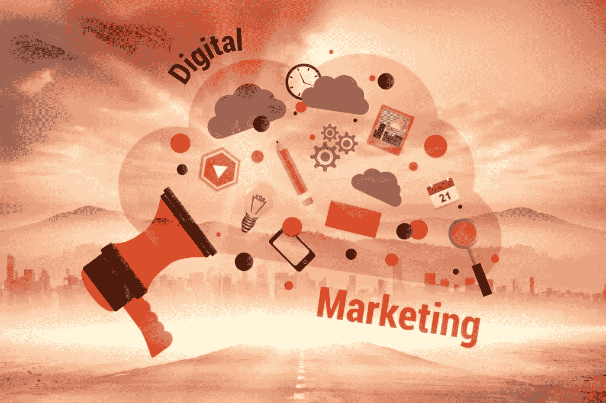

# 2019 年你应该关注的 5 大数字营销趋势

> 原文：<https://medium.datadriveninvestor.com/top-5-digital-marketing-trends-you-should-be-following-in-2019-6e57374fd81d?source=collection_archive---------12----------------------->

所有成功的营销人员都有一个共同点:他们总能找到方法在竞争中胜出。怎么会？通过分析和跟踪随着客户变化而不断变化的趋势。当这股潮流滚滚而来时，你不必被抛在身后。以下是 2019 年你应该关注的一些数字营销趋势:

1.  ***智能软件***

如果你在过去几个月参加了 IT 和数字营销会议，你肯定至少在其中一个会议上听说过人工智能。人工智能工具今天被广泛使用，因为这些工具允许营销人员详细分析客户行为。一旦完成，这些“机器人”就会根据它们被编程的方式做出决定。

 [## 准备在 2019 年改变世界的技术-数据驱动的投资者

### 很难想象一项技术会像去年的区块链一样受到如此多的关注，但是……

www.datadriveninvestor.com](https://www.datadriveninvestor.com/2019/01/17/the-technologies-poised-to-change-the-world-in-2019/) 

否则，这可能是你必须分配给员工的工作。有了一个人工智能软件工具来确定你的客户将如何思考和行动一项服务/产品，你可以更快地得到你需要的结果。事实上，根据你得到的软件，这些工具也可以通过一个聊天窗口与客户聊天，这个聊天窗口可以直接放在你的网站上。

**2*。10 秒广告***

如果一开始不跳过，只有 9%的观众会看完一个 5 秒钟的视频。大多数人在一分钟过去时停止观看，而且内容不会让他们长时间感兴趣。换句话说，普通观众的注意力持续时间与金鱼没有什么不同。

这就是为什么越来越多的数字营销者创造和分发更短的 10 秒钟视频或小吃广告来吸引他们。除了注意力持续时间短之外，另一个原因是因为在线视频内容的量非常大。想要脱颖而出的品牌必须确保他们的视频足够有创意，但也足够短以吸引眼球。

*3。* ***微观影响者***

作为一名数字营销人员，你必须熟悉品牌大使和社交媒体影响者。这些人与大公司关系密切，因为他们在自己的个人资料上推广产品，而这些个人资料通常拥有大量追随者。把他们想象成网络名人，他们可以比真正的名人更快地聚集一百万粉丝。

拥有这么多追随者的影响者被称为宏观影响者，而拥有 10 万到 50 万追随者的影响者被称为中间影响者。然而，在 2019 年，微观影响者占据了至高无上的地位。这些人可能只有 1 到 10 万名粉丝，但这正是他们与其他人如此相关的原因。

通常，想要深入了解顾客或者想要找到他们抱怨的根源的品牌会雇佣微小的影响者来说他们的语言。他们认识到，你也应该认识到，影响客户的最佳方式是站在他们的角度说话。

*4。* ***程序化广告***

管理和分发广告被认为是一项全职工作，但这并不意味着你一天中有足够的时间来完成它。这就是程序化广告发挥作用的地方。你所需要做的就是让人工智能根据有针对性的算法来购买和投放广告，这可以让你的客户毫不费力地脱颖而出。

与传统广告不同，程序化广告是实时发生的。它依赖于大数据、技术专家和自动化的结合来发挥作用，但你仍需要一些人力资本来让它发挥作用。这使得它成为需要大众市场吸引力的品牌比那些寻求利基吸引力的品牌更好的选择。

*5。*T8*个性化*

作为一名数字营销人员，你必须已经知道购买者角色。换句话说，个性化对你来说不是一个陌生的概念。如今，用户正在寻找定制内容，以便在购买或潜在购买时为他们提供更加个性化的体验。根据福布斯的数据，44%的消费者说他们可能会从一个能给他们带来个性化购物体验的品牌那里购买。

你想想这也是可以理解的。如果顾客知道他/她得到了照顾，他们的购买得到了优先考虑，他们将保持忠诚，并传播有关业务的信息。这转化为更多的收入、更高的品牌一致性和跨渠道销售机会的增加。

这可以是任何东西，从星巴克杯子上的他们的名字到视频信息中的一个小呼喊。人们喜欢知道他们忠实认可的品牌，并关心他们的体验，这是传统营销策略中明显缺乏的东西。

顺口溜和千篇一律的广告活动今天已经不再管用了，因为用户变得更有见识了。现在，他们可以从有影响力的人那里获得在线评论，这些人对他们希望获得的产品或服务给出了诚实的意见。

个性化的购物体验可以让他们更容易接受品牌信息。这可以是基于他们的搜索历史的定制产品推荐、首席执行官感谢他们惠顾的特别视频消息、个性化的数字广告以及向他们介绍你正在尝试的新服务或新产品的有针对性的电子邮件。

如果您正在寻找一家能够帮助您应对这些趋势并在竞争对手中脱颖而出的数字营销机构，请立即联系 [Smartcut Marketing](https://www.smartcutmarketing.com/) 。我们提供创造性的营销解决方案，帮助您提升业务绩效并增加销售线索。