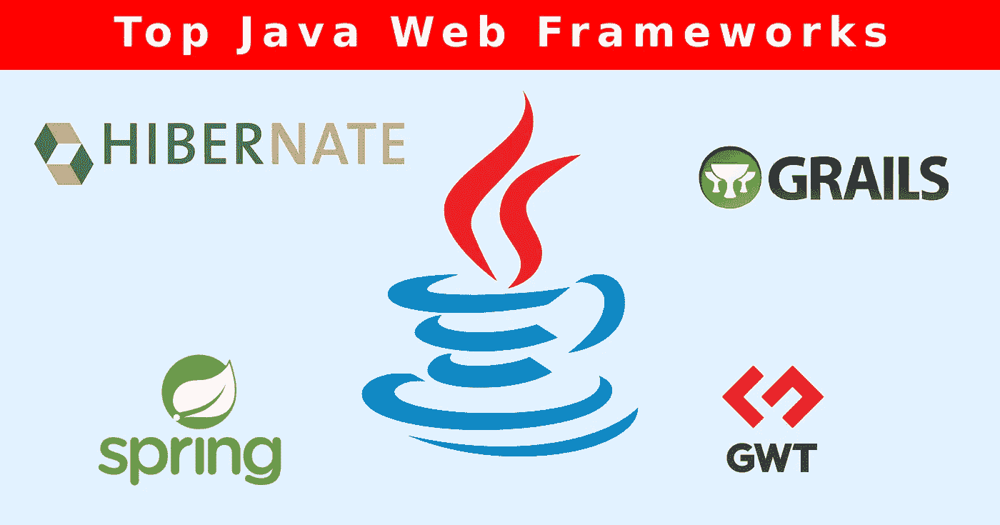
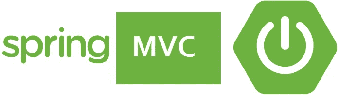
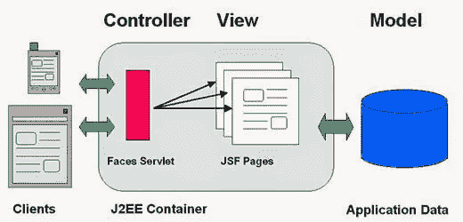

# 前 5 名 Java Web 应用程序框架

> 原文：<https://medium.datadriveninvestor.com/top-5-java-web-application-frameworks-114b135812e4?source=collection_archive---------23----------------------->

框架是预先写好的代码，您可以在其中添加自己的代码来解决特定领域的问题。框架通常由大量的类组成，这些类采用了你的代码的形式，因为通常是框架在控制。

Java 框架有大量的代码，例如，Java 的 Swing 和 AWT 类来管理用户界面。这些大量的代码是类的集合，有时被称为框架。这些框架可以通过调用它的方法来调用，继承。

有各种各样的 web 框架为模板框架提供了库。随着代码的频繁重用，这些库意味着可以方便地访问数据库和进行会话管理。

# Spring MVC(模型视图控制器)

Spring 不仅仅是一个 web 框架，因为它被设计成一个分层的 J2EE/Java 框架。它是一个完整的编程模型，建立在 Java 之上，对于 web 应用程序的开发和配置非常有用。它适用于各种想象，包括 Spring Boot，这是一种启动 Spring 应用程序的方式。

Spring 因其完善的生态系统而在程序员中闻名，该生态系统允许开发人员构建强大可靠的云原生应用程序。它是具有许多附加组件的组件的组合，例如 SOAP 服务、REST APIs 和安全认证。

Spring MVC 框架利用了最新的分布式模式，比如包含应用程序安全性和批处理的微服务架构。

# JSF (Java 服务器接口)

JSF 是 Java 标准的一部分，它完善了 Java 的. net 实用框架。它在希望坚持已发布标准以提高跨平台可移植性的程序员中很受欢迎。该框架得到了 Oracle 的支持，这有助于文档的易用性。

这个框架可能不是 Java 开发的最佳框架，但是它的工具和丰富的库可能会支持开发人员应对应用程序的复杂性。JSF 是基于组件的，这使得它可以用其他组件进行扩展。除此之外，JSF 还允许现有的后端 Java 代码通过 web 接口进行扩展，而无需引入新的框架。此外，JSF 是 Java EE 的重要组成部分，这意味着如果你想要 EE 环境 Java，将不会有额外的依赖 JSF。

# GWT(谷歌网络工具包)

GWT (Google Web Toolkit)是一个开源工具集，很像 JSF。它严格专注于构建 web 界面，并使 web 开发人员能够创建复杂的 JavaScript 前端应用程序。JavaSource 中的所有东西都可以构建在一个支持的平台上，集成了 GWT Ant 构造文件。

在过去的几年里，GWT 失去了一些人气，因为用 Java 代码维护复杂的 JavaScript 用户界面很容易。除此之外，该应用程序还获得了 Apache License 2.0 版本的许可。它有各种 JavaScript 库，从而让开发者体会到 GWT 的真正力量。

# 冬眠

谈到最好的 Java web 框架，Hibernate 是一个高级的 ORM 框架，它允许在 Java 对象的数据库中执行操作。它是编程语言必不可少的对象关系映射设备，因为它通过取代对高级数据库的访问，打破了对象关系阻抗和不匹配。Hibernate 是一个连续的概念，它使用缓存将数据从 Java 环境带到数据库。

最好的部分是它提供了一个域模型(面向对象)到一个关系数据库的映射框架。它的特点是帮助后端开发人员访问数据。此外，它是在 GNU Lesser General 的公共 2.1 许可证下发布的自由软件。

# 支杆

Struts 是 Java Web 框架列表中最好的一个。它被大多数现代软件工程师使用，是 Apache Struts 1 第二版的继承者。

Struts 是开发 web 应用程序基础的框架。因此，这个框架对于用 Java EE 构建新的 web 应用程序的开发人员来说是很好的。此外，它是一组合作解决特定类型问题的接口和类。

如果 web 将具有高数据负载，比如广播 web，那么讨论 Struts 2 是正确的选择。原因是，它为众多 Java 应用程序配备了一个. net 框架。Struts 是各种支持团体共同努力的结果。因此，与互联网的常规功能不同，它可以创建动态响应。

# 结果

说到 Java 框架，市场上有很多框架，很难确定哪一个最适合你。框架中有许多选项适合您的项目。在这种情况下，使用上述指南来评估您的需求。

在这里，我们研究了 Java 框架及其优势。这些市场上流行的基于 Java 的框架各有其重要性。

如果你正在寻找这样一个拥有足够基础设施的完美开发团队，那么 Quytech 及其[雇佣的专用应用程序开发人员](http://www.quytech.com/hire-dedicated-developers.php)就在这里为你的下一个项目服务。

**湿婆神**

Shiva Kushwaha 是首席博客作者、博客作者和内容营销者，他在许多博客上发布和管理内容。Shiva 写生活方式、技术、旅行、健康等等。他已经在营销行业工作了 5 年，在这个行业有着非常宝贵的经验，他已经成为德里著名的客座博主。

*Oginally 发布于 2018 年 11 月 1 日*[*【www.allperfectstories.com】*](https://www.allperfectstories.com/java-web-application-frameworks/)*。*

