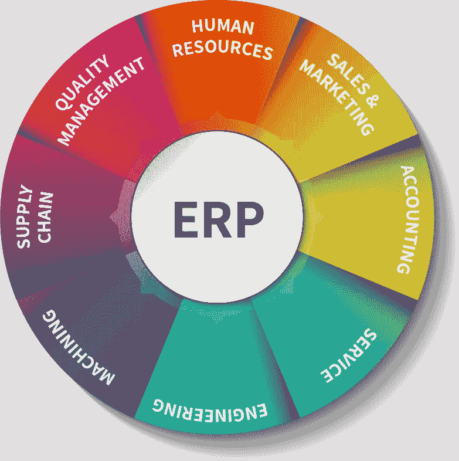
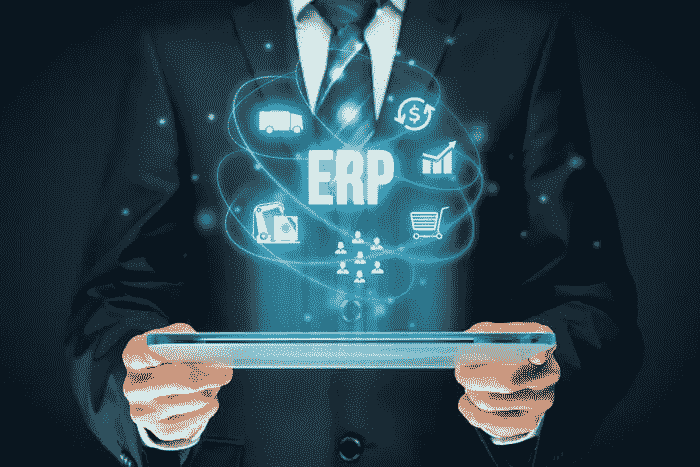
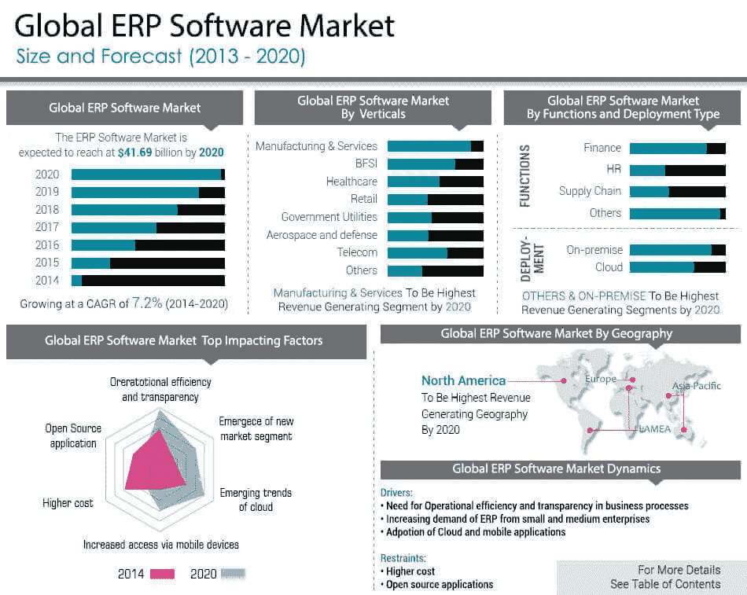

# 内部 ERP 和云 ERP 解决方案之间的 5 大主要差异

> 原文：<https://medium.datadriveninvestor.com/top-5-key-differences-between-on-premises-erp-and-cloud-erp-solutions-5b0836a1506e?source=collection_archive---------1----------------------->

# 云 ERP 解决方案优于内部 ERP 的优势

如果您正在寻找自动化您的组织的工作流程，那么您可能会遇到企业资源规划(ERP)术语在您的密切的商业圈。当然，在选择现场 ERP 和云 ERP 解决方案时，总是会有一场激烈的争论。ERP 是一个连接组织所有部门的自动化解决方案。它有助于提高运营效率，控制成本，从而增加利润。

内部部署和基于云的 ERP 之间的基本区别在于软件的部署和访问方式。内部企业资源规划软件安装在本组织拥有或租赁的计算机和服务器上。基于云的 ERP 部署在云上(服务器由供应商拥有或租赁)，并通过 web 浏览器访问。基于云的 ERP 系统通常是 SaaS(软件即服务)产品，其中服务包括软件及其运行的基础设施。

Source: erpinnews

让我们来看看内部部署和基于云的 ERP 解决方案之间的一些差异。这篇文章为您提供了一个要点，告诉您如何选择满足您业务需求的最佳 ERP 解决方案。

**费用和时间:**

内部 ERP 解决方案需要更高的前期投资来购买和管理软件。如果您的组织没有 IT 团队，您必须在部署系统之前雇佣合适的人员来管理系统。您可以将内部 ERP 视为资本支出。建立基础设施和部署内部企业资源规划系统是一个耗时耗力的过程。

基于云的 ERP 系统已经在云上建立和部署。您通常需要支付包括硬件和软件费用在内的订阅费。假设其他一切保持不变，从长远来看，这一成本通常低于内部方案的相关成本。使用基于云的 ERP 可以被认为是运营支出，只要服务被利用，你就要付费。与内部系统相比，基于云的 ERP 解决方案部署时间更短。

**定制和移动访问:**

定制和移动可访问性是 ERP 系统正在考虑的方面。就内部 ERP 系统而言，它提供了高度的定制化。但是定制内部企业资源规划系统的过程可能会延迟实施过程。随着 ERP 供应商频繁推出新的软件更新和增强功能，您现有的系统可能会变得被动。您的员工和利益相关方无法随时使用内部 ERP 进行实时数据监控。

Source: CIO

在基于云的 ERP 系统的情况下，增值经销商将根据公司的要求进行定制。您的云 ERP 系统将自动更新为最新的更新和安全补丁。终端用户可以通过本地移动应用程序使用云 ERP 系统。

**数据安全性和所有权:**

在内部部署 ERP 系统的情况下，组织掌握数据安全并对其进行控制。但是，有时由于缺乏实施 adept 数据安全协议和监督导致恶意攻击。

在云 ERP 系统中，数据托管在供应商的云上，可以通过 web 浏览器访问。为了保护数据，公司会选择加密方法来增强安全性。云服务提供商将自动更新您的系统，以确保您在安全的环境中工作。

**集成和可扩展性:**

选择 ERP 解决方案时，集成是需要考虑的令人望而生畏的因素之一。在内部部署的情况下，您需要花费大量的精力和时间来将新版本与现有的遗留系统集成。有时，如果集成过程做得不好，它可能会失效。而在云 ERP 系统中，服务提供商将负责集成流程，为客户和最终用户提供无缝的工作体验。

可伸缩性是指您的 ERP 随着业务运营和用户数量的最终增长而具有的灵活性。尽管运营和用户数量在增加，但云 ERP 解决方案实现了高度的灵活性。也许，现场 ERP 解决方案不能为用户数量提供同样程度的自由。通常，您需要部署额外的硬件来处理它。

**培训和支持:**

内部 ERP 系统需要对员工进行长期的广泛培训和技术支持。

在 [**基于云的 ERP 系统**](http://www.netsuite.com/portal/resource/articles/on-premise-cloud-erp.shtml) **s** 的情况下，服务提供商将支持技术团队管理 IT 职能，并支持解决技术方面的问题。

Source: [Magzter](https://www.magzter.com/news/603/1656/102017/qcju9)

以上是推动更多业务增长和有效自动化的云 ERP 软件的 5 大特征。

最近，支持云的 ERP 系统已经成为组织工作流自动化的重要解决方案。我们 Amzur 为我们的客户提供基于云的 NetSuite ERP 解决方案，提供行业最佳体验。我们的顶级技术集成 NetSuite ERP 解决方案将配置您的所有业务模块，使其具有直观的工作流程。

点击此处获取 [**NetSuite 咨询解决方案**](https://amzur.com/netsuite/)