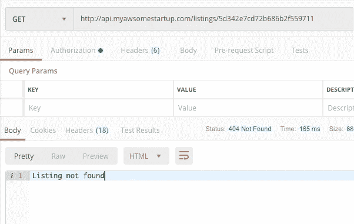
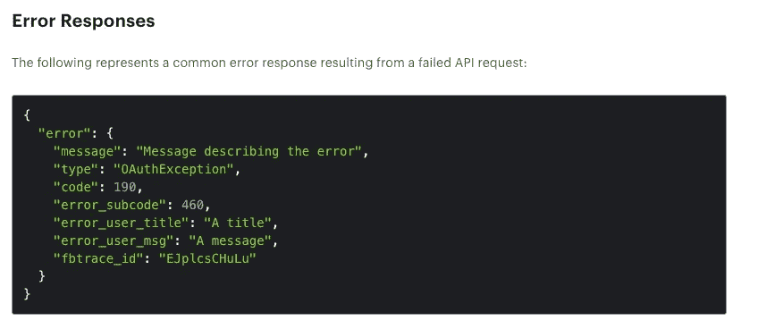

# 在我工作过的每个初创公司中，软件开发过程中最令人痛苦的 5 件事…

> 原文：<https://medium.datadriveninvestor.com/top-5-painful-things-in-the-software-development-process-i-met-in-every-startup-i-worked-9dddbdd6d062?source=collection_archive---------3----------------------->

[](http://www.track.datadriveninvestor.com/1B9E)

我相信不是每个年轻的软件公司或初创公司都有这些问题，但从我的经验来看，这 5 个是我作为开发人员遇到的最常见的问题。它们看起来微不足道，但却给开发人员和企业带来了如此多的痛苦。

## **日志**

我工作过的每一家初创公司(其中一些在仅仅一年的密集开发后就投入生产，另一些已经投入生产几年，拥有庞大的代码库，有数百个客户已经在使用该产品)，几乎没有日志 ***。***

[](https://www.datadriveninvestor.com/2019/02/25/6-alternatives-to-the-yahoo-finance-api/) [## 雅虎财经 API |数据驱动投资者的 6 种替代方案

### 雅虎财务 API 是新的财务 API 万岁！雅虎财务 API 长期以来一直是许多公司的可靠工具。

www.datadriveninvestor.com](https://www.datadriveninvestor.com/2019/02/25/6-alternatives-to-the-yahoo-finance-api/) 

缺少日志使得很难理解为什么会出错。您可以尝试在本地重现该问题，但是您必须模拟相同的应用程序状态，例如数据库。同样，如果您没有日志，您如何知道哪个输入导致了 bug？在许多情况下，您在这里唯一能做的就是添加日志，以便能够在下次出现 bug 时再次捕获它。对企业来说不是一个很好的解决方案…

从开发新软件的第一天起就不添加日志是一个很大的错误，从长远来看，这会减慢你的业务。在有了第一个客户机之后添加日志要痛苦得多，也昂贵得多。当你有成百上千的客户时，我不会谈论损害，仅仅是理解这个问题就需要几个小时或几天…

另一方面，在开发时间添加日志是非常便宜的。如果你有好的日志，你几乎不用花时间去寻找 bug，你可以立即投入时间去寻找解决方案。


如何写好日志是一个专门的话题。我强烈建议在你开始开发一个新项目之前，花些时间了解一下这些术语:

1.  结构化日志
2.  集中记录
3.  分布式跟踪(如果有一个以上的应用程序实例或多个相互通信的服务，这非常重要)
4.  x-请求 Id HTTP 标头

值得一读:

[](https://martinfowler.com/articles/domain-oriented-observability.html) [## 面向领域的可观测性

### Pete Hodgson Pete Hodgson 是位于旧金山湾区的独立软件交付顾问。他…

martinfowler.com](https://martinfowler.com/articles/domain-oriented-observability.html) 

https://www.joeshaw.org/net-context-and-http-handler

[](https://atech.blog/viaduct/x-request-id) [## x-请求-ID

### X-Request-ID 支持意味着您可以轻松地从客户端一直跟踪 HTTP 请求到您的后端 web…

atech.blog](https://atech.blog/viaduct/x-request-id) 

## 错误处理

正确的错误处理是困难的。真的。这就是为什么我遇到的大部分代码都是怀着愉快的心情编写的。不同的语言有自己的错误处理的最佳实践和模式(像 Java 中的抛出早捕捉晚原则)，但是有一些通用的模式可以独立于编程语言使用。


*打字错误*

创建一个包含描述性消息和唯一错误代码的自定义错误。您还可以将一些调试数据放入错误中，并在以后将其打印到日志中。这些错误可能是特定于业务逻辑和工作流的，或者只是低级错误的包装。它将帮助应用程序用户或开发人员理解确切的问题是什么。

举个简单的例子，代替抛出

```
throw new Error('User not found');
```

抛出自定义错误

```
throw new UserNotFoundError(userId)
```

定义了类似于

```
class UserNotFound extends Error {
  construct(userId) {
    this.message = 'Sorry, failed to find the user'; 
    this.code = 'USER_NOT_FOUND';
    this.data = {
      userId,
    };
  }
}
```

主要好处是:

1.  您可以通过在捕获该错误的任何顶级代码上键入来处理该错误。
2.  您可以在 HTTP 请求中响应这个错误，并使用`code`作为标识符，这样客户端就可以通过代码而不是消息字符串来处理错误。
3.  您可以将额外的`data`记录到日志中，这将有助于以后的跟踪

值得一读:

[](https://www.codementor.io/sheena/how-to-write-python-custom-exceptions-du107ufv9) [## 在 Python | Codementor 中编写和使用自定义异常

### 本教程将介绍 Python 中异常的“是什么”和“为什么”,然后带您了解…

www.codementor.io](https://www.codementor.io/sheena/how-to-write-python-custom-exceptions-du107ufv9) [](https://stackify.com/java-custom-exceptions/) [## 在 Java 中实现定制异常:为什么、何时和如何

### 我们已经在这个博客上谈了很多关于异常处理的内容，并描述了 checked 和…

stackify.com](https://stackify.com/java-custom-exceptions/) 

## 灵活的错误响应

帮自己一个忙，在创建第一个 HTTP API 端点时，考虑一下错误的响应格式。



像往常一样，没有人有时间创建一个正确的错误响应，因为它并不重要…当它变得重要时？当您已经有几十个 API，多个服务相互通信，合作伙伴已经使用您的 API。

在这种情况下，更改错误响应格式就成了一项挑战。看看 twitter、facebook 和其他人是怎么做的吧。



您不必实现完全相同的格式。但至少，使用带有消息、代码/类型字段的错误对象。这种格式足够灵活，可以防止 API 客户端使用字符串比较来处理您的错误。

值得一读:

[https://developers . Facebook . com/docs/graph-API/using-graph-API/error-handling](https://developers.facebook.com/docs/graph-api/using-graph-api/error-handling)

 [## 错误代码和响应

### 成功的响应由一个 200 系列 HTTP 代码和一个包含对象的基于 JSON 的有效负载来表示…

developer.twitter.com](https://developer.twitter.com/en/docs/ads/general/guides/response-codes.html) 

## 试验

为 MVP 编写测试可能有点浪费时间和资源，因为在这个阶段软件需求有太多的变化。但是，当你至少有一个客户时——试着忘记“任务”和“测试”……从现在开始，测试是开发过程的一部分。


我不会解释 QA 和测试的重要性。我将解释创业中缺乏测试的痛苦:

1.  您总是必须进行手动测试，如果固定代码在流程中太深，并且您的本地环境不适合这个流程，那么这将非常耗时，甚至是不可能的。
2.  难以复制和修复错误。有了测试，您可以只从日志中提供输入，并捕获 bug。
3.  如果不考虑测试，你的项目很快就会变成一团泥巴。然后添加测试会非常痛苦，因为大部分代码是不可测试的。如果你有静态类型的语言，你会非常幸运，因为至少重构会不那么痛苦，不像 javascript、python 等等。
4.  对自己的代码没有信心。你只会希望你没有破坏任何功能。
5.  每次按下部署按钮，您都会感到紧张。

编写有效、快速和有价值的测试并不那么简单。如果你有没有测试经验的开发人员，你可以完成随机失败的测试，相互依赖的测试，或者不是真正测试的测试。

确保你的开发人员知道测试的最佳实践，或者有人可以领导这个过程。

[](https://martinfowler.com/articles/practical-test-pyramid.html) [## 实用测试金字塔

### Ham 是德国 ThoughtWorks 公司的软件开发人员和顾问。厌倦了在 3…

martinfowler.com](https://martinfowler.com/articles/practical-test-pyramid.html) 

## 监视

我在这里不讨论系统监控。在我工作的初创公司，几乎没有人考虑性能和资源使用。而且从过早优化的角度来说也是可以的。我相信随着公司的成长，这种类型的监控将在 DevOps 部门诞生的第一天就被创造出来。

但是，尝试基于日志创建一些最小的监控仪表板，这样您将实时了解错误，而不是在下午 3:00 从客户端了解错误。即使是 worth，你从客户那里得到报告也太晚了，所以损失可能是灾难性的。

## 附言

我从一些人那里听到类似这样的话——“但是创业公司仍然在工作，所以不投资任何时间在日志、测试等等上可能是一个好的决定”。

也许吧，但以我的经验来看，如果你不打算一年后关闭你的创业公司，你会投入时间去添加日志、重构 API、编写测试……但代价会大得多。

## 页（page 的缩写）第二节

这些都只是我大声说出的想法。:)