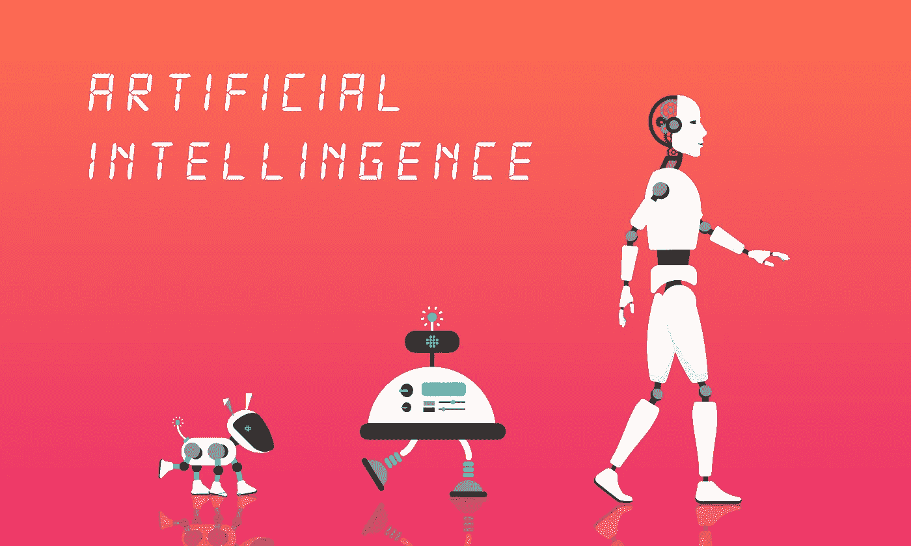

# 在业务流程中实施人工智能的五大理由

> 原文：<https://medium.datadriveninvestor.com/top-5-reasons-to-implement-ai-in-business-processes-24ea1bb725eb?source=collection_archive---------7----------------------->

越来越多的企业开始在各种流程中实施人工智能。我们现在已经过了商业领袖权衡所有利弊的阶段，人工智能实施的好处现在显而易见。

这包括从更智能的聊天机器人到改善客户服务的数据分析，为用户提供定制的产品购买建议。这一切都指向一个事实，贵公司不应该成为人工智能的无所事事的看客，而应该积极探索和实施 AI。

 [## 一个企业在它的肚子上移动:如何顾及直觉-数据驱动的投资者

### 事实证明，直觉不仅仅是一种感觉。科学很清楚:你的直觉比你知道的更多…

www.datadriveninvestor.com](https://www.datadriveninvestor.com/2018/11/09/a-business-moves-on-its-stomach-how-to-make-allowances-for-gut-feelings/) 

让我们来看看人工智能给一个企业带来的所有好处，你的竞争对手很可能正在享受这些好处，而你正在错过这些好处。

# 成本节约

人工智能可以帮你省钱的最重要的方法之一是自动化特定的过程。当您自动化简单的任务时，您不必雇用某人来做它们，并且您释放了您的员工的时间，以便他们可以专注于更重要的任务。例如，Experian Health 一直在与一些公司合作，使多达 80%的任务实现自动化，这使得员工的工作效率几乎翻了一番。自动化可以帮你省钱的另一个方法是在错误滚雪球变成大问题之前注意到它们。很多时候，当员工长时间从事琐碎的工作时，他们会注意力不集中，很容易犯错误。电脑没有这样的问题。

# 改进决策

人工智能最大的优势之一是，它可以给你更深入、更清晰的见解，从而让你做出更好的商业决策。企业，尤其是大型企业，每天都有大量的数据涌入，在当今的市场中，您对收集的所有数据进行洞察的能力至关重要。通过理解所有到来的数据，你将能够更好地了解你的客户，并确定趋势，让你一瞥未来的商店。因此，您必须创建一个环境，使这些高级流程的使用成为标准。

# 改善客户互动

虽然我们前面提到了智能聊天机器人，但人工智能在与客户沟通时提供了许多优势。首先，它让你有机会接触更广泛的受众，因为它可以无限扩展。如果你有一个实体的客户服务部，他们一天能与之交谈的人就只有这么多。人工智能没有这样的限制，因此允许你撒网更广。这种人工智能过程的下一个好处是能够为您的客户提供实时帮助。例如，如果你是一家航空公司，你可以使用人工智能应用程序向你的客户实时发送个性化的旅行信息和更新。

我们生活在一个客户总是在寻求个性化体验的时代，这就是为什么公司正在致力于开发创新的软件解决方案来帮助他们与客户建立关系。

# 数据挖掘

数据挖掘是人工智能最令人兴奋的用途之一，但很少有人谈论它。如今，人工智能应用程序非常先进，它们可以从用户那里获取所有数据，并发现重要的发现。如果您有这样的洞察力，它可以让您在市场中获得巨大优势，因为您将能够调整您的服务产品以满足当前的市场条件，并比竞争对手更好地为未来做好准备。数据挖掘不应被用作证明某些假设的方法。相反，它会给你尚未思考的问题的答案。如果你选择走这条路，你挖掘的数据可以作为机器学习的基础。

# 更好的数据安全性

商业人工智能最突出的方面是为所有数据提供安全性。这在金融部门和银行服务中尤为重要。人工智能可用于检测欺诈企图和试图获取个人身份数据的黑客。这是通过数据处理自动化、机器学习和自然语言理解等手段实现的。如果您能够尽早检测到对数据的未授权访问，那么防止信息泄露将会容易得多，而信息泄露可能会让您遭受数百万美元的罚款。

商业中的人工智能有许多好处，但阻止公司享受这些好处的最大障碍之一根本不是技术。原因是商业领袖没有完全理解人工智能可以提供给他们的所有东西，他们现在不采取行动，就落后于竞争对手。如果你认真审视一下你目前占用最多时间和资源的流程，这将让你明白你需要以什么样的能力在商业中利用人工智能。

在开始你的人工智能冒险之前，理解你的商业目标是至关重要的。如果你清楚地了解你的目标，它会更好地让你拿出一个可行的计划来实现它们。因此，对你的业务流程进行审核，毫不犹豫地将你的计划付诸行动。你公司的未来可能取决于此。

*最初发布于*[*https://sky well . software*](https://skywell.software/blog/top-5-reasons-to-implement-ai-in-business-processes/)*。*