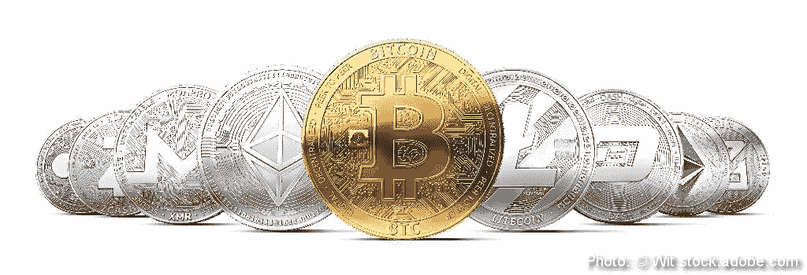
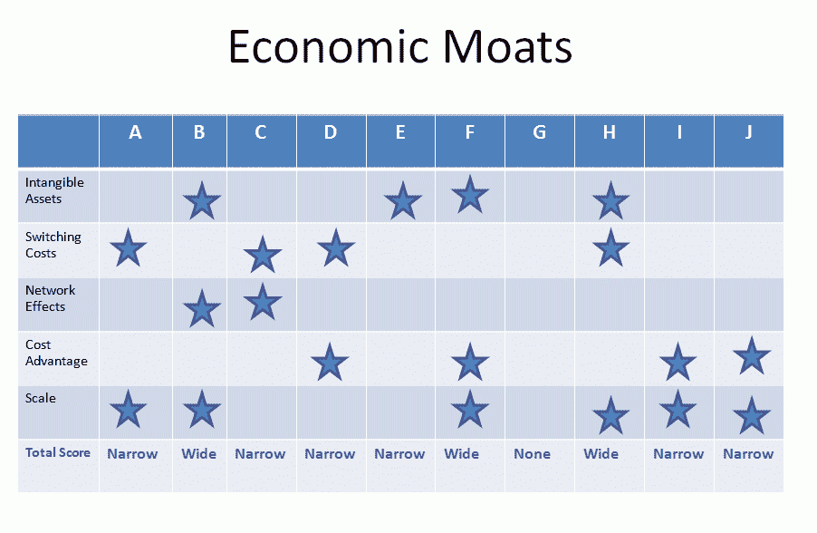

# 评估数字资产价值的五大资源

> 原文：<https://medium.datadriveninvestor.com/top-5-resources-for-valuing-digital-assets-197035e3f93d?source=collection_archive---------5----------------------->

Photo: © Wit stock.adobe.com

*免责声明:虚拟货币不是法定货币，不受政府支持，账户和余额不受消费者保护。本文仅供参考，并非财务建议。该信息不构成投资建议或投资要约。*

对于寻求分散投资组合的现代投资者来说，*数字资产*可能就是未来。在过去几个月的中，ICO(首次公开发行硬币)尤其如此。ICO 是一种相对较新的众筹方法，通常允许项目或公司出售加密令牌，以换取比特币或以太币。对于被不断增加的 ICO 包围的现代投资者来说，困难在于如何在评估这些加密令牌时区分好坏。这可能会令人望而生畏，尤其是由于当前的[隐性熊市对价格的](https://news.caviar.io/millennials-take-note-bear-markets-have-their-benefits-ccffa14fbb4d)影响。为了帮助简化这一点，我们在这篇文章中提供了 5 个核心资源来评估符合您个人投资策略的令牌。

**资源#1:评估令牌背后的团队**

评估加密令牌的第一步是评估团队。对于想要在投资组合中增加数字资产的投资者来说，一个拥有加密经验的成熟开发和咨询团队是物超所值的。方法是[研究](https://hackernoon.com/9-keys-for-ico-team-evaluation-fcfd537b64fc)ICO 团队之前的项目、职业亮点和职业声誉。这种搜索应该从 LinkedIn[开始:搜索每个团队成员的个人资料，记下他们的角色、过去的项目和公司。这些都是你应该通过研究来寻找答案的问题。找到这些信息的另一种方法是查看像](https://www.linkedin.com/) [ICOBench](https://icobench.com/) 和 [TrackICO](https://www.trackico.io/) 这样的地方，它们有每个 ICO 团队的专用部分。

一定要注意社区方面。ICO 应该透明地运行，公司应该提供独立的审计报告，定期更新他们的进展，并与他们的贡献者沟通未来的计划。查看 ICO 的社交媒体页面和他们的 [Telegram](https://telegram.org/) 群，建立他们的社区影响力。

**资源二:代币经济学 101**

[Token economics](http://icocrowd.com/token-economics-design-across-industries/) 是一种定义价值单位来代表特定资产的系统。简单来说，这意味着你得到了一个代表价值的令牌，而它本身并没有内在的价值。相反，这是一个有价值的承诺。就加密令牌而言，有三个不同的类别:

1.  股票代币
2.  实用令牌
3.  安全令牌

股权代币可以比作企业股份的所有权。这种类型的令牌授予您对项目或 ICO 的一部分的权利。[效用](https://strategiccoin.com/3-types-ico-tokens/)硬币是代币，代币持有者可以使用代币获得产品或服务。ICO 可以提供一种特定的服务，这种服务将花费一定数量的实用令牌。最后是[证券](https://icoguide.com/en/blog/what-are-the-different-types-of-token)令牌，其行为与股票非常相似，因为它从可交易资产中获取价值，并受到监管。在确定价值之前，确定令牌属于哪个类别。

**资源#3: Chris Burniske 的实用令牌模型**

Chris Burniske 是《加密资产:创新投资者的比特币指南》一书的作者，他有自己的代币估值公式。他的方程式是基于对资产需求的预测，然后除以资产的供给规模。看起来是这样的:

**V = PQ / M**

在伯尼斯克方程中，[分解](https://www.mosaic.io/pdf/CryptoassetValuationTechniques.pdf)是这样的:

*   P 是所提供的数字资产的价格，Q 是数字资产的数量。*注意，P 不代表资产的价格，而是由加密网络提供的资源的价格。*
*   **M** 等于资产的供给规模
*   而 **V** 是令牌在网络提供的资源上花费的次数。

这种方法不仅可以用来发现加密令牌的值，还可以用来预测采用率和增长率。

**资源#4:沃伦·巴菲特的护城河方法**

由沃伦巴菲特推广的[护城河法](https://www.investopedia.com/ask/answers/05/economicmoat.asp)传统上指的是企业保持竞争优势的能力。该框架可作为无形资产应用于 ICO，使用如下所示的护城河记分卡:

[*Source*](https://mycryptoeconomist.com/2018/03/10/evaluate-potential-ico-using-moat/)

确定使用了哪种区块链技术，以及是否有任何商标来保护 ICO 产品。转换成本是指投资者在选择竞争项目时将面临的困难。随着未来加密货币的采用，这一点的重要性将变得更加明显。成本优势是指对 ICO 的投资:资产采购、市场营销和投资支持。在 ICO 的情况下，可伸缩性是由区块链协议决定的，该算法用于维护区块链和智能合约。护城河方法的一个关键部分是回答三个问题:

1.  是否有任何商标或商标意图来保护 ICO？
2.  ICO 的营销水平如何？
3.  团队的功能是什么？谁是他们的顾问？

**资源#5:令牌速度论文**

[代币速度论题](https://investmentbank.com/token-velocity/)背后的想法是，速度是代币价格的驱动力，速度越低，代币价格就越高。速度较低并在钱包中停留较长时间的代币被认为最终会比速度较高的代币定价更高。计算方法如下:

***速度=总交易量/平均网络量***

如果项目提供了足够的理由持有一枚硬币而不是花掉它，这种方法可以用来确定长期价值。

有一些方法没有包括在本文中，需要进一步研究。[每日活跃地址](https://blockchainatberkeley.blog/todays-crypto-asset-valuation-frameworks-573a38eda27e)是一种方法，其中在交易中使用加密网络的每日用户数量可以作为趋势的指标。另一种方法是[网络价值交易比](https://coinmetrics.io/nvt/#assets=btc)，它衡量交易中加密资产与网络价值相比的美元价值。

有多种评估代币的方法，随着行业的发展，肯定会有更多的方法。ICO 已经成为[增长黑客](https://medium.com/@Prankstr25/growth-hacking-on-the-blockchain-scale-with-an-ico-approach-7c3f00c552fc)的新标准，知道如何对代币估值的投资者将能够识别独特的机会。随着亚马逊和脸书计划推出他们自己的产品，许多科技行业的巨头准备进军 ICO 领域。这一点，以及每年创造的 ICO 项目数量，使得象征性估值比以往任何时候都更加重要。知情投资者可以使用 ICO 等加密资产来分散投资组合，并找到符合其个人投资策略的项目。

你使用哪种代币估价方法？

*免责声明:虚拟货币不是法定货币，不受政府支持，账户和值余额不受消费者保护。本文仅供参考，并非财务建议。未来的利润并不意味着或保证，过去的表现并不保证未来的结果。该信息不构成投资建议或投资要约。Caviar tokens 目前和将来都不会在 SEC 注册，也不会提供或出售给美国和开曼群岛的个人和实体。*

