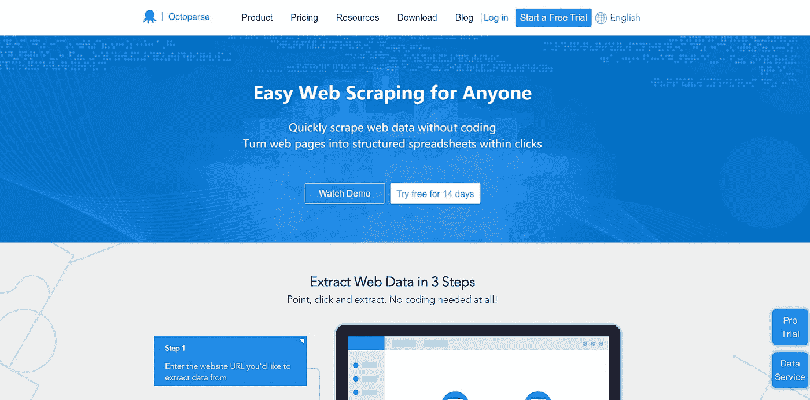
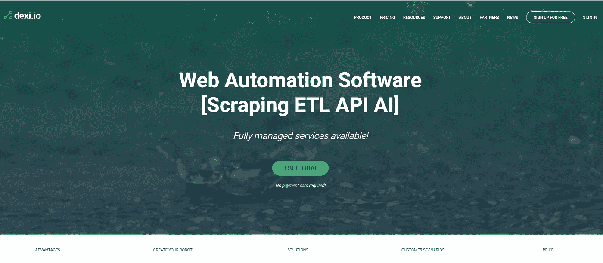
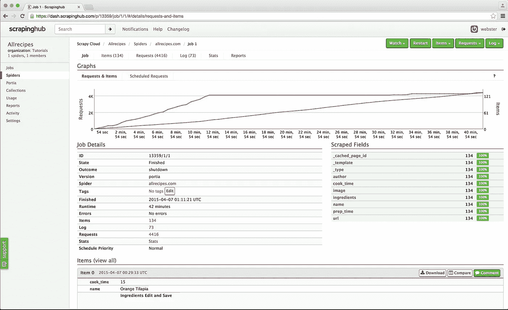
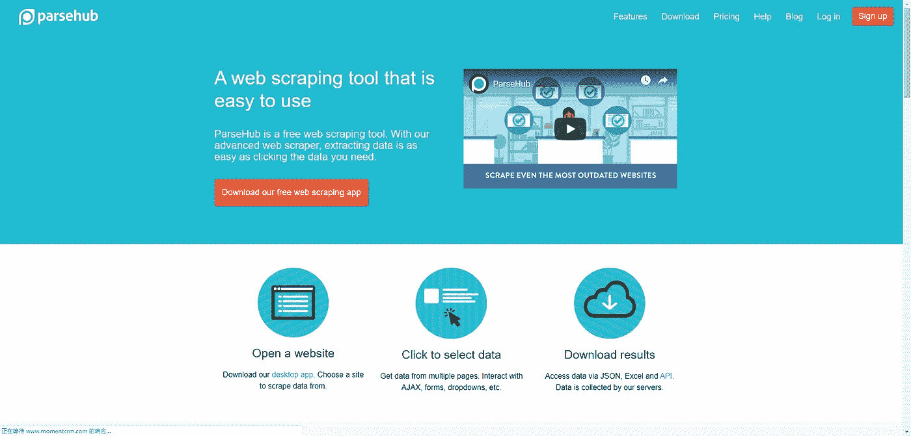

# 2019 年五大社交媒体抓取工具

> 原文：<https://medium.datadriveninvestor.com/top-5-social-media-scraping-tools-for-2019-d137fc28710d?source=collection_archive---------7----------------------->

一个**社交媒体抓取器**通常指的是**一个从社交媒体渠道提取数据的自动网络抓取工具**。它不仅包括社交网站，如脸书、推特、Instagram、LinkedIn 等。，但也包括博客、维基和新闻网站。所有这些门户都有一些共同点:它们都以只能通过 web 访问的非结构化数据的形式生成用户生成的内容。

现在我们知道了社交媒体抓取工具的定义，我将进一步说明如何在商业中使用社交媒体数据集，并列出我推荐的**五大社交媒体抓取工具**。

(Image Source: [Will big data change how you use social media?](https://thenextweb.com/contributors/2017/07/06/will-big-data-change-use-social-media/))

# 你能利用从社交媒体上搜集的数据做什么？

从社交媒体上搜集的数据无疑是关于人类行为的最大和最动态的数据集。它给社会科学家和商业专家带来了全新的机会来了解个人、群体和社会，以及探索隐藏在数据中的巨大财富。

[**社交媒体分析|技术、工具和平台调查**](https://link.springer.com/article/10.1007/s00146-014-0549-4) 指出，社交媒体数据分析的早期业务采用者是零售和金融行业的典型公司。他们应用社交媒体分析来利用品牌意识、客户服务改善、营销策略甚至欺诈检测。

除了上述应用，当今的社交媒体数据集还可以应用于:

**A .客户情绪测量**

从社交媒体渠道收集客户评论后，您可以**通过衡量客户的语气、背景和感受来分析他们对特定主题或产品的态度。**跟踪客户情绪可以让您了解总体客户满意度和客户忠诚度，以及他们的参与意向。它为您当前和未来的营销活动提供了见解。

**B .目标市场细分**

“目标市场是一群客户(个人、家庭或组织)，一个组织为他们设计、实施和维持适合该群体需求和偏好的营销组合，”维基百科上这样定义。获取和分析社交媒体数据集使你能够**知道何时向谁推销你的产品或服务**。确定更多的目标市场有助于您最大化营销投资回报。

**C .在线品牌监测**

在线品牌监测不仅能听到顾客的声音，还能知道你的竞争对手、媒体，甚至行业内的主要意见领袖在说什么。它不仅与你的产品或服务有关，还与**你的客户服务、销售流程、社交活动以及客户接触你品牌的每个接触点有关**。

**D .市场趋势识别**

识别市场趋势对调整你的商业策略至关重要，使你的业务与你所在行业的发展方向保持同步。在 [**大数据自动化工具**](https://www.octoparse.com/blog/top-30-process-automation-tools-for-2019) 的辅助下，市场趋势分析简单来说就是通过跟踪行业影响者和社交媒体渠道上的出版物，对设定时间段内的行业数据进行比较。

# 市场上排名前五的社交媒体抓取工具

# 1.[八元解析](https://www.octoparse.com/)

作为市场上最好的免费自动网页抓取工具之一， **Octoparse** 是为非编码人员开发的，以适应复杂的网页抓取工作。

当前版本 7 提供了一个直观的点击式界面，并支持无限滚动、登录验证、文本输入(用于抓取搜索结果)以及从下拉菜单中进行选择。报废的数据可以导出为 Excel、JSON、HTML 或数据库。如果您想要创建一个动态刮刀来从动态网站中实时提取数据，Octoparse Cloud Extraction(付费计划)非常适合获取动态数据源，因为它支持每分钟一次的提取计划。

对于**抓取社交媒体数据**，Octoparse 已经发布了很多精心制作的教程，比如 [**从 Twitter**](https://helpcenter.octoparse.com/hc/en-us/search/click?data=BAh7CjoHaWRsKwjzNs7SUwA6CXR5cGVJIgxhcnRpY2xlBjoGRVQ6CHVybEkiYGh0dHBzOi8vaGVscGNlbnRlci5vY3RvcGFyc2UuY29tL2hjL2VuLXVzL2FydGljbGVzLzM2MDAxOTAxNTQxMS1TY3JhcGUtdHdlZXRzLWZyb20tVHdpdHRlci0GOwdUOg5zZWFyY2hfaWRJIik0NjhlMzExOC0zY2ZkLTQ3NWMtODBjMi1kYWNmYzU0ZWE3ZGIGOwdGOglyYW5raQY%3D--5ee012b986d35630520ddb91042faacc3af293c4) 抓取推文 [**从 Instagram**](https://helpcenter.octoparse.com/hc/en-us/search/click?data=BAh7CjoHaWRsKwjXkcvSUwA6CXR5cGVJIgxhcnRpY2xlBjoGRVQ6CHVybEkiXWh0dHBzOi8vaGVscGNlbnRlci5vY3RvcGFyc2UuY29tL2hjL2VuLXVzL2FydGljbGVzLzM2MDAxODg0MjA3MS1TY3JhcGUtZGF0YS1vbi1JbnN0YWdyYW0GOwdUOg5zZWFyY2hfaWRJIilmMTIxYzY5Ny02ZDNhLTRlZjQtYWNkOS05NTlmYjZhZDNkNGUGOwdGOglyYW5raQY%3D--021389f1b6304722db76c81ec81876763114d56f) 提取帖子。此外，Octoparse 还提供了一个 [**数据收集服务**](https://www.octoparse.com/Data-Scraping-Service) ，可以将数据直接送到你的 S3 存储桶中。如果你时间紧，这可能是一个很好的选择。

# 2.Dexi.io

作为一个基于网络的应用程序，Dexi.io 是另一个用于商业目的的直观提取自动化工具，起价为每月 119 美元。Dexi.io 支持创建三种机器人:**提取器、爬行器和管道**。

Dexi.io 需要掌握一些编程技巧，但你可以集成第三方服务用于验证码求解、云存储、文本分析(MonkeyLearn 服务集成)甚至与 AWS、Google Drive、Google Sheets…

Addon(付费计划)也是 Dexi.io 的一个革命性的功能，而且附加组件的数量还在不断增长。通过附加组件，您可以解锁提取器和管道中更多可用的功能。

# 3.智胜 Hub

与 Octoparse 和 Dexi.io 不同，Outwit Hub 提供了一个**简单的图形用户界面**，以及复杂的抓取功能和数据结构识别。Outwit Hub 最初是一个 Firefox 插件，后来变成了一个可下载的应用程序。

无需事先编程背景，OutWit Hub 可以提取和导出链接、电子邮件地址、RSS 新闻和数据表到 Excel、CSV、HTML 或 SQL 数据库。

Outwit Hub 有一个突出的“快速抓取”功能，可以从你输入的 URL 列表中快速抓取数据。不过，对于初学者来说，你可能需要浏览一些随机的教程和文档，因为这款抓取应用缺乏点击式界面。

# 4.报废网

Scrapinghub 是一个基于云的网络爬行平台，允许您扩展您的爬虫，并提供智能下载器来解决机器人对策、交钥匙网络抓取服务和现成的数据集。

该应用由四个伟大的工具组成: **Scrapy Cloud** 用于部署和运行基于 Python 的网络爬虫； **Portia** 是一款无需编码提取数据的开源软件； **Splash** 也是一款开源的 JavaScript 渲染工具，从使用 JavaScript 的网页中提取数据； **Crawlera** 是一款避免被网站、被来自多个地点和 IP 的爬虫屏蔽的工具。

不是提供一个完整的套件，而是市场上一个相当复杂和强大的网络抓取平台，更不用说每个由 screen hub 提供的工具都是单独收费的。

# 5.Parsehub

Parsehub 是市场上另一款**免编码桌面刮刀**，支持 Windows、Mac OS X 和 Linux。它提供了一个图形界面来从 JavaScript 和 AJAX 页面中选择和提取数据。数据可以从嵌套的评论、地图、图像、日历甚至弹出窗口中抓取。

而且，Parsehub 还有一个基于浏览器的扩展，可以即时启动你的抓取任务。数据可以导出为 Excel，JSON 或通过 API。

Parsehub 有争议的地方在于它的定价。Parsehub 的付费版本每月 149 美元起，高于市场上大多数的抓取产品，即 Octoparse 的标准计划，每月只需 89 美元，每次抓取不限页面。有一个免费的计划，但遗憾的是仅限于刮 200 页和五个刮工作。

# 结论

除了自动网络抓取工具能做的，现在许多社交媒体渠道向用户、学术界、研究人员和特殊组织提供付费 API，如新闻服务中的汤森路透和彭博，社交网络中的推特和脸书。

随着在线经济的日益增长和繁荣发展，社交媒体为您的企业在其领域脱颖而出开辟了许多新的机会，通过更好地倾听您的客户，并以全新的方式与您的潜在客户和现有客户互动。

*原载于 2018 年 10 月 17 日*[*https://www.octoparse.com*](https://www.octoparse.com/blog/top-5-social-media-scraping-tools-for-2018)*。*