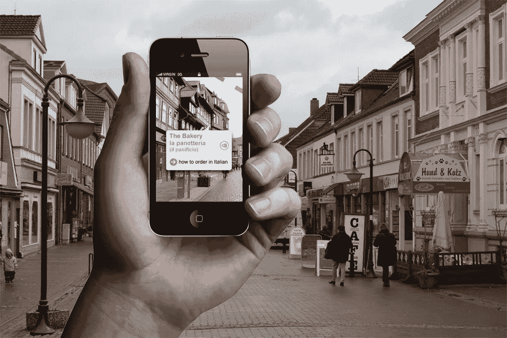

# 五大怪异和不寻常的应用

> 原文：<https://medium.datadriveninvestor.com/top-5-weird-and-unusual-apps-6a2a2b035c34?source=collection_archive---------16----------------------->

这里有很多罕见的应用程序，每一个都提供一些奇怪的服务或功能，这些服务或功能可能看起来不寻常，奇怪，完全没有必要。然而，由于它们是被创造出来的，而且开发这些不寻常的应用程序也花了钱，因此必须有一个需求来证明它们的创造是正当的。让我们来看看今天可以下载的一些最奇怪的应用程序。

# 1.虚假的对话

我们都曾遇到过这样的情况，我们对自己说:“我该如何摆脱这一困境”？嗯，你很幸运，因为这可能是你摆脱任何处境的完美借口。例如，假设你在街上遇到一个人，谈话会一直拖下去。这个应用程序允许你给自己打电话，它与其他提供类似服务的奇怪应用程序的区别在于，它更好地出售虚假对话。

在你收到虚假电话后，该应用程序将播放预先录制的音频指令，你必须重复这些指令，以便让对方相信对话是真实的。大多数其他竞争应用程序只是给你一个机会，让你假装自己是消防员、医生律师或其他没有时间浪费在闲聊上的人，从而给别人留下深刻印象。这个罕见的应用程序 gem 在 Android 和 iOS 上都可以下载。

# 2.阿斯马特平视显示器

我们都喜欢使用 GPS 导航应用程序，但有史以来最奇怪的应用程序之一是将所有导航数据显示为镜像的 GPS 应用程序。当我们开车时，我们通常会把手机放在仪表板上，但有了这个应用程序，屏幕会反映在你的挡风玻璃上，所以你不必低头看手机。这是 iPhone 和 Android 上的一种奇怪的应用，可以让你快速安全地从一个地方到达另一个地方。

# 3.古怪的类型

从激动人心的 [AR 应用程序开发世界](https://skywell.software/ar-vr-development/)来了一个可以让你在半空中写作的应用程序。他们还可以拍摄带文本的照片，用文字将图像分层，实际浏览他们创建的文本等等。这是一个很酷但不寻常的 iPhone 应用程序，有创意，令人上瘾。它真的允许人们释放他们内心的艺术家，但有了增强现实，你画的一切都可以互动。

# 4.维基百科

对于那些知道很多“无用”信息和随机事实的人来说，AR 应用程序开发可以通过提供你周围的信息给你更多你喜欢的东西，我们不是在谈论著名的景点和地标。它会给你每一个建筑的细节，甚至是你用相机瞄准的物体。对于埃米尔来说，如果你把相机对准书架上的一本书，它会给你一个简短的书的概要，并给你提供在线购买这本书的机会。这是那种既有趣又古怪的应用。

# 5.没有任何东西

公司花了很多钱在[定制移动应用](https://skywell.software/mobile-app-development/)上，以确保所有的功能都正常工作，没有错误等等。然而，偶尔会有一些应用程序出现，让你挠头。有一款应用什么都不做。事实上，它甚至没有一个标志。当应用程序启动时，出现一个空白屏幕，然后什么也没有发生。这不仅是有史以来最不寻常的 Android 应用程序之一，更有趣的是，有一个专业版的应用程序，没有任何东西达到了一个全新的水平。只需 0.99 美元，你就可以在 Android Marketplace 上下载专业版，它会给你带来更多的好处。

这些应用程序中有许多确实很奇怪，但它们向我们展示的是，每种产品都有一个客户。有人需要假电话，反射 GPS 导航，在某些极端情况下，他们什么都不需要，他们愿意为此付费。虽然很难理解为什么要做其中的一些，以及它们背后的思维过程是什么，但你可以自己尝试一下，也许你能发现隐藏在它们下面的逻辑。

*最初发表于*[*sky well . software*](https://skywell.software/blog/top-5-weird-and-unusual-apps/)*。*