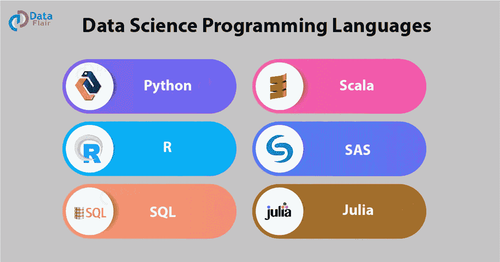
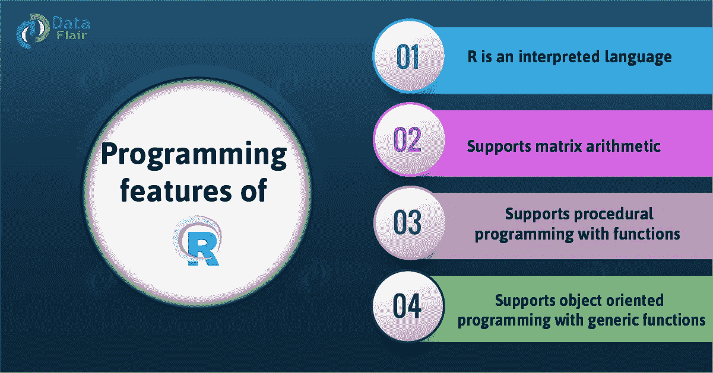
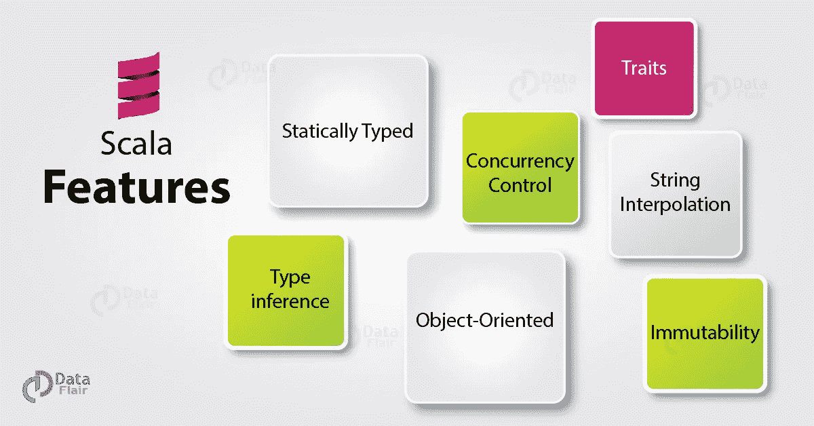
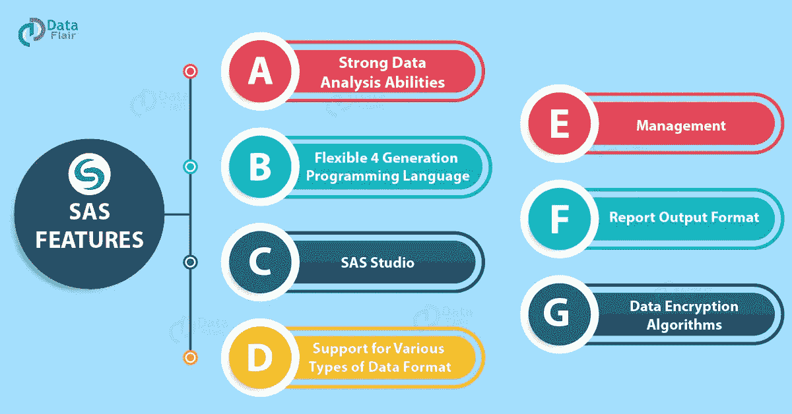

# 2019 年 6 大数据科学编程语言

> 原文：<https://medium.datadriveninvestor.com/top-6-data-science-programming-languages-for-2019-39ba1b6819a8?source=collection_archive---------0----------------------->

数据科学已经成为 21 世纪最受欢迎的技术之一。随着各行业对数据科学家的大量需求，需要拥有所需技能的人来精通这一领域。除了数学技能，还需要编程专业知识。但是在获得专业知识之前，一个有抱负的数据科学家必须能够对工作所需的编程语言类型做出正确的决定。在本文中，我们将介绍一些必需的数据科学编程语言，以便[成为一名熟练的数据科学家](https://data-flair.training/blogs/skills-needed-to-become-a-data-scientist/)。

*6 大数据科学编程语言*

 [## 数据科学和软件工程哪个更有前途？-数据驱动型投资者

### 大约一个月前，当我坐在咖啡馆里为一个客户开发网站时，我发现了这个女人…

www.datadriveninvestor.com](https://www.datadriveninvestor.com/2019/01/23/which-is-more-promising-data-science-or-software-engineering/) 

# 数据科学导论

编程是软件开发的支柱。数据科学是包括计算机科学在内的几个领域的集合。它涉及使用科学的过程和方法来分析数据并从中得出结论。为这个角色设计的特定编程语言执行这些方法。虽然大多数语言都是为软件开发服务的，但数据科学编程的不同之处在于，它帮助用户预处理、分析数据并从数据中生成预测。这些以数据为中心的编程语言能够执行适合数据科学细节的算法。因此，为了成为一名精通的数据科学家，你必须掌握以下数据科学编程语言之一。

# 最佳数据科学编程语言

以下是顶级数据科学编程语言及其重要性和详细描述的列表——

# 1.计算机编程语言

它易于使用，是一种基于解释器的高级编程语言。 [Python 是一种多功能语言](https://data-flair.training/blogs/python-tutorial/)，它有大量用于多种角色的库。由于其更容易的学习曲线和有用的库，它已经成为数据科学最受欢迎的选择之一。Python 的代码可读性也使它成为数据科学的热门选择。由于数据科学家处理复杂的问题，因此，拥有一种更容易理解的语言是理想的。Python 使得用户更容易实现解决方案，同时遵循所需算法的标准。

*Python 的最新特性*

[Python 支持多种多样的库](https://data-flair.training/blogs/python-libraries/)。数据科学中解决问题的各个阶段都使用自定义库。解决数据科学问题涉及数据预处理、分析、可视化、预测和数据保存。为了执行这些步骤，Python 有专门的库，例如——Pandas、Numpy、Matplotlib、SciPy、scikit-learn 等。此外，Tensorflow、Keras 和 Pytorch 等高级 Python 库为数据科学家提供了深度学习工具。

# 2.稀有

对于面向统计的任务，R 是完美的语言。与 Python 相比，有抱负的数据科学家可能不得不面对陡峭的学习曲线。r 专门致力于统计分析。因此，它在统计学家中很受欢迎。如果你想深入研究数据分析和统计，那么 [R 就是你选择的语言](https://data-flair.training/blogs/r-tutorial/)。R 的唯一缺点是它不是一种通用编程语言，这意味着它不能用于统计编程以外的任务。

CRAN 的开源库中有超过 10，000 个软件包，R 可以满足所有统计应用的需求。R 的另一个强项是它处理复杂线性代数的能力。这使得 R 不仅适用于统计分析，也适用于神经网络。R 的另一个重要特性是它的可视化库‘gg plot 2’。还有其他工作室包，如 tidy verse 和 Sparklyr，它们为 R. R 环境提供了 Apache Spark 接口，如 r studio，这使得连接数据库变得更加容易。它有一个名为“RMySQL”的内置包，提供 R 与 MySQL 的本地连接。所有这些特性使 R 成为核心数据科学家的理想选择。

# 3.结构化查询语言

SQL 被称为“数据科学的基础”，是数据科学家必须掌握的最重要的技能。 [SQL 或“结构化查询语言”](https://data-flair.training/blogs/sql-tutorial/)是一种数据库语言，用于从称为关系数据库的有组织的数据源中检索数据。在数据科学中，SQL 用于更新、查询和操作数据库。作为一名数据科学家，知道如何检索数据是工作中最重要的部分。SQL 是数据科学家的“随身武器”,这意味着它提供有限的功能，但对特定的角色至关重要。它有多种实现，如 MySQL、SQLite、PostgreSQL 等。

为了成为一名熟练的数据科学家，有必要从数据库中提取和争论数据。为此，SQL 知识是必须的。由于其声明性语法，SQL 也是一种可读性很高的语言。例如，从薪金> 20000 的用户中选择姓名非常直观。

# 4.斯卡拉

[Scala stands 是运行在 JVM 上的 Java 编程语言](https://data-flair.training/blogs/scala-tutorial/)的扩展。它是一种通用编程语言，既有面向对象技术的特点，又有函数式编程语言的特点。你可以把 Scala 和 Spark 这个大数据平台结合使用。这使得 Scala 成为处理大量数据的理想编程语言。

Scala 提供了与 Java 的完全互操作性，同时保持了与数据的紧密联系。作为一名数据科学家，必须对编程语言的使用有信心，以便以任何需要的形式塑造数据。Scala 是一种专门为这个角色设计的高效语言。Scala 的一个最重要的特性是它能够促进大规模的并行处理。然而，Scala 的学习曲线很陡，我们不推荐初学者使用。最后，如果你作为数据科学家的偏好是处理大量数据，那么 Scala + Spark 是你的最佳选择。

[开始跟业内资深人士学习 Scala 和 Spark】](https://data-flair.training/apache-spark-scala/)

# 5.朱莉娅

Julia 是最近开发的最适合科学计算的编程语言。它因像 Python 一样简单而受欢迎，并具有 C 语言闪电般的性能。这使得 Julia 成为需要复杂数学运算的领域的理想语言。作为一名数据科学家，你将研究需要复杂数学的问题。朱莉娅能够以很高的速度解决这样的问题。

虽然由于最近的发展，Julia 在其稳定版本中面临一些问题，但它现在已经被广泛认为是[人工智能](https://data-flair.training/blogs/artificial-intelligence-tutorial/)的语言。Flux 是一种机器学习架构，是 Julia for advanced AI processes 的一部分。许多银行和咨询服务机构都在使用 Julia 进行风险分析。

# 6.斯堪的纳维亚航空公司

和 R 一样，可以使用 SAS 进行统计分析。唯一的区别是，SAS 不像 r 一样是开源的。然而，它是为统计设计的最古老的语言之一。SAS 语言的开发人员开发了他们自己的软件套件，用于高级分析、预测建模和商业智能。SAS 高度可靠，得到了专业人士和分析师的高度认可。寻求稳定安全平台的公司使用 SAS 来满足他们的分析需求。虽然 SAS 可能是一个闭源软件，但它提供了广泛的库和包，用于统计分析和[机器学习](https://data-flair.training/blogs/machine-learning-tutorial/)。

SAS 有一个优秀的支持系统，这意味着您的组织可以毫无疑问地依赖这个工具。然而，随着先进的开源软件的出现，SAS 落后了。将现代编程语言提供的更高级的工具和特性集成到 SAS 中有点困难，而且非常昂贵。

这些是数据科学家的一些编程语言。

# 摘要

[数据科学](https://en.wikipedia.org/wiki/Data_science)是一个技术和工具不断发展的动态领域。由于数据科学是一个广阔的领域，您必须选择一个特定的问题来解决。为此，您应该选择最适合它的编程语言。上面提到的编程语言集中在数据科学的几个关键领域，人们必须始终愿意根据需求尝试新的语言。

不过，如果你对数据科学编程语言有任何疑问，欢迎在评论区提问。