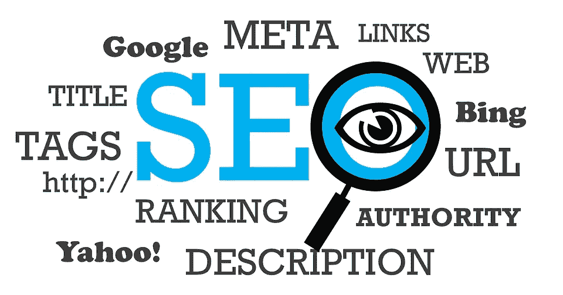
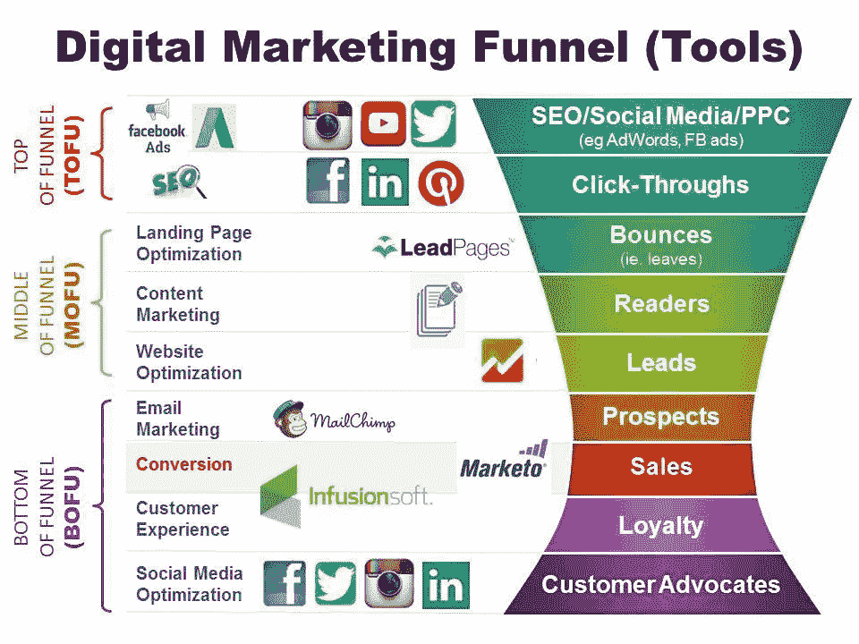

# 2019 年 6 大最新谷歌搜索引擎优化算法

> 原文：<https://medium.datadriveninvestor.com/top-6-latest-google-seo-algorithms-for-2019-190c6e4571d?source=collection_archive---------4----------------------->

**Google SEO 算法新闻:最新 SEO 算法更新**

对于任何博主、SEO 分析师和数字营销经理来说，页面排名都是最大的挑战。有很多方法可以优化内容，提升内容排名，获得更好的 SERP。另一方面，跟上最新的谷歌搜索引擎优化算法是最重要的因素。因为按照老方法做优化会导致排名靠后。在这篇文章中，我试图提供改变了网页搜索和排序方式的 6 大 Google SEO 算法。

**什么是搜索引擎优化？**

搜索引擎优化(SEO)是优化任何网页的内容和媒体的过程，使其易于索引和排名靠前。它在算法的帮助下提高了网站/博客的可见性。它根据用户输入的搜索查询工作，并获取相关内容。谷歌不断改进搜索引擎优化算法，以避免垃圾信息和无缝获取敏感信息。最新的谷歌搜索引擎优化算法专注于引入开创性的技术，以获得更有效的性能。

**2019 年要知道的 6 个最新 Google SEO 算法趋势**

1.  基于图像和视频的搜索

内容在网站或博客的推广中总是扮演着重要的角色。在这里，我们有许多类型的内容，它们可以是图像、信息图、视频、GIF、播客和实时聊天。除此之外，图片和视频得到了在线用户的更多关注。通常，用户花更多的时间在视觉媒体上，而不是长篇大论的内容上。因此，建议包含具有适当属性的图像和视频，以获得更好的排名。而且，它至少提高了 30%的参与度。

 [## 2019 年需要关注的 20 个数字营销趋势和技术——数据驱动的投资者

### 展示本周的电子学习模块。做一个终身学习者！关于技术、金融、工作场所的每日剂量…

www.datadriveninvestor.com](https://www.datadriveninvestor.com/2019/02/04/20-digital-marketing-trends-techniques-to-watch-out-for-in-2019/) 

2.语音搜索 SEO 算法

最近一段时间，随着智能助手的出现，语音搜索得到了极大的发展。牢记这一点，所有领先的科技巨头都在将 Siri、Alexa 和 Google Home 等虚拟语音助手与搜索引擎集成，以获得快速准确的搜索结果。更重要的是，这个最新的谷歌搜索引擎优化算法将很快提供免提查询搜索。那么，如何从语音搜索算法中得到结果呢？专业人士建议使用长尾关键词是高排名的最佳解决方案。根据一份报告，到 2020 年，50%的搜索是通过语音命令进行的。

**3。个性化定制结果**

谷歌以 cookies、搜索历史和其他浏览信息的形式持续跟踪每个用户最频繁的搜索。资深分析师和专家预计，最新的谷歌搜索引擎优化算法将使 SERP 和页面排名比以往任何时候都更容易。此外，复杂的算法依赖于个人以前的搜索结果，并给我们合适的 SERP 和页面排名。

4.人工智能和机器学习

谷歌正在投资大量人工智能和机器学习算法，以引入其所有产品。这两项技术都将使查询搜索变得更加容易和便捷。这些最新的谷歌搜索引擎优化算法将自动改善现有算法的编码，以提供丰富的体验。而且它们对页面排名和页面优化的影响会更大。

**5。超越 Google 和 Bing 的 SEO**

截至目前，谷歌和必应是分析师研究的主要搜索引擎。最终，最新的谷歌搜索引擎优化算法使其他搜索引擎变得友好。最近，亚马逊和 Siri 作为搜索引擎出现，与传统的搜索引擎巨头竞争。未来的搜索引擎优化算法可以很好地为各种搜索引擎提供准确的结果。

6.超局部结果

最新的谷歌搜索引擎优化算法将通过本地搜索和本地搜索引擎优化增加超本地搜索结果。超本地 SEO 特别关注用户的人口统计信息，并给出最佳结果。

最重要的是，页面优化，元描述，链接建设和社会参与在最好的搜索引擎优化结果中起着至关重要的作用。

更多更新请关注我们的[**#点击获取**](https://twitter.com/ClickonGadget)