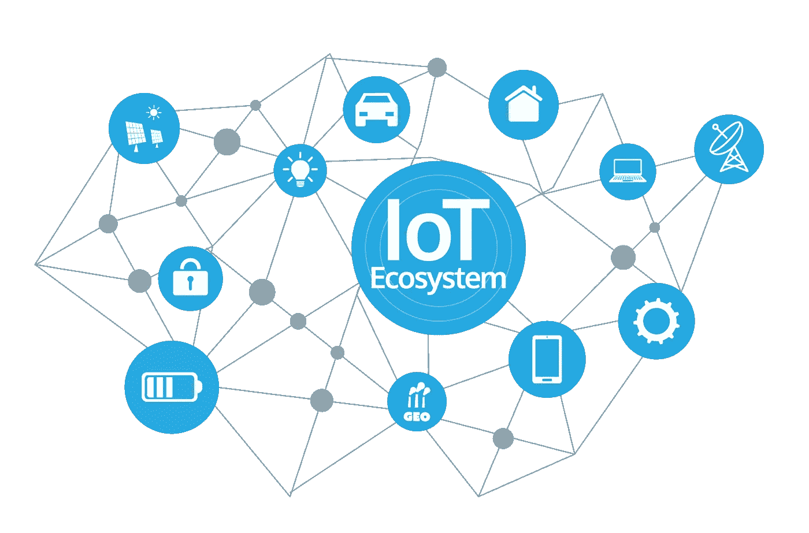
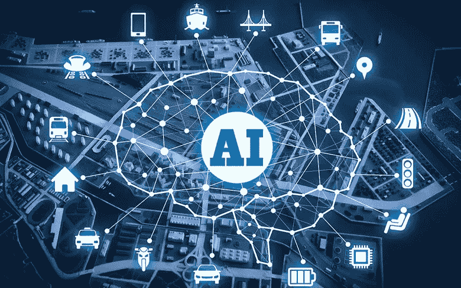

# 2019 年 6 大技术趋势

> 原文：<https://medium.datadriveninvestor.com/top-6-technology-trends-in-2019-d4e70fd3f3d?source=collection_archive---------10----------------------->

技术是一个不断变化的过程，有大量的创新。尽管在商业和工业领域，每个人都在带头投资最新的颠覆性技术。我们可以说，2018 年已经成为工业革命 4.0 的垫脚石，物联网(IoT)、人工智能(AI)、机器学习(ML)、数据科学和云技术等突出技术。随着这些突破性技术的出现，一切都变得智能和有效。机器正在跳出框框思考，做出明智的决策，以改变我们的工作方式和与实时环境的对话。现在，是时候讨论 2019 年技术趋势的下一件大事及其影响了。

**2019 年的物联网:连接地球的各个角落**

随着智能设备和数据交换的指数级增长，物联网近年来备受关注。物联网旨在将运行在互联网上的智能设备连接起来。物联网是一组封闭的智能设备，用于收集信息、分析和处理数据，以做出明智的决策。物联网通过自动化控制设备的流程，在工业转型中发挥着主导作用。据报道，到 2020 年，超过 200 亿台设备将通过物联网技术实现业务效率连接。

Hacker Noon

**人工智能:跳出框框思考**

人工智能是近代最前沿的技术之一。它是计算机科学的一部分，旨在像人脑一样智能地工作。人工智能凭借其大量的创新和应用获得了极大的关注。近年来，人工智能以商业为中心的应用没有让任何行业掉队。在媒体、医疗保健、保险、食品、法律和制药等各种行业中都有大量的应用.. [**AI 技术**](https://www.livemint.com/AI/JmbpuZYmf9Ul6pxg1JLyvI/Over-4000-AI-job-roles-vacant-on-talent-shortage-Report.html) 会帮你分析从你的组织各个角落收集的数据，让你知道你的业务的 KPI。人工智能技术与数据分析一起将预测商业前景，以重新定义组织行为。行业专家预测，2019 年将是人工智能技术释放全部潜力的成功一年。人工智能比我们想象的失业更有可能创造大量机会。

**机器学习技术:自学习技术**

机器学习(ML)是人工智能的一个组成部分，主要关注算法行为。ML 算法很容易适应现有算法，以提供最佳性能。这将反过来提高编码效率，减少开发人员的干预。特别是，在安全性方面 [**ML 算法**](https://www.forbes.com/sites/allbusiness/2018/10/20/machine-learning-artificial-intelligence-could-transform-business/amp/) 在适应最新协议以提供更多安全性方面做得很好。ML 算法分析数据，并为未来的应用进行定制。这是 2019 年另一项不断发展的技术，有利于组织和开发者。

**数据分析及其对业务增长的影响:预测未来**

在当前发展最快的工业革命中，数据就是一切。随着数据的巨大增长，数据处理和分析越来越受到重视。数据分析是预测业务增长时要考虑的重要因素之一。因此，企业主可以在制造、销售和供应方面做出潜在的决策。但是，应该确保仔细处理每一点数据，并更新到系统中。因为任何错误的数据格式或错误的信息都会对整个过程产生不利影响。数据分析和大数据将在 2019 年与人工智能和人工智能技术一起迅猛增长。

Techgenyz

**5G 技术:快速连接**

智能设备同比呈指数级增长。尽管现有带宽在一定程度上支持运营，但仍需要扩展以提供最佳服务。5G 是 2019 年支持所有高端操作的下一件大事。有许多科技巨头已经推出了支持智能手机、芯片组和路由器的 5G。我们可以在 2019 年看到许多智能手机和其他设备支持 5G 速度。

**云技术:轻松访问**

现在一切都成了浮云。云是支持许多公司节省前期投资的最新技术趋势。如果您计划重新设计业务流程，最终您会选择企业应用程序。企业资源规划(ERP)软件是为您的业务需求定制的一站式解决方案。ERP 将职能组织重新设计为跨职能团队，并支持使用正确的技术来简化流程和数据，以便及时有效地做出决策。这些基于云的应用将帮助预算有限的中小企业和大型组织节省大量人力。

**网络安全:保护您的生态系统**

尽管存在垂直行业，但网络安全是令人生畏的因素之一。随着技术趋势和协议的不断变化，黑客在获得对您系统的访问方面总是领先。报道称，与早些年相比，2018 年的攻击事件空前增加。总是有第三只眼颠覆技术，进行欺诈操作。就机会而言，2019 年将是网络安全专家又一个伟大的一年。

在未来几年中，还有一些技术将会推出，以增强用户体验和业务运营。如果你是这些颠覆性技术的早期采用者，你肯定可以在 2019 年与竞争对手抗衡。