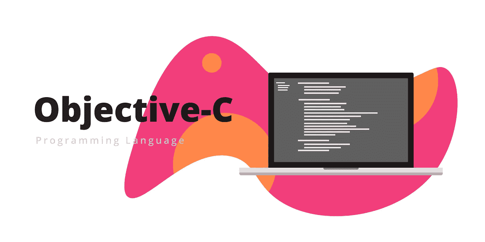
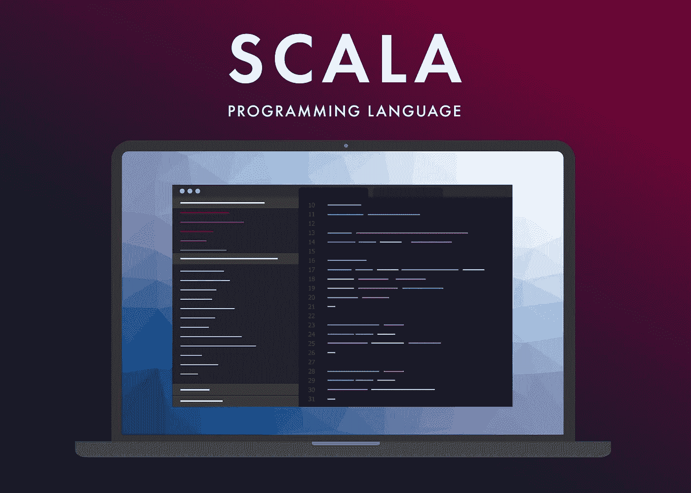

# 2019-2020 年避免学习的 7 种濒临死亡的编程语言

> 原文：<https://medium.datadriveninvestor.com/top-7-dying-programming-languages-to-avoid-studying-in-2019-2020-a4a660f4de0e?source=collection_archive---------0----------------------->

由于 IT 领域在不断发展，受欢迎的编程语言也将随之变化。如果您希望在当今的 IT 世界中保持相关性，您需要了解所有正在发生的变化，以便您的技能和服务将继续受到需求，这包括远离死亡的编程语言或在不久的将来将不再受欢迎的编程语言。以下是 7 种正在消亡的编程语言。

# Visual Basic 死了吗？

即使 Visual Basic 可能还没有完全死亡，但它是一种垂死的语言。Visual Basic 有着悠久而辉煌的历史，可以追溯到 1991 年的发布，但随着智能手机和平板电脑的兴起，它正在灭绝。最终，它在与 C#的竞争中失败了，c#也是基于。NET 框架。此外，根据堆栈溢出调查，Visual Basic 是最可怕的编程语言。它对刚入门的开发人员很有用，因为它非常容易上手，但它也被视为使用其他工具的跳板。

 [## 2019 年最值得学习的编码语言——数据驱动的投资者

### 在我读大学的那几年，我跳过了很多次夜游去学习 Java，希望有一天它能帮助我在…

www.datadriveninvestor.com](https://www.datadriveninvestor.com/2019/02/21/best-coding-languages-to-learn-in-2019/) 

# Objective-C 死了吗？

Objective-C 目前需要支持旧的项目，但随着 Swift 的崛起，我们不得不怀疑这种情况会持续多久。iOS 和 MacOS 仍然使用 C、Objective-C 和 C++，这些都是框架方言，这给了它更多的生命周期。Swift 正在迅速取得进展，它看起来将取代 Objective-C 成为未来的语言。在任何情况下，除非苹果彻底改造 iOS 和 MacOS，将 Swift 作为用于 iOS 应用程序开发的首选语言，否则 Objective-C 仍将有需求，这意味着它至少在未来 5 年甚至更长时间内仍将存在。

# Perl 死了吗？

Perl 的故事是一个非常悲伤的故事，因为它是顶级 web 编程语言之一，但是，随着时间的推移，它被视为只写语言，这导致了它的灭亡。早期它被认为是非常有用和实用的，但是它带有很多警告。Perl 的创造者开始增加特性，但是他们没有计划好如何同步所有的特性。开发人员社区注意到了这个问题，并创建了 Perl6，但这不足以保持 Perl 的需求。最后，它运行得很好，但最好忘记这种语言，专注于现在流行的东西。

# Cobol 现在是死语言了吗？

Cobol 肯定是门外的，因为公司正在快速更新他们的遗留系统，没有它们，Cobol 就没有什么可提供的了。对于大公司来说，迁移到更现代的东西，如 Java，可能会给它一些生存的机会，但很难将 Cobol 看作是软件开发团队用来创建前沿软件的东西。此外，Cobol 不受教育机构的欢迎，因为学生对学习传统编程语言不感兴趣，所以你可能很难找到提供 Cobol 课程的地方。基于这些原因，你应该远离 Cobol。

# CoffeeScript 死了吗？

这可能是 2009 年发布的最年轻的语言。它最初被设计用来获取一个程序的源代码，这是在 CoffeeScript 中，并创建相同的东西，但在 JavaScript 中。然而，随着时间的推移，CoffeeScript 提供的优势被整合到 JavaScript 本身中，使其变得过时。因此，开始学习这种语言或磨练你的技能没有多大意义。

# Scala 要死了吗？

不久前，Scala 被视为编程领域的下一个大事件，但它逐渐开始失去人气，并在 2016 年因不到 1%的开发人员使用它而黯然失色。这是一门非常难学的语言，因为它基于数学类型理论，而且它没有很好地确保与早期版本的 Scala 或 Java 的兼容性。还有很多其他的可用性问题，但长话短说，它不会像 Java 一样成为主流语言。

# 为什么 Lisp 会死？

Lisp 因为其碎片化的本质和特定领域的解决方案风格正在消亡。越来越少的程序员使用同一个版本，直到完全没有必要使用它。不可能制定出一个特定领域的解决方案，因为这将导致所有种类的子语言都不同，并且 Lisp 代码不能被其他语言读取。问题是，不可能确定某个符号是变量、运算符还是函数，要确定它是什么，必须阅读一大段代码。由于所有这些原因，最好远离 Lisp。

不管你是想在 IT 行业开始你的职业生涯，还是想把你的技能提升到一个新的水平，你都必须不断地紧跟行业趋势。虽然会继续有开发人员使用这些语言，但你必须考虑到，在不久的将来，这些语言将被更主流的语言所取代，因此，学习这些语言是没有用的。

*最初发表于*[*sky well . software*](https://skywell.software/blog/top-7-dying-programming-languages/)*。*